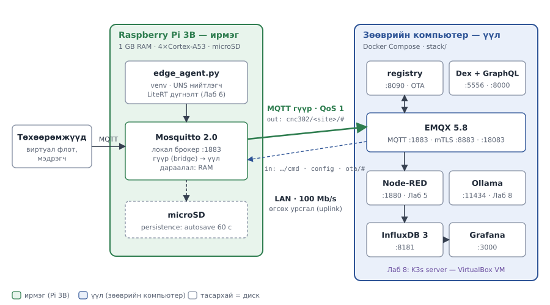
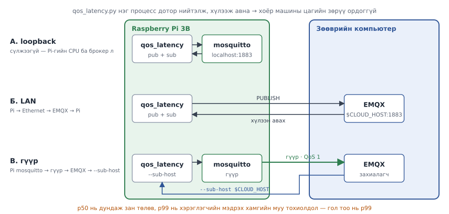

# Лаб 1 — Хоёр давхаргат платформ ба ирмэг–үүлний гүүр

| | |
|---|---|
| **7 хоног** | III |
| **Хугацаа** | 4 цаг (8 алхам + 30 мин нөөц) |
| **Суралцахуйн үр дүн** | ҮД1 (үүлд суурилсан платформ зохиох), ҮД2 (өргөтгөх боломжтой backend) |
| **Үнэлгээ** | Бичгийн тайлан, 10 оноо |
| **Гол хэмжилт** | Гүүрний RTT, Pi-гийн үлдэгдэл санах ой, үйлчилгээний эхлэх хугацаа |

---

## 1. Зорилго

Энэ лабораторийн эцэст та **хоёр машин дээр тархсан, ажиллагаатай IoT платформ**-той болно. Гол нь стекийг асаах биш — **хаана юу ажиллах ёстойг тоогоор нотлох** явдал.

Гурван асуултад тоон хариулт өгнө:

1. Ирмэгийн давхарга Raspberry Pi 3B дээр **хэдий хэмжээний нөөц** зарцуулах вэ, хэдий хэр илүүдэлтэй вэ?
2. Ирмэг ба үүлний хооронд мессеж явахад **хэдэн миллисекунд** зарцуулагдах вэ?
3. Яагаад платформын давхаргыг (EMQX, InfluxDB, Grafana) Pi 3B дээр ажиллуулах **боломжгүй** вэ — таамаглал биш, тооцоо?

### Лабын явц нэг дор

| Алхам | Хаана | Юу хийх | Мин | Бөглөх хүснэгт |
|---|---|---|---|---|
| 0 | 💻🥧 | Терминалууд нээх, урьдчилсан шалгалт | 15 | — |
| 1 | 🥧 | Хоосон Pi-гийн суурь хэмжилт | 25 | 1.1 |
| 2 | 💻 | Үүлний стекийг асааж, эхлэх хугацааг хэмжих | 35 | 1.2 |
| 3 | 🥧💻 | Гүүр ба ирмэгийн агентыг асаах | 25 | 1.3 |
| 4 | 🥧 | Гурван замын саатал | 40 | 1.4 |
| 5 | 💻🥧 | Pi-г флотоор ачаалах | 30 | 1.5 |
| 6 | 💻 | "Бүгдийг Pi дээр" тооцоо | 20 | 1.6 |
| 7 | 💻 | Grafana-д амьд самбар | 25 | — |
| 8 | 💻 | Гаралтаа цуглуулж, Git commit | 15 | — |

> 💡 **Алхмуудыг дарааллаар нь хий.** Алхам бүрийн төгсгөлд ✅ **Шалгах** хэсэг бий. Тэнд бичсэн үр дүн гарахгүй бол **цааш бүү яв** — ❌ мөр эсвэл §8-аас шалтгааныг ол. Алгассан алхам дараагийн бүх хэмжилтийг хүчингүй болгоно.

---

## 2. Урьдчилсан нөхцөл ба бэлтгэл (Алхам 0, 15 мин)

`SETUP.md` бүрэн дуусгасан, **Г хэсгийн хяналтын жагсаалт бүгд ✔** байх ёстой. Үгүй бол **энд зогсоод SETUP.md-д буц** — лабораторийн 4 цагийг орчин тохируулахад зарцуулж болохгүй.

### 0.1 Дөрвөн терминал нээх

Энэ лабд **дөрвөн терминал** зэрэг нээлттэй байна. Цонх бүрийг нэрээр нь дуудна:

| Цонх | Хаана | Хэрхэн нээх | Prompt |
|---|---|---|---|
| **[🥧 Pi-1]** | Raspberry Pi | Windows Terminal → PowerShell таб → `ssh pi` | `cnc302@pi-team07:~ $` |
| **[🥧 Pi-2]** | Raspberry Pi | Шинэ PowerShell таб (`Ctrl + Shift + T`) → `ssh pi` | `cnc302@pi-team07:~ $` |
| **[💻 Ubuntu-1]** | Зөөврийн компьютер (WSL) | Terminal-ын `˅` → **Ubuntu** | `bat@LAPTOP:~$` |
| **[💻 Ubuntu-2]** | Зөөврийн компьютер (WSL) | Дахин `˅` → **Ubuntu** | `bat@LAPTOP:~$` |

> 💡 Таб бүрийг баруун товчоор **Rename tab** хийж `Pi-1`, `Pi-2`, `Ubuntu-1`, `Ubuntu-2` гэж нэрлэ. Буруу цонхонд бичих нь энэ лабын хамгийн түгээмэл алдаа.
>
> 💡 Ubuntu цонх бүрт эхлээд: `cd ~/cnc302 && source .venv/bin/activate` (prompt-ын эхэнд `(.venv)` гарна).

### 0.2 Өөрийн утгуудыг бөглө

Зааврын `<…>`-ийг өөрийн утгаар солино (**хаалтыг хамт устгана**):

| Хувьсагч | Утга | Хаанаас олох |
|---|---|---|
| `<NN>` | багийн дугаар, жишээ `07` | багш |
| `<LAPTOP_IP>` | жишээ `192.168.1.100` | **[💻 PowerShell]** `ipconfig` → Wi-Fi/Ethernet-ийн IPv4 (SETUP А.5) |
| `<PI_IP>` | жишээ `192.168.1.57` | **[🥧 Pi-1]** `hostname -I` → эхний хаяг |

> ⚠️ IP хаяг сүлжээ солих, router restart хийхэд **өөрчлөгдөж болно**. Өнөөдрийн утгыг дахин шалга.

### 0.3 Урьдчилсан шалгалт

**[🥧 Pi-1]**
```bash
cd ~/cnc302/edge && make check
uname -m
vcgencmd get_throttled
grep -E '^(CLOUD_HOST|DEVICE_ID)=' .env
```

✅ **Шалгах:**

- `make check`-ийн бүх мөр `OK` (swap ≈ 2048 MB),
- `uname -m` → `aarch64`,
- `throttled=0x0`,
- `CLOUD_HOST=<LAPTOP_IP>` (өнөөдрийн IP), `DEVICE_ID=pi3b-team<NN>`.

❌ `CLOUD_HOST` хуучин IP-тэй бол: `nano .env` → засаад хадгал → `make bridge`.

**[💻 Ubuntu-1]**
```bash
cd ~/cnc302/stack && make health
docker info --format '{{.MemTotal}}' | awk '{printf "Docker-т %.1f GB\n", $1/1024/1024/1024}'
```

✅ Дөрвөн мөр `200`; Docker-т ≈ 6 GB. `DOWN` гарвал `make up`, 1 мин хүлээгээд дахин `make health`.

### 0.4 Энэ лабд нэмэлтээр хэрэгтэй хэрэгслүүд

`measure_stack.sh` нь `bc`-ийг, Алхам 7 нь `jq`-ийг ашиглана. Байхгүй бол суулга (байгаа бол `already the newest version` гэж гарна):

**[💻 Ubuntu-1]**
```bash
sudo apt install -y bc jq
```

**[🥧 Pi-1]**
```bash
sudo apt install -y bc jq
```

### 0.5 Гаралтын хавтас үүсгэх

Бүх хэмжилтийн түүхий гаралт `lab01/out/`-д хадгалагдана — **хоёр машин дээр хоёуланд нь** үүсгэ:

**[🥧 Pi-1]** ба **[💻 Ubuntu-1]** хоёуланд:
```bash
mkdir -p ~/cnc302/lab01/out
```

---

## 3. Онолын сануулга

### Edge–Fog–Cloud континуум

IoT лавлах архитектурт өгөгдөл нэг чиглэлд урсдаггүй. Гурван шийдвэрийн цэг байна:

| Асуулт | Ирмэг дээр | Үүл дээр |
|---|---|---|
| Хэдэн мс дотор хариу хэрэгтэй вэ | < 100 мс | > 1 сек болно |
| Холбоос тасарвал ажиллах ёстой юу | тийм | үгүй |
| Хэдий хэмжээний өгөгдөл боловсруулах вэ | багахан | асар их |
| Түүх хадгалах уу | үгүй (эсвэл түр) | тийм |

Энэ курсын байрлуулалт яг үүнийг дагана: **хурдан, локал, тасалдалд тэсвэртэй зүйл Pi дээр; хүнд, түүхэн, харьцуулсан зүйл компьютер дээр.**



### Гүүр (bridge) гэж юу вэ

MQTT гүүр бол **брокер хоорондын клиент холболт**. Ирмэгийн mosquitto нь үүлний EMQX-д ердийн MQTT клиент шиг холбогдож, тодорхой сэдвийн мессежийг дамжуулна.

```
төхөөрөмж ──► mosquitto (Pi) ══гүүр══► EMQX (компьютер) ──► InfluxDB
                    │
                    └── диск: холбоос тасрахад мессежийг ХАДГАЛНА
```

Гүүрний гурван чухал тохиргоо (`edge/mosquitto/conf.d/bridge.conf`):

| Тохиргоо | Утга | Яагаад |
|---|---|---|
| `topic cnc302/shutis/# out 1` | юуг, хаашаа, QoS хэдээр | угтвар зөрвөл мессеж **хэзээ ч** үүлэнд хүрэхгүй |
| `cleansession false` | session хадгална | тасрахад дараалал үлдэнэ |
| `restart_timeout 5 60` | дахин холбогдох завсарлага | 5→60 сек өсөх backoff |

### Санах ойн хязгаар бол архитектурын хязгаар

ThingsBoard-ын албан ёсны суулгах зааварт хөгжүүлэлт/PoC-д хүртэл **4 GB RAM**-ыг доод шаардлага гэж заасан; манай `stack/docker-compose.tb.yml`-д зөвхөн JVM-д `-Xmx1500m` өгсөн. Raspberry Pi 3B-д **нийт** 1 GB RAM бий (албан ёсны үзүүлэлт), үйлдлийн системд ~925 MiB харагдана. Энэ бол тохиргооны асуудал биш — **физик хязгаар**. Тиймээс платформын давхарга компьютер дээр байх нь тохиромжийн асуудал биш, зайлшгүй шаардлага.

---

## 4. Алхмууд

### Алхам 1 — Ирмэгийн суурь хэмжилт (25 мин) 🥧

Юу ч асаахаас өмнө **хоосон Pi-гийн төлөвийг** бичиж авна. Дараагийн бүх тоо үүнтэй харьцуулагдана.

**1.1 Pi дээрх илүүдэл процессыг зогсоох.** VS Code-ийн Remote-SSH сервер 150–250 MiB иддэг тул хэмжилтийн өмнө **заавал** зогсооно. Ирмэгийн стек асаалттай байвал түүнийг ч зогсооно:

**[🥧 Pi-1]**
```bash
pkill -f vscode-server
cd ~/cnc302/edge && make down
sleep 10
```

`pkill` юу ч олоогүй бол чимээгүй өнгөрнө — хэвийн. VS Code-оор Pi-д холбогдсон байсан бол VS Code-ийн цонхоо хаа.

**1.2 Суурь хэмжилт.**

**[🥧 Pi-1]**
```bash
cd ~/cnc302
OUTDIR=lab01/out bash tools/measure_stack.sh --role edge | tee lab01/out/01-edge-baseline.txt
vcgencmd get_mem gpu | tee -a lab01/out/01-edge-baseline.txt
```

✅ **Шалгах:** `ҮҮРЭГ : edge — Raspberry Pi 3B` гэсэн толгойтой тайлан хэвлэгдэж, `Throttle : 0x0` ба `✓ Хэвийн` гэж гарна. `(ажиллаж буй cnc302-edge контейнер алга)` гэвэл **зөв** — бид хоосон Pi-г хэмжиж байна.

❌ `bc: command not found` → §0.4. `⚠ THROTTLE ИЛЭРСЭН` → тэжээлээ солих хүртэл хэмжилт хүчингүй (§8).

**1.3 Хүснэгт 1.1-ийг бөглө.** Утга бүрийг тайлангийн аль мөрөөс авахыг "Хаанаас" баганад заасан:

#### Хүснэгт 1.1 — Pi 3B-гийн суурь төлөв (юу ч ажиллаагүй)

| Хэмжигдэхүүн | Утга | Хаанаас | Тэмдэглэл |
|---|---|---|---|
| Pi загвар | | `Модель :` | `Raspberry Pi 3 Model B …` |
| `MemTotal` (MiB) | | `Санах ой :` — "нийт" | ~925 хүлээгдэнэ |
| `MemAvailable` (MiB) | | `Санах ой :` — "боломжтой" | |
| Swap ашигласан (MiB) | | `Swap :` | 0 байх ёстой |
| CPU температур (°C) | | `Температур :` | |
| `get_throttled` | | `Throttle :` | **0x0** байх ёстой |
| `gpu_mem` | | `gpu=…M` (сүүлийн мөр) | SETUP Б.3 хийсэн бол `16M` |
| microSD чөлөөтэй (GB) | | `microSD :` — "сул" | |
| Ачаалал (1 мин) | | `Ачаалал :` — эхний тоо | |

> **`gpu_mem` шалгалт:** SETUP.md Б.3 хийсэн бол `16M` гарна. Албан ёсны баримтаар 1 GB-тай загварт `gpu_mem`-ийн анхдагч утга нь `76`. Гэхдээ Raspberry Pi-гийн баримт `gpu_mem`-ийг «legacy» тохиргоонд ангилж, *Bookworm болон түүнээс хойшхи Raspberry Pi OS дээр албан ёсоор дэмжигдэхгүй* гэж тэмдэглэсэн. Тиймээс хэдэн MiB «хэмнэснийг» таамаглах биш, SETUP Б.3-т тэмдэглэсэн өмнөх `MemTotal`-тай харьцуулж **хэмжинэ**.
>
> Албан ёсны баримт: [vcgencmd — get_mem, get_throttled](https://www.raspberrypi.com/documentation/computers/os.html#vcgencmd) · [Legacy config.txt — gpu_mem](https://www.raspberrypi.com/documentation/computers/legacy_config_txt.html#gpu_mem)

---

### Алхам 2 — Үүлний давхаргыг асаах ба хэмжих (35 мин) 💻

**2.1 Docker Desktop ажиллаж байгааг шалга.** Docker Desktop-ийн зүүн доод буланд `Engine running` (ногоон).

**2.2 Эхлэх хугацааг хэмжих.** `--startup` горим нь core стекийг **бүрэн зогсоож** (өгөгдөл устахгүй), дахин асааж, үйлчилгээ бүр **healthy** болох хүртэлх хугацааг хэмжинэ (1–3 мин):

**[💻 Ubuntu-1]**
```bash
cd ~/cnc302
OUTDIR=lab01/out bash tools/measure_stack.sh --role cloud --startup | tee lab01/out/02-cloud-startup.txt
```

✅ **Шалгах:** `→ Бүх үйлчилгээ healthy болтол хүлээж байна…` гэсний дараа `→ Нийт бэлэн болох хугацаа: NN сек` ба `→ Бичигдлээ: lab01/out/startup-cloud-….csv` гарна.

❌ Удаан хүлээгээд `unhealthy` гарвал: `cd stack && docker compose ps` → аль үйлчилгээ асахгүй байгааг ол → `make logs S=<нэр>`.

**2.3 RAM ба CPU-г хэмжих.** Эхлэх хугацааны дараа стек "тайвширтал" 1 минут хүлээгээд:

**[💻 Ubuntu-1]**
```bash
sleep 60
OUTDIR=lab01/out bash tools/measure_stack.sh --role cloud | tee lab01/out/02-cloud-snapshot.txt
```

**2.4 Хүснэгт 1.2-ыг бөглө.** "Эхэлсэн/Эрүүл болсон" нь `startup-cloud-….csv`-аас (`cat lab01/out/startup-cloud-*.csv`), RAM ба CPU нь `02-cloud-snapshot.txt`-ын `docker stats` хэсгээс.

> `profiles` шинж өгсөн үйлчилгээ зөвхөн тухайн профайлыг `--profile`-оор идэвхжүүлсэн үед асна — тиймээс Node-RED, Dex, Ollama энд асахгүй.
>
> Албан ёсны баримт: [Using profiles with Compose](https://docs.docker.com/compose/how-tos/profiles/)

#### Хүснэгт 1.2 — Үүлний үйлчилгээний эхлэх хугацаа

| Үйлчилгээ | Эхэлсэн (сек) | Эрүүл болсон (сек) | RAM (MiB) | CPU % |
|---|---|---|---|---|
| emqx | | | | |
| influxdb | | | | |
| grafana | | | | |
| registry | | | | |
| **Нийт** | | | | |

**2.5 Шалгах ба хөтчөөр нээх.**

**[💻 Ubuntu-1]**
```bash
cd ~/cnc302/stack
make health
docker compose ps
```

✅ Дөрвөн мөр `200`; `docker compose ps`-д дөрвөн контейнер `Up (healthy)`.

Windows-ийн хөтчөөр нээж, **нэвтэрч чадаж байгаагаа** шалга:

| Үйлчилгээ | Хаяг | Нэвтрэх |
|---|---|---|
| EMQX самбар (dashboard) | http://localhost:18083 | `admin` / `stack/.env`-ийн `EMQX_DASHBOARD_PASSWORD` |
| Grafana | http://localhost:3000 | `admin` / `stack/.env`-ийн `GRAFANA_PASSWORD` |
| InfluxDB | http://localhost:8181/health | — (`OK` гэх мэт хариу) |
| Бүртгэл | http://localhost:8090/health | — (JSON хариу) |

> 💡 Нууц үгээ мартсан бол: **[💻 Ubuntu-1]** `grep -E 'PASSWORD' ~/cnc302/stack/.env`.

---

### Алхам 3 — Ирмэгийн давхаргыг асаах (25 мин) 🥧💻

**3.1 Гүүрний тохиргоог шинэчлээд mosquitto-г асаах.**

**[🥧 Pi-1]**
```bash
cd ~/cnc302/edge
grep '^CLOUD_HOST=' .env
make bridge
make up
```

✅ **Шалгах:**

- `CLOUD_HOST=` нь өнөөдрийн `<LAPTOP_IP>` (§0.2),
- `✓ mosquitto/conf.d/bridge.conf үүслээ  →  <LAPTOP_IP>:1883`,
- `docker compose ps`-д `mosquitto` → `Up`.

**3.2 Гүүр холбогдсоныг Pi талаас батлах.**

**[🥧 Pi-2]**
```bash
cd ~/cnc302/edge
make link
```

✅ Хэдэн секундын дотор:
```
cnc302/shutis/mhts/lab/pi3b-team<NN>/bridge/state 1
```
`1` = холбогдсон. Энэ цонхыг **нээлттэй үлдээ** — Алхам 4 хүртэл гүүрний төлөвийг харуулна.

❌ `0` эсвэл юу ч гарахгүй бол → `docs/troubleshooting.md` §1 (ихэвчлэн `CLOUD_HOST` буруу эсвэл Windows-ийн галт хана — SETUP А.6).

**3.3 Үүлний талаас сонсох.**

**[💻 Ubuntu-2]**
```bash
mosquitto_sub -h localhost -t 'cnc302/#' -v
```

Энэ цонх **нээлттэй хүлээж** байна — хааж болохгүй.

**3.4 Ирмэгийн агентыг ажиллуулах.**

**[🥧 Pi-1]**
```bash
cd ~/cnc302/edge && make agent
```

✅ **Шалгах:** **[💻 Ubuntu-2]** цонхонд 2 секунд тутам
```
cnc302/shutis/mhts/lab/pi3b-team<NN>/… {"…": …}
```
хэлбэрийн мөр урсаж эхэлнэ. 30 секунд орчим тутам `…/health` сэдэвтэй мөр (`cpu_temp_c`, `mem_available_mb` агуулсан) гарна.

❌ Pi-1 дээр агент ажиллаж байгаа ч Ubuntu-2-т юу ч гарахгүй бол → `docs/troubleshooting.md` §2 (сэдвийн угтвар `SITE` зөрсөн).

**3.5 Ирмэгийн нөөцийг хэмжих.** Агент ажиллаж байх үед (Pi-1-ийг бүү зогсоо):

**[🥧 Pi-2]** — эхлээд `make link`-ийг `Ctrl + C`-ээр зогсоогоод:
```bash
cd ~/cnc302
OUTDIR=lab01/out bash tools/measure_stack.sh --role edge | tee lab01/out/03-edge-running.txt
ps -o pid,rss,pcpu,cmd -C python3 | grep edge_agent
ps -o pid,rss,pcpu,cmd -C dockerd
```

`ps`-ийн `RSS` багана **KiB**-ээр — MiB болгохын тулд 1024-д хуваа.

#### Хүснэгт 1.3 — Ирмэгийн үйлчилгээний нөөц

| Хэсэг | RAM (MiB) | CPU % | Хаанаас |
|---|---|---|---|
| mosquitto | | | `03-edge-running.txt` → `docker stats` хэсэг |
| ирмэгийн агент | | | `ps … edge_agent` → RSS / 1024 |
| Docker демон | | | `ps … dockerd` → RSS / 1024 |
| **Нийт нэмэгдсэн** | | | Хүснэгт 1.1-ийн `MemAvailable` − одоогийн `MemAvailable` |
| **Үлдэгдэл `MemAvailable`** | | | `03-edge-running.txt` → `Санах ой :` "боломжтой" |

---

### Алхам 4 — Гүүрний саатлыг хэмжих (40 мин) 🥧

Гурван замын саатлыг харьцуулна. Энэ бол Лаб 3-ын бүрэн хэмжилтийн **урьдчилсан хувилбар**.



`qos_latency.py` нь нийтлэгч ба захиалагчийг **нэг процесс** дотор ажиллуулдаг тул хоёр машины цагийн зөрүү (clock skew) хэмжилтэд орохгүй. Хэмжилт бүр 300 мессеж × 0.05 сек ≈ **15 сек** үргэлжилнэ.

**4.1 Агентыг түр зогсоох.** Агентын урсгал хэмжилтэд саад болохгүйн тулд **[🥧 Pi-1]**-д `Ctrl + C` дар (mosquitto ба гүүр ажилласаар байна).

**4.2 Орчноо бэлтгэх.** Pi дээр Python-ийн `paho-mqtt` зөвхөн **ирмэгийн venv** дотор суусан тул `python3` биш, `edge/.venv/bin/python`-ыг ашиглана:

**[🥧 Pi-1]**
```bash
cd ~/cnc302
PY=edge/.venv/bin/python
export CLOUD_HOST=$(grep '^CLOUD_HOST=' edge/.env | cut -d= -f2)
export DEVICE_ID=$(grep '^DEVICE_ID=' edge/.env | cut -d= -f2)
echo "үүл=$CLOUD_HOST  төхөөрөмж=$DEVICE_ID"
```

✅ `үүл=192.168.1.100  төхөөрөмж=pi3b-team07` (өөрийн утгаар) хэвлэгдэнэ. **Хоосон** бол `.env`-ээ шалга.

> ⚠️ Эдгээр хувьсагч зөвхөн **энэ цонхонд** хүчинтэй. Цонх хаагдвал эсвэл SSH тасарвал 4.2-ыг дахин ажиллуул.

**4.3 А. Loopback (сүлжээгүй)** — нийтлэгч ба захиалагч хоёулаа Pi-гийн өөрийн брокерт:

**[🥧 Pi-1]**
```bash
$PY tools/qos_latency.py --host localhost --port 1883 \
    --path loopback --qos 1 --count 300 --interval 0.05 \
    --csv lab01/out/04-latency-loopback.csv
```

**4.4 Б. LAN (шууд үүл рүү, гүүрийг тойрч)** — Pi-гаас EMQX руу:

**[🥧 Pi-1]**
```bash
$PY tools/qos_latency.py --host $CLOUD_HOST --port 1883 \
    --path lan --qos 1 --count 300 --interval 0.05 \
    --csv lab01/out/04-latency-lan.csv
```

**4.5 В. Гүүрээр** — нийтлэгч Pi-гийн mosquitto руу бичнэ, мессеж гүүрээр EMQX-д очно, захиалагч EMQX-ээс уншина. Сэдэв нь гүүрийн `topic cnc302/shutis/# out 1` дүрэмд **заавал** багтах ёстой — эс бөгөөс мессеж Pi-гаас гарахгүй:

**[🥧 Pi-1]**
```bash
$PY tools/qos_latency.py --host localhost --port 1883 \
    --sub-host $CLOUD_HOST --sub-port 1883 \
    --topic cnc302/shutis/mhts/lab/$DEVICE_ID/bench \
    --path bridge --qos 1 --count 300 --interval 0.05 \
    --csv lab01/out/04-latency-bridge.csv
```

> Санамж: `--sub-host`-гүйгээр `--host localhost` гэж ажиллуулбал нийтлэгч, захиалагч хоёулаа Pi-гийн брокерт холбогдоно — энэ нь гүүр биш, loopback-ийг дахин хэмжинэ.

✅ **Шалгах (4.3–4.5 бүрт):** `Зам  QoS  Sub  Илгээв  Ирсэн …  p99 мс  max мс` толгойтой хүснэгт хэвлэгдэж, **Илгээв = Ирсэн = 300**, Алдалт% = 0 орчим байна.

❌ `ModuleNotFoundError: No module named 'paho'` → `python3` гэж бичсэн байна, `$PY` ашигла (4.2). `АНХААР: … бүх мессеж ирсэнгүй` → 4.5-д гүүр тасарсан эсвэл сэдэв `cnc302/shutis/`-ээр эхлээгүй; 4.4-т галт хана.

**4.6 Хүснэгт 1.4-ийг бөглө.** Гурван хэмжилт тус бүр өөрийн CSV файлтай (`--csv` файлыг дахин бичдэг тул нэр нь өөр): `cat lab01/out/04-latency-*.csv`. Утгыг дэлгэцэнд хэвлэгдсэн хүснэгтээс ч авч болно.

#### Хүснэгт 1.4 — Гурван замын саатал (QoS 1, 300 мессеж)

| Зам | p50 (мс) | p95 (мс) | **p99 (мс)** | max (мс) | Алдагдал % |
|---|---|---|---|---|---|
| loopback (Pi доторх) | | | | | |
| LAN (Pi → EMQX) | | | | | |
| гүүрээр | | | | | |

> **p99 нь гол тоо, дундаж биш.** Pi 3B-гийн Ethernet нь 100 Mb/s (албан ёсны үзүүлэлт), CPU нь 1.2 GHz-ийн 4 цөмт Cortex-A53. Ийм хязгаартай төхөөрөмж дээр p50 сайхан харагдаж байхад саатлын сүүл (p99) хэд дахин том гарч болно. Хэрэглэгчийн мэдэрдэг зүйл нь p99.

---

### Алхам 5 — Нөөцийн хязгаарыг ил гаргах (30 мин) 💻🥧

Компьютерээс виртуал флотыг **Pi-гийн брокер** руу чиглүүлж, Pi-гийн санах ой хаана ханахыг **бодитоор** үзнэ. Нэг түвшин = **2 минут**: флот илгээж байх хооронд Pi дээр хэмжинэ.

**5.1 Pi дээр хяналтын цонх нээх.** Энэ давталт 5 секунд тутам `MemAvailable`, swap-ын хөдөлгөөн (`si`/`so` — swap-аас уншсан / swap руу бичсэн, MiB/с), температур ба throttle-ийг нэг мөрөнд хэвлэж, файлд хадгална. Блокийг `cd`-ээс `done`-ын мөр хүртэл **бүтнээр нь** буулга:

**[🥧 Pi-2]**
```bash
cd ~/cnc302
while true; do
  printf '%s  avail=%s MiB  %s  %s  %s\n' "$(date +%T)" \
    "$(awk '/MemAvailable/{print int($2/1024)}' /proc/meminfo)" \
    "$(vmstat -S M 1 2 | tail -1 | awk '{print "si="$7" so="$8}')" \
    "$(vcgencmd measure_temp)" "$(vcgencmd get_throttled)"
  sleep 4
done | tee -a lab01/out/05-monitor.txt
```

✅ `14:05:12  avail=610 MiB  si=0 so=0  temp=48.3'C  throttled=0x0` хэлбэрийн мөр 5 секунд тутам гарна. Энэ цонх Алхам 5 дуустал нээлттэй үлдэнэ.

**5.2 Суурь (0 төхөөрөмж) мөр.** Флотгүйгээр нэг удаа хэмж:

**[🥧 Pi-1]**
```bash
cd ~/cnc302
OUTDIR=lab01/out bash tools/measure_stack.sh --role edge | tee lab01/out/05-load-000.txt
```

**5.3 Флот = 50.** Компьютер дээр флот эхлүүл:

**[💻 Ubuntu-1]**
```bash
cd ~/cnc302 && source .venv/bin/activate
python tools/sim_device.py --host <PI_IP> --port 1883 \
       --target edge --devices 50 --interval 1.0
```

✅ 10 секунд тутам илгээсэн мессежийн статистик хэвлэгдэнэ. Ubuntu-2-ын `mosquitto_sub` цонхонд ч мессеж урсана (гүүрээр үүлэнд хүрч байгаа).

❌ `Connection refused` / timeout → `<PI_IP>` буруу; **[🥧 Pi-1]** `hostname -I`-ээр дахин шалга.

30 секунд хүлээгээд, флот **ажилласаар байх үед** Pi дээр 2 минут хэмж:

**[🥧 Pi-1]**
```bash
OUTDIR=lab01/out bash tools/measure_stack.sh --role edge --watch 120 5 | tee lab01/out/05-load-050.txt
```

Хэмжилт дууссаны дараа **[💻 Ubuntu-1]**-д `Ctrl + C` дарж флотыг зогсоо.

**5.4 Флот = 100, 200.** 5.3-ыг `--devices 100`, дараа нь `--devices 200`-аар давтаж, гаралтыг `05-load-100.txt`, `05-load-200.txt` гэж хадгал.

> ⚠ **Аюулгүйн дүрэм:** **[🥧 Pi-2]**-ын `si` эсвэл `so` 0-ээс их болох, эсвэл `measure_stack.sh` `⚠⚠ САНАХ ОЙ ДУУСАХ ДӨХӨЖ БАЙНА` гэж анхааруулбал **тэр даруй флотыг зогсоо** (`Ctrl + C`). Тэр бол хязгаар. Цааш шахах нь Pi-г царцаана. Энэ нь алдаа биш, **хэмжилт** — тухайн мөрийг хүснэгтэд бичээд дараагийн түвшинд **бүү** шилж.
>
> Pi царцвал: 2 мин хүлээ → хариу өгөхгүй бол тэжээлийг салгаж залга → `ssh pi` → Алхам 3.1-ээс гүүрээ асаа.

**5.5 Хүснэгт 1.5-ыг бөглө.** Түвшин бүрийн 2 минутын хэмжилтээс:

| Багана | Хаанаас |
|---|---|
| mosquitto RAM | `05-load-NNN.txt` → `docker stats` мөрүүдийн `cnc302-mosquitto`-ийн хамгийн их утга |
| `MemAvailable`, Темп, `get_throttled` | **[🥧 Pi-2]** (`05-monitor.txt`) — тухайн 2 минутын хамгийн **муу** мөр (хамгийн бага `avail`) |
| Swap `si/so` | **[🥧 Pi-2]** — тухайн 2 минутын хамгийн их `si` ба `so` |

#### Хүснэгт 1.5 — Ирмэгийн ачааллын хариу үйлдэл

| Виртуал төхөөрөмж | mosquitto RAM (MiB) | `MemAvailable` (MiB) | Swap `si/so` | Темп (°C) | `get_throttled` |
|---|---|---|---|---|---|
| 0 (суурь) | | | | | |
| 50 | | | | | |
| 100 | | | | | |
| 200 | | | | | |

Аль түвшинд `MemAvailable` **150 MiB**-аас доош унав? Хариултаа тайландаа бич.

**5.6 Цэвэрлэх.** **[🥧 Pi-2]**-д `Ctrl + C` (хяналтын давталтыг зогсооно).

---

### Алхам 6 — Яагаад платформыг Pi дээр ажиллуулж болохгүй вэ (20 мин) 💻

Таамаглах биш, **тоолох**.

**6.1 Үүлний үйлчилгээний бодит RAM.**

**[💻 Ubuntu-1]**
```bash
docker stats --no-stream --format 'table {{.Name}}\t{{.MemUsage}}' | tee ~/cnc302/lab01/out/06-cloud-mem.txt
```

> Албан ёсны баримт: [docker container stats](https://docs.docker.com/reference/cli/docker/container/stats/) — `--no-stream` нь нэг удаагийн хэмжилт авна; Linux дээр `MemUsage`-ээс кэшийг хасч тооцдог.

`MemUsage` баганын эхний тоо (`/`-ийн өмнөх) нь тухайн контейнерийн бодит хэрэглээ. `GiB` бол 1024-өөр үржүүлж MiB болго.

**6.2 Хүснэгт 1.6-г бөглө.** "Pi-д боломжтой" мөрөнд Хүснэгт 1.1-ийн `MemAvailable`-ийг бич. **Дутагдал** = Нийт − Pi-д боломжтой.

#### Хүснэгт 1.6 — Хэрэв бүгдийг Pi дээр ажиллуулах гэвэл

| Үйлчилгээ | Компьютер дээрх бодит RAM (MiB) | Pi-д багтах уу |
|---|---|---|
| emqx | | |
| influxdb | | |
| grafana | | |
| registry | | |
| **Нийт** | | |
| Pi-д боломжтой (Хүснэгт 1.1) | | |
| **Дутагдал** | | |

**6.3 Нэмэлт (сонголтот).** Компьютерт **16 GB RAM** байвал ThingsBoard-ыг асааж хэмж. 8 GB-тай бол **алгас**.

**[💻 Ubuntu-1]**
```bash
cd ~/cnc302/stack
docker compose -f docker-compose.yml -f docker-compose.tb.yml \
  --profile core --profile tb up -d
sleep 180
docker stats --no-stream cnc302-thingsboard
```

Энэ нэг тоо (1.2–1.8 GiB орчим) нь Pi-гийн **нийт** санах ойноос хэдэн дахин их вэ? Хэмжиж дууссаны дараа **заавал** зогсоо:

```bash
docker compose -f docker-compose.yml -f docker-compose.tb.yml --profile tb stop thingsboard
```

---

### Алхам 7 — Grafana-д амьд самбар (25 мин) 💻

**Анхаар:** Лаб 1-д MQTT-ээс InfluxDB руу бичих шугам хараахан **байхгүй** (Лаб 5-д Node-RED-ээр хийнэ). Тиймээс самбар хоосон байх болно. Доорх **түр шугам** нь агентын `health` ба `bridge/state` мессежийг InfluxDB 3 Core-ын `/api/v3/write_lp` руу line protocol болгон бичнэ.

**7.1 Агентыг дахин асаах.** Самбарт өгөгдөл хэрэгтэй:

**[🥧 Pi-1]**
```bash
cd ~/cnc302/edge && make agent
```

**7.2 InfluxDB-д өгөгдлийн сан үүсгэх.**

**[💻 Ubuntu-1]**
```bash
cd ~/cnc302/stack
docker compose exec influxdb influxdb3 create database cnc302
```

✅ `Database "cnc302" created successfully` эсвэл `already exists` — **хоёулаа зүгээр**.

**7.3 Түр шугамыг асаах.** **[💻 Ubuntu-2]**-ын `mosquitto_sub`-ыг `Ctrl + C`-ээр зогсоогоод, доорх блокийг `mosquitto_sub`-аас `done` хүртэл **бүтнээр нь НЭГ ДОР** хуулж буулга:

**[💻 Ubuntu-2]**
```bash
mosquitto_sub -h localhost -v \
  -t 'cnc302/shutis/+/+/+/health' -t 'cnc302/shutis/+/+/+/bridge/state' |
while read -r topic payload; do
  dev=$(echo "$topic" | cut -d/ -f5); ch=$(echo "$topic" | cut -d/ -f6)
  if [ "$ch" = health ]; then
    line=$(echo "$payload" | jq -r --arg d "$dev" '"health,device=\($d) " + ([to_entries[]
      | select(.key | IN("cpu_temp_c","cpu_pct","load1","mem_available_mb","swap_used_mb"))
      | select(.value != null) | "\(.key)=\(.value)"] | join(","))')
  else
    line="bridge,device=${dev} state=${payload}i"
  fi
  curl -s -X POST "http://localhost:8181/api/v3/write_lp?db=cnc302" --data-binary "$line"
  echo "→ $line"
done
```

✅ 30 секунд орчмын дотор `→ health,device=pi3b-team07 cpu_temp_c=…` хэлбэрийн мөр хэвлэгдэнэ. Энэ цонхыг **Алхам 7 дуустал** нээлттэй үлдээ.

> Албан ёсны баримт: [InfluxDB 3 Core — v3 write_lp API](https://docs.influxdata.com/influxdb3/core/write-data/http-api/v3-write-lp/). Line protocol-д `i` дагаваргүй тоо нь float, `1i` нь integer.

**7.4 Өгөгдлийн эх сурвалжийг шалгах.** Хөтчөөр http://localhost:3000 → нэвтэр →

1. Зүүн цэс **☰ → Connections → Data sources** → **InfluxDB3** (provisioning-оор аль хэдийн бүртгэгдсэн; хэл нь SQL, өгөгдлийн сан `cnc302`).
2. Хуудасны доод талд **Save & test** → ✅ ногоон `OK` / `datasource is working`.

**7.5 Самбар үүсгэх.** **☰ → Dashboards → New → New dashboard → + Add visualization** → өгөгдлийн эх сурвалжаас **InfluxDB3** сонго. Гурван панел нэмнэ. Панел бүрт:

1. Баруун талын **Visualization** жагсаалтаас төрлийг сонго (хүснэгтийн "Төрөл").
2. Доод хэсгийн query засварлагчийг **SQL / Code** горимд шилжүүлж, хүснэгтийн query-г буулга. **`pi3b-team<NN>`-ийг өөрийн `DEVICE_ID`-аар соль.**
3. Баруун дээд **Title** талбарт нэр өг.
4. **Back to dashboard** (эсвэл **Apply**) → дараагийн панелд **Add → Visualization**.

| Title | Төрөл | Query |
|---|---|---|
| Pi CPU температур | Time series | `SELECT time, cpu_temp_c FROM health WHERE device = 'pi3b-team<NN>' AND $__timeFilter(time) ORDER BY time` |
| Pi MemAvailable | Time series | `SELECT time, mem_available_mb FROM health WHERE device = 'pi3b-team<NN>' AND $__timeFilter(time) ORDER BY time` |
| Гүүрний төлөв | Stat | `SELECT time, state FROM bridge WHERE device = 'pi3b-team<NN>' ORDER BY time DESC LIMIT 1` |

✅ **Шалгах:** баруун дээд буланд хугацааны мужийг **Last 15 minutes** болгоход эхний хоёр панелд шугам, гурав дахьд нь `1` харагдана. `No data` бол 7.3-ын цонхонд `→ health,…` мөр гарч байгаа эсэхийг шалга.

**7.6 Хадгалах ба экспортлох.**

1. Баруун дээд **Save dashboard** → Title: `Лаб 1 — Pi ирмэг` → **Save**.
2. **Export → Export as JSON** → **Download file**.
3. Татагдсан файлыг Ubuntu-д хуул (Windows-ийн хэрэглэгчийн нэрээ `<WinUser>` оронд бич):

**[💻 Ubuntu-1]**
```bash
cp /mnt/c/Users/<WinUser>/Downloads/*.json ~/cnc302/lab01/dashboard.json
ls -l ~/cnc302/lab01/dashboard.json
```

> Албан ёсны баримт: [Grafana 11.6 — Export a dashboard as JSON](https://grafana.com/docs/grafana/v11.6/dashboards/share-dashboards-panels/) · [InfluxDB query editor — SQL macros](https://grafana.com/docs/grafana/v11.6/datasources/influxdb/query-editor/)

> Энэ самбар Лаб 5-д гүүр тасрахыг **нүдээр харах** гол хэрэгсэл болно.

**7.7 Зогсоох.** **[💻 Ubuntu-2]** ба **[🥧 Pi-1]**-д `Ctrl + C`.

---

### Алхам 8 — Гаралтаа цуглуулж, Git commit (15 мин) 💻

**8.1 Pi дээрх гаралтыг компьютер руу хуулах.** Алхам 1, 3, 4, 5-ын файлууд Pi-гийн `~/cnc302/lab01/out/`-д байгаа. Хуулахын тулд Windows дээрх SSH түлхүүрийг Ubuntu-д нэг удаа хуулна (Ubuntu нууц түлхүүрийг `/mnt/c/...`-ээс шууд ашиглахыг зөвшөөрдөггүй — эрх нь хэт нээлттэй):

**[💻 Ubuntu-1]**
```bash
mkdir -p ~/.ssh && chmod 700 ~/.ssh
cp /mnt/c/Users/<WinUser>/.ssh/cnc302 ~/.ssh/cnc302
chmod 600 ~/.ssh/cnc302
scp -i ~/.ssh/cnc302 'cnc302@<PI_IP>:cnc302/lab01/out/*' ~/cnc302/lab01/out/
ls ~/cnc302/lab01/out/
```

✅ `01-edge-baseline.txt`, `03-edge-running.txt`, `04-latency-*.csv`, `05-load-*.txt`, `05-monitor.txt`, `stack-…csv` болон компьютер дээрх `02-…`, `06-…` файлууд нэг хавтаст харагдана.

**8.2 Тайлангийн файл үүсгэх.**

**[💻 Ubuntu-1]**
```bash
cd ~/cnc302
cp docs/report-template.md lab01/report.md
code lab01/report.md
```

VS Code дээр Хүснэгт 1.1–1.6 ба §5-ын асуултын хариултыг бөглөж хадгал.

**8.3 Commit ба tag.** `lab01/out/` нь `.gitignore`-д орсон тул түүхий гаралтыг `-f`-ээр **зориуд** нэмнэ:

**[💻 Ubuntu-1]**
```bash
cd ~/cnc302
git add lab01/report.md lab01/dashboard.json
git add -f lab01/out/*.txt lab01/out/*.csv
git status --short
```

**8.4 Нууц файл ороогүйг шалгах** — commit хийхээс **өмнө**:

```bash
git ls-files | grep -E '\.env$|bridge\.conf$'
git diff --cached --name-only | grep -E '\.env$|bridge\.conf$'
```

✅ Хоёр команд **юу ч хэвлэхгүй** байх ЁСТОЙ. Ямар нэг файл гарвал `git restore --staged <файл>` → `docs/troubleshooting.md` §12.

**8.5 Commit ба push.**

```bash
git commit -m "Лаб 1: хоёр давхаргат платформ, гүүр ажиллаж байна"
git tag lab01-done
git push
git push --tags
```

✅ GitHub дээрх багийн сангийн **Tags** хэсэгт `lab01-done` харагдана.

❌ `Updates were rejected because the remote contains work…` → багийн гишүүн түрүүлж push хийсэн: `git pull --rebase` → дахин `git push`.

**8.6 Лабыг дуусгах.** Дараагийн лаб хүртэл үүлний стекийг зогсоож болно (өгөгдөл үлдэнэ): **[💻 Ubuntu-1]** `cd ~/cnc302/stack && make down`. Pi-г унтраах бол: **[🥧 Pi-1]** `sudo poweroff` → ногоон гэрэл анивчихаа больсны дараа тэжээлийг сугал.

---

## 5. Хяналтын асуултууд

Тайландаа **тоон баримт заавал иш татаж** хариулна.

1. Хүснэгт 1.4-д гурван замын p99 хэд дахин ялгаатай вэ? Ялгааны **гол шалтгаан** юу вэ — сүлжээ, брокерын боловсруулалт, эсвэл дараалал? Хэрхэн ялгаж тогтоох вэ?

2. Хүснэгт 1.5-д хязгаарлагч нөөц юу байв — RAM, CPU, эсвэл сүлжээ? Хариултаа тоогоор нотол. (Санамж: `docker stats`-ын CPU % нь олон цөм ашиглавал 100%-иас давж болно — 4 цөмт машин дээр 400% хүртэл.)

3. Хүснэгт 1.6-гийн дутагдал хэдэн MiB вэ? Хэрэв Pi 3B-д 2 GB RAM байсан бол платформыг түүн дээр ажиллуулах уу? Яагаад тийм / үгүй?

4. `cleansession false`-ийг `true` болговол юу өөрчлөгдөх вэ? Ямар тохиолдолд `true` нь **зөв** сонголт байх вэ?

5. Гүүр нь `cnc302/shutis/#` сэдвийг дамжуулдаг. Хэрэв өөр баг `SITE=shutis` ашиглаад нэг брокерт холбогдвол юу болох вэ? Үүнээс хэрхэн сэргийлэх вэ (хоёр өөр арга нэрлэ)?

6. Pi дээр `vcgencmd get_throttled` нь `0x50000` буцаав. Энэ юу гэсэн үг вэ, өмнөх хэмжилтүүд хүчинтэй юу?

---

## 6. Хүлээлгэн өгөх зүйл

| # | Зүйл | Байрлал |
|---|---|---|
| 1 | Тайлан (Хүснэгт 1.1–1.6 бөглөсөн, §5-ын хариулт) | `lab01/report.md` → PDF |
| 2 | Grafana самбарын JSON | `lab01/dashboard.json` |
| 3 | `measure_stack.sh`, `qos_latency.py`-ийн түүхий гаралт | `lab01/out/` (`git add -f`) |
| 4 | Git tag | `lab01-done` |

---

## 7. Үнэлгээний шалгуур (10 оноо)

| Шалгуур | Оноо |
|---|---|
| Хоёр давхарга ажиллаж, гүүр холбогдсон (амьд үзүүлнэ) | 3 |
| Хүснэгт 1.1–1.6 бүрэн, throttling шалгасан | 3 |
| Хязгаарлагч нөөцийг **зөв тогтоож, тоогоор нотолсон** | 2 |
| Git сан цэвэр, нууц файл ороогүй | 1 |
| Grafana самбар ажиллаж байна | 1 |

---

## 8. Түгээмэл алдаа

| Шинж | Шалтгаан | Шийдэл |
|---|---|---|
| Команд "олдсонгүй" эсвэл огт өөр үр дүн | Буруу цонхонд бичсэн | Prompt-ыг хар (§0.1) |
| `bc: command not found` | `bc` суугаагүй | §0.4 |
| `Permission denied` — `tools/measure_stack.sh` | Скриптийг `./`-ээр ажиллуулсан | `bash tools/measure_stack.sh …` |
| `ModuleNotFoundError: No module named 'paho'` (Pi) | Системийн `python3`-ыг ашигласан | `edge/.venv/bin/python` (Алхам 4.2) |
| `bridge/state 0` | `CLOUD_HOST` буруу / галт хана | troubleshooting §1, SETUP А.6 |
| Гүүр холбогдсон ч мессеж алга | `SITE` зөрсөн | troubleshooting §2 |
| `qos_latency.py`: `бүх мессеж ирсэнгүй` (гүүрээр) | Сэдэв `cnc302/shutis/`-ээр эхлээгүй | Алхам 4.5-ын `--topic` |
| Санах ойн тоо хачин их | VS Code сервер ажиллаж байна | `pkill -f vscode-server` |
| `docker stats` санах ой хоосон | cgroup идэвхгүй | SETUP.md Б.5 |
| Саатал 10 дахин хэлбэлзэнэ | throttling эсвэл Wi-Fi | `get_throttled`, кабельд шилжих |
| Pi царцав (Алхам 5) | Санах ой дууссан | 2 мин хүлээ → тэжээл салгаж залга; дараагийн удаа §5.4-ийн дүрмээр эрт зогсоо |
| Grafana: `No data` | Түр шугам ажиллаагүй / `device` буруу | Алхам 7.3-ын цонхыг шалга; query-ийн `pi3b-team<NN>` |
| `scp`: `UNPROTECTED PRIVATE KEY FILE` | Түлхүүрийг `/mnt/c/...`-ээс шууд ашигласан | Алхам 8.1 — `~/.ssh/`-д хуулж `chmod 600` |
| `exec format error` | 32-bit OS | `uname -m` → aarch64 байх ёстой |

---

## 9. Эх сурвалж

| # | Эх сурвалж | Юуг баталгаажуулсан | Хандсан |
|---|---|---|---|
| 1 | [Raspberry Pi hardware — Raspberry Pi 3 Model B](https://www.raspberrypi.com/documentation/computers/raspberry-pi.html) (эх: [github.com/raspberrypi/documentation](https://github.com/raspberrypi/documentation/blob/master/documentation/asciidoc/computers/raspberry-pi/introduction.adoc)) | 1 GB RAM, 100 Mb/s Ethernet, 4 × USB 2.0 | 2026-09 |
| 2 | [Processors — BCM2837](https://www.raspberrypi.com/documentation/computers/processors.html#bcm2837) (эх: [bcm2837.adoc](https://github.com/raspberrypi/documentation/blob/master/documentation/asciidoc/computers/processors/bcm2837.adoc)) | 4 цөмт Cortex-A53 (Armv8), 1.2 GHz | 2026-09 |
| 3 | [vcgencmd](https://www.raspberrypi.com/documentation/computers/os.html#vcgencmd) (эх: [graphics-utilities.adoc](https://github.com/raspberrypi/documentation/blob/master/documentation/asciidoc/computers/os/graphics-utilities.adoc)) | `get_throttled` битүүд (0x1, 0x2, 0x4, 0x8, 0x10000…0x80000), `get_mem gpu` | 2026-09 |
| 4 | [Legacy config.txt options — gpu_mem](https://www.raspberrypi.com/documentation/computers/legacy_config_txt.html) (эх: [legacy_config_txt/memory.adoc](https://github.com/raspberrypi/documentation/blob/master/documentation/asciidoc/computers/legacy_config_txt/memory.adoc)) | 1 GB загварт анхдагч 76, доод утга 16; Bookworm+ дээр албан ёсоор дэмжигдэхгүй | 2026-09 |
| 5 | [Using profiles with Compose](https://docs.docker.com/compose/how-tos/profiles/) | `--profile`, `profiles:` шинж | 2026-09 |
| 6 | [docker container stats](https://docs.docker.com/reference/cli/docker/container/stats/) | `--no-stream`, `--format 'table {{.Name}}\t{{.MemUsage}}'` | 2026-09 |
| 7 | [EMQX 5.8 — Dashboard](https://docs.emqx.com/en/emqx/v5.8/guides/dashboard/introduction.html) | самбарын анхдагч порт 18083 | 2026-09 |
| 8 | [InfluxDB 3 Core — v3 write_lp API](https://docs.influxdata.com/influxdb3/core/write-data/http-api/v3-write-lp/) | `/api/v3/write_lp?db=`, line protocol | 2026-09 |
| 9 | [influxdb3 create database](https://docs.influxdata.com/influxdb3/core/reference/cli/influxdb3/create/database/) | CLI синтакс, анхдагч host `http://127.0.0.1:8181` | 2026-09 |
| 10 | [Grafana 11.6 — Share dashboards and panels](https://grafana.com/docs/grafana/v11.6/dashboards/share-dashboards-panels/) | Export → Export as JSON | 2026-09 |
| 11 | [Grafana 11.6 — InfluxDB query editor](https://grafana.com/docs/grafana/v11.6/datasources/influxdb/query-editor/) | SQL макро `$__timeFilter(time)` | 2026-09 |
| 12 | [ThingsBoard — Install using Docker](https://thingsboard.io/docs/installation/docker/) | Dev/PoC-д доод тал нь 4 GB RAM | 2026-09 |
| 13 | [vmstat(8)](https://man7.org/linux/man-pages/man8/vmstat.8.html) | `si`/`so` — swap-аас уншсан / swap руу бичсэн санах ой | 2026-10 |
