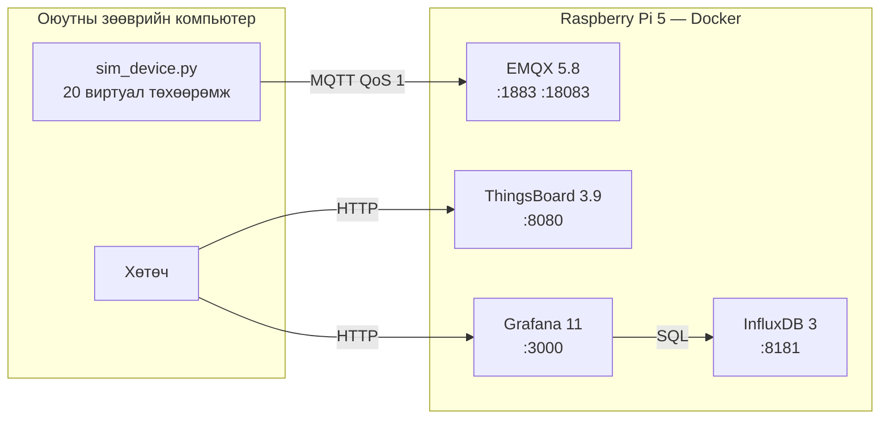

# Лаб 1 — Платформын стек ба ажиглалт (observability)

| | |
|---|---|
| **7 хоног** | III |
| **Хугацаа** | 4 цаг |
| **Багийн бүрэлдэхүүн** | 2–3 хүн |
| **Суралцахуйн үр дүн** | ҮД6 (байршуулах), ҮД8 (баримтжуулах) |
| **Үнэлгээ** | Бичгийн тайлан, 10 оноо |

---

## 1. Зорилго

Cloud-native IoT платформын үндсэн дөрвөн үйлчилгээг Raspberry Pi 5 дээр контейнерээр байршуулж, **платформ хэдий хэмжээний нөөц иддэгийг тоогоор тогтооно**.

Энэ бол зөвхөн "суулгах" лаб биш. Лабораторийн гол бүтээгдэхүүн бол **нөөцийн төсвийн хүснэгт** — Лаб 4-ийн ачааллын тестэд харьцуулах суурь болно. Хэмжилтгүй тайлан 5 оноо авна.

### Лабын төгсгөлд хариулж чадах ёстой асуултууд

1. Бидний платформ Pi-гийн санах ойн хэдэн хувийг эзэлж байна вэ? Хэдэн төхөөрөмж нэмэх зай үлдсэн бэ?
2. Аль үйлчилгээ хамгийн удаан эхэлдэг вэ, яагаад?
3. Ямар нэг үйлчилгээ унтарвал бид үүнийг хэдэн секундын дараа мэдэх вэ?

---

## 2. Урьдчилсан нөхцөл

`SETUP.md`-ийн **Д. Бэлэн байдлын шалгалт** бүх мөр ✔ байх ёстой. Ялангуяа:

- Swap 2 GB (үгүй бол ThingsBoard эхлэхдээ OOM болно)
- `cgroup_enable=memory` идэвхтэй (үгүй бол `docker stats` санах ойг буруу харуулна)
- Дүрсүүд урьдчилан татагдсан (`docker compose --profile core pull`)

> Хэрэв дүрс татаагүй бол лабораторийн эхний 30 минут татахад алдагдана. Энэ нь таны хариуцлага.

---

## 3. Онолын сануулга

**Healthcheck vs "ажиллаж байна".** Контейнер `Up` төлөвтэй байх нь дотор нь ажиллаж буй програм ажиллагаатай гэсэн үг **биш**. ThingsBoard-ын Java процесс 2 минут эхэлж байхад контейнер аль хэдийн `Up` байна. Тиймээс `healthcheck` бичих ёстой — тэр л жинхэнэ бэлэн байдлыг хэлнэ.

**`start_period` яагаад чухал вэ.** Healthcheck эхнээсээ уначихвал Docker контейнерийг `unhealthy` гэж тэмдэглэнэ. `start_period` нь "энэ хугацаанд унасныг тоохгүй" гэсэн үг. ThingsBoard-д 180 секунд өгсөн шалтгаан энэ.

**Санах ойн хязгаар.** `deploy.resources.limits.memory` тавихгүй бол нэг үйлчилгээ санах ойг бүхэлд нь идэж бусдыг уначихна. Хязгаар тавьсан үед харин тэр үйлчилгээ өөрөө OOM-оор унана — энэ нь **илүү дээр**, учир нь алдаа тусгаарлагдана (fault isolation).

**Ажиглалтын гурван багана:** лог (юу болсон), метрик (хэр их/хурдан), мөр (trace — хаанаас хаашаа). Энэ лабд эхний хоёрыг авч үзнэ.

---

## 4. Алхмууд

### Алхам 0 — Бэлтгэл ба суурь төлөв (15 мин)

Pi дээр, VS Code Remote-SSH терминалаас:

```bash
cd ~/cnc302
git pull                       # багийн сүүлийн төлөв
cd stack
cp -n .env.example .env        # хэрэв байхгүй бол
```

`.env` файлыг нээж **бүх нууц үгийг солино**. Дараа нь платформ эхлэхээс өмнөх Pi-гийн суурь төлөвийг тэмдэглэнэ:

```bash
bash ../tools/measure_stack.sh
```

`measurements/sysinfo-*.txt` файлаас дараах утгуудыг **хүснэгт 1** рүү бичнэ.

> **Тэмдэглэл:** `vcgencmd get_throttled` нь `0x0` биш бол Pi тэжээл эсвэл халалтын улмаас хязгаарлагдаж байна. Энэ тохиолдолд бүх хэмжилт гажина — багшид хэлнэ.

---

### Алхам 1 — Стекийг эхлүүлэх (30 мин)

```bash
docker compose --profile core up -d
docker compose ps
```

Бүх үйлчилгээ `healthy` болтол хүлээнэ. ThingsBoard 2–4 минут авна:

```bash
watch -n 5 'docker ps --format "table {{.Names}}\t{{.Status}}"'
```

Хөтчөөр шалгах (VS Code-ийн PORTS табаар дамжуулсны дараа):

| Үйлчилгээ | Хаяг | Анхны нэвтрэлт |
|---|---|---|
| EMQX самбар | http://localhost:18083 | `admin` / `.env`-д бичсэн |
| ThingsBoard | http://localhost:8080 | `tenant@thingsboard.org` / `tenant` |
| Grafana | http://localhost:3000 | `admin` / `.env`-д бичсэн |
| InfluxDB эрүүл мэнд | http://localhost:8181/health | — |

**ЗААВАЛ:** ThingsBoard-д анх нэвтэрсний дараа `tenant` нууц үгийг солино.

<details>
<summary><b>Хэрэв ThingsBoard эхлэхгүй бол</b></summary>

```bash
docker compose logs --tail=200 thingsboard
free -h                                   # swap ашиглагдаж байна уу?
docker inspect cnc302-thingsboard | grep -i oomkilled
```
`OOMKilled: true` бол `JAVA_OPTS`-ын `-Xmx`-ийг 1200m болгож бууруулаад дахин оролдоно.
</details>

---

### Алхам 2 — Эрүүл мэндийн шалгалт ба лог (25 мин)

**2.1** Healthcheck-ийн түүхийг үзнэ:

```bash
docker inspect cnc302-emqx --format '{{json .State.Health}}' | python3 -m json.tool
```

**2.2** Одоо healthcheck-ийг **зориудаар эвдэж** юу болохыг ажиглана. `docker-compose.yml` дотор `grafana`-гийн healthcheck-ийн хаягийг буруу порт руу заана (`3000` → `3999`), дараа нь:

```bash
docker compose --profile core up -d grafana
sleep 90
docker ps --filter name=cnc302-grafana --format '{{.Names}} {{.Status}}'
```

Хариу `(unhealthy)` болох ёстой. **Хэдэн секундын дараа тэмдэглэгдсэнийг хэмжинэ** — `interval × retries` томьёо биелж байна уу?

Дараа нь буцааж зөв болгоно:
```bash
git checkout docker-compose.yml   # эсвэл гараар засна
docker compose --profile core up -d grafana
```

**2.3** Логийн эргэлт (rotation) ажиллаж байгааг шалгана:

```bash
docker inspect cnc302-emqx --format '{{json .HostConfig.LogConfig}}'
sudo du -sh /var/lib/docker/containers/*/*-json.log | sort -h | tail -5
```

> Логийн хязгаар байхгүй бол хэдэн долоо хоногийн дараа Pi-гийн диск дүүрнэ. Лаб 5-д яг үүнийг зориудаар үүсгэнэ.

---

### Алхам 3 — Эхлэх хугацааны хэмжилт (35 мин)

```bash
bash ../tools/measure_stack.sh --startup
```

Энэ нь стекийг зогсоож дахин эхлүүлээд үйлчилгээ бүрийн эхлэх хугацааг `measurements/startup-*.csv`-д бичнэ.

**Хоёр удаа** ажиллуулна:
1. Нэгдүгээр удаа — өгөгдөлтэй (халуун эхлэлт)
2. Хоёрдугаар удаа — `docker compose --profile core down` хийсний дараа шууд (мөн халуун)

**Хүснэгт 2**-ыг бөглөнө. Дараа нь хариулна: **яагаад ThingsBoard бусдаас 10–50 дахин удаан эхэлдэг вэ?** (Хариултад JVM-ийн эхлэлт, өгөгдлийн сангийн шилжилт (migration), healthcheck-ийн `start_period` гэсэн гурван хүчин зүйлийг дурдана.)

---

### Алхам 4 — Амралтын үеийн нөөцийн хэрэглээ (40 мин)

Ачаалалгүй үед 10 минут ажиглана:

```bash
bash ../tools/measure_stack.sh --watch 600 15
```

Ажиллаж байх хооронд өөр терминалд:

```bash
free -h
docker stats --no-stream
vcgencmd measure_temp
```

**Хүснэгт 3**-ыг бөглөнө. Дараа нь **үлдэгдэл нөөцийг** тооцоолно:

```
Боломжтой санах ой  =  Pi-гийн нийт RAM − (бүх контейнерийн санах ой) − (OS-ийн хэрэглээ)
```

---

### Алхам 5 — Ачаалалтай үеийн хэрэглээ (30 мин)

Одоо **зөөврийн компьютер дээрээс** виртуал төхөөрөмж холбоно:

```bash
# зөөврийн компьютер дээр, багийн сангийн үндсэн фолдероос
source .venv/bin/activate
python tools/sim_device.py --host pi-team03.local --devices 20 --interval 1 --qos 1
```

Үүнтэй зэрэг Pi дээр:

```bash
bash ../tools/measure_stack.sh --watch 300 10
```

EMQX самбарын **Dashboard → Metrics** хэсгээс мессежийн хурдыг харна.

**Хүснэгт 4**-ийг бөглөж, Хүснэгт 3-тай харьцуулна. **20 төхөөрөмж нэмэхэд юу өөрчлөгдсөн бэ?** CPU шугаман өссөн үү, эсвэл өссөнгүй юү?

---

### Алхам 6 — Нөөцийн төсөв гаргах (25 мин)

Хүснэгт 3, 4-ийн үр дүнд тулгуурлан **Хүснэгт 5** (нөөцийн төсөв)-ийг бөглөнө.

Дараа нь энгийн шугаман экстраполяци хийнэ:

```
нэг төхөөрөмжид ногдох CPU  =  (ачаалалтай CPU% − амралтын CPU%) / 20
```

Үүнээс: **Pi-гийн CPU-г 80% болгоход хэдэн төхөөрөмж хэрэгтэй вэ?**

> Энэ бол зөвхөн **таамаг**. Лаб 4-т бид үүнийг бодитоор шалгаж, шугаман экстраполяци хаана алдагдахыг харна. Таамгаа тайландаа бичиж үлдээгээрэй — Лаб 4-ийн тайланд буцаж харьцуулна.

---

### Алхам 7 — Баримтжуулалт ба commit (25 мин)

**7.1 Архитектурын диаграм.** `lab01/architecture.md` файлд Mermaid диаграм зурна:

```markdown

```

Диаграмд **порт, хувилбар, протоколыг заавал** бичнэ.

**7.2** Тайланг бөглөнө: `cp report-template.md report.md` → бүх хүснэгтийг бөглөнө.

**7.3** Commit:

```bash
cd ~/cnc302
git add -A
git commit -m "Лаб 1: платформын стек, нөөцийн хэмжилт"
git tag lab01-done
git push origin main --tags
```

`git status` цэвэр байх ёстой. `.env`, `measurements/` санд орох ёсгүй.

---

## 5. Хэмжилтийн хүснэгтүүд

### Хүснэгт 1 — Pi-гийн суурь төлөв (платформ эхлэхээс өмнө)

| Үзүүлэлт | Утга |
|---|---|
| Модель | |
| Цөмийн тоо | |
| Нийт RAM | |
| Ашиглагдсан RAM (сул) | |
| Swap (нийт / ашиглагдсан) | |
| Дискний сул зай | |
| Температур | |
| `get_throttled` | |

### Хүснэгт 2 — Эхлэх хугацаа

| Үйлчилгээ | Дүрсийн хувилбар | Эхлэх хугацаа (с) | `healthy` болох хугацаа (с) |
|---|---|---|---|
| emqx | 5.8.6 | | |
| thingsboard | 3.9.1 | | |
| influxdb | 3.2-core | | |
| grafana | 11.6.0 | | |
| **Нийт стек бэлэн** | — | | |

### Хүснэгт 3 — Амралтын үеийн хэрэглээ (10 мин дундаж)

| Үйлчилгээ | CPU % (дундаж) | CPU % (дээд) | Санах ой (MiB) | Санах ой % | Хязгаар (MiB) |
|---|---|---|---|---|---|
| emqx | | | | | 1024 |
| thingsboard | | | | | 2500 |
| influxdb | | | | | 1024 |
| grafana | | | | | 512 |
| **Нийт** | | | | | |

Pi-гийн нийт RAM: ______ MiB  ·  OS + бусад: ______ MiB  ·  **Үлдэгдэл: ______ MiB**

### Хүснэгт 4 — Ачаалалтай үеийн хэрэглээ (20 төхөөрөмж, 1 мсж/с)

| Үйлчилгээ | CPU % (дундаж) | Санах ой (MiB) | Хүснэгт 3-аас өөрчлөлт |
|---|---|---|---|
| emqx | | | |
| thingsboard | | | |
| influxdb | | | |
| grafana | | | |

EMQX-ийн бүртгэсэн мессежийн хурд: ______ мсж/с
Pi-гийн температур ачаалалтай үед: ______ °C

### Хүснэгт 5 — Нөөцийн төсөв ба таамаг

| Асуулт | Хариулт | Тооцооны үндэслэл |
|---|---|---|
| Платформын суурь санах ой | MiB | |
| Үлдэгдэл санах ой | MiB | |
| Нэг төхөөрөмжид ногдох CPU % | | |
| CPU 80% болох төхөөрөмжийн тоо (таамаг) | | |
| Санах ойгоор хязгаарлагдах уу, CPU-гаар уу? | | |

---

## 6. Хяналтын асуулт

Тайландаа хариулна (тус бүр 2–4 өгүүлбэр):

1. `Up` төлөв ба `healthy` төлөвийн ялгаа юу вэ? Аль нь платформын бэлэн байдлыг илэрхийлэх вэ?
2. Grafana-гийн healthcheck-ийг эвдсэний дараа `unhealthy` болтол хэдэн секунд өнгөрсөн бэ? Энэ тоо `interval`, `retries`, `start_period`-тэй хэрхэн уялдаж байна вэ?
3. Санах ойн хязгаар (`memory limit`) тавих нь яагаад хязгааргүй орхихоос **дээр** вэ? Алдааны тусгаарлалт гэж юу вэ?
4. Логийн эргэлт (`max-size`, `max-file`) тохируулаагүй бол 3 сарын дараа юу болох вэ? Тооцоолж үзнэ үү.
5. ThingsBoard-ын эхлэх хугацаа урт нь ямар практик асуудал үүсгэх вэ (жишээ нь Pi цахилгаан тасарсны дараа)?
6. Хүснэгт 5-ын таамаг ямар таамаглалууд дээр тулгуурласан бэ? Аль нь бодит байдалд эвдрэх магадлалтай вэ?

---

## 7. Тайлангийн шаардлага

`lab01/report.md` дотор:

- [ ] Багийн гишүүд ба хувь нэмэр
- [ ] Хүснэгт 1–5 бүрэн бөглөгдсөн
- [ ] Архитектурын диаграм (`architecture.md`, Mermaid)
- [ ] Хяналтын 6 асуултын хариулт
- [ ] Тулгарсан асуудал ба шийдэл
- [ ] `measurements/` доторх CSV-ийн нэр (файлыг Git-д оруулахгүй, зөвхөн нэрийг дурдана)
- [ ] Git commit hash ба `lab01-done` тэмдэглэгээ

---

## 8. Оношилгоо

| Шинж тэмдэг | Магадлалтай шалтгаан | Шийдэл |
|---|---|---|
| `docker stats` санах ойг 0 харуулна | cgroup memory идэвхгүй | SETUP Б.4-ийг дахин хийнэ |
| ThingsBoard `Restarting` давтана | OOM | Swap 2 GB эсэхийг шалга; `-Xmx`-ийг 1200m болго |
| `port is already allocated` | 1883 эсвэл 8080 өөр процесс эзэлсэн | `sudo ss -tlnp \| grep <порт>` |
| InfluxDB эхлэхгүй, `--without-auth` танихгүй | InfluxDB 3-ын CLI өөрчлөгдсөн | `docker run --rm influxdb:3.2-core influxdb3 serve --help`; эсвэл influx2 нөөц хувилбар руу шилж |
| EMQX самбарт нэвтэрч чадахгүй | `.env` уншигдаагүй | `docker compose config \| grep PASSWORD` |
| Хөтчөөр хандаж чадахгүй | порт дамжуулаагүй | VS Code PORTS таб эсвэл SSH `-L` туннел |
| Температур 80 °C давсан | хөргөлт хүрэлцэхгүй | идэвхтэй хөргөлт залга; хэмжилт гажина |

---

## 9. Үнэлгээний шалгуур (10 оноо)

| Шалгуур | Оноо | Тэмдэглэл |
|---|---|---|
| Дөрвөн үйлчилгээ ажиллаж, `healthy` төлөвтэй | 3 | Багш шалгах үед ажиллаж байх ёстой |
| Хүснэгт 1–4 бодит хэмжилтээр бөглөгдсөн | 3 | Хуулсан/зохиосон тоо → 0 |
| Хүснэгт 5-ын таамаг тооцооны үндэслэлтэй | 2 | Томьёо харагдах ёстой |
| Git сан цэвэр, `.env` ороогүй, тэмдэглэгээтэй | 1 | |
| Диаграм ба тайлангийн чанар | 1 | |

**Автомат 0 оноо:** `.env` эсвэл хувийн түлхүүр Git санд орсон тохиолдолд.
