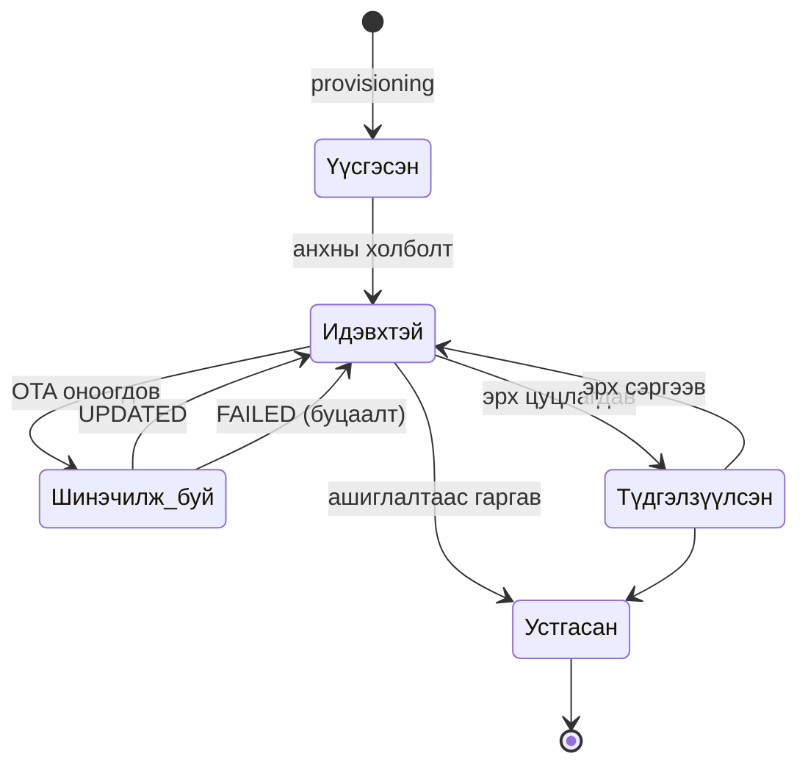

# Лаб 2 — Төхөөрөмжийн бүрэн амьдралын мөчлөг

| | |
|---|---|
| **7 хоног** | V |
| **Хугацаа** | 4 цаг |
| **Суралцахуйн үр дүн** | ҮД3 (үнэлэх), ҮД6 (байршуулах) |
| **Үнэлгээ** | Бичгийн тайлан, 10 оноо |

---

## 1. Зорилго

Төхөөрөмжийн амьдралын мөчлөгийн **дөрвөн үе шатыг бүхэлд нь** хэрэгжүүлж хэмжинэ:

```
  бүртгэл  →  таних тэмдэг  →  ажиллагаа (OTA)  →  ашиглалтаас гаргах
 provisioning    identity        operation           decommission
```

Ихэнх сургалтын материал зөвхөн эхний хоёр үе шатыг үзүүлдэг. Бодит байршуулалтад **гурав дахь ба дөрөв дэх** үе шат буюу шинэчлэл, эрх цуцлалт л жинхэнэ асуудлыг үүсгэдэг. Энэ лабораторид дөрвүүлээ хийнэ.

### Лабын төгсгөлд хариулж чадах ёстой асуултууд

1. 100 төхөөрөмжийг bulk болон JIT горимоор бүртгэхэд ямар ялгаа гарах вэ — хугацаа, эрсдэл, ажиллагааны ачаалал талаас?
2. Токен (access token) ба X.509 сертификатын хооронд ямар аюулгүй байдлын ялгаа байна вэ?
3. 30% нь амжилтгүй болсон OTA тараалтын дараа таны флот ямар байдалд байх вэ? Хэдэн хувилбар зэрэг оршиж байна вэ?

---

## 2. Урьдчилсан нөхцөл

- Лаб 1 дууссан, `core` профайл ажиллаж байна (`make ps`)
- Бие даалт V: provisioning стратегийн уншлага
- Зөөврийн компьютер дээр `.venv` идэвхтэй, `requests`, `paho-mqtt` суусан

```bash
# Pi дээр
cd ~/cnc302/stack && docker compose --profile core up -d && make health
```

---

## 3. Онолын сануулга

**Bulk vs JIT.** Bulk нь урьдчилан таамаглах боломжтой: үйлдвэрээс гарахад бүх итгэмжлэл бэлэн. Гэхдээ хэзээ ч асаагдахгүй төхөөрөмжийн итгэмжлэл платформ дээр үүрд хэвтэнэ — халдагчийн гар дор орох боломж. JIT нь ашиглагдахгүй итгэмжлэл үүсгэхгүй, гэхдээ **бүртгэлийн түлхүүр** (provision key) нэг л ширхэг бөгөөд түүнийг мэдсэн хэн ч төхөөрөмж нэмж чадна.

**Токен vs сертификат.**

| | Access token | X.509 сертификат |
|---|---|---|
| Юу нь нууц вэ | тэмдэгт мөр өөрөө | зөвхөн хувийн түлхүүр |
| Сүлжээгээр дамжих уу | тийм (TLS дотор) | үгүй — зөвхөн гарын үсэг дамжина |
| Хугацаа дуусах уу | үгүй (гараар цуцална) | тийм, `notAfter` талбартай |
| Цуцлах | платформ дээр устгана | CRL/OCSP шаардана |
| Тохиромжтой | прототип, дотоод сүлжээ | үйлдвэрлэлийн флот |

**OTA-гийн эрсдэл.** Шинэчлэл бол төхөөрөмжийг **алсаас эвдэж болох** цорын ганц үйлдэл. Тиймээс: (1) хяналтын нийлбэр заавал шалгана, (2) үе шаттай (canary) тараана, (3) буцаах зам үргэлж байх ёстой, (4) шинэчлэлийн явцад тэжээл тасарсан ч төхөөрөмж сэргэх ёстой (A/B хуваалт).

---

## 4. Алхмууд

### Алхам 1 — Bulk provisioning ба хэмжилт (35 мин)

**Зөөврийн компьютер дээрээс** ThingsBoard-ын REST API руу:

```bash
source .venv/bin/activate
# SSH туннел эсвэл VS Code порт дамжуулалт идэвхтэй байх ёстой
python lab02/provision.py --url http://localhost:8080 \
    --mode bulk --count 20 --prefix bulk --csv lab02/out/bulk.csv
```

> `lab02/out/` нь `.gitignore`-д бүртгэгдсэн. **Итгэмжлэл агуулсан CSV-г Git-д оруулах нь автоматаар 0 оноо.**

ThingsBoard-ын веб дээр **Entities → Devices** хэсэгт 20 төхөөрөмж харагдана. Аль нэгийг нээж **Attributes → Server attributes** дотор `provision_mode: bulk` байгааг шалгана.

**Хүснэгт 1**-ийн `bulk` мөрийг бөглөнө (дундаж, медиан, p95, нийт хугацаа).

Одоо 100 төхөөрөмж дээр давтана:

```bash
python lab02/provision.py --url http://localhost:8080 \
    --mode bulk --count 100 --prefix bulk1 --csv lab02/out/bulk100.csv
```

**Ажигла:** нэг төхөөрөмжид ногдох хугацаа 20-оос 100 болоход өөрчлөгдсөн үү? Хэрэв өссөн бол яагаад? (Санамж: Pi-гийн Postgres, индекс, ThingsBoard-ын кэш.)

---

### Алхам 2 — JIT provisioning ба харьцуулалт (30 мин)

```bash
python lab02/provision.py --url http://localhost:8080 \
    --mode jit --count 20 --prefix jit --jit-delay 0.5 --csv lab02/out/jit.csv
```

**Хүснэгт 1**-ийн `jit` мөрийг бөглөнө.

**Хүснэгт 2** (стратегийн харьцуулалт)-ыг **өөрсдийн үгээр** бөглөнө. Энэ бол хэмжилт биш, **шийдвэрийн шинжилгээ**. Багийн төслийн хувьд аль стратегийг сонгохоо энд шийднэ.

---

### Алхам 3 — mTLS: сертификат үүсгэх ба брокерт тохируулах (45 мин)

**3.1 CA ба төхөөрөмжийн сертификат үүсгэх.** Pi дээр (эсвэл зөөврийн компьютер дээр — дараа нь Pi рүү хуулна):

```bash
cd ~/cnc302/lab02
SERVER_CN=pi-team03.local bash make_certs.sh init          # ← өөрийн хостын нэрээр
bash make_certs.sh device tls0001 tls0002
bash make_certs.sh list
```

Сертификатын гинжийг шалгана:
```bash
openssl verify -CAfile certs/ca.crt certs/tls0001.crt      # → OK
openssl x509 -in certs/tls0001.crt -noout -subject -dates -ext extendedKeyUsage
```

**3.2 EMQX-д TLS сонсогч тохируулах.** Сертификатыг брокерын харагдах фолдер руу хуулна:

```bash
cp certs/ca.crt certs/server.crt certs/server.key ~/cnc302/stack/emqx/certs/
chmod 644 ~/cnc302/stack/emqx/certs/*
```

`stack/docker-compose.yml` дотор `emqx` үйлчилгээний `environment` хэсэгт нэмнэ:

```yaml
      EMQX_LISTENERS__SSL__DEFAULT__ENABLE: "true"
      EMQX_LISTENERS__SSL__DEFAULT__BIND: "0.0.0.0:8883"
      EMQX_LISTENERS__SSL__DEFAULT__SSL_OPTIONS__CACERTFILE: "/opt/emqx/etc/certs/ca.crt"
      EMQX_LISTENERS__SSL__DEFAULT__SSL_OPTIONS__CERTFILE: "/opt/emqx/etc/certs/server.crt"
      EMQX_LISTENERS__SSL__DEFAULT__SSL_OPTIONS__KEYFILE: "/opt/emqx/etc/certs/server.key"
      EMQX_LISTENERS__SSL__DEFAULT__SSL_OPTIONS__VERIFY: "verify_peer"
      EMQX_LISTENERS__SSL__DEFAULT__SSL_OPTIONS__FAIL_IF_NO_PEER_CERT: "true"
```

`verify_peer` + `fail_if_no_peer_cert` хоёулаа байх нь **харилцан баталгаажуулалт (mTLS)** — зөвхөн бидний CA-гаар гарын үсэг зурагдсан төхөөрөмж холбогдоно.

```bash
cd ~/cnc302/stack && docker compose --profile core up -d emqx
docker compose logs --tail=50 emqx | grep -i ssl
```

---

### Алхам 4 — TLS холболтыг шалгах (25 мин)

**4.1 Зөв сертификаттай — амжилттай байх ёстой:**

```bash
python tools/sim_device.py --host pi-team03.local --port 8883 --tls \
  --ca lab02/certs/ca.crt --cert lab02/certs/tls0001.crt \
  --key lab02/certs/tls0001.key --devices 1 --count 5 --interval 1
```

**4.2 Сертификатгүйгээр — АМЖИЛТГҮЙ байх ёстой:**

```bash
python tools/sim_device.py --host pi-team03.local --port 8883 --tls \
  --ca lab02/certs/ca.crt --devices 1 --count 3
```

Алдааны мессежийг **яг байгаагаар нь** тайланд хуулна.

**4.3 Хуурамч CA-гаар — АМЖИЛТГҮЙ байх ёстой:**

```bash
CERTDIR=/tmp/evil SERVER_CN=pi-team03.local bash lab02/make_certs.sh device evil0001
python tools/sim_device.py --host pi-team03.local --port 8883 --tls \
  --ca lab02/certs/ca.crt --cert /tmp/evil/evil0001.crt \
  --key /tmp/evil/evil0001.key --devices 1 --count 3
```

**Хүснэгт 3**-ыг бөглөнө. Гурван тохиолдол бүрд: холбогдсон уу, алдааны мессеж, брокерын лог дахь бичлэг.

```bash
# Pi дээр брокерын талын логийг харна
docker compose logs --tail=100 emqx | grep -iE 'ssl|handshake|certificate'
```

---

### Алхам 5 — OTA багц бэлтгэж байршуулах (30 мин)

**5.1 "Firmware" үүсгэх.** Бид жинхэнэ хоёртын firmware биш, гэхдээ протоколын хувьд ялгаагүй:

```bash
mkdir -p lab02/out
head -c 200000 /dev/urandom > lab02/out/agent-1.1.0.bin
sha256sum lab02/out/agent-1.1.0.bin
```

**5.2 ThingsBoard дээр байршуулах.** Веб → **Advanced features → OTA updates → +**

| Талбар | Утга |
|---|---|
| Title | `cnc302-agent` |
| Version | `1.1.0` |
| Device profile | `default` |
| Package type | Firmware |
| Checksum algorithm | SHA-256 |
| File | `agent-1.1.0.bin` |

Байршуулсны дараа ThingsBoard хяналтын нийлбэрийг өөрөө тооцно — таны `sha256sum`-тай **таарч байгааг шалгана**.

**5.3 Нэг төхөөрөмж дээр туршина.** `bulk.csv`-ээс эхний токеныг аваад:

```bash
python lab02/ota_agent.py --host pi-team03.local --port 1884 \
    --token <ACCESS_TOKEN> --verbose
```

Агент ажиллаж байх зуур ThingsBoard-ын төхөөрөмжийн хуудсан дээр **Latest telemetry** хэсэгт `fw_state` талбар `DOWNLOADING → DOWNLOADED → VERIFIED → UPDATING → UPDATED` гэж өөрчлөгдөхийг ажиглана.

> Хэрэв төлөв өөрчлөгдөхгүй бол: төхөөрөмжид firmware оноогдоогүй байна. Device → **Manage firmware** → `cnc302-agent 1.1.0` сонгоно.

---

### Алхам 6 — Canary тараалт ба буцаалт (35 мин)

Бодит тараалтад бүх флотыг нэг дор шинэчлэхгүй. Эхлээд жижиг хэсгийг ("canary") шинэчилж, амжилтын хувийг хэмжээд л цааш үргэлжлүүлнэ.

**6.1 Canary — 20% (4 төхөөрөмж), амжилтгүйн магадлал 30%:**

```bash
python lab02/ota_agent.py --host pi-team03.local --port 1884 \
    --tokens-csv lab02/out/bulk.csv --devices 4 \
    --fail-rate 0.3 --csv lab02/out/ota-canary.csv
```

**6.2 Шийдвэр гаргах.** Амжилтын хувь **95%-иас доош** бол тараалтыг зогсооно. Таны үр дүн юу гэж байна?

**6.3 Бүтэн тараалт** (canary амжилттай гэж үзвэл):

```bash
python lab02/ota_agent.py --host pi-team03.local --port 1884 \
    --tokens-csv lab02/out/bulk.csv --devices 20 \
    --fail-rate 0.3 --csv lab02/out/ota-full.csv
```

**6.4 Флотын төлөвийг тоолох.** ThingsBoard дээр төхөөрөмжүүдийн `current_fw_version` талбарыг харна. Хэдэн төхөөрөмж 1.0.0 дээр үлдсэн, хэд нь 1.1.0 руу шилжсэн бэ?

**Хүснэгт 4**-ийг бөглөнө.

**6.5 Хяналтын нийлбэрийн эвдрэлийг туршина.** ThingsBoard дээр шинэ багц үүсгээд checksum-ыг **зориудаар буруу** бичнэ (нэг тэмдэгт солино). Дараа нь агентыг ажиллуулна:

```bash
python lab02/ota_agent.py --host pi-team03.local --port 1884 \
    --token <ACCESS_TOKEN> --verbose
```

Агент `CHECKSUM_FAILED` гарган суулгахаас **татгалзах ёстой**. Энэ нь яагаад амин чухал вэ? (Санамж: сүлжээнд гарсан алдаа vs зориудын халдлага.)

---

### Алхам 7 — Ашиглалтаас гаргах ба эрх цуцлах (20 мин)

**7.1 Токеноор баталгаажсан төхөөрөмжийг устгах:**

```bash
python lab02/provision.py --url http://localhost:8080 --prefix jit --cleanup
```

Устгасны дараа тухайн токеноор холбогдож үзнэ — татгалзах ёстой.

**7.2 Сертификаттай төхөөрөмжийг хүчингүй болгох:**

```bash
bash lab02/make_certs.sh revoke tls0002
```

**Одоо чухал асуулт:** `tls0002.crt` файл халдагчийн гарт үлдсэн байна. Брокер түүнийг **татгалзах уу?**

```bash
python tools/sim_device.py --host pi-team03.local --port 8883 --tls \
  --ca lab02/certs/ca.crt --cert /tmp/backup/tls0002.crt \
  --key /tmp/backup/tls0002.key --devices 1 --count 3
```

> Сертификатыг файлын нэр солиод "хүчингүй болгосон" гэж үзэх нь **хангалтгүй**. Жинхэнэ цуцлалт нь CRL (Certificate Revocation List) эсвэл OCSP шаардана, эсвэл брокер дээр зөвшөөрөгдсөн CN-үүдийн жагсаалт (allow-list) хөтлөх хэрэгтэй. Үүнийг тайландаа тайлбарлана — Лаб 7-д эрхийн удирдлагатай холбогдоно.

**7.3** Амьдралын мөчлөгийн төлөвийн диаграмыг `lab02/lifecycle.md`-д Mermaid-аар зурна:



Төлөв бүрд **өгөгдөлд юу тохиолдохыг** бичнэ (Хүснэгт 5).

---

### Алхам 8 — Тайлан ба commit (10 мин)

```bash
git add -A
git status                       # certs/, out/ ОРОХГҮЙ байх ёстой!
git commit -m "Лаб 2: төхөөрөмжийн амьдралын мөчлөг"
git tag lab02-done && git push origin main --tags
```

---

## 5. Хэмжилтийн хүснэгтүүд

### Хүснэгт 1 — Provisioning-ийн гүйцэтгэл

| Горим | Тоо | Дундаж (мс) | Медиан (мс) | p95 (мс) | Нийт (сек) |
|---|---|---|---|---|---|
| bulk | 20 | | | | |
| bulk | 100 | | | | |
| jit | 20 | | | | |

Нэг төхөөрөмжид ногдох хугацаа 20 → 100 болоход өөрчлөгдсөн үү? ______%

### Хүснэгт 2 — Стратегийн шинжилгээ

| Шалгуур | Bulk | JIT |
|---|---|---|
| Ашиглагдахгүй итгэмжлэл үүсэх үү | | |
| Гол эрсдэл | | |
| Үйлдвэрлэлийн шатанд юу шаардлагатай вэ | | |
| Флот томрох үед хэрхэн ажиллах вэ | | |
| **Бидний төсөлд сонгосон нь** | | |

### Хүснэгт 3 — mTLS-ийн хандалтын шалгалт

| Туршилт | Холбогдсон уу | Клиент талын алдаа | Брокерын лог |
|---|---|---|---|
| Зөв сертификат | | | |
| Сертификатгүй | | | |
| Хуурамч CA | | | |
| Цуцалсан сертификат (7.2) | | | |

### Хүснэгт 4 — OTA тараалтын үр дүн

| Тараалт | Төхөөрөмж | UPDATED | ROLLED_BACK | Бусад | Амжилт % | Дундаж хугацаа (с) |
|---|---|---|---|---|---|---|
| Canary (20%) | 4 | | | | | |
| Бүтэн | 20 | | | | | |

Тараалтын дараах флотын байдал: 1.0.0 дээр ______ төхөөрөмж, 1.1.0 дээр ______ төхөөрөмж.
Хяналтын нийлбэр буруу үед агент юу хийсэн бэ: ______________________

### Хүснэгт 5 — Амьдралын мөчлөг ба өгөгдөл

| Төлөв | Төхөөрөмж холбогдож чадах уу | Түүхэн өгөгдөлд юу тохиолдох вэ | Итгэмжлэлийн байдал |
|---|---|---|---|
| Үүсгэсэн | | | |
| Идэвхтэй | | | |
| Шинэчилж буй | | | |
| Түдгэлзүүлсэн | | | |
| Устгасан | | | |

---

## 6. Хяналтын асуулт

1. Bulk горимд үүсгэсэн боловч хэзээ ч ашиглагдаагүй 500 итгэмжлэл ямар эрсдэл дагуулах вэ?
2. JIT горимын бүртгэлийн түлхүүр алдагдвал халдагч юу хийж чадах вэ? Үүнийг хэрхэн хязгаарлах вэ?
3. Access token сүлжээгээр дамждаг, сертификатын хувийн түлхүүр дамждаггүй. Яагаад энэ нь чухал ялгаа вэ?
4. `verify_peer` тохируулаагүй бол ямар халдлага боломжтой болох вэ?
5. Хяналтын нийлбэр шалгахгүйгээр firmware суулгавал ямар үр дагавар гарах вэ? Хоёр өөр хувилбар бод: (а) сүлжээний алдаа, (б) зориудын халдлага.
6. Canary тараалтын хэмжээг хэрхэн сонгох вэ? 20% зөв үү, эсвэл флотын хэмжээнээс хамаарах уу?
7. Сертификатыг жинхэнээр цуцлахад юу шаардлагатай вэ? Файлын нэр солих нь яагаад хангалтгүй вэ?
8. Шинэчлэлийн явцад төхөөрөмжийн тэжээл тасарвал юу болох вэ? A/B хуваалт гэж юу вэ, энэ асуудлыг хэрхэн шийддэг вэ?

---

## 7. Тайлангийн шаардлага

- [ ] Хүснэгт 1–5 бүрэн
- [ ] Алхам 4-ийн гурван алдааны мессеж **яг байгаагаар нь**
- [ ] `lifecycle.md` төлөвийн диаграм
- [ ] Хяналтын 8 асуултын хариулт
- [ ] Багийн төсөлд сонгосон provisioning стратеги ба **үндэслэл**
- [ ] Git commit hash, `lab02-done` тэмдэглэгээ

---

## 8. Оношилгоо

| Шинж тэмдэг | Шалтгаан | Шийдэл |
|---|---|---|
| `401 Unauthorized` REST дээр | нууц үг солигдсон | `--password`-оо шинэ утгаар өг |
| `Connection refused :8883` | SSL сонсогч идэвхжээгүй | `docker compose logs emqx \| grep ssl` |
| TLS handshake `unknown ca` | буруу `--ca` эсвэл сертификат өөр CA-гаас | `openssl verify -CAfile` |
| TLS handshake `hostname mismatch` | `SERVER_CN` Pi-гийн нэртэй таарахгүй | сертификатыг зөв CN-ээр дахин үүсгэ, эсвэл `--insecure` (зөвхөн лабораторид) |
| OTA-д `fw_state` өөрчлөгдөхгүй | firmware төхөөрөмжид оноогоогүй | Device → Manage firmware |
| OTA `TIMEOUT` | 1884 биш 1883 порт руу холбогдсон | ThingsBoard-ын MQTT нь **1884** |
| Агент `NO_UPDATE` гэнэ | сервер дээрх хувилбар агентын `current_version`-той ижил | ThingsBoard дээр шинэ хувилбар үүсгэ |

---

## 9. Үнэлгээний шалгуур (10 оноо)

| Шалгуур | Оноо |
|---|---|
| mTLS ажиллаж, гурван хандалтын шалгалт баримтжсан | 3 |
| OTA тараалт canary + бүтэн хэлбэрээр гүйцэтгэгдэж хэмжигдсэн | 3 |
| Хүснэгт 1–5 бодит үр дүнгээр бөглөгдсөн | 2 |
| Амьдралын мөчлөгийн диаграм ба өгөгдлийн шинжилгээ | 1 |
| Git цэвэр (сертификат, токен ороогүй), тэмдэглэгээтэй | 1 |

**Автомат 0 оноо:** `certs/`, `out/` доторх түлхүүр эсвэл токен Git санд орсон бол.
