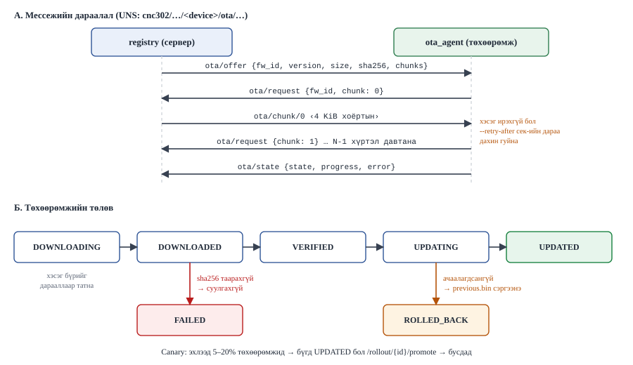

# Лаб 2 — Төхөөрөмжийн бүрэн амьдралын мөчлөг ба OTA

| | |
|---|---|
| **7 хоног** | V |
| **Хугацаа** | 4 цаг |
| **Суралцахуйн үр дүн** | ҮД4 (аюулгүй төхөөрөмж, өгөгдлийн удирдлага) |
| **Үнэлгээ** | Бичгийн тайлан, 10 оноо |
| **Гол хэмжилт** | Бүртгэлийн хурд, OTA-гийн хугацаа ба амжилтын хувь |

---

## 1. Зорилго

Төхөөрөмжийн амьдралын мөчлөгийн **дөрвөн үе шатыг** өөрсдөө хэрэгжүүлж, хэмжинэ:

```
бүртгэл (provisioning) → таних тэмдэг (identity) → OTA шинэчлэлт → хүчингүй болгох (revocation)
```

Худалдааны платформууд (ThingsBoard, AWS IoT, Azure IoT Hub) эдгээрийг **хар хайрцаг** болгож нуудаг. Энэ лабораторид та `lab02/registry/app.py` (≈500 мөр) ба `lab02/ota_agent.py` (≈270 мөр) хоёрыг **уншиж, ажиллуулж, эвдэж** протоколыг ил харна.

> **Яагаад ThingsBoard биш вэ:** ThingsBoard-ын албан ёсны заавар хөгжүүлэлт/PoC-д хүртэл 4 GB RAM шаарддаг. Pi 3B-д нийт 1 GB (OS-д ~925 MiB). Гэхдээ илүү чухал шалтгаан бий — та энэ хичээлээр *платформ ашиглагч* биш *платформ зохиогч* болох ёстой. Лабораторийн эцэст сонголтот харьцуулалт хийнэ (§4, Алхам 8).

---

## 2. Урьдчилсан нөхцөл ба бэлтгэл (15 мин)

- Лаб 1 дууссан, `lab01-done` tag тавигдсан.
- Бие даалт IV: X.509 сертификатын гинжин хэлхээ (CA → төхөөрөмж) уншсан.

> 💡 **Алхмуудыг дарааллаар нь хий.** Алхам бүрийн төгсгөлд ✅ **Шалгах** хэсэг бий. Үр дүн нь таарахгүй бол **цааш бүү яв** — ❌ мөр эсвэл §8-аас шалтгааныг ол. Лаб 2-ын алхмууд бие биеэсээ хамаардаг: Алхам 0-гүй бол Алхам 1, 7 ажиллахгүй; Алхам 3-гүй бол Алхам 4-ийн сертификат алга.

### 2.1 Терминалууд

Лаб 1-ийн адил **нэрлэсэн** терминалуудыг нээнэ (Windows Terminal-ын таб дээр баруун товч → **Rename tab**):

| Цонх | Хаана | Хэрхэн нээх |
|---|---|---|
| **[🥧 Pi-1]** | Raspberry Pi | PowerShell таб → `ssh pi` |
| **[🥧 Pi-2]** | Raspberry Pi | шинэ PowerShell таб → `ssh pi` |
| **[💻 Ubuntu-1]** | Зөөврийн компьютер (WSL) | Terminal-ын `˅` → **Ubuntu** |
| **[💻 Ubuntu-2]** | Зөөврийн компьютер (WSL) | дахин `˅` → **Ubuntu** |

### 2.2 Өөрийн утгууд

| Хувьсагч | Утга | Хаанаас |
|---|---|---|
| `<NN>` | багийн дугаар, жишээ `07` | багш |
| `<LAPTOP_IP>` | жишээ `192.168.1.100` | **[💻 PowerShell]** `ipconfig` → Wi-Fi/Ethernet-ийн IPv4 |
| `<PI_IP>` | жишээ `192.168.1.57` | **[🥧 Pi-1]** `hostname -I` → эхний хаяг |

Энэ лабд таны Pi-гийн **төхөөрөмжийн нэр** нь `pi3b-team<NN>` (Pi-гийн `edge/.env`-ийн `DEVICE_ID`). Командуудад үүнийг `$DEV` хувьсагчаар бичсэн — доорх 2.3-т нэг удаа тохируулна.

### 2.3 Орчноо бэлтгэх — **цонх нээх бүрт** ажиллуулна

Доорх блокийг **Ubuntu цонх бүрт** (Ubuntu-1, Ubuntu-2) нээсний дараа нэг удаа буулга. `<NN>`-ийг өөрийн дугаараар соль:

**[💻 Ubuntu-1]** ба **[💻 Ubuntu-2]**
```bash
cd ~/cnc302 && source .venv/bin/activate
export DEV=pi3b-team<NN>
export EMQX_API_KEY=$(grep '^EMQX_API_KEY=' stack/.env | cut -d= -f2)
export EMQX_API_SECRET=$(grep '^EMQX_API_SECRET=' stack/.env | cut -d= -f2)
echo "DEV=$DEV  API_KEY=${EMQX_API_KEY:-<хоосон — Алхам 0-д бөглөнө>}"
```

Доорх блокийг **Pi цонх бүрт** (Pi-1, Pi-2) нээсний дараа нэг удаа буулга:

**[🥧 Pi-1]** ба **[🥧 Pi-2]**
```bash
cd ~/cnc302
PY=~/cnc302/edge/.venv/bin/python
export CLOUD_HOST=$(grep '^CLOUD_HOST=' edge/.env | cut -d= -f2)
export DEV=$(grep '^DEVICE_ID=' edge/.env | cut -d= -f2)
echo "үүл=$CLOUD_HOST  төхөөрөмж=$DEV"
```

✅ Pi дээр `үүл=192.168.1.100  төхөөрөмж=pi3b-team07` (өөрийн утгаар). Ubuntu дээрх `DEV` нь Pi-гийнхтай **яг ижил** байх ёстой.

> ⚠️ Pi дээр Python скриптийг **`python3`-аар биш, `$PY`-аар** ажиллуулна: `paho-mqtt` зөвхөн ирмэгийн venv-д суусан.

### 2.4 Шинэ хамаарал суулгах (нэг удаа)

`lab02/provision.py` нь `httpx` санг ашигладаг. Энэ хувилбарт `tools/requirements.txt`-д нэмэгдсэн тул дахин суулгана:

**[💻 Ubuntu-1]**
```bash
git pull
pip install -r tools/requirements.txt
python -c "import httpx, paho.mqtt; print('OK')"
sudo apt install -y jq openssl
```

✅ `OK`. ❌ `ModuleNotFoundError: No module named 'httpx'` → venv идэвхгүй байна (`source .venv/bin/activate`).

**[🥧 Pi-1]**
```bash
git pull
```

### 2.5 Урьдчилсан шалгалт

**[💻 Ubuntu-1]**
```bash
cd ~/cnc302/stack && make up && make health
curl -s localhost:8090/health | jq
cd ~/cnc302
```

✅ `make health` дөрвөн мөр `200`; бүртгэлийн үйлчилгээ `{"ok": true, "devices": …, "mqtt": true}` буцаана.

**[🥧 Pi-1]**
```bash
cd ~/cnc302/edge && make up
cd ~/cnc302
```

**[🥧 Pi-2]**
```bash
cd ~/cnc302/edge && make link
```

✅ `…/bridge/state 1`. `Ctrl + C`-ээр зогсооно. ❌ `0` → `docs/troubleshooting.md` §1.

### 2.6 Гаралтын лог

Лаб 2-ын гаралт `lab02/out/`-д хадгалагдана (Pi ба компьютер хоёуланд). Энэ хавтас **нууц үг агуулдаг** тул `.gitignore`-д байгаа — тайланд хэрэгтэй `.log` файлуудыг л Алхам 9-д `-f`-ээр зориуд нэмнэ.

---

## 3. Онолын сануулга

### Bulk vs JIT — хоёр загварын солилцоо

| | **Bulk (бөөнөөр)** | **JIT (яг цагт нь)** |
|---|---|---|
| Хэзээ бүртгэнэ | үйлдвэрээс гарахаас өмнө | төхөөрөмж анх залгагдахад |
| Нэвтрэлт хаанаас | урьдчилан үүсгэж бүтээгдэхүүнд суулгана | төхөөрөмж өөрөө гуйна |
| Давуу тал | хяналттай, аудит хийхэд амархан | ашиглагдаагүй бүртгэл үлдэхгүй |
| Сул тал | 10 000 бүртгэлээс 3 000 нь хэзээ ч ашиглагдахгүй | **хэн болохыг батлах** асуудал хурцаар тавигдана |
| Хэзээ хэрэглэх | хаалттай флот, тодорхой тоо | нээлттэй тархалт, тодорхойгүй тоо |

JIT-ийн гол эрсдэл: баталгаагүй бол **хэн ч** `device_id` сонгоод флотод нэвтэрч болно. Шийдэл нь үйлдвэрт суусан X.509 сертификат — үүнийг Алхам 3-т хийнэ.

### Таних тэмдгийн гурван түвшин

| Түвшин | Механизм | Хулгайлагдвал | Хэрэглээ |
|---|---|---|---|
| 1 | нэр/нууц үг | бүх флот эрсдэлд | зөвхөн лаборатори |
| 2 | төхөөрөмж тус бүрийн токен | нэг төхөөрөмж | дунд зэрэг |
| 3 | **X.509 + mTLS** | нэг төхөөрөмж, CRL-ээр хаана | үйлдвэрлэл |

### OTA-гийн протокол — CNC302 хувилбар

```
сервер → төхөөрөмж   .../ota/offer     {fw_id, version, size, sha256, chunk_size, chunks}
төхөөрөмж → сервер   .../ota/request   {fw_id, chunk: N}
сервер → төхөөрөмж   .../ota/chunk/N   <хоёртын 4 KiB>
төхөөрөмж → сервер   .../ota/state     {state, progress, error}
```



Төлөвийн дараалал:
```
DOWNLOADING → DOWNLOADED → VERIFIED → UPDATING → UPDATED
                               ↓            ↓
                            FAILED     ROLLED_BACK
```

**Гурван зүйл заавал байх ёстой**, эс бөгөөс OTA нь тоосго үйлдвэрлэх машин болно:

1. **Шалгах (checksum).** Татсан файл эвдэрсэн эсэхийг суулгахаас ӨМНӨ шалгана.
2. **Буцаах (rollback).** Шинэ хувилбар ачаалагдахгүй бол хуучинд буцна. Тиймээс A/B хуваалт эсвэл нөөц хуулбар хэрэгтэй.
3. **Canary.** 5 000 төхөөрөмжийг нэг дор шинэчилж эвдвэл засах арга байхгүй. Эхлээд 5–20%-д, амжилттай бол бусдад.

---

## 4. Алхмууд

| Алхам | Хаана | Юу хийх | Мин | Хүснэгт |
|---|---|---|---|---|
| 0 | 💻 | EMQX API түлхүүр ба authenticator | 15 | — |
| 1 | 💻 | Bulk бүртгэл | 30 | 2.1 |
| 2 | 💻 | JIT бүртгэл ба эмзэг байдал | 20 | 2.2 |
| 3 | 💻🥧 | X.509 ба mTLS | 50 | 2.3 |
| 4 | 💻🥧 | OTA — хэвийн зам | 35 | 2.4 |
| 5 | 💻🥧 | OTA — эвдрэлийн гурван хувилбар | 40 | 2.5 |
| 6 | 💻 | Canary тараалт | 35 | 2.6 |
| 7 | 💻 | Хүчингүй болгох | 25 | 2.7 |
| 8 | 💻 | (сонголтот) ThingsBoard | 25 | 2.8 |
| 9 | 💻🥧 | Гаралт цуглуулж, Git | 15 | — |

---

### Алхам 0 — EMQX REST API түлхүүр ба authenticator (15 мин) 💻

`registry` нь EMQX-ийн REST API-г (`/api/v5`) дуудаж төхөөрөмж бүрд MQTT нэвтрэлт үүсгэнэ. REST API нь **самбарын admin нууц үгийг хүлээн авдаггүй** (EMQX 5.0-оос хойш) — зөвхөн API key / secret key-г HTTP Basic нэвтрэлтээр хүлээн авна.

**0.1 API түлхүүр үүсгэх.** Windows-ийн хөтчөөр:

1. http://localhost:18083 → нэвтэр (`admin` / `stack/.env`-ийн `EMQX_DASHBOARD_PASSWORD`).
2. Зүүн цэс **System → API Key** → **+ Create**.
3. **Name**: `cnc302-registry`, **Expire At** хоосон → **Confirm**.
4. Гарч ирсэн цонхноос **API Key** ба **Secret Key**-г **тэр дор нь** хуулж Notepad-д түр хадгал. Secret Key **дахин харагдахгүй**.

**0.2 `.env`-д бичих.**

**[💻 Ubuntu-1]**
```bash
cd ~/cnc302/stack
nano .env
```

`EMQX_API_KEY=` ба `EMQX_API_SECRET=` мөрийн `=`-ийн ард хуулсан утгаа буулга (хоосон зай, хашилтгүй). `Ctrl + O` → `Enter` → `Ctrl + X`.

**0.3 `registry`-г шинэ утгатай нь дахин үүсгэж, шалгах.**

**[💻 Ubuntu-1]**
```bash
docker compose --profile core up -d registry
export EMQX_API_KEY=$(grep '^EMQX_API_KEY=' .env | cut -d= -f2)
export EMQX_API_SECRET=$(grep '^EMQX_API_SECRET=' .env | cut -d= -f2)
curl -s -u "$EMQX_API_KEY:$EMQX_API_SECRET" localhost:18083/api/v5/nodes | jq '.[0].version'
```

✅ `"5.8.6"`. ❌ `null` эсвэл `401` → түлхүүр буруу хуулагдсан; 0.1-ээс шинээр үүсгэ.

> 💡 Ubuntu-2 цонхонд ч §2.3-ын блокийг **дахин** буулга — тэгвэл тэнд ч түлхүүр бэлэн болно.

**0.4 Built-in database authenticator-ыг идэвхгүй байдлаар үүсгэх.** Үүсгээгүй бол хэрэглэгч нэмэх дуудлага `404 Authenticator not found` буцаана. Идэвхгүй (`"enable": false`) үед ч хэрэглэгч нэмэх боломжтой; харин EMQX нээлттэй хэвээр үлдэж, гүүр ба бусад клиент тасрахгүй. Алхам 7-д л идэвхжүүлнэ. Блокийг **бүтнээр нь** буулга:

**[💻 Ubuntu-1]**
```bash
curl -s -u "$EMQX_API_KEY:$EMQX_API_SECRET" -X POST localhost:18083/api/v5/authentication \
  -H 'content-type: application/json' \
  -d '{"mechanism":"password_based","backend":"built_in_database",
       "user_id_type":"username",
       "password_hash_algorithm":{"name":"sha256","salt_position":"suffix"},
       "enable":false}' | jq '.id, .enable'
cd ~/cnc302
```

✅ `"password_based:built_in_database"` ба `false`. ❌ `ALREADY_EXISTS` — өмнө нь үүсгэсэн, зүгээр.

> ⚠ EMQX-ийн баримтаар authenticator идэвхтэй үед нэвтрэлтийн мэдээлэл нь олдоогүй клиент (сүүлийн authenticator дээр) **татгалзагдана** — нэр/нууц үггүй бүх клиент ч мөн адил. Иймээс authenticator-ыг зөвхөн Алхам 7-д богино хугацаанд асаана.
>
> Албан ёсны баримт: [EMQX REST API](https://docs.emqx.com/en/emqx/v5.8/guides/api.html) · [API Keys](https://docs.emqx.com/en/emqx/v5.8/guides/api-keys.html) · [Authentication](https://docs.emqx.com/en/emqx/v5.8/guides/access-control/authn/authn.html) · [Built-in Database](https://docs.emqx.com/en/emqx/v5.8/guides/access-control/authn/mnesia.html)

---

### Алхам 1 — Bulk бүртгэл ба хурдны хэмжилт (30 мин) 💻

**1.1 Гурван хэмжээгээр бүртгэх.** Мөр бүрийг тус тусад нь ажиллуулж, `ХЭМЖИЛТ (тайланд бич)` мөрийг хүснэгтэд бич:

**[💻 Ubuntu-1]**
```bash
cd ~/cnc302/lab02
python provision.py bulk --count 10               --out out/devices.csv | tee out/01-bulk-10.log
python provision.py bulk --count 100 --prefix b100 --out out/b100.csv   | tee out/01-bulk-100.log
python provision.py bulk --count 500 --prefix b500 --out out/b500.csv   | tee out/01-bulk-500.log
python provision.py list --limit 10
```

✅ Мөр бүр `✓ N төхөөрөмж, X.XX сек (Y.Y мс/төхөөрөмж)` хэвлэнэ; `list` нь `dev0001 …`-ээс эхэлсэн жагсаалт өгнө.

**1.2 EMQX-д хэрэглэгч үүссэн эсэхийг шалгах.**

```bash
head -3 out/devices.csv
```

✅ Сүүлийн багана (`emqx`) нь `created`. ❌ `skipped` → Алхам 0.2–0.3 (API key хоосон); `error 404` → Алхам 0.4 хийгдээгүй.

**1.3 Нууц файл Git-д орохгүйг батлах.** `out/devices.csv` нь нууц үг агуулна:

```bash
git check-ignore -v out/devices.csv
```

✅ `.gitignore:…:lab02/out/*  lab02/out/devices.csv` хэлбэрийн мөр буцаана. **Юу ч хэвлэхгүй бол** багшид хандана.

#### Хүснэгт 2.1 — Bulk бүртгэлийн хурд

| Төхөөрөмжийн тоо | Нийт хугацаа (сек) | мс/төхөөрөмж | Тэмдэглэл |
|---|---|---|---|
| 10 | | | |
| 100 | | | |
| 500 | | | |

> Хугацаа **шугаман** өсөж байна уу? Үгүй бол хаана бөглөрч байна вэ? (Санамж: `app.py`-ийн `bulk()` бүх INSERT-ийг НЭГ transaction-д хийдэг, харин төхөөрөмж бүрд EMQX руу нэг HTTP дуудлага (`emqx_add_user`) явуулдаг.)
>
> **Нэмэлт туршилт:** `EMQX_API_KEY`-гүйгээр ажиллуулж харьцуул — `stack/.env`-ийн утгыг түр хоосолж, `docker compose --profile core up -d registry`, `python provision.py bulk --count 100 --prefix nokey --out out/nokey.csv`, дараа нь утгаа **буцааж** бичээд registry-г дахин үүсгэ.

---

### Алхам 2 — JIT бүртгэл ба түүний эмзэг байдал (20 мин) 💻

**2.1 Өөрийн Pi-г JIT-ээр бүртгэх.** Хоёр дахь удаа юу болохыг ажигла:

**[💻 Ubuntu-1]** (`~/cnc302/lab02`)
```bash
python provision.py jit --device-id $DEV | tee out/02-jit.log
python provision.py jit --device-id $DEV | tee -a out/02-jit.log
```

✅ Эхнийх нь `✓ pi3b-team07  нууц үг=…  (N мс)`. Хоёр дахь нь **ижил нууц үг** ба `тэмдэглэл: аль хэдийн бүртгэлтэй` буцаана. Энэ юу гэсэн үг вэ — нэрийг нь мэдэх хэн ч нууц үгийг нь авч чадна гэсэн үг үү? Тайландаа бич.

**2.2 Халдлагыг дуурайх.** Ямар ч нэр бичиж флотод нэвтэрч болохыг харуулна:

```bash
python provision.py jit --device-id ямар-ч-нэр-бичиж-болно | tee -a out/02-jit.log
python provision.py list --limit 20
```

✅ `ямар-ч-нэр-бичиж-болно` жагсаалтад **орсон** байна — энэ бол эмзэг байдал.

#### Хүснэгт 2.2 — Bulk vs JIT харьцуулалт

| Шалгуур | Bulk | JIT | Таны төслийн сонголт |
|---|---|---|---|
| Нэг төхөөрөмжийн хугацаа (мс) | | | |
| Урьдчилан хэдэн бүртгэл шаардлагатай | | | |
| Баталгаажуулалт байгаа юу | | | |
| Хүчингүй болгоход яах вэ | | | |

---

### Алхам 3 — X.509 таних тэмдэг ба mTLS (50 мин) 💻🥧

Өөрсдийн CA үүсгэж, төхөөрөмжид сертификат олгоно. Брокерийн (EMQX) сертификат нь **зөөврийн компьютерт** зориулагдана: клиент холбогдсон хаягаа сертификатын subjectAltName (SAN)-тай тулгадаг тул Pi-гаас холбогдох LAN IP (`<LAPTOP_IP>`) SAN-д **заавал** орно.

**3.1 CA, брокерийн ба төхөөрөмжийн сертификат үүсгэх.** `<LAPTOP_IP>`-ийг өөрийн утгаар соль:

**[💻 Ubuntu-1]** (`~/cnc302/lab02`)
```bash
CLOUD_HOST=<LAPTOP_IP> bash make_certs.sh init
bash make_certs.sh device $DEV
bash make_certs.sh device dev0001
bash make_certs.sh list
```

✅ `init` нь `SAN: DNS:cnc302-cloud, DNS:localhost, DNS:emqx, IP:127.0.0.1, IP:<LAPTOP_IP>` гэж хэвлэнэ. `list` нь `ca.crt`, `server.crt`, `$DEV.crt`, `dev0001.crt`-ийг дуусах огноотой нь харуулна.

❌ `⚠ CLOUD_HOST хоосон` → `CLOUD_HOST=` хэсгийг мартсан: `CLOUD_HOST=<LAPTOP_IP> bash make_certs.sh server`.

**3.2 Гинжин хэлхээг батлах.**

```bash
openssl verify -CAfile certs/ca.crt certs/server.crt certs/$DEV.crt
openssl x509 -in certs/server.crt -noout -ext subjectAltName
openssl x509 -in certs/$DEV.crt -noout -subject -dates -ext extendedKeyUsage
```

✅ Эхний команд хоёр мөр `: OK`; хоёр дахь нь `IP Address:<LAPTOP_IP>` агуулна; гурав дахь нь `CN = pi3b-team07` ба `TLS Web Client Authentication`.

> Албан ёсны баримт: [openssl-req](https://docs.openssl.org/3.0/man1/openssl-req/) · [openssl-x509](https://docs.openssl.org/3.0/man1/openssl-x509/) · [openssl-verify](https://docs.openssl.org/3.0/man1/openssl-verify/) · [x509v3_config (subjectAltName, extendedKeyUsage)](https://docs.openssl.org/3.0/man5/x509v3_config/)

**3.3 EMQX-д mTLS сонсогчийг асаах.** SSL сонсогч (8883) анхдагчаар **нэг талын** TLS: клиентийн сертификатыг шаарддаггүй. Хоёр талын (mTLS) болгохын тулд `ssl_options.verify = verify_peer` ба `ssl_options.fail_if_no_peer_cert = true` хоёулаа хэрэгтэй. `stack/docker-compose.yml` эдгээрийг `EMQX_LISTENERS__SSL__DEFAULT__SSL_OPTIONS__…` орчны хувьсагчаар (`.` → `__`, угтвар `EMQX_`) аль хэдийн тохируулсан; `EMQX_TLS_ENABLE` нь сонсогчийг асаана.

**[💻 Ubuntu-1]**
```bash
cd ~/cnc302/stack
cp ../lab02/certs/{ca.crt,server.crt,server.key} emqx/certs/
chmod 644 emqx/certs/server.key
sed -i 's/^EMQX_TLS_ENABLE=.*/EMQX_TLS_ENABLE=true/' .env
grep '^EMQX_TLS_ENABLE' .env
docker compose --profile core up -d emqx
```

- `chmod 644` — контейнер доторх `emqx` хэрэглэгч таны хувийн түлхүүрийг уншиж чадна (**зөвхөн лабораторид**; үйлдвэрлэлд файлын эзэмшигчийг тааруулна).
- Орчны хувьсагч өөрчлөгдсөн тул `up -d emqx` контейнерийг **дахин үүсгэнэ** (≈30 сек).

**3.4 Сонсогч асаалттай, mTLS горимтой эсэхийг шалгах.** 30 секунд хүлээгээд:

```bash
docker compose exec emqx emqx ctl listeners | grep -A3 'ssl:default'
curl -s -u "$EMQX_API_KEY:$EMQX_API_SECRET" localhost:18083/api/v5/listeners/ssl:default \
  | jq '.ssl_options | {verify, fail_if_no_peer_cert}'
cd ~/cnc302/lab02
```

✅ `running : true` ба `{"verify":"verify_peer","fail_if_no_peer_cert":true}`.

❌ `running : false` эсвэл логт (`docker compose logs emqx | tail -30`) `cert_file_not_found` / `eacces` → 3.3-ын `cp` ба `chmod`-ыг шалга.

> Албан ёсны баримт: [EMQX — Enable SSL/TLS Connection](https://docs.emqx.com/en/emqx/v5.8/guides/network/emqx-mqtt-tls.html) · [EMQX — Configuration (environment variables)](https://docs.emqx.com/en/emqx/v5.8/guides/configuration/configuration.html)

**3.5 CA ба төхөөрөмжийн файлыг Pi руу хуулах.** Лаб 1-ийн Алхам 8.1-д SSH түлхүүрээ Ubuntu-д (`~/.ssh/cnc302`) хуулсан. `lab02/certs/` нь `.gitignore`-д байгаа тул Git-ээр **биш**, `scp`-ээр хуулна:

**[💻 Ubuntu-1]** (`~/cnc302/lab02`)
```bash
scp -i ~/.ssh/cnc302 certs/ca.crt certs/$DEV.crt certs/$DEV.key \
    cnc302@<PI_IP>:cnc302/lab02/certs/
```

✅ Гурван файл `100%` гэж хуулагдана.

❌ `No such file or directory` (Pi талд) → Pi дээр `git pull` хийгээгүй эсвэл `~/cnc302/lab02/certs` алга: **[🥧 Pi-1]** `mkdir -p ~/cnc302/lab02/certs`.

**3.6 Сертификаттай холбогдох — амжилттай байх ёстой.** `time` нь холбогдох хугацааг хэмжинэ (Хүснэгт 2.3-ын эхний мөр):

**[🥧 Pi-1]**
```bash
cd ~/cnc302/lab02
time mosquitto_pub -h $CLOUD_HOST -p 8883 -d \
  --cafile certs/ca.crt --cert certs/$DEV.crt --key certs/$DEV.key \
  -t "cnc302/shutis/mhts/lab/$DEV/telemetry" -m '{"tls":true}'
```

✅ `Client … received CONNACK (0)` ба `real 0m0.XXXs`.

❌ `host name verification failed` → SAN-д `CLOUD_HOST` алга (3.1-ийн ❌). ❌ `certificate verify failed` + цагийн алдаа → `timedatectl status` (SETUP Б.6).

Харьцуулахын тулд TLS-гүй 1883 порт руу:
```bash
time mosquitto_pub -h $CLOUD_HOST -p 1883 -d -t "cnc302/shutis/mhts/lab/$DEV/telemetry" -m '{"tls":false}'
```

**3.7 Сертификатгүй холбогдох — татгалзах ёстой.**

```bash
mosquitto_pub -h $CLOUD_HOST -p 8883 -d --cafile certs/ca.crt \
  -t "cnc302/shutis/mhts/lab/$DEV/telemetry" -m '{"tls":false}'
```

✅ `OpenSSL Error[0]: … certificate required` ба `Error: The connection was lost.` — **татгалзсан нь зөв**. ❌ `CONNACK (0)` гарвал mTLS ажиллаагүй байна → 3.4.

**3.8 Өөрөө гарын үсэг зурсан («хуурамч») сертификат — татгалзах ёстой.**

```bash
openssl req -x509 -newkey rsa:2048 -nodes -days 1 -subj /CN=$DEV \
  -keyout /tmp/rogue.key -out /tmp/rogue.crt
mosquitto_pub -h $CLOUD_HOST -p 8883 --cafile certs/ca.crt \
  --cert /tmp/rogue.crt --key /tmp/rogue.key -t test -m x
```

✅ Холболт тасарна (`unknown ca` эсвэл `connection was lost`). CN нь таны төхөөрөмжийнхтэй ижил ч **манай CA гарын үсэг зураагүй** тул EMQX хүлээж авахгүй.

> Албан ёсны баримт: [mosquitto_pub(1)](https://mosquitto.org/man/mosquitto_pub-1.html) — `--cafile`, `--cert`, `--key`, `-d`. `--insecure` (хостын нэр шалгахгүй) -ийг бүү хэрэглэ: SAN зөв бол шаардлагагүй.

**3.9 mTLS-ийн саатал ба CPU-г хэмжих.** Pi-2 цонхонд CPU-г ажиглана:

**[🥧 Pi-2]**
```bash
top -d 1
```

`%CPU` баганад `python3` процессийн утгыг хэмжилт явах үед ажигла (`q`-ээр гарна).

**[🥧 Pi-1]** (`~/cnc302/lab02`)
```bash
$PY ../tools/qos_latency.py --host $CLOUD_HOST --port 1883 --path lan --count 200 \
    --csv out/03-lat-1883.csv | tee out/03-lat-1883.log
$PY ../tools/qos_latency.py --host $CLOUD_HOST --port 8883 --path lan --count 200 \
    --tls --ca certs/ca.crt --cert certs/$DEV.crt --key certs/$DEV.key \
    --csv out/03-lat-8883.csv | tee out/03-lat-8883.log
```

✅ Хоёулаа `Илгээв 200 / Ирсэн 200` хүснэгт хэвлэнэ.

#### Хүснэгт 2.3 — mTLS-ийн үнэ

| Хэмжигдэхүүн | 1883 (TLS-гүй) | 8883 (mTLS) | Ялгаа | Хаанаас |
|---|---|---|---|---|
| Холбогдох хугацаа (мс) | | | | 3.6-гийн `real` |
| p50 саатал, QoS 1 (мс) | | | | 3.9 |
| p99 саатал (мс) | | | | 3.9 |
| Pi-гийн CPU % нийтлэх үед | | | | 3.9-ийн `top` |

**3.10 Pi-гийн CPU-д крипто өргөтгөл байгаа эсэх.** Armv8-ийн Cryptography Extension (AES/SHA-ийн техник хангамжийн заавар) нь Cortex-A53-д *сонголттой* хэсэг; BCM2837 түүнийг агуулдаг эсэхийг Raspberry Pi-гийн баримт тодорхой заагаагүй. Тиймээс таамаглах биш, хэмжинэ:

**[🥧 Pi-1]**
```bash
grep -m1 Features /proc/cpuinfo
openssl speed -seconds 3 -evp aes-128-gcm 2>/dev/null | tail -2
```

**[💻 Ubuntu-1]**
```bash
openssl speed -seconds 3 -evp aes-128-gcm 2>/dev/null | tail -2
```

`Features` мөрөнд `aes`, `sha1`, `sha2`, `pmull` байгаа эсэхийг, мөн хоёр машины `16384 bytes` баганын утгыг тайландаа бич. `aes`/`sha2` алга бол TLS-ийн шифрлэлт бүхэлдээ програмаар хийгдэж, CPU-гийн зардал өндөр — ирмэгийн төхөөрөмж сонгохдоо анхаарах бодит хүчин зүйл.

---

### Алхам 4 — OTA: аз жаргалтай зам (35 мин) 💻🥧

Firmware дүрс байршуулна (жинхэнэ биш, санамсаргүй өгөгдөл — протокол л чухал).

> **Дарааллыг санаарай:** `offer` мессеж retained **биш**. Тиймээс **(1)** Pi дээр агентыг эхлүүлж `санал хүлээж байна…` гартал хүлээ → **(2)** дараа нь л компьютер дээр `offer` дууд. Урвуу дарааллаар хийвэл агент саналыг хэзээ ч авахгүй (180 сек хүлээгээд гарна).

**4.1 Firmware байршуулж, `offer` функц тодорхойлох.**

**[💻 Ubuntu-1]** (`~/cnc302/lab02`)
```bash
head -c 524288 /dev/urandom > /tmp/fw-1.2.0.bin
FW=$(curl -s -X POST "localhost:8090/firmware?version=1.2.0" \
     -F "file=@/tmp/fw-1.2.0.bin" | jq -r .fw_id)
echo "FW=$FW" | tee out/fw_ids.txt
offer() { curl -s -X POST localhost:8090/rollout -H 'content-type: application/json' \
  -d "{\"fw_id\":\"$1\",\"canary_percent\":100,\"devices\":[\"$DEV\"]}" | jq -c; }
```

✅ `FW=` нь 12 тэмдэгттэй hex (жишээ `FW=3fa9c0d1e2b4`). ❌ `FW=null` → `registry` асаагүй (`curl -s localhost:8090/health`).

> ⚠️ `FW` ба `offer` нь **зөвхөн энэ цонхонд** хадгалагдана. Цонх хаагдвал: `source <(grep FW out/fw_ids.txt)` гэж буцааж ачаалаад `offer` функцийг дахин буулга.

**4.2 Зам А — Pi → үүл шууд (LAN).**

**[🥧 Pi-1]** (`~/cnc302/lab02`)
```bash
$PY -u ota_agent.py --host $CLOUD_HOST --device $DEV --out out/fw --once | tee out/04-ota-lan.log
```

`төхөөрөмж pi3b-team07 — санал хүлээж байна…` гартал хүлээ. **Дараа нь:**

**[💻 Ubuntu-1]**
```bash
offer $FW
```

✅ Компьютер дээр `{"rollout_id":"…","targets":1,"canary":1,…}`. Pi дээр:
```
санал: v1.2.0  524288 байт …
  [DOWNLOADING] …
  татаж дууслаа: 524288 байт, X.X сек, NNN KiB/сек
  [DOWNLOADED] … [VERIFIED] … [UPDATING] …
  ✓ ШИНЭЧЛЭГДЛЭЭ → v1.2.0
```

> `-u` нь Python-ийн гаралтыг буферлэхгүй — `tee`-тэй хамт лог шууд дэлгэцэнд гарна.

**4.3 Зам Б — Pi → гүүрээр.** Агент Pi-гийн **өөрийн mosquitto** руу холбогдоно; `ota/#` сэдэв гүүрийн `in` дүрэмд бий тул санал ба хэсгүүд гүүрээр ирнэ:

**[🥧 Pi-1]**
```bash
$PY -u ota_agent.py --host localhost --device $DEV --out out/fw --once | tee out/04-ota-bridge.log
```

`санал хүлээж байна…` гарсны дараа **[💻 Ubuntu-1]** `offer $FW`.

**4.4 Зам В (лавлагаа) — loopback.** Компьютер дээр, EMQX руу шууд:

**[💻 Ubuntu-2]** (§2.3-ын блок буулгасан, `~/cnc302/lab02`)
```bash
cd ~/cnc302/lab02
python -u ota_agent.py --host localhost --device $DEV --out /tmp/fw-loop --once | tee out/04-ota-loop.log
```

`санал хүлээж байна…` гарсны дараа **[💻 Ubuntu-1]** `offer $FW`.

#### Хүснэгт 2.4 — OTA-гийн гүйцэтгэл (512 KiB, 128 хэсэг)

Утгыг лог бүрийн `татаж дууслаа: …, X.X сек, NNN KiB/сек` мөрөөс ав. Хэсэг/сек = 128 / хугацаа.

| Зам | Нийт хугацаа (сек) | KiB/сек | Хэсэг/сек | Тэмдэглэл |
|---|---|---|---|---|
| Pi → үүл шууд (LAN) | | | | |
| Pi → гүүрээр | | | | |
| (лавлагаа) loopback | | | | |

**4.5 Хэмжээг өөрчилж давтах** (зам А — LAN). Хоёр шинэ хувилбар байршуул:

**[💻 Ubuntu-1]**
```bash
head -c 131072  /dev/urandom > /tmp/fw-1.2.1.bin
head -c 2097152 /dev/urandom > /tmp/fw-1.2.2.bin
FW128=$(curl -s -X POST "localhost:8090/firmware?version=1.2.1" -F "file=@/tmp/fw-1.2.1.bin" | jq -r .fw_id)
FW2M=$(curl -s -X POST "localhost:8090/firmware?version=1.2.2" -F "file=@/tmp/fw-1.2.2.bin" | jq -r .fw_id)
echo "FW128=$FW128" | tee -a out/fw_ids.txt; echo "FW2M=$FW2M" | tee -a out/fw_ids.txt
```

Тус бүрийн хувьд: **[🥧 Pi-1]** 4.2-ын агентыг (`… | tee out/04-ota-128k.log`, дараа нь `… | tee out/04-ota-2m.log`) эхлүүл → **[💻 Ubuntu-1]** `offer $FW128` (дараа нь `offer $FW2M`).

| Хэмжээ | Хэсэг | Хугацаа (сек) | KiB/сек |
|---|---|---|---|
| 128 KiB | 32 | | |
| 512 KiB | 128 | | (4.2-оос) |
| 2 MiB | 512 | | |

> **Асуулт:** хурд нь хэмжээтэй шугаман өсөж байна уу? Үгүй бол хязгаарлагч нь юу вэ — 100 Mbit сүлжээ, microSD-гийн бичилт, эсвэл MQTT-ийн round-trip? (Санамж: 128 хэсэг × round-trip.)

**4.6 Одоо суусан хувилбарыг тэмдэглэх** — Алхам 5-д энэ нь «хуучин хувилбар» болно:

**[🥧 Pi-1]**
```bash
cat out/fw/version.txt
```

✅ `1.2.2` (хамгийн сүүлд суулгасан). Энэ утгыг тэмдэглэ.

---

### Алхам 5 — OTA: эвдрэлийн гурван хувилбар (40 мин) 💻🥧

Rollback-ийг бодитоор харахын тулд **өөр агуулгатай** шинэ хувилбар (1.3.0) байршуулна — эс бөгөөс `current.bin` ба `previous.bin` ижил файл тул юу ч батлахгүй.

**5.1 Хувилбар 1.3.0-ыг байршуулах.**

**[💻 Ubuntu-1]**
```bash
head -c 131072 /dev/urandom > /tmp/fw-1.3.0.bin
FW2=$(curl -s -X POST "localhost:8090/firmware?version=1.3.0" \
      -F "file=@/tmp/fw-1.3.0.bin" | jq -r .fw_id)
echo "FW2=$FW2" | tee -a out/fw_ids.txt
```

Хувилбар бүрт: **(1)** Pi дээр агентыг эхлүүл → `санал хүлээж байна…` → **(2)** компьютер дээр `offer $FW2`.

**5.2 А. Шалгалт унах (checksum failure).**

**[🥧 Pi-1]**
```bash
$PY -u ota_agent.py --host $CLOUD_HOST --device $DEV --out out/fw --once --fail-verify \
  | tee out/05-fail-verify.log
cat out/fw/version.txt
```

✅ `DOWNLOADED → FAILED` ба `✗ ШАЛГАЛТ УНАЛАА — суулгахгүй. Хуучин хувилбар хэвээр.` `version.txt` нь 4.6-д тэмдэглэсэн утга (`1.2.2`) **хэвээр**.

**5.3 Б. Суулгасны дараа ачаалагдахгүй (rollback).**

**[🥧 Pi-1]**
```bash
$PY -u ota_agent.py --host $CLOUD_HOST --device $DEV --out out/fw --once --fail-apply \
  | tee out/05-fail-apply.log
sha256sum out/fw/current.bin out/fw/previous.bin
cat out/fw/version.txt
```

✅ `VERIFIED → UPDATING → ROLLED_BACK`, `↩ БУЦААЛАА — хуучин хувилбар сэргээгдлээ.` Хоёр `sha256sum` **ижил**, `version.txt` нь `1.2.2` хэвээр.

**5.4 В. Сүлжээний алдагдал (20% хэсэг алга).**

**[🥧 Pi-1]**
```bash
$PY -u ota_agent.py --host $CLOUD_HOST --device $DEV --out out/fw --once \
    --drop-rate 0.2 --retry-after 1.0 --max-retries 8 | tee out/05-drop.log
grep -c 'алдагдлаа' out/05-drop.log
grep -c 'дахин гуйж' out/05-drop.log
```

✅ Эцэст нь `✓ ШИНЭЧЛЭГДЛЭЭ → v1.3.0`. Хоёр `grep -c` нь алдагдсан хэсгийн тоо ба дахин гуйсан тоо.

❌ `max-retries` хэтэрч FAILED болбол — энэ ч бас **хэмжилт**; хүснэгтэд бич, `--max-retries 20`-оор дахин оролдож болно.

#### Хүснэгт 2.5 — Эвдрэлийн хариу үйлдэл

| Хувилбар | Эцсийн төлөв | Хугацаа (сек) | Алдагдсан хэсэг | Дахин гуйсан тоо | Хуучин хувилбар хадгалагдсан уу |
|---|---|---|---|---|---|
| Хэвийн (4.2) | UPDATED | | 0 | 0 | — |
| `--fail-verify` | | | | | |
| `--fail-apply` | | | | | |
| `--drop-rate 0.2` | | | | | |

> **Хүлээгдэх ажиглалт:** 20% алдагдалтай үед татах хугацаа **10–40 дахин** уртасна. Яагаад ийм их вэ? (Санамж: `--retry-after` нь тогтмол хүлээлт; алдагдал бүрд бүтэн завсарлага зарцуулагдана.)

---

### Алхам 6 — Canary тараалт ба буцаалт (35 мин) 💻

Виртуал флот (20 OTA агент) дээр компьютер дотор туршина.

**6.1 20 виртуал төхөөрөмж бүртгэх.**

**[💻 Ubuntu-1]** (`~/cnc302/lab02`)
```bash
python provision.py bulk --count 20 --prefix ota --out out/ota.csv
```

✅ `✓ 20 төхөөрөмж`. Нэрс нь `ota0001` … `ota0020`.

**6.2 20 OTA агентыг ар талд асаах** (18 хэвийн, 2 эвдэрсэн). Блокийг **бүтнээр нь** буулга:

**[💻 Ubuntu-2]** (`~/cnc302/lab02`, venv идэвхтэй)
```bash
mkdir -p out/fleet
for i in $(seq -w 1 18); do
  python -u ota_agent.py --host localhost --device ota00$i --out out/f$i --once \
    > out/fleet/ota00$i.log 2>&1 &
done
for i in 19 20; do
  python -u ota_agent.py --host localhost --device ota00$i --out out/f$i --once --fail-apply \
    > out/fleet/ota00$i.log 2>&1 &
done
sleep 3; jobs | wc -l
```

✅ `20` — 20 агент ажиллаж байна. Тэд **180 сек** санал хүлээгээд, ирэхгүй бол өөрөө гарна — тиймээс 6.3–6.4-ийг **3 минутын дотор** хий.

**6.3 Canary 20% (жагсаалтын эхний 4 төхөөрөмж).** `devices`-ийг **заавал** өгнө — эс бөгөөс хүчингүй болоогүй **бүх** төхөөрөмж (`dev*`, `b100*`, `b500*` …) зорилт болно.

**[💻 Ubuntu-1]**
```bash
DEVS=$(seq -f '"ota%04g"' 1 20 | paste -sd, -)
RID=$(curl -s -X POST localhost:8090/rollout -H 'content-type: application/json' \
  -d "{\"fw_id\":\"$FW\",\"canary_percent\":20,\"devices\":[$DEVS]}" | jq -r .rollout_id)
echo "RID=$RID" | tee -a out/fw_ids.txt
sleep 10
curl -s localhost:8090/rollout/$RID | jq '.summary, .success_rate' | tee out/06-canary.json
```

✅ `summary` = `{"UPDATED": 4, "pending": 16}`, `success_rate` = `20.0` — энэ нь **бүх 20** зорилтын хувь (canary дотроо 4/4 = 100%). Хэрэв `UPDATED` 4 хүрээгүй бол 10 сек хүлээгээд дахин шалга.

**6.4 Бусдад тараах (promote).** Canary-гийн **бүх** төхөөрөмж UPDATED бол үлдсэн 16-д тараана:

```bash
curl -s -X POST localhost:8090/rollout/$RID/promote | jq
sleep 20
curl -s localhost:8090/rollout/$RID | jq '.summary, .success_rate' | tee out/06-full.json
```

✅ `{"UPDATED": 18, "ROLLED_BACK": 2}`, `success_rate` = `90.0`. ❌ `promote` → `409 canary дуусаагүй` бол 10 сек хүлээгээд дахин promote.

**[💻 Ubuntu-2]** — бүх агент дууссан эсэх:
```bash
sleep 5; jobs; grep -l 'БУЦААЛАА' out/fleet/*.log
```

✅ `jobs` хоосон; `БУЦААЛАА` зөвхөн `ota0019.log`, `ota0020.log`-д.

#### Хүснэгт 2.6 — Canary тараалт

| Давалгаа | Төхөөрөмж | UPDATED | FAILED / ROLLED_BACK | Амжилтын % | Хугацаа |
|---|---|---|---|---|---|
| Canary (20%) | 4 | | | | |
| Бүрэн (80%) | 16 | | | | |
| **Нийт** | 20 | | | | |

**6.5 Canary унах хувилбар.** Эвдэрсэн хоёр төхөөрөмжийг **canary-д** оруулна. 6.2-ын блокийг **[💻 Ubuntu-2]**-д дахин буулгаж 20 агентыг шинээр асаа, дараа нь:

**[💻 Ubuntu-1]**
```bash
DEVS2='"ota0019","ota0020",'$(seq -f '"ota%04g"' 1 18 | paste -sd, -)
RID2=$(curl -s -X POST localhost:8090/rollout -H 'content-type: application/json' \
  -d "{\"fw_id\":\"$FW\",\"canary_percent\":20,\"devices\":[$DEVS2]}" | jq -r .rollout_id)
sleep 10
curl -s localhost:8090/rollout/$RID2 | jq '.summary, .success_rate'
curl -s -o /dev/null -w 'promote → HTTP %{http_code}\n' -X POST localhost:8090/rollout/$RID2/promote
curl -s localhost:8090/rollout/$RID2 | jq '.rollout.state'
curl -s -o /dev/null -w 'дахин promote → HTTP %{http_code}\n' -X POST localhost:8090/rollout/$RID2/promote
```

✅ `promote → HTTP 409`, `state` = `"halted"`, дахин promote → `409`. **Үлдсэн 16 төхөөрөмж хэзээ ч шинэчлэгдээгүй** — canary флотыг хамгаалав. Тайландаа бич.

Үлдсэн агентуудыг зогсоох: **[💻 Ubuntu-2]** `kill $(jobs -p) 2>/dev/null`.

---

### Алхам 7 — Хүчингүй болгох (revocation) (25 мин) 💻

Хүчингүй болгохыг шалгахын тулд EMQX нэвтрэлт шаардах ёстой. Алхам 0-д үүсгэсэн authenticator-ыг **түр** идэвхжүүлнэ. Идэвхтэй үед нэр/нууц үггүй **бүх шинэ** холболт татгалзагдана (гүүр, OTA агент). Одоо холбогдсон байгаа клиентүүд тасрахгүй — нэвтрэлтийг зөвхөн CONNECT үед шалгадаг.

> ⚠️ Энэ алхмын төгсгөлд `authn false`-ийг **заавал** ажиллуулна. Мартвал Pi-гийн гүүр дахин холбогдохгүй болж дараагийн лабууд ажиллахгүй.

**7.1 `authn` функц тодорхойлж, нэвтрэлтийг асаах.** Блокийг **бүтнээр нь** буулга:

**[💻 Ubuntu-1]** (`~/cnc302/lab02`)
```bash
AUTHN=localhost:18083/api/v5/authentication/password_based%3Abuilt_in_database
authn() { curl -s -o /dev/null -w "authn enable=$1 → HTTP %{http_code}\n" \
  -u "$EMQX_API_KEY:$EMQX_API_SECRET" -X PUT "$AUTHN" -H 'content-type: application/json' \
  -d "{\"mechanism\":\"password_based\",\"backend\":\"built_in_database\",
       \"user_id_type\":\"username\",
       \"password_hash_algorithm\":{\"name\":\"sha256\",\"salt_position\":\"suffix\"},
       \"enable\":$1}"; }
authn true
```

✅ `authn enable=true → HTTP 200` (эсвэл `204`).

**7.2 Нэвтрэлт ажиллаж байгааг шалгах.**

```bash
PW=$(grep '^dev0001,' out/devices.csv | cut -d, -f3)
mosquitto_pub -h localhost -u dev0001 -P "$PW" -t 'cnc302/shutis/mhts/lab/dev0001/telemetry' -m '{"test":1}' \
  && echo "нэвтрэлт OK"
mosquitto_pub -h localhost -t 'cnc302/shutis/mhts/lab/dev0001/telemetry' -m x
```

✅ Эхнийх нь `нэвтрэлт OK`; хоёр дахь (нэргүй) нь `Connection error: Connection Refused: bad user name or password` (эсвэл `not authorised`).

**7.3 «Хулгайлагдсан» төхөөрөмж холбогдсон хэвээр байна.** Ubuntu-2-т `PW`-г дахин уншиж холбогдоно:

**[💻 Ubuntu-2]** (`~/cnc302/lab02`)
```bash
PW=$(grep '^dev0001,' out/devices.csv | cut -d, -f3)
mosquitto_sub -h localhost -u dev0001 -P "$PW" -i dev0001-live -t 'cnc302/shutis/mhts/lab/dev0001/#' -v
```

Энэ цонх нээлттэй хүлээж байна.

**7.4 Хүчингүй болгох.**

**[💻 Ubuntu-1]**
```bash
python provision.py revoke --device-id dev0001 | tee out/07-revoke.log
python provision.py list --state revoked
mosquitto_pub -h localhost -u dev0001 -P "$PW" -t 'cnc302/shutis/mhts/lab/dev0001/telemetry' -m x
```

✅
- `✓ dev0001 хүчингүй боллоо (EMQX хэрэглэгч: deleted)` ба `Хөөсөн идэвхтэй холболт: ['dev0001-live']`,
- **[💻 Ubuntu-2]**-ын `mosquitto_sub` **тасарсан** байна,
- сүүлийн `mosquitto_pub` → `Connection Refused: not authorised` (эсвэл `bad user name or password`).

`registry` хүчингүй болгохдоо **гурван** зүйл хийнэ (`app.py` → `revoke()`): бүртгэлд `revoked` гэж тэмдэглэнэ → EMQX-ээс хэрэглэгчийг устгана (`DELETE /api/v5/authentication/{id}/users/{user_id}`) → тухайн username-тэй клиентүүдийг хайж (`GET /api/v5/clients?username=`) хөөнө (`DELETE /api/v5/clients/{clientid}`).

**7.5 Хөөх алхамгүй бол яах вэ?** `dev0002`-оор туршина:

**[💻 Ubuntu-2]**
```bash
PW2=$(grep '^dev0002,' out/devices.csv | cut -d, -f3)
mosquitto_sub -h localhost -u dev0002 -P "$PW2" -i dev0002-live -t 'cnc302/shutis/mhts/lab/dev0002/#' -v
```

**[💻 Ubuntu-1]** — хэрэглэгчийг **зөвхөн EMQX-ээс** устга (registry-г тойрно):
```bash
curl -s -o /dev/null -w '%{http_code}\n' -u "$EMQX_API_KEY:$EMQX_API_SECRET" -X DELETE \
  "localhost:18083/api/v5/authentication/password_based%3Abuilt_in_database/users/dev0002"
curl -s -u "$EMQX_API_KEY:$EMQX_API_SECRET" "localhost:18083/api/v5/clients?username=dev0002" \
  | jq '[.data[].clientid]'
```

✅ `204`, дараа нь `["dev0002-live"]` — **нэвтрэлт устсан ч холбогдсон хэвээр!** Ubuntu-2-ын `mosquitto_sub` тасраагүй.

Одоо бүрэн хүчингүй болго:
```bash
python provision.py revoke --device-id dev0002 | tee -a out/07-revoke.log
```

✅ Ubuntu-2-ын `mosquitto_sub` одоо л тасарна.

**7.6 Authenticator-ыг унтраах — ЗААВАЛ.**

**[💻 Ubuntu-1]**
```bash
authn false
```

✅ `authn enable=false → HTTP 200` (эсвэл `204`). Шалгах: **[🥧 Pi-2]** `cd ~/cnc302/edge && make link` → хэдэн секундын дотор `bridge/state 1` (`Ctrl + C`).

> Албан ёсны баримт: [EMQX — Authentication (chain, ignore/deny)](https://docs.emqx.com/en/emqx/v5.8/guides/access-control/authn/authn.html) · [Manage user data via HTTP API](https://docs.emqx.com/en/emqx/v5.8/guides/access-control/authn/user_management.html) · [Dashboard — Clients (Kick Out)](https://docs.emqx.com/en/emqx/v5.8/guides/dashboard/connections.html). `DELETE /api/v5/clients/{clientid}` («Kick out client by client ID») нь EMQX-ийн Swagger баримтад (`http://localhost:18083/api-docs`) бий.

#### Хүснэгт 2.7 — Хүчингүй болгох

| Асуулт | Хариу |
|---|---|
| Шинэ холболт татгалзаж байна уу | |
| Одоо байгаа session тасарсан уу (7.4 ба 7.5-ыг харьцуул) | |
| Хэдэн секундын дараа тасарсан | |
| X.509 бол CRL/OCSP хэрэгтэй юу | |

---

### Алхам 8 — Сонголтот: ThingsBoard-тай харьцуулах (25 мин) 💻

> Зөвхөн компьютерт **≥ 16 GB RAM** байвал. 8 GB-тай бол **алгас**. ThingsBoard-ын албан ёсны заавар хөгжүүлэлт/PoC-д 1 цөм, **4 GB RAM**-ыг доод шаардлага гэж заасан.

**8.1 Асаах ба хэмжих.**

**[💻 Ubuntu-1]**
```bash
cd ~/cnc302/stack
time docker compose -f docker-compose.yml -f docker-compose.tb.yml \
  --profile core --profile tb up -d
sleep 180
docker stats --no-stream cnc302-thingsboard
```

**8.2 Нэвтрэх.** http://localhost:8080 — анхдагч нэвтрэлт: **System Administrator** `sysadmin@thingsboard.org` / `sysadmin`. Системийн админ төхөөрөмж үүсгэдэггүй — түрээслэгч (tenant) удирддаг. Демо өгөгдөлтэй суусан бол `tenant@thingsboard.org` / `tenant`-аар нэвтэр; эс бөгөөс sysadmin-аар **Tenants → +** шинэ tenant ба tenant admin үүсгэ. Дараа нь tenant admin-аар **Entities → Devices → + Add device**.

> Албан ёсны баримт: [ThingsBoard — Installing using Docker](https://thingsboard.io/docs/installation/docker/)

#### Хүснэгт 2.8 — Өөрсдийн бүртгэл vs ThingsBoard

| Шалгуур | `registry` (бидний) | ThingsBoard |
|---|---|---|
| RAM (MiB) | | |
| Эхлэх хугацаа (сек) | | |
| Кодын мөрийн тоо | ~500 (`wc -l ../lab02/registry/app.py`) | (GitHub сангаас тооцоол) |
| Pi 3B дээр ажиллах уу | | |
| Rule engine, UI, олон түрээслэгч | ✗ | ✓ |
| Протокол ил харагдах уу | ✓ | ✗ |

**8.3 Заавал зогсоох** (санах ой суллана):
```bash
docker compose -f docker-compose.yml -f docker-compose.tb.yml --profile tb stop thingsboard
cd ~/cnc302
```

---

### Алхам 9 — Гаралт цуглуулж, Git commit (15 мин) 💻🥧

**9.1 Pi дээрх логийг компьютер руу хуулах.**

**[💻 Ubuntu-1]**
```bash
cd ~/cnc302
scp -i ~/.ssh/cnc302 'cnc302@<PI_IP>:cnc302/lab02/out/*.log' 'cnc302@<PI_IP>:cnc302/lab02/out/*.csv' lab02/out/
ls lab02/out/*.log
```

✅ `03-lat-*.log`, `04-ota-*.log`, `05-*.log` (Pi) ба `01-bulk-*.log`, `02-jit.log`, `07-revoke.log` (компьютер) нэг хавтаст.

**9.2 Тайлан.**

```bash
cp docs/report-template.md lab02/report.md
code lab02/report.md
```

**9.3 Зөвхөн лог ба тайланг нэмэх.** `lab02/out/` нь нууц агуулдаг тул **бүхэлд нь бүү нэм** — `.log`-уудыг л `-f`-ээр:

```bash
git add lab02/report.md
git add -f lab02/out/*.log lab02/out/0*.json
git status --short
```

**9.4 Нууц файл ороогүйг шалгах — commit-оос ӨМНӨ.**

```bash
git diff --cached --name-only | grep -E '\.crt$|\.key$|\.csv$|\.env$|fw_ids'
git ls-files | grep -E '\.crt$|\.key$|devices\.csv|\.env$'
```

✅ Хоёр команд **юу ч хэвлэхгүй**. Ямар нэг файл гарвал: `git restore --staged <файл>`.

**9.5 Commit ба push.**

```bash
git commit -m "Лаб 2: бүртгэл, mTLS, OTA, canary тараалт"
git tag lab02-done
git push && git push --tags
```

✅ GitHub-ын **Tags** хэсэгт `lab02-done`.

---

## 5. Хяналтын асуултууд

1. Хүснэгт 2.1-д bulk бүртгэл шугаман өсөв үү? Хэрэв 100 000 төхөөрөмж бүртгэх бол одоогийн хэрэгжүүлэлт хэр хугацаа шаардах вэ? Хэрхэн хурдасгах вэ (хоёр арга)?

2. JIT бүртгэлийн эмзэг байдлыг **X.509-ээр** хэрхэн хаах вэ? Төхөөрөмж дээр хувийн түлхүүр яаж аюулгүй хадгалагдах вэ (Pi 3B-д TPM/Secure Element байхгүй — энэ юу гэсэн үг вэ)?

3. Хүснэгт 2.3-д mTLS-ийн саатлын нэмэгдэл хэдэн хувь байв? Таны Pi-гийн `/proc/cpuinfo`-д `aes`/`sha2` байсан уу, `openssl speed` Pi ба компьютер дээр хэд дахин ялгаатай гарав? 1 000 төхөөрөмжтэй флотод энэ ямар үр дагавартай вэ?

4. Хүснэгт 2.4-т OTA-гийн хурд файлын хэмжээтэй шугаман өсөв үү? Хэрэв хязгаарлагч нь round-trip бол `chunk_size`-ыг 4 KiB-аас 64 KiB болговол юу өөрчлөгдөх вэ? Ямар эрсдэл нэмэгдэх вэ?

5. `--fail-apply` тохиолдолд манай агент `previous.bin`-ээс сэргээв. Жинхэнэ төхөөрөмжид (жишээ нь ESP32) энэ хэрхэн хийгддэг вэ? A/B хуваалт хэдэн % илүү флеш шаарддаг вэ?

6. Canary 20% нь 5 000 төхөөрөмжийн флотод 1 000 төхөөрөмж болно. Энэ хэт олон уу? Canary-гийн хэмжээг юугаар тодорхойлох вэ?

7. Алхам 7-д зөвхөн хэрэглэгчийг устгахад **одоо байгаа** холболт тасраагүй. Энэ ямар халдлагын боломж олгох вэ? `registry` хөөх алхмыг нэмсэн ч ямар цоорхой үлдэх вэ (жишээ нь X.509-ээр холбогдсон төхөөрөмж)? MQTT 5.0-ийн ямар боломж (`Session Expiry Interval`, сервер талаас илгээх `DISCONNECT`) үүнд тусалж болох вэ?

---

## 6. Хүлээлгэн өгөх зүйл

| # | Зүйл | Байрлал |
|---|---|---|
| 1 | Тайлан (Хүснэгт 2.1–2.7, сонголтоор 2.8) | `lab02/report.md` → PDF |
| 2 | OTA-гийн дөрвөн хувилбарын лог | `lab02/out/*.log` |
| 3 | Багийн таних тэмдгийн стратеги (½ хуудас) | тайлангийн хавсралт |
| 4 | Git tag | `lab02-done` |

⛔ Сертификат, түлхүүр, `devices.csv` **Git-д орохгүй**.

---

## 7. Үнэлгээний шалгуур (10 оноо)

| Шалгуур | Оноо |
|---|---|
| Bulk + JIT + mTLS ажиллаж байна (амьд үзүүлнэ) | 3 |
| OTA-гийн 4 хувилбар бүгд хэмжигдсэн, Хүснэгт 2.4–2.5 бүрэн | 3 |
| Canary + rollback ажилласан, тоогоор баримтжуулсан | 2 |
| Таних тэмдгийн стратеги үндэслэлтэй | 1 |
| Git цэвэр, нууц файл ороогүй | 1 |

---

## 8. Түгээмэл алдаа

| Шинж | Шалтгаан | Шийдэл |
|---|---|---|
| `ModuleNotFoundError: No module named 'httpx'` | `tools/requirements.txt` шинэчлэгдсэнийг суулгаагүй / venv идэвхгүй | §2.4 |
| `ModuleNotFoundError: No module named 'paho'` (Pi) | `python3` гэж бичсэн | `$PY` (§2.3) |
| `✗ бүртгэлийн үйлчилгээнд хүрэхгүй байна` | `registry` асаагүй | 💻 `cd ~/cnc302/stack && make up` |
| `devices.csv`-д `emqx = skipped` | `EMQX_API_KEY` хоосон | Алхам 0.1–0.3 |
| `devices.csv`-д `emqx = error 404` | authenticator үүсгээгүй | Алхам 0.4 |
| `curl … /nodes` → `null` / 401 | API key/secret буруу хуулагдсан | Алхам 0.1-ээс шинээр үүсгэ |
| EMQX 8883 `running: false` | `server.key` уншигдахгүй эсвэл файл хуулагдаагүй | Алхам 3.3 (`cp`, `chmod 644`), `docker compose logs emqx` |
| mTLS: `host name verification failed` | серверийн сертификатын SAN-д `<LAPTOP_IP>` алга, эсвэл IP өөрчлөгдсөн | `CLOUD_HOST=<LAPTOP_IP> bash make_certs.sh server` → Алхам 3.3-ыг дахин |
| mTLS: `certificate verify failed` зөв сертификаттай ч | Pi-гийн цаг буруу | 🥧 `timedatectl status` (SETUP Б.6) |
| Сертификатгүй клиент 8883-т холбогдчихлоо | `verify_peer` / `fail_if_no_peer_cert` тохируулаагүй | Алхам 3.4 |
| `openssl verify` → error 10 | сертификат хугацаа дууссан | `bash make_certs.sh device <нэр>` дахин |
| OTA: агент 180 сек хүлээгээд гарна | `offer`-ийг агентаас ӨМНӨ дуудсан (offer retained биш) | агентыг эхлүүлж `санал хүлээж байна…` гартал хүлээгээд `offer` |
| OTA: `offer: command not found` / `FW` хоосон | Ubuntu цонх солигдсон | Алхам 4.1-ийн ⚠️ |
| OTA: гүүрээр санал ирэхгүй | гүүр тасарсан / `SITE` зөрсөн | `make link`; troubleshooting §2 |
| OTA хэт удаан (>5 мин) | throttling эсвэл Wi-Fi | `vcgencmd get_throttled`, кабель |
| Лог `tee`-д хоцорч гарна | Python гаралтаа буферлэсэн | `python -u` / `$PY -u` |
| Canary: агентууд санал авахгүй гарсан | 6.2-оос хойш 3 минут өнгөрсөн | 6.2-ыг дахин асаагаад шууд 6.3 |
| `promote` → HTTP 409 `canary дуусаагүй` | canary-гийн бүх төхөөрөмж UPDATED болоогүй | 10 сек хүлээгээд дахин |
| `promote` → HTTP 409 `canary-д N алдаа` | canary-д алдаа гарсан | **зөв ажиллаж байна** — 6.5 |
| Алхам 7-ийн дараа гүүр/агент холбогдохгүй | authenticator идэвхтэй хэвээр | 💻 `authn false` (Алхам 7.6) |
| `scp`: `UNPROTECTED PRIVATE KEY FILE` | түлхүүрийг `/mnt/c/...`-ээс шууд ашигласан | Лаб 1 Алхам 8.1 — `~/.ssh/`-д хуулж `chmod 600` |

---

## 9. Эх сурвалж

| # | Эх сурвалж | Юуг баталгаажуулсан | Хандсан |
|---|---|---|---|
| 1 | [EMQX 5.8 — REST API](https://docs.emqx.com/en/emqx/v5.8/guides/api.html) | суурь зам `/api/v5`, API key/secret-ээр HTTP Basic, самбарын нэвтрэлт REST-д ажиллахгүй, 201/204/404/409 кодууд | 2026-09 |
| 2 | [EMQX 5.8 — API Keys](https://docs.emqx.com/en/emqx/v5.8/guides/api-keys.html) | System → API Key → Create; secret нэг л удаа харагдана | 2026-09 |
| 3 | [EMQX 5.8 — Authentication](https://docs.emqx.com/en/emqx/v5.8/guides/access-control/authn/authn.html) | анхдагчаар нээлттэй; сүүлийн authenticator-т олдоогүй бол татгалзана; ID `password_based:built_in_database`, `:` → `%3A` | 2026-09 |
| 4 | [EMQX 5.8 — Built-in Database](https://docs.emqx.com/en/emqx/v5.8/guides/access-control/authn/mnesia.html) | `mechanism`, `backend`, `user_id_type`, `password_hash_algorithm` | 2026-09 |
| 5 | [EMQX 5.8 — Manage user data via HTTP API](https://docs.emqx.com/en/emqx/v5.8/guides/access-control/authn/user_management.html) | `/api/v5/authentication/{id}/users` | 2026-09 |
| 6 | [EMQX 5.8 — Enable SSL/TLS Connection](https://docs.emqx.com/en/emqx/v5.8/guides/network/emqx-mqtt-tls.html) | 8883 анхдагчаар нэг талын; mTLS-д `verify = verify_peer`, `fail_if_no_peer_cert = true` | 2026-09 |
| 7 | [EMQX 5.8 — Configuration](https://docs.emqx.com/en/emqx/v5.8/guides/configuration/configuration.html) | орчны хувьсагч: `EMQX_` угтвар, `.` → `__` | 2026-09 |
| 8 | [EMQX 5.8 — CRL Check](https://docs.emqx.com/en/emqx/v5.8/guides/network/crl.html) | CRL-ийг сертификатын CRL Distribution Point-оос татна; зөвхөн `ssl` сонсогч | 2026-09 |
| 9 | [EMQX 5.8 — Dashboard: Clients](https://docs.emqx.com/en/emqx/v5.8/guides/dashboard/connections.html) | Kick Out | 2026-09 |
| 10 | [mosquitto_pub(1)](https://mosquitto.org/man/mosquitto_pub-1.html) | `--cafile`, `--cert`, `--key`, `-d`, `--insecure` | 2026-09 |
| 11 | [openssl-req(1)](https://docs.openssl.org/3.0/man1/openssl-req/) · [openssl-x509(1)](https://docs.openssl.org/3.0/man1/openssl-x509/) · [openssl-verify(1)](https://docs.openssl.org/3.0/man1/openssl-verify/) | `-subj`, `-x509`, `-req -CA -CAkey -CAcreateserial -extfile`, `-ext`, `-CAfile` | 2026-09 |
| 12 | [x509v3_config(5)](https://docs.openssl.org/3.0/man5/x509v3_config/) | `subjectAltName`, `extendedKeyUsage = serverAuth / clientAuth` | 2026-09 |
| 13 | [Eclipse Paho Python — Migrations (2.0)](https://eclipse.dev/paho/files/paho.mqtt.python/html/migrations.html) · [Client](https://eclipse.dev/paho/files/paho.mqtt.python/html/client.html) | `CallbackAPIVersion.VERSION2`, `on_connect(client, userdata, flags, reason_code, properties)`, `on_disconnect(…, flags, reason_code, properties)`, `tls_set`, `username_pw_set` | 2026-09 |
| 14 | [FastAPI — Request Files](https://fastapi.tiangolo.com/tutorial/request-files/) · [Lifespan Events](https://fastapi.tiangolo.com/advanced/events/) | `UploadFile` нь `python-multipart` шаардана; `lifespan` | 2026-09 |
| 15 | [Raspberry Pi — BCM2837](https://www.raspberrypi.com/documentation/computers/processors.html#bcm2837) (эх: [bcm2837.adoc](https://github.com/raspberrypi/documentation/blob/master/documentation/asciidoc/computers/processors/bcm2837.adoc)) | Cortex-A53 (Armv8); крипто өргөтгөлийн тухай дурдаагүй | 2026-09 |
| 16 | [ThingsBoard — Installing using Docker](https://thingsboard.io/docs/installation/docker/) | `sysadmin@thingsboard.org` / `sysadmin`; `tenant@…` зөвхөн демо өгөгдөлтэй; Dev/PoC 4 GB RAM | 2026-09 |
