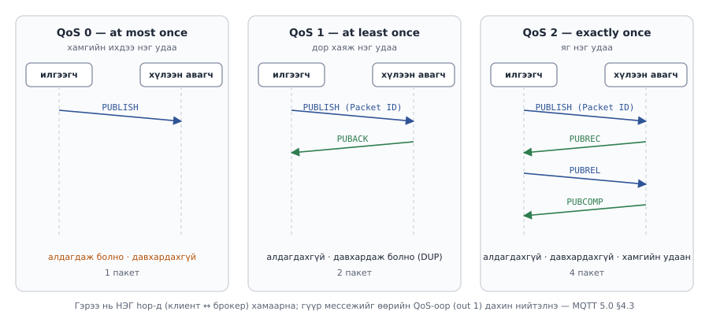
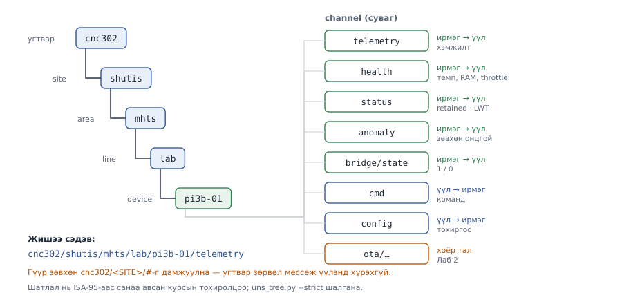

# Лаб 3 — MQTT 5.0, Unified Namespace ба гурван зам

| | |
|---|---|
| **7 хоног** | VII |
| **Хугацаа** | 4 цаг |
| **Суралцахуйн үр дүн** | ҮД1 (архитектур шинжлэх), ҮД4 (өгөгдлийн загвар зохиох), ҮД6 |
| **Үнэлгээ** | Бичгийн тайлан, 10 оноо |
| **Гол хэмжилт** | QoS × зам (loopback / LAN / bridge): p50, p95, **p99** |

---

## 1. Зорилго

Лаб 1-д гурван замын саатлыг **урьдчилан** нэг удаа хэмжсэн. Өнөөдөр түүнийг бүтэн матриц болгож, дээр нь протоколын шийдвэрүүдийг нэмнэ. Дөрвөн зүйлийг **тоогоор** тогтооно:

1. MQTT 5.0-ийн зургаан боломж юуг шийддэг вэ — ямар үнэтэй вэ?
2. **QoS × зам** матриц: loopback / 100 Mb/s LAN / гүүр гурван замд QoS 0/1/2 тус бүр хэдэн мс вэ?
3. Тэсрэлт (burst) ба тогтвортой урсгалын саатал яагаад хэдэн арав дахин зөрдөг вэ?
4. Багийн төслийн **UNS схем** ямар байх вэ?

Лабын гол бүтээгдэхүүн хоёр: **багийн UNS схем** ба **тоон үндэслэлтэй QoS сонголт**. Хоёуланг нь Лаб 4-өөс эцэс хүртэл ашиглана.

> **p99 бол гол тоо, дундаж биш.** Pi 3B-гийн албан ёсны үзүүлэлт нь «100 Mb/s Ethernet, 4 × USB 2.0»; CPU нь 4 цөмт Cortex-A53. Ийм хязгаартай төхөөрөмж дээр p50 сайхан харагдаж байхад p99 хэд дахин том гарч болно. Хэрэглэгчийн мэдэрдэг, SLA-д бичигддэг тоо нь p99. Ethernet нь USB-тэй зурвас хуваадаг эсэх нь **таамаг** — үүнийг Алхам 4.4-т өөрсдөө шалгана.

---

## 2. Урьдчилсан нөхцөл ба бэлтгэл (15 мин)

- Лаб 1, 2 дууссан, `lab02-done` tag тавигдсан. **Лаб 2-ын Алхам 7.6-д EMQX-ийн authenticator-ыг унтраасан** (`authn false`) байх ёстой — эс бөгөөс энэ лабын бүх клиент `not authorised` авна.
- Бие даалт VI: MQTT 5.0 стандартын §3.3 (PUBLISH), §4.3 (QoS-ийн урсгал), §4.7 (Topic Names ба Topic Filters) уншсан.

> 💡 **Алхмуудыг дарааллаар нь хий.** Алхам бүрийн төгсгөлд ✅ **Шалгах** хэсэг бий. Үр дүн нь таарахгүй бол **цааш бүү яв** — ❌ мөр эсвэл §8-аас шалтгааныг ол.

### 2.1 Терминалууд

| Цонх | Хаана | Хэрхэн нээх |
|---|---|---|
| **[🥧 Pi-1]** | Raspberry Pi | PowerShell таб → `ssh pi` |
| **[🥧 Pi-2]** | Raspberry Pi | шинэ PowerShell таб → `ssh pi` |
| **[💻 Ubuntu-1]** | Зөөврийн компьютер (WSL) | Terminal-ын `˅` → **Ubuntu** |
| **[💻 Ubuntu-2]** | Зөөврийн компьютер (WSL) | дахин `˅` → **Ubuntu** |

`<PI_IP>` — **[🥧 Pi-1]** `hostname -I`-ийн эхний хаяг. `<LAPTOP_IP>` — **[💻 PowerShell]** `ipconfig`.

### 2.2 Орчноо бэлтгэх — **цонх нээх бүрт** ажиллуулна

**[💻 Ubuntu-1]** ба **[💻 Ubuntu-2]**
```bash
cd ~/cnc302 && source .venv/bin/activate
export EMQX_API_KEY=$(grep '^EMQX_API_KEY=' stack/.env | cut -d= -f2)
export EMQX_API_SECRET=$(grep '^EMQX_API_SECRET=' stack/.env | cut -d= -f2)
```

**[🥧 Pi-1]** ба **[🥧 Pi-2]**
```bash
cd ~/cnc302
PY=~/cnc302/edge/.venv/bin/python
set -a && source ~/cnc302/edge/.env && set +a
echo "$CLOUD_HOST / $SITE/$AREA/$LINE/$DEVICE_ID"
```

✅ Pi дээр `192.168.1.100 / shutis/mhts/lab/pi3b-team07` (өөрийн утгаар).

> ⚠️ Pi дээр Python скриптийг **`python3`-аар биш, `$PY`-аар** ажиллуулна: `paho-mqtt` зөвхөн ирмэгийн venv-д суусан. Компьютер дээр venv идэвхтэй үед `python` гэж бичнэ.

### 2.3 Багийн хамгийн сүүлийн кодыг татах

**[💻 Ubuntu-1]**
```bash
git pull && pip install -r tools/requirements.txt
mkdir -p lab03/out
```

**[🥧 Pi-1]**
```bash
git pull
mkdir -p lab03/out
```

### 2.4 Урьдчилсан шалгалт

**[💻 Ubuntu-1]**
```bash
cd ~/cnc302/stack && make up && make health
cd ~/cnc302
```

✅ Дөрвөн мөр `200`.

**[🥧 Pi-1]**
```bash
cd ~/cnc302/edge && make check && make up && make mem
cd ~/cnc302
```

✅ `make check` бүгд `OK`; `make mem`-ийн `throttle : throttled=0x0`.

**[🥧 Pi-2]**
```bash
cd ~/cnc302/edge && make link
```

✅ `…/bridge/state 1` → `Ctrl + C`.

❌ `bridge/state 0` → `docs/troubleshooting.md` §1. ❌ Throttle `0x0` биш → Pi-г хөргөж, тэжээлээ шалгаад дахин эхэл — өнөөдрийн бүх саатлын тоо тэр үед хүчингүй.

---

## 3. Онолын сануулга

### QoS бол төгсгөл-төгсгөлийн баталгаа биш, нэг үсрэлтийн (hop) гэрээ

| QoS | Стандартын нэр (§4.3) | Пакет солилцоо | Давхардал | Алдагдал |
|---|---|---|---|---|
| 0 | At most once | PUBLISH | үгүй | **байж болно** |
| 1 | At least once | PUBLISH → PUBACK | **байж болно** | үгүй* |
| 2 | Exactly once | PUBLISH → PUBREC → PUBREL → PUBCOMP | үгүй* | үгүй* |



\* Стандарт үүнийг хэд хэдэн нөхцөлтэйгээр л амлана:

- **Нэг илгээгч → нэг хүлээн авагч.** «The delivery protocol is concerned solely with the delivery of an application message from a single sender to a single receiver» (§4.3). Төхөөрөмж → брокер нэг гэрээ, брокер → захиалагч тусдаа гэрээ. Брокер захиалагч руу **захиалгын QoS**-оор дамжуулна, тэр нь нийтэлсэн QoS-оос бага байж болно.
- **Сесс амьд байх.** QoS 1/2-ын баталгаа нь сессийн төлөвт (дуусаагүй пакетын дугаар гэх мэт) тулгуурладаг (§4.1). Сесс дууссан, эсвэл брокер төлвөө санах ойд байлгаад унасан бол баталгаа алга болно. Ирмэгийн mosquitto дараалсан мессежээ RAM-д барьж, дискэнд зөвхөн `autosave_interval` тутам эсвэл зөв зогсоох үед бичдэг — `kill -9`-д автвал сүүлийн autosave-аас хойшхи мессеж алдагдана.
- **Програмын түвшин хамаарахгүй.** QoS 2 нь брокер PUBLISH-ийг хоёр удаа *хүлээж авахгүй* гэсэн үг; ирмэгийн mosquitto хүлээж авсан нь InfluxDB-д бичигдсэн гэсэн үг биш. Төгсгөл-төгсгөлийн шалгалтыг Лаб 5-д InfluxDB дотор хийнэ.

QoS 2 нь дөрвөн пакеттай тул хамгийн удаан — хэр удаан болохыг Хүснэгт 3.4 хэлнэ.

### Гурван зам

| `--path` | Юу дамжина | Юуг харуулна |
|---|---|---|
| `loopback` | Pi доторх mosquitto, сүлжээгүй | брокер өөрөө хэдэн мс иддэг |
| `lan` | Pi → 100 Mb/s Ethernet, өгсөх урсгал (uplink) → үүлний EMQX → буцаж Pi | сүлжээ + EMQX-ийн үнэ |
| `bridge` | нийтлэгч → Pi-гийн mosquitto → **гүүр** → үүлний EMQX → захиалагч (`--sub-host`) | ирмэгээс үүл хүртэлх **бодит** зам |

> `tools/qos_latency.py` нь нийтлэгч ба захиалагчийг **нэг процесс дотор** ажиллуулдаг тул хоёр машины цагийн зөрүү (clock skew) хэмжилтэд орохгүй. `bridge` замд нийтлэгч `--host localhost` (Pi-гийн mosquitto) руу, захиалагч `--sub-host $CLOUD_HOST` (EMQX) руу холбогдоно — процесс нэг, брокер хоёр. `--path` нь зөвхөн **шошго**; замыг `--host`/`--sub-host` тодорхойлно. `--sub-host`-гүйгээр `--path bridge` гэвэл loopback-ийг дахин хэмжинэ (Лаб 1, Алхам 4В-тэй ижил).

### Burst ба steady-state

500 мессежийг нэг дор шидвэл (`--interval 0`) хэмжсэн "саатал" нь үнэндээ **дараалалд хүлээсэн хугацаа**. Тогтвортой урсгалд (`--interval 0.01`) хэмжсэн нь **жинхэнэ сүлжээ + брокерын саатал**. Эхнийх нь хүчин чадлын хязгаарыг, хоёр дахь нь SLA-г тодорхойлно. Хоёрыг хольж тайлбарлах нь энэ лабораторийн хамгийн түгээмэл алдаа.

### Unified Namespace бол технологи биш, гэрээ

Unified Namespace (UNS) нь стандарт биш, **салбарт тогтсон дадал**; энэ курст бид үүнийг «аливаа өгөгдөл яг нэг л газар, урьдчилан таамаглах боломжтой нэрээр байрлана» гэсэн **курсын тохиролцоо** болгон ашиглана. Шатлалыг үйлдвэрийн ISA-95 загварын site / area / line санаанаас авсан. MQTT 5.0 өөрөө сэдвийн бүтцийг тогтоодоггүй: сэдэв том жижиг үсгийг ялгадаг, `/`-ээр түвшин хуваагдана, нийтлэх сэдэвт `+`/`#` байж болохгүй (§4.7). Схемгүй бол 2 жилийн дараа брокер дээр `temp`, `Temperature`, `temp_c`, `sensor/1/t` гэсэн дөрвөн нэр зэрэг оршино.



```
cnc302/<site>/<area>/<line>/<device>/<channel>
       shutis  mhts   lab    pi3b-01  telemetry
```

Гүүр нь `cnc302/<SITE>/#` сэдвийг **л** үүл рүү дамжуулна. Угтвар зөрвөл мессеж локал брокер дээр л үлдэнэ — энэ курсын хамгийн түгээмэл ганц алдаа.

---

## 4. Алхмууд

| Алхам | Хаана | Юу хийх | Мин | Хүснэгт |
|---|---|---|---|---|
| 1 | 🥧💻 | Суурь төлөв, хоёр брокерын баталгаа | 15 | 3.1 |
| 2 | 💻🥧 | MQTT 5.0-ийн зургаан боломж, хоёр брокер дээр | 45 | 3.2, 3.3 |
| 3 | 🥧 | QoS × зам матриц | 55 | 3.4 |
| 4 | 🥧 | Тэсрэлт ба тогтвортой урсгал | 30 | 3.5, 3.6 |
| 5 | 🥧💻 | Unified Namespace | 35 | 3.7 |
| 6 | 💻🥧 | Sparkplug B | 30 | 3.8 |
| 7 | 💻 | Багийн шийдвэр | 20 | 3.9 |
| 8 | 💻🥧 | Гаралт цуглуулж, Git | 15 | — |

---

### Алхам 1 — Суурь төлөв ба хоёр брокерын баталгаа (15 мин) 🥧💻

**1.1 Pi-гийн төлөв.**

**[🥧 Pi-1]**
```bash
pkill -f vscode-server
OUTDIR=lab03/out bash tools/measure_stack.sh --role edge | tee lab03/out/01-edge.txt
```

✅ `Throttle : 0x0`, `Санах ой : … MiB боломжтой`.

**1.2 Үүл дээр гүүрээр юу ирж байгааг сонсох** — энэ цонхыг Алхам 1-ийн турш **нээлттэй** орхи:

**[💻 Ubuntu-2]**
```bash
mosquitto_sub -h localhost -t 'cnc302/#' -v
```

**1.3 Ирмэгийн агентыг асаах.**

**[🥧 Pi-2]**
```bash
cd ~/cnc302/edge && make agent
```

✅ **[💻 Ubuntu-2]**-д `…/telemetry`, `…/health`, `…/status` урсаж эхэлнэ. Хүснэгт 3.1-ийн «Үүл дээр харагдаж буй сувгууд» мөрийг эндээс бөглө (сэдвийн **сүүлийн** хэсэг).

Хүснэгтийг бөглөсний дараа **[💻 Ubuntu-2]** ба **[🥧 Pi-2]**-д `Ctrl + C`.

#### Хүснэгт 3.1 — Эхлэлийн төлөв

| Хэмжигдэхүүн | Утга | Тэмдэглэл |
|---|---|---|
| Pi `MemAvailable` (MiB) | | Лаб 1-ийн Хүснэгт 1.1-тэй харьцуул |
| Pi температур (°C) / `get_throttled` | / | **0x0** байх ёстой |
| `bridge/state` | | 1 байх ёстой |
| Үүл дээр харагдаж буй сувгууд | | telemetry / health / status / … |
| `CLOUD_HOST` | | |
| `SITE/AREA/LINE/DEVICE_ID` | | |

---

### Алхам 2 — MQTT 5.0-ийн зургаан боломж, хоёр брокер дээр (45 мин) 💻🥧

**2.1 Үүлний EMQX дээр.** Мөр бүрийг **тус тусад нь** ажиллуулж, дуусахыг хүлээ (`expiry`, `session` тус бүр ~15–25 сек):

**[💻 Ubuntu-1]**
```bash
python lab03/mqtt5_features.py --host localhost --expiry 10 expiry         | tee lab03/out/f-expiry-emqx.txt
python lab03/mqtt5_features.py --host localhost --count 1000 alias         | tee lab03/out/f-alias-emqx.txt
python lab03/mqtt5_features.py --host localhost reqresp                    | tee lab03/out/f-reqresp-emqx.txt
python lab03/mqtt5_features.py --host localhost --subs 3 --count 300 shared | tee lab03/out/f-shared-emqx.txt
python lab03/mqtt5_features.py --host localhost --expiry 10 session        | tee lab03/out/f-session-emqx.txt
python lab03/mqtt5_features.py --host localhost reason                     | tee lab03/out/f-reason-emqx.txt
ls lab03/out/f-*-emqx.txt | wc -l
```

✅ Сүүлийн мөр `6`. Файл бүрийн агуулга хоосон биш (`cat lab03/out/f-alias-emqx.txt`).

> Албан ёсны баримт: [MQTT 5.0](https://docs.oasis-open.org/mqtt/mqtt/v5.0/mqtt-v5.0.html) — Message Expiry §3.3.2.3.3, Topic Alias §3.3.2.3.4, Response Topic / Correlation Data §3.3.2.3.5–6 ба §4.10, Shared Subscriptions §4.8.2, Session Expiry §3.1.2.11.2, Reason Code §2.4.

**2.2 Ирмэгийн mosquitto дээр — яг ижил зургаан туршилт.** `--host localhost` нь Pi дээр Pi-гийн **өөрийн** mosquitto 2.0-ийг заана:

**[🥧 Pi-1]**
```bash
$PY lab03/mqtt5_features.py --host localhost --expiry 10 expiry         | tee lab03/out/f-expiry-mosq.txt
$PY lab03/mqtt5_features.py --host localhost --count 1000 alias         | tee lab03/out/f-alias-mosq.txt
$PY lab03/mqtt5_features.py --host localhost reqresp                    | tee lab03/out/f-reqresp-mosq.txt
$PY lab03/mqtt5_features.py --host localhost --subs 3 --count 300 shared | tee lab03/out/f-shared-mosq.txt
$PY lab03/mqtt5_features.py --host localhost --expiry 10 session        | tee lab03/out/f-session-mosq.txt
$PY lab03/mqtt5_features.py --host localhost reason                     | tee lab03/out/f-reason-mosq.txt
ls lab03/out/f-*-mosq.txt | wc -l
```

✅ `6`.

**2.3 Юуг ажиглах вэ** — хоёр брокерын гаралтыг хажуу тийш нь тавьж харьцуул:

- `expiry` — хүлээн авсан мессежийн `MessageExpiryInterval` нь нийтэлсэн утгаас **бага** байх ёстой: брокер хүлээлгэсэн хугацааг хасаж дамжуулна (§3.3.2.3.3).
- `alias` — CONNACK-ийн **Topic Alias Maximum**-ыг хэвлэнэ. Энэ property байхгүй эсвэл 0 бол клиент alias илгээж болохгүй (§3.2.2.3.8). mosquitto-гийн анхдагч `max_topic_alias` нь 10; EMQX-ийнхийг гаралтаас уншиж бич.
- `session` — эхний дахин холболтод `session_present=True, 5/5`, Session Expiry дууссаны дараа `session_present=False, 0/5` гарах ёстой.
- `reason` — амжилтын кодууд (CONNACK 0, SUBACK 2 = Granted QoS 2, PUBACK 0) ба зориуд үүсгэсэн алдаа: alias-ыг хязгаараас 1-ээр хэтрүүлэхэд mosquitto `e0 01 94` буюу **DISCONNECT 0x94 Topic Alias invalid** буцаана. Хязгаар нь 65535 (дээд утга) бол хэтрүүлэх боломжгүй.

Өөр програм хангамж, өөр зан төлөв — зөрүүг Хүснэгт 3.2-т тэмдэглэ.

#### Хүснэгт 3.2 — MQTT 5.0-ийн боломжууд

| Боломж | Ямар асуудлыг шийдэв | 3.1.1-д хэрхэн шийддэг байсан | EMQX (💻) үр дүн | mosquitto (🥧) үр дүн | Бидний төсөлд |
|---|---|---|---|---|---|
| Message Expiry | | | | | |
| Topic Alias | | | | | |
| Request/Response | | | | | |
| Shared Subscription | | | | | |
| Session Expiry | | | | | |
| Reason Code | | | | | |

**2.4 Alias-ийн хэмнэлтийг mosquitto дээр бодитоор хэмжих.** Яг ижил 1000 мессежийг эхлээд alias-гүй, дараа нь alias-тай илгээж, брокерын **хүлээн авсан байтын** тоолуурын зөрүүг харьцуулна. mosquitto-гийн `$SYS` тоолуур 10 секунд тутам шинэчлэгддэг тул мөр бүрийн **хооронд 15 секунд** хүлээ (`sleep 15` бичигдсэн). Блокийг **бүтнээр нь** буулга:

**[🥧 Pi-1]**
```bash
rd() { mosquitto_sub -h localhost -t '$SYS/broker/bytes/received' -C 1; }
sleep 15; A=$(rd); echo "A=$A"
$PY lab03/mqtt5_features.py --host localhost --count 1000 alias --no-alias > /dev/null
sleep 15; B=$(rd); echo "B=$B"
$PY lab03/mqtt5_features.py --host localhost --count 1000 alias > /dev/null
sleep 15; C=$(rd); echo "C=$C"
echo "alias-гүй: $((B-A)) Б   alias-тай: $((C-B)) Б" | tee lab03/out/alias-bytes-mosq.txt
```

✅ Сүүлийн мөр хоёр эерэг тоо хэвлэнэ, alias-тай нь **бага**.

> ⚠️ Энэ хугацаанд ирмэгийн агентыг **бүү** ажиллуул — түүний мессеж тоолуурт нэмэгдэж хэмжилтийг гажуудуулна.

**2.5 EMQX-ийн тоолуур (харьцуулалт).** EMQX-ийн REST API-ийн `bytes.received`:

**[💻 Ubuntu-1]**
```bash
emqx_rx() { curl -s -u "$EMQX_API_KEY:$EMQX_API_SECRET" \
  'http://localhost:18083/api/v5/metrics?aggregate=true' \
  | jq 'if type=="array" then .[0]["bytes.received"] else .["bytes.received"] end'; }
sleep 5; A=$(emqx_rx)
python lab03/mqtt5_features.py --host localhost --count 1000 alias --no-alias > /dev/null
sleep 5; B=$(emqx_rx)
python lab03/mqtt5_features.py --host localhost --count 1000 alias > /dev/null
sleep 5; C=$(emqx_rx)
echo "alias-гүй: $((B-A)) Б   alias-тай: $((C-B)) Б" | tee lab03/out/alias-bytes-emqx.txt
```

❌ `null` → API түлхүүр хоосон (§2.2; Лаб 2-ын Алхам 0). Энэ үед гүүрээр Pi-гийн агентын мессеж ирж байвал тоолуурт нэмэгдэнэ — агентыг зогсоосон эсэхээ шалга.

> Албан ёсны баримт: [mosquitto(8) — \$SYS topics](https://mosquitto.org/man/mosquitto-8.html): `$SYS/broker/bytes/received` = брокер асснаас хойш хүлээн авсан нийт байт.

#### Хүснэгт 3.3 — Topic Alias-ийн хэмнэлт

| | Сэдвийн урт (Б) | Мессеж | Тоолуурын зөрүү (Б) | Нэг мессежид (Б) | Скриптийн онолын утга (Б) |
|---|---|---|---|---|---|
| Alias-гүй (`--no-alias`) | | 1000 | B − A = | | |
| Alias-тай | | 1000 | C − B = | | |
| **Хэмнэлт %** | | | | | |

«Сэдвийн урт» ба «онолын утга»-ыг 2.1/2.2-ын `alias` гаралтаас ав.

> Скриптийн онолын тооцоо MQTT пакетын түвшинд (fixed header, Remaining Length, сэдэв, Packet Identifier, property) хийгдсэн. Тоолуурын зөрүү түүнтэй хэр таарав? Зөрүүг CONNECT/DISCONNECT, PINGREQ зэрэг нэмэлт пакетаар тайлбарла. TCP/IP толгой аль ч тоолуурт ордоггүй — яагаад?

---

### Алхам 3 — QoS × зам матриц (55 мин) 🥧

**Энэ бол лабораторийн гол хэмжилт:** гурван зам × гурван QoS = 9 мөр, бүгд **Pi дээрээс** — бид ирмэгийн төхөөрөмжийн туршлагыг хэмжиж байна. Нэг хэмжилт = 3 QoS × 500 мессеж × 0.01 сек ≈ **20–30 сек**.


**3.1 Бэлтгэл.** Ирмэгийн агент ба бусад ачааллыг зогсоо (**[🥧 Pi-2]**-д агент ажиллаж байвал `Ctrl + C`), throttle-ийг шалга:

**[🥧 Pi-1]**
```bash
vcgencmd get_throttled
```

✅ `throttled=0x0`.

**3.2 А. loopback** — сүлжээ огт оролцохгүй:

**[🥧 Pi-1]**
```bash
$PY tools/qos_latency.py --path loopback --host localhost --port 1883 \
    --sweep --count 500 --payload 200 --interval 0.01 --csv lab03/out/qos-loopback.csv
```

**3.3 Б. lan** — Pi → 100 Mb/s өгсөх урсгал (uplink) → үүлний EMQX → буцаж Pi:

```bash
$PY tools/qos_latency.py --path lan --host "$CLOUD_HOST" --port 1883 \
    --sweep --count 500 --payload 200 --interval 0.01 --csv lab03/out/qos-lan.csv
```

**3.4 В. bridge** — нийтлэгч Pi-гийн mosquitto руу, захиалагч үүлний EMQX-ээс. Сэдэв нь гүүрийн `topic cnc302/<SITE>/# out 1` дүрэмд **заавал** багтана:

```bash
$PY tools/qos_latency.py --path bridge --host localhost --port 1883 \
    --sub-host "$CLOUD_HOST" --sub-port 1883 \
    --topic "cnc302/$SITE/$AREA/$LINE/$DEVICE_ID/bench" \
    --sweep --count 500 --payload 200 --interval 0.01 --csv lab03/out/qos-bridge.csv
```

✅ **Шалгах (3.2–3.4 бүрт):** QoS 0, 1, 2 гэсэн **гурван мөртэй** хүснэгт хэвлэгдэнэ; QoS 1, 2-ын «Илгээв» = «Ирсэн» = 500 (QoS 0-д бага зэрэг алдагдал байж болно — тэр ч **хэмжилт**).

❌ `bridge`-ийн бүх мөрөнд Ирсэн = 0 → `--topic` нь `cnc302/$SITE/`-ээр эхлээгүй, эсвэл `$SITE` хоосон (§2.2-ын блокийг энэ цонхонд буулгаагүй). ❌ QoS 2-т `АНХААР: … бүх мессеж ирсэнгүй` → `--timeout 60` нэмж дахин.

> **Юуг хэмжиж байгаагаа мэд.** В мөр нь нийтлэгчээс ирмэгийн брокер, гүүр, үүлний брокероор дамжин захиалагчид хүрэх **бүтэн замыг** хэмжинэ; «Ирсэн» багана нь EMQX-ээс уншсан тоо тул мессеж үүлэнд хүрсний нотолгоо. Анхаар: гүүр нь **өөрийн** QoS-оор (`out 1` → QoS 1) дамжуулдаг тул В мөрийн «QoS 2» нь зөвхөн нийтлэгч → mosquitto үсрэлтэд хамаарна — тайландаа тайлбарла. Сэдэв гүүрийн дүрэмд багтахгүй бол (жишээ нь `--topic cnc302/bench/latency`) алдалт 100% гарна — туршаад үз. Мессеж InfluxDB-д бичигдсэн эсэхийг Лаб 5-д шалгана.

#### Хүснэгт 3.4 — QoS × зам (500 мессеж, 200 Б, `--interval 0.01`) ⭐

| Зам | QoS | p50 (мс) | p95 (мс) | **p99 (мс)** | max (мс) | Алдалт % | Давхардал | Хүлээн авалт (мсж/с) |
|---|---|---|---|---|---|---|---|---|
| loopback | 0 | | | | | | | |
| loopback | 1 | | | | | | | |
| loopback | 2 | | | | | | | |
| lan | 0 | | | | | | | |
| lan | 1 | | | | | | | |
| lan | 2 | | | | | | | |
| bridge | 0 | | | | | | | |
| bridge | 1 | | | | | | | |
| bridge | 2 | | | | | | | |

**3.5 Харьцаа тооцох.** Матрицаас гурван харьцааг тооцож бич:

```
p99(lan, QoS1) / p99(loopback, QoS1)   = ______   ← сүлжээний үнэ
p99(bridge, QoS1) / p99(lan, QoS1)     = ______   ← гүүрний (нэмэлт брокер) үнэ
p99(QoS2) / p99(QoS1)  (нэг зам дээр)  = ______   ← гар барилтын үнэ
p99 / p50              (lan, QoS1)     = ______   ← СҮҮЛИЙН ӨРГӨН
```

> **Сүүлийн өргөн (p99/p50).** p50 нь «бүх зүйл тайван байсан» агшныг, p99 нь CPU завгүй, сүлжээний дараалал дүүрсэн, эсвэл Python-ы хог цуглуулагч ажилласан агшнуудыг харуулна. Үйлдвэрийн хариу үйлдлийн баталгааг **сүүл** тодорхойлно. Pi 3B-д Ethernet ба USB нэг зурвасыг хуваадаг гэдэг нь албан ёсны үзүүлэлтэд бичигдээгүй **таамаг** — Алхам 4.4-т шалгана.

---

### Алхам 4 — Тэсрэлт ба тогтвортой урсгал (30 мин) 🥧

Ижил зам (`lan`), зөвхөн илгээх хэмнэл ба ачаалал өөрчлөгдөнө. `--shared 3` нь MQTT 5.0-ийн Shared Subscription (`$share/<group>/<filter>`, §4.8.2): мессеж бүр бүлгийн **нэг л** захиалагчид очно.

**4.1 Тэсрэлт** — 500 мессежийг завсаргүй шиднэ:

**[🥧 Pi-1]**
```bash
$PY tools/qos_latency.py --path lan --host "$CLOUD_HOST" \
    --sweep --count 500 --payload 200 --interval 0 --csv lab03/out/qos-burst.csv
```

**4.2 Том ачаалал** — 2000 байт, тогтвортой:

```bash
$PY tools/qos_latency.py --path lan --host "$CLOUD_HOST" \
    --qos 1 --count 500 --payload 2000 --interval 0.01 --csv lab03/out/qos-2000b.csv
```

**4.3 Хуваалцсан захиалга** — 3 хэрэглэгч:

```bash
$PY tools/qos_latency.py --path lan --host "$CLOUD_HOST" \
    --qos 1 --count 500 --interval 0.01 --shared 3 --csv lab03/out/qos-shared3.csv
```

✅ Гурвуулаа хүснэгт хэвлэнэ; 4.3-ын `Sub` багана `3`.

#### Хүснэгт 3.5 — Тэсрэлт ба тогтвортой урсгал (зам = lan)

«steady» мөрүүдийг Хүснэгт 3.4-ийн `lan` мөрүүдээс ав.

| Горим | QoS | p50 (мс) | p99 (мс) | Илгээх хурд (мсж/с) | Хүлээн авалт (мсж/с) |
|---|---|---|---|---|---|
| burst (`--interval 0`) | 0 | | | | |
| burst | 1 | | | | |
| burst | 2 | | | | |
| steady (`--interval 0.01`) | 0 | | | | |
| steady | 1 | | | | |
| steady | 2 | | | | |

burst / steady p50-ийн харьцаа (QoS 1): ______ дахин. Шалтгаан: ________________

#### Хүснэгт 3.6 — Ачаалал ба хуваалцсан захиалгын нөлөө (QoS 1, steady)

| Тохиргоо | p50 (мс) | p99 (мс) | Хүлээн авалт (мсж/с) | Тэмдэглэл |
|---|---|---|---|---|
| 200 Б, энгийн захиалга | | | | Хүснэгт 3.4-ээс |
| 2000 Б, энгийн захиалга | | | | |
| 200 Б, shared × 3 | | | | дараалал хадгалагдав уу? |

> 2000 байт нь 200 байтаас 10 дахин том. p99 нь 10 дахин өссөн үү? Үгүй бол хязгаарлагч нь зурвас биш, **нэг мессеж бүрийн тогтмол зардал** (round-trip, брокерын боловсруулалт) байна гэсэн үг. 100 Mb/s дээр 2000 байтын мессеж утсан дээр ~0.18 мс л эзэлнэ (Лаб 4, §3-ын арифметик). Энэ тоо Лаб 4-ийн өгсөх урсгалын (uplink) тооцоонд шууд хэрэглэгдэнэ.

**4.4 (сонголттой, 10 мин) Таамаг шалгах: Ethernet ба USB зурвас хуваадаг уу?** USB флаш диск хэрэгтэй. Raspberry Pi OS **Lite** USB дискийг автоматаар холбодоггүй (mount) тул гараар холбоно.

> ⚠️ Флаш диск дээрх өгөгдөл **устахгүй** (зөвхөн `big.bin` файл нэмэгдэнэ), гэхдээ хоосон диск ашиглахыг зөвлөж байна.

**[🥧 Pi-1]** — дискийг олж, холбох:
```bash
lsblk -o NAME,SIZE,TYPE,MOUNTPOINT
```

USB диск нь ихэвчлэн `sda`, хуваалт нь `sda1`. **Хэмжээгээр нь шалга** (`mmcblk0` бол microSD — түүнийг БҮҮ сонго).

```bash
sudo mkdir -p /mnt/usb
sudo mount /dev/sda1 /mnt/usb
df -h /mnt/usb
```

**[🥧 Pi-2]** — USB руу ~500 MB бичнэ:
```bash
sudo dd if=/dev/zero of=/mnt/usb/big.bin bs=1M count=500 oflag=direct status=progress
```

**[🥧 Pi-1]** — `dd` ажиллаж байх **зуур**:
```bash
$PY tools/qos_latency.py --path lan --host "$CLOUD_HOST" \
    --qos 1 --count 500 --interval 0.01 --csv lab03/out/qos-lan-usbload.csv
```

Дууссаны дараа цэвэрлэ:
```bash
sudo rm /mnt/usb/big.bin && sudo umount /mnt/usb
```

| Нөхцөл | p50 (мс) | p99 (мс) | Дүгнэлт |
|---|---|---|---|
| USB сул (Хүснэгт 3.4) | | | |
| USB руу бичиж байхад | | | таамаг дэмжигдэв / няцаагдав |

p99 мэдэгдэхүйц өсвөл таамаг дэмжигдэнэ; өсөөгүй бол няцаагдана — аль ч үр дүн тайланд хүчинтэй.

---

### Алхам 5 — Unified Namespace: мод, зөрчил, схем (35 мин) 🥧💻

**5.1 Одоогийн модыг харах.** Компьютерээс виртуал флотыг **Pi-гийн брокер** руу чиглүүлнэ:

**[💻 Ubuntu-1]**
```bash
python tools/sim_device.py --target edge --host <PI_IP> --devices 8 --interval 1 --lines 3
```

Флот ажиллаж байх **зуур** Pi дээр модыг 30 сек барьж авна:

**[🥧 Pi-1]**
```bash
$PY lab03/uns_tree.py --host localhost --seconds 30 \
    --filter 'cnc302/#' --json lab03/out/uns-before.json | tee lab03/out/uns-before.txt
```

✅ `cnc302 → shutis → mhts → line…` хэлбэрийн мод хэвлэгдэж, `lab03/out/uns-before.json` үүснэ.

**5.2 Зөрчил үүсгэж, шалгагч барьж авахыг харах.** **[🥧 Pi-1]**-д шалгагчийг дахин 60 сек ажиллуул:

**[🥧 Pi-1]**
```bash
$PY lab03/uns_tree.py --host localhost --seconds 60 --filter '#' | tee lab03/out/uns-violations.txt
```

Ажиллаж байх **зуур** компьютерээс гурван «буруу» сэдэв илгээ:

**[💻 Ubuntu-2]**
```bash
mosquitto_pub -h <PI_IP> -t 'cnc302/UB/Campus/Line 1/DEV-1/temp' -m '{"t":24}'
mosquitto_pub -h <PI_IP> -t 'sensors/room12/temperature' -m '24'
mosquitto_pub -h <PI_IP> -t 'cnc302/ub/campus/line01/dev1/telemetry/raw' -m '{}'
```

✅ 60 секундын дараа **[🥧 Pi-1]**-ийн тайланд гурван сэдэв бүгд **зөрчил** гэж гарна. Тайланг хуулж тайландаа оруул.

Одоо флотыг зогсоо: **[💻 Ubuntu-1]** `Ctrl + C`.

**5.3 Хатуу горим ба гарах код.** `--strict` нь CI-д ашиглагдана. Ирмэгийн агентыг асаа:

**[🥧 Pi-2]**
```bash
cd ~/cnc302/edge && make agent
```

**[🥧 Pi-1]**
```bash
$PY lab03/uns_tree.py --host localhost --seconds 20 --strict --prefix cnc302
echo "гарах код: $?"
```

✅ `гарах код: 0` = цэвэр, `1` = зөрчилтэй. Агентын ердийн урсгал цэвэр гарах ёстой.

> **Хүлээгдэх үр дүн:** `uns_tree.py`-ийн зөвшөөрөгдсөн суваг нь `telemetry`, `status`, `health`, `anomaly`, `cmd`, `config`, `event`, `attributes`, мөн нийлмэл `bridge/…` ба `ota/…` (7–8 хэсэгтэй). Тиймээс агентын ердийн урсгал цэвэр гарах ёстой, харин Алхам 5.2-ын гурван сэдэв, Алхам 3.4-ийн `…/bench` суваг **зөрчил** болно. Энэ бол **шийдвэр гаргах цэг**: `bench`-ийг жагсаалтад нэмэх үү, эсвэл хэмжилтийн урсгалыг UNS-ээс гадуур тусад нь байлгах уу? Тайландаа сонголтоо үндэслэлтэй бич. Жагсаалт нь стандарт биш, **курсын тохиролцоо** гэдгийг санаарай.

Агентыг зогсоо: **[🥧 Pi-2]** `Ctrl + C`.

**5.4 Багийн UNS схем.** Компьютер дээр файл үүсгэ:

**[💻 Ubuntu-1]**
```bash
code lab03/uns-schema.md
```

Дор хаяж **10 бодит сэдвийн жишээ** оруулж, дараах асуултад хариул:

- Таны төслийн шатлал (site / area / line / device) юу гэсэн үг вэ?
- Ямар суваг хэрэгтэй вэ, тус бүр ямар чиглэлд урсах вэ?
- Аль сэдэв **retained** байх вэ, яагаад? (Санамж: `status` бол LWT-тэй retained.)
- Тушаал хаашаа очиж, хариу хаанаас ирэх вэ? Гүүрний `in` дүрэмтэй нийцэж байна уу? (`cat ~/cnc302/edge/mosquitto/conf.d/bridge.conf.template`)
- 10 жилийн дараа шинэ талбай нэмэхэд схем эвдрэх үү?

#### Хүснэгт 3.7 — Багийн UNS схем

| Суваг | Чиглэл | QoS | Retained | Гүүрээр дамжих уу (`out`/`in`/үгүй) | Жишээ сэдэв |
|---|---|---|---|---|---|
| telemetry | ирмэг → үүл | | | | |
| health | ирмэг → үүл | | | | |
| status | ирмэг → үүл | | | | |
| anomaly | ирмэг → үүл | | | | |
| bridge/state | ирмэг → үүл | | | | |
| cmd | үүл → ирмэг | | | | |
| config | үүл → ирмэг | | | | |
| ota/* | хоёр тал | | | | |

---

### Алхам 6 — Sparkplug B (30 мин) 💻🥧

⚠ **`sparkplug_lite.py` нь жинхэнэ Sparkplug B БИШ — сургалтын хялбаршуулалт.** [Sparkplug 3.0.0](https://sparkplug.eclipse.org/specification/version/3.0/documents/sparkplug-specification-3.0.0.pdf)-ийн дагуу хийсэн нь: сэдвийн бүтэц `spBv1.0/<group_id>/<message_type>/<edge_node_id>[/<device_id>]`; NBIRTH-ийн `seq` = 0, мессеж бүрт +1, 255-ын дараа 0; NDEATH нь MQTT Will (QoS 1, retain=false), `seq`-гүй, `bdSeq` нь NBIRTH-ийнхтэй ижил; BIRTH-д нэр + alias, DATA-д **зөвхөн** alias.

Стандартыг **зөрчиж** буй зүйлс (жинхэнэ системд байж болохгүй):

1. Ачаалал **JSON** — стандарт нь Google Protocol Buffers (`sparkplug_b.proto`) шаарддаг. Тиймээс жинхэнэ Sparkplug Host Application эдгээр мессежийг уншиж чадахгүй.
2. `dataType` нь текст — стандартад protobuf-ийн тоон утга.
3. `bdSeq` үргэлж 0 — стандартаар CONNECT бүрт нэмэгдэж, дахин асахад хадгалагдах ёстой.
4. Зангилаа NCMD/DCMD-д захиалдаггүй, `Node Control/Rebirth`-д хариулдаггүй.
5. Primary Host-ийн `spBv1.0/STATE/<host_id>`-ийг хүлээдэггүй.

**6.1 Ажиглагч ба зангилаа (үүлний EMQX дээр).** Эхлээд ажиглагчийг асаа — 90 сек сонсоно:

**[💻 Ubuntu-2]**
```bash
python lab03/sparkplug_lite.py monitor --host localhost --seconds 90 | tee lab03/out/sp-monitor-1.txt
```

5 секундын дараа зангилааг асаа:

**[💻 Ubuntu-1]**
```bash
python lab03/sparkplug_lite.py node --host localhost --devices 3 --seconds 60 --interval 1
```

✅ Ажиглагч дээр `NBIRTH → DBIRTH ×3 → DDATA … → NDEATH` дараалал. DDATA дотор метрикийн **нэр байхгүй, зөвхөн alias** байна — ажиглагч нь BIRTH-ээс сурсан хүснэгтээрээ нэрийг сэргээнэ.

**6.2 Дарааллын тасалдал ба report-by-exception.** **[💻 Ubuntu-2]**-д ажиглагчийг дахин асаа (`--seconds 150`, `tee lab03/out/sp-monitor-2.txt`), дараа нь **[💻 Ubuntu-1]**-д нэг нэгээр нь (өмнөх нь дуусахыг хүлээ):

```bash
python lab03/sparkplug_lite.py node --host localhost --devices 2 --seconds 30 --drop-seq 5
python lab03/sparkplug_lite.py node --host localhost --devices 3 --seconds 30 --deadband 0
python lab03/sparkplug_lite.py node --host localhost --devices 3 --seconds 30 --deadband 0.5
```

✅ `--drop-seq 5`-ийн үед ажиглагч **дарааллын тасалдал** илрүүлнэ. Deadband 0 ба 0.5-ын DDATA-гийн тоог ажиглагчийн гаралтаас тоол (`grep -c DDATA` — хоёр ажиллуулалтыг тусад нь хадгалахыг хүсвэл ажиглагчийг тус бүрт дахин асаа).

**6.3 Гэнэтийн салалт (Last Will) — хоёр өөр тохиолдол.** **[💻 Ubuntu-2]**-д ажиглагчийг `--seconds 300`-аар асаа. Дараа нь **[💻 Ubuntu-1]**-д:

**(а) Процесс үхэв:** үйлдлийн систем TCP холболтыг ХААНА → брокер шууд мэднэ.
```bash
python lab03/sparkplug_lite.py node --host localhost --devices 2 --seconds 300 &
sleep 15; date +%T; kill -9 %1
```

✅ NDEATH **бараг тэр даруй** гарна. Хэвлэгдсэн цаг ба ажиглагчийн NDEATH-ийн цагийг харьцуул.

**(б) Процесс «хөлдөв»:** холболт нээлттэй, гэхдээ пакет илгээхгүй (кабель тасрахтай адил).
```bash
python lab03/sparkplug_lite.py node --host localhost --devices 2 --seconds 300 &
sleep 15; date +%T; kill -STOP %1
```

✅ NDEATH **~45 секундын** дараа гарна. Харсны дараа процессыг устга: `kill -9 %1`.

> **Яагаад ялгаатай вэ?** MQTT 5.0 §3.1.2.5-ын дагуу Will нь «клиент DISCONNECT илгээлгүй сүлжээний холболтыг хаасан» үед ч, «keepalive хугацаанд харилцаагүй» үед ч нийтлэгдэнэ. `kill -9` үед цөм сокетыг хааж брокер тэр дороо мэднэ (локал туршилтад ~2 мс). `kill -STOP` эсвэл кабель тасрахад брокер юу ч хүлээж авахгүй тул keepalive-ын **1.5 дахин** хугацааг хүлээнэ (§3.1.2.10): keepalive 30 с → ~45 с. Энэ нь «төхөөрөмж унасныг хэдэн секундын дараа мэдэх вэ» гэсэн бодит асуултын хариу. Ctrl+C-ээр зогсоовол зангилаа DISCONNECT-ийг reason code **0x04 (Disconnect with Will Message)**-тэй илгээж, брокер NDEATH-ийг шууд нийтэлнэ — Sparkplug 3.0 MQTT 5.0 клиентэд үүнийг шаарддаг.

**6.4 Угтварын сургамж.** Sparkplug сэдэв нь `spBv1.0/…` угтвартай — `cnc302/<SITE>/#` **биш**. Тиймээс Pi дээр ажиллуулсан зангилааны мессежийг гүүр үүл рүү дамжуулахгүй (гүүрийн `topic cnc302/<SITE>/# out 1` дүрэм). Батал — эхлээд үүл дээр сонс:

**[💻 Ubuntu-2]**
```bash
mosquitto_sub -h localhost -t 'spBv1.0/#' -v -W 20
```

Тэр **20 секундын дотор** Pi дээр зангилаа ажиллуул:

**[🥧 Pi-1]**
```bash
$PY lab03/sparkplug_lite.py node --host localhost --devices 2 --seconds 15
```

✅ **[💻 Ubuntu-2]** юу ч хэвлэхгүй, 20 сек дараа `Timed out` гэж гарна — гүүр `spBv1.0/#`-ийг дамжуулаагүй.

#### Хүснэгт 3.8 — Sparkplug B-гийн ажиглалт

| Асуулт | Хариулт |
|---|---|
| NBIRTH-д хэдэн метрик зарлагдав | |
| DDATA-д метрикийн нэр дамжсан уу | |
| Дарааллын тасалдал илэрсэн үү (`--drop-seq 5`) | |
| `kill -9`-ийн дараа NDEATH хэдэн секундын дараа гарав | |
| `kill -STOP`-ийн дараа NDEATH хэдэн секундын дараа гарав | |
| DDATA-гийн тоо: deadband 0 vs 0.5 | / |
| Deadband-ийн хэмнэлт % | |
| Гүүр `spBv1.0/#`-ийг дамжуулав уу | |

---

### Алхам 7 — Багийн шийдвэр (20 мин) 💻

Энэ бол лабораторийн гол үр дүн: цаашид ямар тохиргоо хэрэглэхээ **тоон үндэслэлтэйгээр** шийднэ. Багана бүрд Хүснэгт 3.4–3.6-гийн **тодорхой тоо** иш татна («хурдан учраас» гэсэн хариулт оноо авахгүй).

#### Хүснэгт 3.9 — Багийн протоколын шийдвэр

| Шийдвэр | Сонголт | Тоон үндэслэл (аль хүснэгт, ямар тоо) |
|---|---|---|
| Телеметрийн QoS | | |
| Тушаалын (cmd) QoS | | |
| Дохиоллын (anomaly) QoS | | |
| Session Expiry Interval | | |
| Message Expiry (телеметр) | | |
| Topic Alias хэрэглэх үү | | |
| Ачааллын дээд хэмжээ (Б) | | |
| Sparkplug B хэрэглэх үү | | |

---

### Алхам 8 — Гаралт цуглуулж, Git commit (15 мин) 💻🥧

**8.1 Pi дээрх гаралтыг компьютер руу хуулах.** (Лаб 1 Алхам 8.1-д SSH түлхүүрээ `~/.ssh/cnc302`-д хуулсан.)

**[💻 Ubuntu-1]**
```bash
cd ~/cnc302
scp -i ~/.ssh/cnc302 'cnc302@<PI_IP>:cnc302/lab03/out/*' lab03/out/
ls lab03/out/
```

✅ `qos-*.csv` (Pi), `f-*-emqx.txt` ба `f-*-mosq.txt`, `uns-before.json`, `alias-bytes-*.txt` нэг хавтаст.

**8.2 Тайлан.**
```bash
cp docs/report-template.md lab03/report.md
code lab03/report.md
```

**8.3 Нэмэх ба шалгах.** `lab03/out/` нь `.gitignore`-д тул хэмжилтийн нотолгоог **зориуд** `-f`-ээр нэмнэ:

```bash
git add lab03/report.md lab03/uns-schema.md
git add -f lab03/out/qos-*.csv lab03/out/f-*.txt lab03/out/uns-*.json lab03/out/uns-*.txt \
           lab03/out/alias-bytes-*.txt lab03/out/sp-*.txt
git status --short
git ls-files | grep -E '\.env$|bridge\.conf$|\.key$|\.crt$|devices\.csv'
```

✅ Сүүлийн команд **юу ч хэвлэхгүй**.

**8.4 Commit ба push.**
```bash
git commit -m "Лаб 3: QoS × зам матриц, UNS схем, Sparkplug"
git tag lab03-done
git push && git push --tags
```

---

## 5. Хяналтын асуултууд

Хариулт бүр **хүснэгтээс авсан тоо** агуулсан байх ёстой.

1. Хүснэгт 3.4-т `p99(lan) / p99(loopback)` харьцаа QoS 1 дээр хэд гарав? Тэр зөрүүний хэдэн хувь нь 100 Mb/s сүлжээ, хэдэн хувь нь EMQX-ийн боловсруулалт вэ? Хэрхэн ялгаж тогтоох вэ?

2. Хүснэгт 3.4-т `p99/p50` харьцаа аль зам дээр хамгийн том байв? Хэрэв та SLA-д "95% хүсэлт X мс дотор" гэж бичих бол X-ийг ямар тоогоор сонгох вэ, яагаад p50-ийг ашиглаж болохгүй вэ?

3. Хүснэгт 3.4-т QoS 2 нь QoS 1-ээс хэдэн дахин удаан байв? Тэр зөрүү нь зөвхөн нэмэлт PUBREC/PUBREL/PUBCOMP пакетаас үүдэлтэй юу — тоогоор шалга (нэг round-trip хэдэн мс байв?). QoS 2-ын «exactly once» нь `bridge` замд төгсгөл-төгсгөл хүртэл хадгалагдах уу (§4.3, гүүрийн QoS)?

4. Хүснэгт 3.5-д burst ба steady горимын p50 хэдэн дахин зөрөв? Аль тоог нь брокерын гүйцэтгэл гэж нэрлэж **болохгүй** вэ, яагаад?

5. Хүснэгт 3.6-д ачааллыг 200 → 2000 байт болгоход p99 хэдэн хувиар өсөв? Хэрэв 10 дахин бага өссөн бол хязгаарлагч нь юу вэ? Энэ дүгнэлт Лаб 4-ийн өгсөх урсгалын (uplink) тооцоонд хэрхэн нөлөөлөх вэ?

6. Хүснэгт 3.8-д `kill -9` ба `kill -STOP`-оос NDEATH хүртэл хэдэн секунд өнгөрөв, яагаад ялгаатай вэ? Хэрэв таны төсөлд төхөөрөмж "хөлдсөн" эсвэл кабель тасарсныг 5 секунд дотор мэдэх шаардлагатай бол ямар тохиргоог өөрчлөх вэ, тэр нь ямар үнэтэй вэ (PINGREQ/PINGRESP тус бүр 2 байт MQTT пакет; Pi 3B-гийн 100 Mb/s өгсөх урсгал дээр 1000 төхөөрөмжөөр тооцоол)?

7. Хүснэгт 3.7-д `uns_tree.py --strict` таны сувгуудын хэдийг нь зөрчил гэж тэмдэглэв? Та схемээ өөрчлөх үү, шалгагчийг өөрчлөх үү? Багийн CI-д энэ шалгалтыг оруулбал ямар ашиг, ямар эрсдэл гарах вэ?

---

## 6. Хүлээлгэн өгөх зүйл

| # | Зүйл | Байрлал |
|---|---|---|
| 1 | Тайлан (Хүснэгт 3.1–3.9 бөглөсөн) | `lab03/report.md` → PDF |
| 2 | Багийн UNS схем, 10 жишээ сэдэвтэй | `lab03/uns-schema.md` |
| 3 | QoS хэмжилтийн CSV (5–6 файл) ба MQTT 5.0 туршилтын гаралт | `lab03/out/qos-*.csv`, `lab03/out/f-*.txt` |
| 4 | UNS модны JSON ба зөрчлийн гаралт | `lab03/out/uns-before.json` |
| 5 | Sparkplug-ийн NBIRTH/DDATA/NDEATH гаралт | тайлангийн хавсралт |
| 6 | Git tag | `lab03-done` |

---

## 7. Үнэлгээний шалгуур (10 оноо)

| Шалгуур | Оноо |
|---|---|
| Хүснэгт 3.4 (QoS × зам, 9 мөр) бүрэн, throttle 0x0 үед хэмжигдсэн | 3 |
| Хүснэгт 3.5–3.6: burst/steady ялгааг **зөв тайлбарласан** | 2 |
| UNS схем зохиогдож, `--strict` шалгагчаар туршигдсан | 2 |
| Sparkplug-ийн ажиглалт (alias, seq gap, `kill -9` ба `kill -STOP`-ийн NDEATH хугацаа) | 1 |
| Хүснэгт 3.9 — шийдвэр бүр тодорхой тоонд тулгуурласан | 1 |
| Git цэвэр, нууц файл ороогүй | 1 |

> **Оноо хасагдах гол шалтгаан:** burst горимын саатлыг "брокерын саатал" гэж тайлбарлах, эсвэл p50-ийг гол тоо болгож бичих.

---

## 8. Түгээмэл алдаа

| Шинж | Шалтгаан | Шийдэл |
|---|---|---|
| `bridge` мөрөнд алдалт 100% | сэдвийн угтвар `cnc302/$SITE/` биш, эсвэл `--sub-host` буруу | `--topic`, `--sub-host`-оо шалга; troubleshooting §2 |
| `bridge` мөр loopback-тэй бараг ижил | `--sub-host` өгөөгүй — хоёр тал Pi-гийн брокерт | `--sub-host "$CLOUD_HOST"` нэм |
| Бүх QoS дээр p50 ижил | `--interval 0` — бүгд дараалалд хүлээж байна | `--interval 0.01` ашигла |
| QoS 2 дээр `АНХААР: … бүх мессеж ирсэнгүй` | `--timeout` бага | `--timeout 60` нэмнэ |
| Саатал 10 дахин хэлбэлзэнэ | throttling эсвэл Wi-Fi | `make mem` → 0x0 эсэх; кабельд шилж |
| `shared` туршилтад нэг захиалагч бүгдийг авна | `$share` дэмжигдэхгүй | брокерын хувилбарыг шалга, хоёр брокер дээр давт |
| `expiry` "дараа нь ч ирлээ" гэнэ | брокер Message Expiry-г дэмжихгүй | Хүснэгт 3.2-т **ажиглалт болгон** бич |
| `alias` "Брокер topic alias хүлээж авахгүй" | CONNACK-д Topic Alias Maximum 0 эсвэл байхгүй | брокерын тохиргоо (`max_topic_alias`) — Хүснэгт 3.2-т бич |
| `uns_tree.py` мессеж олохгүй | флот ажиллахгүй эсвэл `--filter` буруу | `mosquitto_sub -t '#' -v` |
| `health`/`anomaly` зөрчил гэж гарна | шалгагчийн сувгийн жагсаалт хязгаартай | Алхам 5.3 — шийдвэрээ тайланд бич |
| Sparkplug NDEATH `kill -STOP`-ийн дараа гарахгүй | keepalive × 1.5 = 45 с болоогүй | 45 секунд хүлээ |
| Sparkplug NDEATH `kill -9`-ийн дараа ч гарахгүй | ажиглагч өөр брокерт/группт холбогдсон | `--host`, `--group` ижил эсэхийг шалга |
| `ModuleNotFoundError: No module named 'paho'` (Pi) | `python3` гэж бичсэн | `$PY` (§2.2) |
| `$SITE`, `$CLOUD_HOST` хоосон | энэ Pi цонхонд `.env` ачаалаагүй | §2.2-ын блок |
| Бүх клиент `not authorised` | Лаб 2-ын authenticator идэвхтэй хэвээр | Лаб 2 Алхам 7.6 — `authn false` |
| `alias-bytes` зөрүү сөрөг / хэт их | тоолуур шинэчлэгдээгүй, эсвэл агент зэрэг ажилласан | `sleep 15`-ийг бүү алгас; агентыг зогсоо |
| `mount: /dev/sda1 … does not exist` | USB диск өөр нэртэй | `lsblk`-ээр шалга (`sdb1` г.м.) |
| `scp`: `UNPROTECTED PRIVATE KEY FILE` | түлхүүрийг `/mnt/c/...`-ээс шууд ашигласан | Лаб 1 Алхам 8.1 |

---

## 9. Эх сурвалж

| # | Эх сурвалж | Юуг баталгаажуулсан | Хандсан |
|---|---|---|---|
| 1 | [MQTT Version 5.0, OASIS Standard](https://docs.oasis-open.org/mqtt/mqtt/v5.0/mqtt-v5.0.html) | §4.3 QoS 0/1/2-ын урсгал ба «нэг илгээгч → нэг хүлээн авагч»; §4.1 Session State; §3.3.2.3.3 Message Expiry (үлдсэн хугацааг хасаж дамжуулна); §3.3.2.3.4 Topic Alias; §3.2.2.3.8 Topic Alias Maximum (байхгүй = 0); §3.3.2.3.5–6 ба §4.10 Response Topic, Correlation Data; §4.8.2 `$share/{ShareName}/{filter}`; §3.1.2.11.2 Session Expiry; §3.1.2.5 Will нийтлэгдэх нөхцөл; §3.1.2.10 keepalive × 1.5; §2.4 Хүснэгт 2-6 Reason Code (0x00, 0x02, 0x04, 0x87, 0x90, 0x94, 0x97); §4.7 сэдвийн дүрэм; §1.5.5 Variable Byte Integer | 2026-09 |
| 2 | [mosquitto(8)](https://mosquitto.org/man/mosquitto-8.html) | MQTT 5.0 боломжийн дэмжлэг (Shared subscriptions, Request/response, properties); `$SYS/broker/bytes/received`, `…/clients/connected`, `…/publish/messages/received`, `…/store/messages/count` (`messages/stored` хуучирсан) | 2026-09 |
| 3 | [mosquitto.conf(5)](https://mosquitto.org/man/mosquitto-conf-5.html) | `max_topic_alias` анхдагч 10; `sys_interval` анхдагч 10 с; bridge `topic … out <qos>` — QoS нь гүүрийн өөрийн publish QoS | 2026-09 |
| 4 | [Eclipse Sparkplug Specification 3.0.0 (PDF)](https://sparkplug.eclipse.org/specification/version/3.0/documents/sparkplug-specification-3.0.0.pdf) | `spBv1.0` namespace; NBIRTH seq = 0, 0–255 эргэлт; NDEATH = Will, QoS 1, retain=false, seq-гүй, bdSeq тохирох; DATA-д зөвхөн alias; MQTT 5.0-д DISCONNECT 0x04; Clean Start = true, Session Expiry = 0; protobuf ачаалал (§6.2) | 2026-09 |
| 5 | [Eclipse Paho Python — Client](https://eclipse.dev/paho/files/paho.mqtt.python/html/client.html) | `CallbackAPIVersion.VERSION2` callback-ын гарын үсэг (on_connect, on_subscribe, on_publish, on_disconnect); v5.0-д alias тохируулсан үед хоосон сэдэвтэй publish | 2026-09 |
| 6 | [paho-mqtt (PyPI)](https://pypi.org/project/paho-mqtt/) | одоогийн хувилбар 2.1.0 | 2026-09 |
| 7 | [Raspberry Pi documentation (эх репо: github.com/raspberrypi/documentation)](https://github.com/raspberrypi/documentation) — [raspberrypi.com/documentation/computers/raspberry-pi.html](https://www.raspberrypi.com/documentation/computers/raspberry-pi.html) | Pi 3B: 1 GB, 4 × USB 2.0, 100 Mb/s Ethernet; BCM2837 — 4 цөмт Cortex-A53, 1.2 GHz. raspberrypi.com автомат татахыг хаадаг тул ижил агуулгыг албан ёсны эх репогоос уншив | 2026-09 |
| 8 | Шууд туршилт: mosquitto 2.0.18, EMQX 5.8.6, paho-mqtt 2.1.0 | `mqtt5_features.py`-ийн 6 дэд команд хоёр брокер дээр; mosquitto Topic Alias Maximum = 10, EMQX = 65535; хэтрүүлсэн alias → mosquitto `e0 01 94`; `kill -9` → NDEATH ~2 мс, `kill -STOP` → ~45 с; `qos_latency.py --sub-host` гүүрээр холбосон хоёр брокер дээр | 2026-09 |

