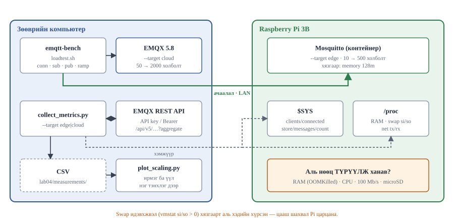

# Лаб 4 — Багтаамжийн хязгаар: ирмэг ба үүл

| | |
|---|---|
| **7 хоног** | IX |
| **Хугацаа** | 4 цаг |
| **Суралцахуйн үр дүн** | ҮД2 (өргөтгөх боломжтой backend), ҮД4, ҮД6, ҮД8 |
| **Үнэлгээ** | **10 минутын багийн ҮЗҮҮЛЭН** (бичгийн тайлан биш), 10 оноо |
| **Гол хэмжилт** | Аль нөөц ХАМГИЙН ТҮРҮҮНД ханав — RAM, CPU, 100 Mb/s өгсөх урсгал (uplink) эсвэл microSD |

---

## 1. Зорилго

Энэ бол хичээлийн **гол лаборатори**. Та нэг брокер биш, **хоёр брокерыг** ачаалж, тэдгээрийн хязгаарыг харьцуулна:

- 🥧 Raspberry Pi 3B дээрх **mosquitto** — 1 GB RAM, 4 × Cortex-A53 (1.2 GHz), 100 Mb/s Ethernet, 4 × USB 2.0, microSD. Контейнер нь **128 MiB** санах ойн хязгаартай (`edge/docker-compose.yml`)
- 💻 Зөөврийн компьютер дээрх **EMQX** — олон GB RAM, олон цөм, SSD

Гурван асуултад тоон хариулт өгнө:

1. Хоёр брокер тус бүр хэдэн холболт, хэдэн мессеж/сек даах вэ?
2. **Аль нөөц түрүүлж ханав?** — RAM (хост эсвэл контейнерийн хязгаар), CPU, өгсөх урсгал (uplink), эсвэл microSD. Хариултаа **нотол**, зүгээр битгий бич.
3. Мессежийг хаана боловсруулах вэ — брокер дээр (EMQX rule engine) үү, тусдаа хэрэглэгч дээр үү?

> **Хамгийн чухал зарчим:** "Pi 3B 200 холболт даасан" гэдэг нь хариулт биш. "200 холболт дээр сул RAM 118 MiB болж swap `si/so` тэгээс өссөн, харин CPU 140% буюу 4 цөмийн 35% л байсан — тиймээс хязгаар нь **санах ой**" гэдэг нь хариулт. Үзүүлэнгийн оноо энэ ялгаан дээр тогтоно.

> **Анхаар:** энэ лабораторийг **үзүүлэнгээр** үнэлнэ. Багийн гурван гишүүн бүгд ярина. Слайд шаардлагагүй — ажиллаж буй график ба тоо хангалттай.

---

## 2. Урьдчилсан нөхцөл

- Лаб 1–3 дууссан. **Лаб 1-ийн Хүснэгт 1.5 (ирмэгийн ачааллын хариу үйлдэл) ба Лаб 3-ын Хүснэгт 3.6 (ачааллын хэмжээний нөлөө) гар дор байх ёстой** — өнөөдөр тэдгээрээс таамаг гаргана.
- 💻 Файлын дескрипторын хязгаар өргөжсөн, дүрс татагдсан:

```bash
ulimit -n                     # 1024 бол хангалтгүй (binary-ээр ажиллуулах үед)
ulimit -n 65535               # Linux/macOS; Windows дээр WSL2 дотор
docker pull emqx/emqtt-bench:0.6.3   # amd64 ба arm64 дүрс бий
```

> Албан ёсны баримт: [emqtt-bench README](https://github.com/emqx/emqtt-bench) — `conn` / `sub` / `pub` дэд команд; `-c` клиентийн тоо, `-i` холбогдох завсар (мс), `-I` нийтлэх завсар (мс), `-s` ачааллын хэмжээ, `-q` QoS, `-t` сэдэв (`%i` = клиентийн дэс дугаар); анхдагчаар MQTT 5.0 (`-V 5`). Docker-гүй бол [releases](https://github.com/emqx/emqtt-bench/releases) хуудаснаас OS-д тохирох багцыг татаж, `bin/`-ийг `PATH`-д нэмнэ; `loadtest.sh` Docker демон олдохгүй бол `emqtt_bench`-ийг өөрөө ашиглана. Docker-оор ажиллуулахад хостын `ulimit -n` контейнерт шилждэггүй тул скрипт `--ulimit nofile=65535:65535` өгдөг.

- 🥧 Pi бэлэн: `cd ~/cnc302/edge && make check && make mem` → бүгд OK, throttle `0x0`
- 💻 EMQX-ийн нууц үг терминалд бэлэн:

```bash
# EMQX 5-ын REST API самбарын нэр/нууц үгээр Basic auth ХҮЛЭЭН АВАХГҮЙ.
# collect_metrics.py эхлээд API түлхүүрийг (Лаб 2), байхгүй бол /api/v5/login-ийг ашиглана.
set -a && source ~/cnc302/stack/.env && set +a   # EMQX_API_KEY, EMQX_API_SECRET, EMQX_DASHBOARD_PASSWORD
```

- 🥧 Pi дээр терминал бүрд: `set -a && source ~/cnc302/edge/.env && set +a`

---

## 3. Онолын сануулга

### Ханалт (saturation) гурван үе шаттай

Ачаалал нэмэгдэхэд систем эхлээд **шугаман** өснө, дараа нь **тэгширнэ**, эцэст нь **буурна**. Сүүлийн үе шат хамгийн аюултай: систем ажиллаж байгаа мэт харагдаад бодит хүчин чадал нь буурсан байдаг. Түүнийг олж харах нь энэ лабораторийн зорилго.

### Дөрвөн боломжит хязгаарлагч ба тэдгээрийн гарын үсэг

| Хязгаарлагч | Ямар тоогоор илэрнэ | Хаанаас харах |
|---|---|---|
| **RAM — контейнер** | mosquitto-гийн `MEM %` 100-д ойртоно; kernel OOM-оор алагдаж дахин асна | `docker stats`, `mem_mosquitto_pct`, `docker inspect -f '{{.State.OOMKilled}}' cnc302-mosquitto` |
| **RAM — хост** | сул RAM 150 MiB-ээс доош, swap `si/so` > 0 | `measure_stack.sh`, `vmstat 1`, `swap_out_pages_s` |
| **CPU** | нийт CPU 380–400% (4 цөм × 100%) | `docker stats`, `cpu_total_pct` |
| **Өгсөх урсгал (uplink)** | `net_tx_mbit` тооцоолсон таазад ойртоно, саатал огцом өснө | `collect_metrics.py`, доорх арифметик |
| **microSD** | I/O хүлээлт (`wa`) өснө, mosquitto-гийн persistence удаашрана | `vmstat 1`, `iostat` |

> Албан ёсны баримт: [vmstat(8)](https://man7.org/linux/man-pages/man8/vmstat.8.html) — `si`: дискнээс swap-аар орж ирсэн санах ой (/с), `so`: диск рүү swap хийсэн санах ой (/с), `wa`: I/O хүлээсэн хугацаа. [Docker — Resource constraints](https://docs.docker.com/engine/containers/resource_constraints/): санах ойн хязгаарыг хэтэрвэл kernel контейнер доторх процессыг OOM-оор алдаг; `--memory` өгөөд `--memory-swap` өгөөгүй бол хостод swap байвал контейнер хязгаартайгаа тэнцэх хэмжээний swap ашиглаж болно.

Pi 3B дээр **RAM (эхлээд контейнерийн 128 MiB) түрүүлнэ, CPU биш** гэдэг бол таамаг. Өнөөдөр үүнийг батлах эсвэл няцаах нь та.

### Өгсөх урсгалын (uplink) арифметик — хэмжихээсээ ӨМНӨ тооцоол

Зөвхөн ачааллыг (`S × 8`) тоолбол зурвасыг дутуу үнэлнэ. Нэг MQTT мессеж утсан дээр дараах давхаргуудыг зөөнө:

| Давхарга | Байт | Эх сурвалж |
|---|---|---|
| MQTT 5.0 PUBLISH: fixed header 1 + Remaining Length 1–2 + сэдвийн урт 2 + сэдэв *L* + Packet Identifier 2 (QoS > 0) + Property Length 1 + ачаалал *S* | 7 + *L* + *S* (*S* ≥ ~120 үед) | MQTT 5.0 §2.1, §1.5.5, §3.3 |
| TCP толгой 20 + timestamps option 12 (Linux-д анхдагчаар идэвхтэй) | 32 | RFC 9293, RFC 7323 |
| IPv4 толгой | 20 | RFC 791 |
| Ethernet толгой 14 + FCS 4 + преамбул 8 + кадр хоорондын завсар 12 | 38 | IEEE 802.3 (курсын таамаглал) |

TCP сегмент бүрт 90 байт нэмэгдэнэ (MTU 1500 → MSS 1448). Хэд хэдэн жижиг мессеж нэг сегментэд нийлбэл нэмэгдэл багасна — тиймээс доорх нь **дээд** үнэлгээ:

```
B_утас (Б)      = (7 + L + S) + ⌈(7 + L + S) / 1448⌉ × 90
Bitrate (Mbit/с) = N_холболт × R_мсж/с × B_утас × 8 / 1 000 000
```

| Жишээ (QoS 1, сэдэв *L* ≈ 40 Б) | MQTT (Б) | Утсан дээр (Б) | 100 Mb/s-ийн онолын тааз |
|---|---|---|---|
| *S* = 200 Б | 249 | 339 | ≈ 36 900 мсж/с |
| *S* = 2000 Б | 2 050 | 2 230 (2 сегмент) | ≈ 5 600 мсж/с |

`loadtest.sh` нь `pub` горимд «зөвхөн ачаалал» ба «утсан дээр ≈» хоёр тоог хэвлэнэ. Энэ бол **онолын** тааз: TCP ACK, PUBACK, брокерын боловсруулалт, Pi-гийн CPU нь бодит таазыг үүнээс доош буулгана — хэдий хэр доош вэ гэдэг нь таны хэмжилт.

> **Урхи:** `loadtest.sh`-ийн анхдагч сэдэв нь `cnc302/bench/%i/telemetry`. Гүүр нь зөвхөн `cnc302/<SITE>/#`-ийг үүл рүү дамжуулдаг тул **анхдагч ачаалал өгсөх урсгалыг огт хөндөхгүй** — зөвхөн Pi-гийн mosquitto-г ачаална. Өгсөх урсгалыг ачаалах бол `TOPIC`-ыг гүүрээр дамжих угтвартай болгоно (Алхам 3.3). Тэгэхэд мессеж бүр Pi-гийн Ethernet-ээр **хоёр удаа** гарна: зөөврийн компьютерээс Pi руу (Pi-д rx), гүүрээр Pi-гаас EMQX руу (Pi-гаас tx). 100 Mb/s Ethernet full-duplex бол хоёр чиглэл тус тусдаа 100 Mb/s — `net_tx_mbit` ба `net_rx_mbit`-ийг хоёуланг нь ажигла.

### Хаана боловсруулах вэ

| Байрлал | Давуу тал | Сул тал |
|---|---|---|
| Брокер дээр (EMQX rule engine) | хамгийн бага саатал, нэмэлт үсрэлт үгүй | брокерын CPU иднэ, SQL-ээр хязгаарлагдмал |
| Тусдаа хэрэглэгч (Node-RED, Python) | бүрэн уян хатан, тусад нь өргөтгөнө | нэмэлт үсрэлт, нэмэлт үйлчилгээ |
| Ирмэг дээр (агент) | өгсөх урсгал (uplink) хэмнэнэ, холбоос тасарсан ч ажиллана | Pi-гийн CPU/RAM хязгаартай |

---

## 4. Алхмууд



### Алхам 1 — Суурь төлөв, хоёр хост дээр (20 мин) 🥧💻

Ачаалал өгөхийн өмнөх төлөв. Дараагийн бүх тоо үүнтэй харьцуулагдана.

```bash
# 🥧 Pi дээр
pkill -f vscode-server                       # 150–250 MiB чөлөөлнө
cd ~/cnc302 && ./tools/measure_stack.sh --role edge
mosquitto_sub -h localhost -t '$SYS/broker/clients/connected' -C 1
mosquitto_sub -h localhost -t '$SYS/broker/store/messages/count' -C 1   # (хуучин нэр: messages/stored)
docker stats --no-stream --format '{{.Name}} {{.MemUsage}} {{.MemPerc}}' cnc302-mosquitto
# 💻 компьютер дээр
cd ~/cnc302 && ./tools/measure_stack.sh --role cloud
```

#### Хүснэгт 4.1 — Суурь төлөв

| Хэмжигдэхүүн | 🥧 ирмэг (Pi 3B) | 💻 үүл (компьютер) |
|---|---|---|
| Сул RAM (MiB) | | |
| Swap ашигласан (MiB) | | |
| CPU % (сул үед) | | |
| Температур (°C) / `get_throttled` | / | — |
| Брокерын одоогийн холболт | | |
| Брокерын RAM (MiB) / хязгаарын % | / | / |

---

### Алхам 2 — Таамаг: хязгаарыг ХЭМЖИХЭЭСЭЭ ӨМНӨ тооцоол (25 мин) 💻

Багаараа цаасан дээр тооцоолж, **дараа нь битгий засаарай**. Буруу таамаг бол сонирхолтой үр дүн; засварласан таамаг бол оноогүй.

**2.1 Өгсөх урсгалын (uplink) таазыг тооцоол** (200 байт ачаалал, 1 мсж/с нэг холболтод, §3-ын томьёо):

```
Сэдвийн урт L (өөрийн TOPIC)            = ______ Б
MQTT PUBLISH = 7 + L + 200               = ______ Б
Утсан дээр  = MQTT + 90                  = ______ Б  = ______ бит
100 000 000 ÷ ______ бит                 = ______ мсж/с   ← онолын дээд хязгаар
Ачааллын шатууд 10…500 холболт × 1 мсж/с = 10…500 мсж/с
→ Өгсөх урсгал ханах уу? ______  (Хэдэн % ашиглагдах вэ: ______)
```

**2.2 Санах ойн таазыг тооцоол.** Лаб 1-ийн Хүснэгт 1.5-аас нэг холболтод ногдох RAM-ыг гарга:

```
ΔRAM (MiB) / Δхолболт = ______ KiB/холболт
Контейнер: 128 MiB − mosquitto-гийн суурь RAM (Хүснэгт 4.1) = ______ MiB
Хост:      Сул RAM (Хүснэгт 4.1) − 150 MiB нөөц            = ______ MiB
→ RAM ханах холболтын тоо ≈ ______  (аль хязгаар нь түрүүлэх вэ?)
```

**2.3 CPU-гийн таазыг тооцоол.** Лаб 1-д хэмжсэн нэг мессежид ногдох CPU-гаас:

```
4 цөм × 100% = 400% боломжтой;  70% ашиглалтаар = 280%
→ CPU ханах мессежийн хурд ≈ ______ мсж/с
```

#### Хүснэгт 4.2 — Таамаг (хэмжихээс ӨМНӨ бөглөнө)

| Нөөц | Ханах цэг (холболт эсвэл мсж/с) | Тооцооны үндэс |
|---|---|---|
| RAM | | |
| CPU | | |
| 100 Mb/s өгсөх урсгал (uplink) | | |
| microSD (persistence) | | |
| **Бидний таамаг: ХАМГИЙН ТҮРҮҮНД ханах нөөц** | | |

---

### Алхам 3 — Ирмэгийн ачааллын тест (60 мин) 💻🥧

**3.1 Дасгал ажиллуулалт** — бүх зүйл холбогдож байгааг батлах:

```bash
# 💻 компьютер дээрээс Pi рүү (ачаалал ҮРГЭЛЖ өөр хостоос ирнэ)
cd ~/cnc302 && bash lab04/loadtest.sh --target edge pub <PI-IP> 10 1
```

30 секунд ажиллуулаад Ctrl+C. 🥧 Pi дээр холболт харагдах ёстой:

```bash
mosquitto_sub -h localhost -t '$SYS/broker/clients/connected' -C 1   # ≈ 10
```

**3.2 Бүтэн шат дараалсан тест.** Гурван терминалыг **зэрэг** ажиллуулна:

```bash
# 🥧 терминал 1 — систем хэмжилт
cd ~/cnc302 && ./tools/measure_stack.sh --role edge --watch 900 5

# 🥧 терминал 2 — үзүүлэлт цуглуулагч (CSV-д `target=edge`; mosquitto-г $SYS-ээр уншина)
cd ~/cnc302 && python3 lab04/collect_metrics.py --target edge --label ramp --seconds 900

# 🥧 терминал 3 — swap-ын хяналт. si/so > 0 бол ХЯЗГААР ОЛДЛОО
vmstat 1

# 💻 ачаалал үүсгэгч — шатууд: 10 25 50 100 200 350 500
bash lab04/loadtest.sh --target edge ramp <PI-IP>
```

> ⚠ **`vmstat 1`-ийн `si`/`so` багана тэгээс өссөн мөчид зогсоо.** Тэр бол хязгаар. Цааш шахах нь Pi-г царцааж, microSD-г элээнэ. Энэ нь алдаа биш — **энэ бол таны хэмжилт**.

> **Санамж:** `--target edge` үед CSV-ийн `broker_connections` ба `broker_msg_in_rate` нь ирмэгийн mosquitto-гийн `$SYS/broker/clients/connected` ба `$SYS/broker/publish/messages/received`-ээс ирнэ (mosquitto `sys_interval` тутам, анхдагч 10 с шинэчилнэ). Цуглуулагч өөрөө нэг холболт эзэлдэг — холболтын тоо шатнаас 1–2-оор их байна. `emqx_*` баганууд edge дээр хоосон (эсвэл `--emqx` өгвөл **үүлнийх**). Хэмжилтийн хэрэгсэл юуг хэмжиж байгааг үргэлж мэдэж бай.
>
> Албан ёсны баримт: [mosquitto(8) — $SYS topics](https://mosquitto.org/man/mosquitto-8.html).

Шат бүрд `emqtt-bench`-ийн гаралт (илгээсэн хурд) ба Pi-гийн үзүүлэлтийг бичнэ:

#### Хүснэгт 4.3 — Ирмэг (Pi 3B, mosquitto): шатууд ⭐

| Холболт | Зорилтот мсж/с | Бодит илгээсэн | mosquitto холболт (`$SYS`) | mosquitto MEM % (128 MiB) | CPU % (4 цөм = 400) | Сул RAM (MiB) | Swap `si/so` | tx Mbit/с | °C | `throttled` |
|---|---|---|---|---|---|---|---|---|---|---|
| 10 | 10 | | | | | | | | | |
| 25 | 25 | | | | | | | | | |
| 50 | 50 | | | | | | | | | |
| 100 | 100 | | | | | | | | | |
| 200 | 200 | | | | | | | | | |
| 350 | 350 | | | | | | | | | |
| 500 | 500 | | | | | | | | | |

**Хэзээ зогсоох вэ:** сул RAM < 150 MiB, `si/so` > 0, `throttled` ≠ `0x0`, mosquitto контейнер дахин асав (`docker inspect -f '{{.State.OOMKilled}} {{.RestartCount}}' cnc302-mosquitto`), брокер шинэ холболт авахаа больсон (скрипт өөрөө илрүүлж зогсоно), эсвэл хүлээн авалт илгээсний 95%-иас доош.

**3.3 Өгсөх урсгалыг (uplink) зориудаар ачаалах.** Дээрх шатууд өгсөх урсгалыг **хөндөөгүй** (яагаад? — §3-ын урхи). Одоо сэдвийг гүүрээр дамжих угтвартай болгож, ачааллыг том болгоно:

```bash
# 💻 компьютер дээрээс (SITE/AREA/LINE-ийг edge/.env-ээс хуул).
# 200 холболт × 5 мсж/с × 2000 Б: зөвхөн ачаалал 16 Mbit/с, утсан дээр ≈ 17.8 Mbit/с
TOPIC="cnc302/$SITE/$AREA/$LINE/bench-%i/telemetry" PAYLOAD_SIZE=2000 \
  bash lab04/loadtest.sh --target edge pub <PI-IP> 200 5
```

🥧 зэрэг ажиглана (`collect_metrics.py`-ийн `tx Mbit` багана, `docker stats`-ийн NET I/O өсөлт):

```bash
docker stats --no-stream --format 'table {{.Name}}\t{{.NetIO}}\t{{.MemUsage}}\t{{.CPUPerc}}'
```

Ачааллыг 5 → 10 мсж/с болгож давт (≈ 35.7 Mbit/с утсан дээр). Дараа нь онолын таазад ойртуулъя: 500 × 10 × 2000 ≈ 89 Mbit/с. Өгсөх урсгал тэр хэмжээнд хүрэв үү, эсвэл түүнээс өмнө RAM (контейнер/хост) эсвэл CPU ханав уу?

#### Хүснэгт 4.4 — Өгсөх урсгалын (uplink) ачаалал (сэдэв гүүрээр дамжина)

| Холболт × мсж/с × Б | Тооцоолсон Mbit/с | Хэмжсэн Mbit/с | Сул RAM (MiB) | CPU % | Гүүрээр үүлэнд хүрсэн үү |
|---|---|---|---|---|---|
| 200 × 5 × 2000 | 17.8 | | | | |
| 200 × 10 × 2000 | 35.7 | | | | |
| 500 × 10 × 2000 | 89.2 | | | | |
| ______ | | | | | |

---

### Алхам 4 — Үүлний ачааллын тест (45 мин) 💻

Ижил аргачлал, өөр зорилт. Шатууд **50 100 250 500 1000 2000**.

```bash
# 💻 терминал 1 — цуглуулагч (CSV-д `target=cloud`)
cd ~/cnc302 && python3 lab04/collect_metrics.py --target cloud --label ramp --seconds 900

# 💻 терминал 2 — ачаалал
bash lab04/loadtest.sh --target cloud ramp localhost
```

> Ачаалал үүсгэгч ба брокер нэг машин дээр байвал **компьютер өөрөө хязгаарлагч** болж мэднэ. Хоёр дахь машинаас (эсвэл багийн нөгөө гишүүний компьютерээс) ачаалж чадвал илүү зөв. Аль нөхцөлд хэмжсэнээ үзүүлэнд заавал хэл.

#### Хүснэгт 4.5 — Үүл (компьютер, EMQX): шатууд

| Холболт | Зорилтот мсж/с | EMQX холболт | EMQX хүлээн авсан мсж/с | Хаягдсан (`msg_dropped`) | CPU % | Сул RAM (MiB) |
|---|---|---|---|---|---|---|
| 50 | 50 | | | | | |
| 100 | 100 | | | | | |
| 250 | 250 | | | | | |
| 500 | 500 | | | | | |
| 1000 | 1000 | | | | | |
| 2000 | 2000 | | | | | |

---

### Алхам 5 — EMQX rule engine: мессежийг брокер дээр чиглүүлэх (30 мин) 💻

**5.1** EMQX самбар (`:18083`) → **Integration → Rules → Create** (5.8-ын цэсний нэр; хувилбараас хамаарч «Data Integration» гэж бичигдэж болно). Чичиргээний хэт өндөр утгыг шүүх дүрэм:

```sql
SELECT
  payload.device_id     as device_id,
  payload.vibration_rms as vibration,
  payload.temperature   as temperature,
  clientid              as source,
  timestamp             as ts
FROM
  "cnc302/+/+/+/+/telemetry"
WHERE
  payload.vibration_rms > 1.5
```

Үйлдэл (Action): **Republish** → Topic `cnc302/alerts/vibration`, QoS 1, Payload `${.}` (SELECT-ийн бүх талбарыг JSON болгоно). JSON ачааллын талбарт `payload.<нэр>`-ээр шууд хандана.

> EMQX 5.8.6 дээр шууд туршсан: энэ дүрэм `sim_device.py --anomaly-rate 0.5` урсгал дээр `{"vibration":3.37,"ts":…,"temperature":32.1,"source":"dev0002","device_id":"dev0002"}` хэлбэрийн дохиолол гаргав. `cnc302/alerts/…` нь 6 хэсэгтэй UNS схемд багтахгүй (Лаб 3, `uns_tree.py --strict`) — багийн схемд хаана байрлуулахаа шийд.

**5.2 Туршина:**

```bash
# 💻 терминал 1 — дохиоллыг сонсоно; терминал 2 — гажилтай өгөгдөл илгээнэ
mosquitto_sub -h localhost -t 'cnc302/alerts/#' -v
python3 tools/sim_device.py --target cloud --host localhost --devices 5 --interval 1 --anomaly-rate 0.2
```

**5.3 Ачаалалтай үед дүрэм ажиллаж байна уу?** Алхам 4-ийн 500 холболтын шатыг дахин ажиллуулж, дүрмийн статистик ба EMQX-ийн CPU-г дүрэмгүй үетэй харьцуул. Самбарын дүрмийн хуудас эсвэл REST API-аас уншина:

```bash
curl -s -u "$EMQX_API_KEY:$EMQX_API_SECRET" \
  http://localhost:18083/api/v5/rules/<дүрмийн-id>/metrics | python3 -m json.tool
```

Гол тоолуурууд: `matched` (FROM-д таарсан), `passed` (WHERE үнэн), `failed.no_result` (WHERE худал — **алдаа биш**, шүүгдсэн мессеж), `failed.exception` (жинхэнэ алдаа), `actions.success` / `actions.failed`, `matched.rate`. Анхаар: `failed` нь `failed.no_result`-ийг агуулдаг тул «Failed» өндөр байх нь шүүлтүүр ажиллаж байгааг л илэрхийлж болно.

**5.4 Цонхны нэгтгэл.** EMQX-ийн rule SQL доорх бичлэгийг хүлээн авах эсэхийг **шалгаж, самбарын буцаасан мессежийг үгчлэн бич** — хүлээн авахгүй бол энэ нь Лаб 5-д Node-RED хэрэгтэй болох шалтгаан:

```sql
SELECT avg(payload.temperature) as avg_temp
FROM "cnc302/+/+/+/+/telemetry"
GROUP BY device_id, INTERVAL 60s
```

#### Хүснэгт 4.6 — Боловсруулалтын байрлал

| Байрлал | Дундаж саатал (мс) | Нэмэгдсэн CPU % | 500 холболт дээр ажиллав уу | Логикийн уян хатан (1–5) |
|---|---|---|---|---|
| EMQX rule engine (💻) | | | | |
| Ирмэгийн агентын шүүлт (🥧, Лаб 1) | | | | |
| Node-RED (💻, Лаб 5-д хэмжинэ) | — | — | — | |

Цонхны нэгтгэл EMQX CE-д дэмжигдэв үү: ______ Хэрэв үгүй бол хаана хийх вэ: ______

---

### Алхам 6 — Хоёр муруй, нэг тэнхлэг: ханалтын шинжилгээ (30 мин) 💻

```bash
# 💻 хоёр хостын CSV-г нэг дор өгнө (Pi-гийнхийг эхлээд хуулж ав)
cd ~/cnc302
scp pi@<PI-IP>:~/cnc302/measurements/loadtest-edge-ramp-*.csv measurements/
python3 lab04/plot_scaling.py measurements/loadtest-edge-*.csv \
        measurements/loadtest-cloud-*.csv --out lab04/scaling.png
```

matplotlib байхгүй бол ASCII график гарна (edge = ●, cloud = ○) — үзүүлэнд ч хангалттай.

#### Хүснэгт 4.7 — Аль нөөц түрүүлж ханав ⭐⭐

Багана бүрд **тоо ба эх сурвалж** бич. "RAM ханасан" гэсэн ганц үг оноо авахгүй.

| Нөөц | Ирмэг: ханасан уу, ямар тоогоор | Үүл: ханасан уу, ямар тоогоор | Нотолгоо (хүснэгт/багана) |
|---|---|---|---|
| RAM (сул MiB, swap si/so) | | | |
| CPU (% 400-аас) | | | |
| mosquitto контейнер (128 MiB-ийн %, OOMKilled) | | — | |
| Өгсөх урсгал (tx Mbit/с, §3-ын онолын таазаас) | | | |
| microSD (I/O хүлээлт `wa`) | | | |
| Холболтын тоо / файлын дескриптор | | | |
| **ХАМГИЙН ТҮРҮҮНД ханасан нь** | | | |

#### Хүснэгт 4.8 — Таамаг ба бодит

| | Таамаг (Хүснэгт 4.2) | Бодит | Зөрүү % |
|---|---|---|---|
| Ирмэгийн дээд холболт | | | |
| Ирмэгийн дээд мсж/с | | | |
| Түрүүлж ханасан нөөц | | | таарсан уу: тийм/үгүй |
| Үүлний дээд холболт | | | |

Зөрүү 30%-иас их бол шалтгааныг 2–4 өгүүлбэрээр бич. Боломжит шалтгаанууд: холболт бүрийн тогтмол зардал шугаман биш; дараалал дүүрэхэд саатал экспоненциалаар өснө; температур өсөж давтамж буурсан; swap эхэлсэн (microSD рүү бичих нь RAM-аас олон зуун дахин удаан).

---

### Алхам 7 — Багтаамжийн томьёо ба төслийн тооцоо (15 мин) 💻

```
Шаардлагатай ирмэгийн зангилааны тоо =  ⌈ N × R ⌉ / C_edge × S

  N        — төхөөрөмжийн тоо
  R        — нэг төхөөрөмжийн мессежийн хурд (мсж/с)
  C_edge   — хэмжсэн багтаамж (мсж/с), 70% ашиглалтаар
  S        — аюулгүйн коэффициент (санал: 1.5)
```

Өөрсдийн тоогоор бөглө:

```
C_edge (70%) = ______ мсж/с      C_cloud (70%) = ______ мсж/с
Төслийн ачаалал: ______ төхөөрөмж × ______ мсж/с = ______ мсж/с
→ Хэрэгтэй Pi: ______     → Нэг үүл хангалттай юу: ______
Нэг Pi-д ногдох дээд төхөөрөмж (RAM-аар хязгаарлавал): ______
```

Дараа нь хариул: **ижил ачааллыг үүл дээр авах уу, эсвэл ирмэг нэмэх үү?** Өгсөх урсгалын (uplink) зардал, тасалдалд тэсвэртэй байдал, төхөөрөмжийн үнэ гурвыг харьцуул (Лаб 5-д холбоос тасрахад юу болохыг үзнэ).

---

### Алхам 8 — Үзүүлэнгийн бэлтгэл ба commit (15 мин) 💻

**10 минут, гурван гишүүн бүгд ярина:**

| Хэсэг | Хугацаа | Хэн |
|---|---|---|
| 1. Таамаг ба арифметик (Хүснэгт 4.2), аргачлал | 3 мин | гишүүн 1 |
| 2. Хоёр муруй нэг тэнхлэгт, аль нөөц түрүүлж ханав (4.3–4.5, 4.7) | 4 мин | гишүүн 2 |
| 3. Rule engine, багтаамжийн томьёо, төслийн тооцоо (4.6, 4.8) | 3 мин | гишүүн 3 |

**Заавал үзүүлэх:** ханалтын график, хязгаарын цэг, таамаг–бодит зөрүү, ханасан нөөцийн **нотолгоо**.

```bash
cd ~/cnc302
git add lab04/
# measurements/ нь .gitignore-д — тайланд хэрэгтэй CSV-г зориудаар албадан нэмнэ
git add -f measurements/loadtest-edge-ramp-*.csv measurements/loadtest-cloud-ramp-*.csv
git status --short
git commit -m "Лаб 4: ирмэг ба үүлний багтаамжийн хязгаар"
git tag lab04-done && git push && git push --tags
# Нууц файл ороогүйг ЗААВАЛ шалга
git ls-files | grep -E '\.env$|bridge\.conf$|\.key$|\.crt$|devices\.csv'   # хоосон байх ЁСТОЙ
```

---

## 5. Хяналтын асуултууд (үзүүлэнд амаар хариулна)

1. Хүснэгт 4.7-д ирмэг дээр аль нөөц түрүүлж ханав? Тухайн шатанд сул RAM хэдэн MiB, mosquitto контейнер хязгаарынхаа хэдэн %, CPU хэдэн %, өгсөх урсгал хэдэн Mbit/с байв — тоог нь хэл. Яагаад бусад нь хязгаарлагч биш вэ?

2. Хүснэгт 4.2-ын таамаг ба Хүснэгт 4.8-ын бодит үр дүн хэдэн хувиар зөрөв? Шугаман экстраполяци яг хаанаас алдагдав?

3. Хүснэгт 4.3-т swap `si/so` тэгээс өссөн шат аль вэ? Түүнээс хойшхи саатлын тоог яагаад тайланд оруулж болохгүй вэ?

4. Хүснэгт 4.4-т тооцоолсон ба хэмжсэн Mbit/с хэр таарав? Зөрүү гарсан бол хаана алдагдав (TCP/IP/Ethernet толгой, MQTT толгой, олон мессеж нэг сегментэд нийлэх, PUBACK ба TCP ACK урсгал, гүүрний QoS)?

5. Хүснэгт 4.3 ба 4.5-ын дээд мсж/с хэдэн дахин зөрөв? Тэр харьцаа нь техник хангамжийн (RAM, цөм) харьцаатай таарч байна уу, эсвэл програм хангамжийн (mosquitto vs EMQX) ялгаа нь давамгайлав уу?

6. Хүснэгт 4.6-д rule engine 500 холболт дээр ажиллав уу? Хэрэв EMQX-ийн CPU дүрэмтэй үед мэдэгдэхүйц өссөн бол 10 000 төхөөрөмжийн флотод юу хийх вэ?

7. Таны төслийн тооцоогоор (Алхам 7) хэдэн Pi хэрэгтэй гарав? Хэрэв ирмэг дээр 90% шүүлт хийж, зөвхөн 10%-ийг үүл рүү илгээвэл энэ тоо хэрхэн өөрчлөгдөх вэ — өгсөх урсгалын (uplink) арифметикээр хариул.

---

## 6. Хүлээлгэн өгөх зүйл

| # | Зүйл | Байрлал |
|---|---|---|
| 1 | 10 минутын үзүүлэн (гурван гишүүн) | хичээл дээр |
| 2 | Ачааллын муруй (хоёр зорилт нэг тэнхлэгт) | `lab04/scaling.png` эсвэл ASCII гаралт |
| 3 | Хоёр хостын түүхий CSV | `measurements/loadtest-edge-*.csv`, `loadtest-cloud-*.csv` |
| 4 | Хүснэгт 4.1–4.8 (слайд эсвэл нэг хуудас) | `lab04/tables.md` |
| 5 | Git tag | `lab04-done` |

---

## 7. Үнэлгээний шалгуур (10 оноо)

| Шалгуур | Оноо |
|---|---|
| Хоёр зорилт (ирмэг ба үүл) бүрэн шатаар ачаалагдаж, хязгаар нь олдсон | 3 |
| **Түрүүлж ханасан нөөц зөв тогтоогдож, тоогоор нотлогдсон** (Хүснэгт 4.7) | 3 |
| Өгсөх урсгалын (uplink) арифметик хийгдэж, хэмжилттэй харьцуулагдсан (4.2, 4.4) | 2 |
| Rule engine ажиллаж, ачаалалтай үед хэмжигдсэн | 1 |
| Гурван гишүүн бүгд ярьж, асуултад хариулсан | 1 |

**Онцгой оноо (+1):** ханалтын муруйн **буурах** хэсгийг баримтжуулсан бол (ачаалал нэмэгдэхэд хүлээн авалт буурсан).

**Оноо хасах гол шалтгаан:** ханасан нөөцийг нотолгоогүй нэрлэх; throttle `0x0` биш үеийн тоог хүчинтэй мэт үзүүлэх.

---

## 8. Түгээмэл алдаа

| Шинж | Шалтгаан | Шийдэл |
|---|---|---|
| emqtt-bench 1024 холболт дээр зогсоно | `ulimit -n` бага | binary: `ulimit -n 65535`; Docker: скрипт `--ulimit nofile=65535:65535` өгдөг |
| `failed to connect to the docker API` | Docker CLI бий, демон ажиллахгүй | Docker-ийг асаа, эсвэл `USE_DOCKER=0` + releases-ийн `emqtt_bench` |
| Ачаалал өгсөн ч Pi дээр юу ч өөрчлөгдөхгүй | ачаалал үүлний EMQX рүү явж байна | `--target edge` ба `<PI-IP>`-ээ шалга |
| Өгсөх урсгал (tx) огт ачаалагдахгүй | сэдэв `cnc302/<SITE>/` угтваргүй | Алхам 3.3-ын `TOPIC=` |
| `collect_metrics.py` EMQX API алдаа `401` | EMQX 5-д самбарын нэр/нууц үгээр Basic auth хийхгүй; түлхүүр эсвэл нууц үг буруу | `EMQX_API_KEY`/`EMQX_API_SECRET` (stack/.env) эсвэл зөв `EMQX_DASHBOARD_PASSWORD`; эсвэл `--no-emqx` |
| edge CSV-д `broker_connections` хоосон | mosquitto $SYS-д холбогдсонгүй, эсвэл 10 с хүлээгээгүй | `--mqtt-host`/`--mqtt-port`; `mosquitto_sub -t '$SYS/#' -C 5 -v` |
| mosquitto гэнэт дахин асав, холболтууд тасрав | контейнерийн 128 MiB хязгаар → OOM | `docker inspect -f '{{.State.OOMKilled}}' cnc302-mosquitto` → Хүснэгт 4.7-д **нотолгоо** болгон бич |
| Pi гэнэт хариу өгөхөө болино | swap + microSD дүүрсэн | тэжээл унтраахаас өмнө 2 мин хүлээ; шатыг буулга |
| CPU 400% харагдана | 4 цөмийн нийлбэр | 100% = нэг цөм, 400% = бүрэн ханалт |
| `throttled` ≠ `0x0` | халалт эсвэл сул тэжээл | хөргөлт, 5 V/2.5 A тэжээл; хэмжилтийг **дахин** хий |
| Компьютер өөрөө эхэлж ханана | ачаалал үүсгэгч нэг машин дээр | өөр машинаас ачаал, эсвэл `-c` багасгаж хурдыг нэмэгдүүл |

---

## 9. Эх сурвалж

| # | Эх сурвалж | Юуг баталгаажуулсан | Хандсан |
|---|---|---|---|
| 1 | [emqtt-bench README (GitHub)](https://github.com/emqx/emqtt-bench) | `conn`/`sub`/`pub` дэд команд; `-h -p -c -i -I -s -q -t` туг; `%i` орлуулагч; анхдагч `-V 5`, `-F 1`; releases-ийн бэлэн багц, Raspberry Pi (arm64) дээр ажиллуулах заавар | 2026-09 |
| 2 | [emqx/emqtt-bench — Docker Hub tags](https://hub.docker.com/r/emqx/emqtt-bench/tags) | `0.6.3` таг бий (2026-06), amd64 + arm64; `0.4.20` хуучирсан | 2026-09 |
| 3 | [mosquitto(8)](https://mosquitto.org/man/mosquitto-8.html) | `$SYS/broker/clients/connected`, `…/publish/messages/received`, `…/publish/messages/dropped`, `…/store/messages/count` (`messages/stored` хуучирсан), `…/bytes/received` | 2026-09 |
| 4 | [mosquitto.conf(5)](https://mosquitto.org/man/mosquitto-conf-5.html) | `sys_interval` анхдагч 10 с; bridge `topic … out <qos>` | 2026-09 |
| 5 | [MQTT Version 5.0, OASIS Standard](https://docs.oasis-open.org/mqtt/mqtt/v5.0/mqtt-v5.0.html) | PUBLISH-ийн бүтэц (§2.1, §3.3), Variable Byte Integer 1 байт ≤ 127, 2 байт ≤ 16 383 (§1.5.5); PUBACK Remaining Length 2 (§3.4) | 2026-09 |
| 6 | [RFC 9293 — TCP](https://www.rfc-editor.org/rfc/rfc9293.txt), [RFC 7323 — TCP timestamps](https://www.rfc-editor.org/rfc/rfc7323.txt), [RFC 791 — IPv4](https://www.rfc-editor.org/rfc/rfc791.txt), [RFC 894 — IP over Ethernet](https://www.rfc-editor.org/rfc/rfc894.txt) | TCP толгой 20 Б (Data Offset), timestamps option 10 Б (+2 padding); IPv4 толгой ≥ 20 Б (IHL ≥ 5); Ethernet MTU 1500 | 2026-09 |
| 7 | [vmstat(8)](https://man7.org/linux/man-pages/man8/vmstat.8.html), [proc_vmstat(5)](https://man7.org/linux/man-pages/man5/proc_vmstat.5.html) | `si`/`so`/`wa` утга; `/proc/vmstat`-ийн `pswpin`/`pswpout` | 2026-09 |
| 8 | [Docker — Resource constraints](https://docs.docker.com/engine/containers/resource_constraints/) | санах ойн хязгаар хэтрэхэд OOM kill; `--memory-swap` өгөөгүй үед хязгаартай тэнцүү swap | 2026-09 |
| 9 | [Raspberry Pi documentation (эх репо: github.com/raspberrypi/documentation)](https://github.com/raspberrypi/documentation) — [raspberrypi.com/documentation/computers/raspberry-pi.html](https://www.raspberrypi.com/documentation/computers/raspberry-pi.html) | Pi 3B: 1 GB, 100 Mb/s Ethernet, 4 × USB 2.0; BCM2837 4 × Cortex-A53 1.2 GHz; Pi 3-т 2.5 A тэжээл зөвлөнө. raspberrypi.com автомат татахыг хаадаг тул эх репогоос уншив | 2026-09 |
| 10 | Шууд туршилт: EMQX 5.8.6 (албан ёсны release), mosquitto 2.0.18, emqtt-bench 0.6.0 | REST API: самбарын нэрээр Basic auth → 401, `/api/v5/login` Bearer ба API key ажиллана; `stats`/`metrics` түлхүүрийн нэр; Алхам 5.1-ийн дүрэм + Republish `${.}` ажилласан; дүрмийн тоолуур `matched/passed/failed.no_result`; `GROUP BY … INTERVAL` → SQL parse error; `loadtest.sh` conn/pub/ramp, `collect_metrics.py` edge/cloud, `plot_scaling.py` | 2026-09 |

> docs.emqx.com нь robots.txt-ээр автомат татахыг хориглодог тул EMQX-ийн зан төлөвийг 5.8.6 хувилбар дээр шууд туршиж баталгаажуулав.

