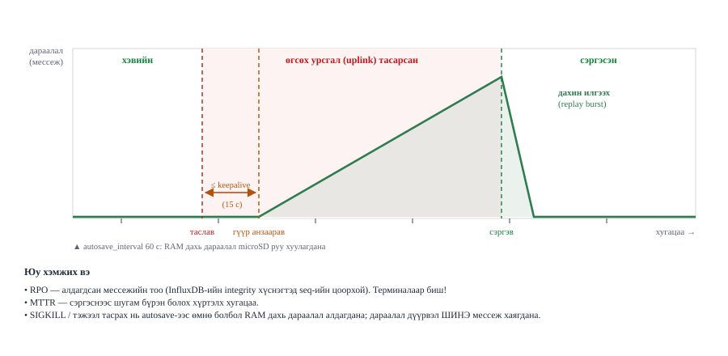
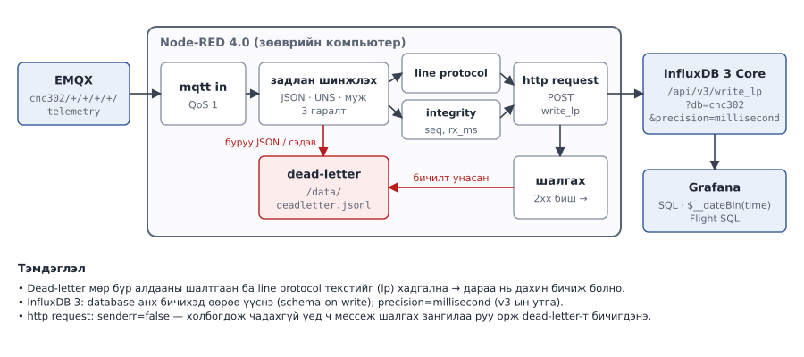

# Лаб 5 — Өгөгдлийн шугам ба холбоос тасрах

| | |
|---|---|
| **7 хоног** | XI |
| **Хугацаа** | 4 цаг |
| **Суралцахуйн үр дүн** | ҮД4 (үнэлэх), ҮД6, ҮД7 |
| **Үнэлгээ** | Бичгийн тайлан, 10 оноо |
| **Гол хэмжилт** | Store-and-forward-ийн алдагдал, **RPO** ба **MTTR** секундээр |

---

## 1. Зорилго

Хоёр хагас. Эхний хагаст 💻 үүл дээр бүрэн өгөгдлийн шугам барина:

```
🥧 mosquitto ══гүүр══▶ 💻 EMQX ─▶ Node-RED ─▶ InfluxDB 3 ─▶ Grafana
                                   (задлах,     (хадгалах)    (харах)
                                    шалгах)  └─▶ dead-letter
```

Хоёр дахь хагас — **энэ бол лабораторийн зүрх** — өгсөх урсгалыг (uplink) тасалж, юу амьд үлдэхийг тоогоор хэмжинэ. Хоёр тоог гаргана:

- **RPO** (Recovery Point Objective) — хэдэн секундын өгөгдөл **бүрмөсөн алдагдав**
- **MTTR** (Mean Time To Recovery) — шугам бүрэн эдгэрэх хүртэл хэдэн секунд өнгөрөв

> **Курсын тодорхойлолт.** RPO нь угтаа "хэдий хэмжээний өгөгдлийн алдагдлыг (хугацаагаар) хүлээн зөвшөөрөх вэ" гэсэн **зорилт**; MTTR нь олон эвдрэлийн сэргэх хугацааны **дундаж**. Энэ лабораторид бид нэг туршилт бүрийн **бодит** утгыг хэмжинэ: RPO = бүрмөсөн алдагдсан хамгийн урт тасралтгүй хэсгийн үргэлжлэл (с); MTTR = өгсөх урсгал сэргэснээс хойш тасалдлын үеэр илгээсэн сүүлийн мессеж санд хүрэх хүртэлх хугацаа (с). Олон давталтын дундаж нь жинхэнэ MTTR болно.

Энэ хоёр өөр үзүүлэлт: систем 5 секундын дараа сэргэж болно (сайн MTTR), гэхдээ тэр хугацааны өгөгдөл бүрэн алдагдсан байж болно (муу RPO).

> **⚠ ЭНЭ ЛАБОРАТОРИЙН ХАМГИЙН ЧУХАЛ УРХИ.** Өгсөх урсгал сэргэхэд гүүр хуримтлагдсан мессежээ **нэг тэсрэлтээр** урсгана. Хэрэв та `mosquitto_sub`-ыг тэр тэсрэлтийн **дараа** асаавал юу ч харагдахгүй — MQTT нь өнгөрсөн мессежийг шинэ захиалагчид дахин илгээхгүй. Тэгээд "store-and-forward ажиллаагүй" гэсэн **буруу дүгнэлт** гарна. Дахин илгээлт болсон эсэхийг **зөвхөн InfluxDB дотор** (эсвэл эхнээс нь ажиллаж байсан тогтвортой session-тэй захиалагчаар) шалгана.

---

## 2. Урьдчилсан нөхцөл

- Лаб 1–4 дууссан, `lab04-done` тэмдэглэгээ тавигдсан
- 💻 `pipeline` профайл нэмж асаана:

```bash
cd ~/cnc302/stack && make up-pipeline && make health
docker compose ps       # nodered "healthy" болтол 40 сек хүлээнэ
```

- 🥧 Pi дээр `sudo` эрх (`uplink-down` нь iptables/nft, `disk` нь mount шаарддаг)
- 🥧 `stress-ng` суусан: `sudo apt install -y stress-ng`
- 🥧 Гүүр ажиллаж байна: `cd ~/cnc302/edge && make link` → `bridge/state 1`
- 🥧 Терминал бүрд: `set -a && source ~/cnc302/edge/.env && set +a`

---

## 3. Онолын сануулга

### Баталгаа нь давхаргуудын үржвэр биш, хамгийн сул холбоосоор тодорхойлогдоно

QoS 2-оор илгээсэн мессеж брокерт баттай хүрнэ. Гэвч брокероос Node-RED, тэндээс InfluxDB руу явах замд MQTT-ийн баталгаа **байхгүй**. Тиймээс "төгсгөл-төгсгөлийн найдвартай байдал" гэдэг нь давхарга бүрийн баталгааны нийлбэр биш — **хамгийн сул холбоос** юм.

### Хаана буферлэгдэх вэ

| Эвдрэл | Хэн буферлэдэг | Хязгаар |
|---|---|---|
| **Өгсөх урсгал тасарсан** | ирмэгийн mosquitto-гийн гүүрний дараалал (**RAM**, үе үе microSD руу хуулна) | `max_queued_messages` / `max_queued_bytes`, контейнерийн RAM (128 MiB) |
| Ирмэгийн брокер унтарсан | төхөөрөмж өөрөө (кодлогдсон бол) | төхөөрөмжийн RAM |
| Node-RED/InfluxDB унтарсан | Node-RED-ийн dead-letter файл | диск |
| Диск дүүрсэн | **хэн ч үгүй** | — |

### Store-and-forward-ийн гурван тохиргоо

`edge/mosquitto/mosquitto.conf` ба `conf.d/bridge.conf` дахь гурван мөр л энэ бүхнийг тодорхойлно:

| Тохиргоо | Хаана | Үүрэг |
|---|---|---|
| `cleansession false` | bridge.conf | тасрахад **алсын** (EMQX) талын захиалга, session хадгалагдана; `true` бол холбоос тасрахад алсын захиалга, мессеж цэвэрлэгдэнэ |
| `local_cleansession false` | bridge.conf | гүүрний **локал** талын session (гүүрт зориулсан дараалал) хадгалагдана. Заагаагүй бол `cleansession`-ий утгыг авна |
| `queue_qos0_messages true` | mosquitto.conf (**глобал**) | тогтвортой клиент (гүүр) тасарсан үед QoS 0 мессежийг ч дараалалд оруулна (MQTT стандарт биш сонголт); эдгээр нь `max_queued_messages`-д тоологдоно |



> **⚠ Тохиргооны урхи:** `bridge_queue_qos0_messages` гэсэн сонголт **байхгүй** — mosquitto үүнийг танихгүй сонголт гэж үзээд **огт эхлэхгүй**. Зөв нэр нь глобал `queue_qos0_messages`. Гүүрний хэсэгт бичих гэж оролдвол `docker compose logs mosquitto` дотор `Unknown configuration variable` гарна.

**Хүлээгдэх зан төлөв:** эдгээр гурав зөв тохируулагдсан үед **QoS 1**-ээр өгсөх урсгал унасан хугацаанд нийтэлсэн мессеж бүгд дараалалд орж, холбоос сэргэхэд үүл рүү урсана. Гэхдээ дөрвөн нарийн зүйл RPO/MTTR-ын тоонд шууд нөлөөлнө:

1. **Гүүр тасралтыг шууд мэддэггүй.** iptables DROP нь TCP холболтыг "тасалдаггүй" — пакетууд зүгээр л алга болно. Гүүр `keepalive_interval` (анхдагч **60 с**) хугацаанд юу ч ирээгүй бол PING илгээж, хариу ирэхгүй бол холболтыг хаана. Тэр болтол `bridge/state` = 1 хэвээр. Иймээс **60 секундын тасалдалд `bridge.jsonl` дээр "0" огт гарахгүй байж болно** (бидний туршилтаар keepalive 60 үед 60 с тасалдалд "0" гараагүй, keepalive 10 үед ~19 с-т илэрсэн). Тиймээс энэ лабд тасалдлын **бодит** цагийг `failure_inject.sh` бичдэг `uplink-events.jsonl`-ээс авна (`verify --cut-log`).
2. **QoS 0 ба илрүүлэх хугацаа.** Гүүр тасралтыг илрүүлэхээс өмнө TCP холболт руу бичигдсэн QoS 0 мессежийг дахин илгээх механизм байхгүй (QoS 0 = "хамгийн ихдээ нэг удаа"). Тиймээс `queue_qos0_messages true` байсан ч QoS 0-ийн алдагдал ≈ *хурд × илрүүлэх хугацаа* байж болно. QoS 1 мессеж PUBACK авах хүртэл session-д үлдэж, дахин холбогдоход дахин илгээгдэнэ.
3. **Дараалал дүүрэхэд ШИНЭ мессеж хаягдана.** Албан ёсны баримтаар хязгаарт хүрсний дараах мессежүүд "чимээгүй хаягдана" — хуучин нь үлдэнэ. mosquitto лог дээр `Outgoing messages are being dropped for client local.edge-…` гарна.
4. **Дараалал RAM-д байна.** `persistence true` үед санах ой дахь өгөгдөл `mosquitto.db` файлд зөвхөн (а) `autosave_interval` тутамд, (б) mosquitto **хэвийн** унтрахад, (в) `SIGUSR1` дохиогоор бичигдэнэ. `autosave_on_changes false` тул манай тохиргоонд 60 секунд тутамд. **Цахилгаан гэнэт тасарвал** (эсвэл SIGKILL) сүүлийн хадгалалтаас хойш дараалалд орсон мессеж алдагдана — энэ нь RPO-д шууд нэмэгдэнэ.

Гүүр тасарснаа мэдсэний дараа `restart_timeout 5 60`-ийн дагуу 5 секундээс эхлэн 60 секунд хүртэл санамсаргүй өсөх ("Decorrelated Jitter") завсарлагатайгаар дахин холбогдохыг оролдоно — энэ нь MTTR-д нэмэгдэнэ.

> Албан ёсны баримт: [mosquitto.conf(5)](https://mosquitto.org/man/mosquitto-conf-5.html) — `max_queued_messages`, `max_queued_bytes`, `queue_qos0_messages`, `persistence`, `autosave_interval`, `cleansession`, `local_cleansession`, `keepalive_interval`, `restart_timeout`.

---

## 4. Алхмууд

### Алхам 1 — InfluxDB бэлтгэх ба бичилтийг гараар шалгах (25 мин) 💻

InfluxDB 3 нь *schema-on-write*: анхны бичилт өгөгдлийн сан, хүснэгтийг автоматаар үүсгэдэг. Гэхдээ санг **ил үүсгэх** нь сайн дадал (нэр, хадгалах хугацааг өөрөө шийднэ). Амжилттай бол `200`, аль хэдийн байвал `409` буцна.

```bash
curl -s -w '  → HTTP %{http_code}\n' -X POST 'http://localhost:8181/api/v3/configure/database' \
  -H 'Content-Type: application/json' -d '{"db":"cnc302"}'
curl -s 'http://localhost:8181/api/v3/configure/database?format=json' | jq
# Нэг мөр гараар бичиж, буцааж уншина
curl -s -X POST 'http://localhost:8181/api/v3/write_lp?db=cnc302&precision=millisecond' \
  -H 'Content-Type: text/plain' \
  --data-binary "telemetry,site=test,device=test0 temperature=24.5 $(date +%s%3N)"

curl -s -X POST 'http://localhost:8181/api/v3/query_sql' \
  -H 'Content-Type: application/json' \
  -d '{"db":"cnc302","q":"SELECT * FROM telemetry LIMIT 5","format":"json"}' | jq
# Ижил асуулга GET-ээр (URL-кодчилсон), мөр бүр тусдаа JSON (jsonl):
curl -s 'http://localhost:8181/api/v3/query_sql?db=cnc302&format=jsonl&q=SELECT+*+FROM+telemetry+LIMIT+5'
```

- `precision` утга нь v3 API-д **бүтэн үгээр**: `auto` (анхдагч) | `nanosecond` | `microsecond` | `millisecond` | `second`. `ms`, `s` гэх товчлол нь зөвхөн v1 (`/write`) ба v2 (`/api/v2/write`) нийцлийн API-д хүчинтэй.
- Амжилттай бичилт `204 No Content` буцаана. Line protocol буруу эсвэл баганын төрөл зөрчигдвөл `400` ба алдааны JSON (анхдагч `accept_partial=true` үед зөв мөрүүд нь бичигдэнэ).
- `query_sql`-ийн `format`: `json` (анхдагч), `jsonl`, `csv`, `pretty`, `parquet`.
- **Нэвтрэлт:** манай стек `--without-auth`-аар ажилладаг (**зөвхөн лабораторид**). Бодит системд эхлээд `docker exec -it cnc302-influxdb influxdb3 create token --admin` гэж токен үүсгэж, бүх хүсэлтэд `-H "Authorization: Bearer $TOKEN"` толгой нэмнэ (`data_integrity.py verify --auth-token …`).

> Албан ёсны баримт: [InfluxDB 3 Core — v3 write_lp API](https://docs.influxdata.com/influxdb3/core/write-data/http-api/v3-write-lp/), [v3 query API](https://docs.influxdata.com/influxdb3/core/query-data/execute-queries/influxdb-v3-api/)

**Бичилтийн саатлыг хэмжинэ** (5 удаа давтаж, `%{time_total}`-ыг тэмдэглэ):

```bash
for i in 1 2 3 4 5; do curl -s -o /dev/null -w '%{time_total}\n' -X POST \
  'http://localhost:8181/api/v3/write_lp?db=cnc302&precision=millisecond' \
  -H 'Content-Type: text/plain' \
  --data-binary "telemetry,site=test,device=test0 temperature=2$i.0 $(date +%s%3N)"; done
```

#### Хүснэгт 5.1 — Бичих давхаргын суурь

| Хэмжигдэхүүн | Утга | Тэмдэглэл |
|---|---|---|
| `write_lp` дундаж хугацаа (мс) | | 5 хэмжилтийн дундаж |
| `write_lp` хамгийн удаан (мс) | | |
| Хариу код (амжилттай бичилт) | | 204 хүлээгдэнэ |
| `query_sql` мөр буцаав уу | | |

> InfluxDB 2.7 нөөц хувилбар дээр ажиллаж байгаа бол `docs/troubleshooting.md` §6-г уншаад цаашид `verify`-д `--influx2` тугийг нэмнэ.

---

### Алхам 2 — Node-RED шугам ба Grafana самбар (45 мин) 💻

**2.1 Импортлох.** Node-RED (`:1880`) → ☰ → **Import** (эсвэл `Ctrl-I`) → `lab05/flows/nodered-pipeline.json`-ийн агуулгыг наах эсвэл файлыг сонгох → **new flow** → **Import** → **Deploy**.

> Албан ёсны баримт: [Node-RED — Importing and Exporting Flows](https://nodered.org/docs/user-guide/editor/workspace/import-export)



```
mqtt in ─▶ задлах + шалгах ─┬─(1)─▶ line protocol (telemetry) ─┐
                            │  └──▶ 60с цонх ─▶ lp (нэгтгэл) ──┤
                            ├─(2)─▶ lp (integrity, rx_ms) ─────┼─▶ InfluxDB бичих ─▶ шалгах ─┬─▶ ok
                            └─(3)─▶ dead-letter ◀──────────────┘                            └─▶ dead-letter
```

`data_integrity.py`-ийн мессеж (`run_id`, `seq` талбартай) 2-р салаагаар `integrity` хүснэгтэд бичигдэнэ. Node-RED хүлээн авсан цаг `rx_ms` нь MTTR-ыг тооцоход хэрэглэгдэнэ.

**2.2 Хоёр зангилааг шалга.** `mqtt-broker` нь `emqx:1883` (compose сүлжээн доторх нэр, `localhost` **биш**), MQTT v5, `cleansession` унтраалттай, `sessionExpiry` 3600 с — Node-RED дахин асахад EMQX хүлээлгэсэн мессежийг өгнө. `http request` нь `POST http://influxdb:8181/api/v3/write_lp?db=cnc302&precision=millisecond`. Түүний **"Only send non-2xx responses to Catch node"** сонголт **унтраалттай** байх ёстой: асаалттай бол InfluxDB унтарсан үеийн холболтын алдаа (`ECONNREFUSED`) гаралт руу гарахгүй, dead-letter хэзээ ч бичигдэхгүй. Захиалж буй сэдэв: `cnc302/+/+/+/+/telemetry`. Dead-letter файл `/data/deadletter.jsonl` — `nodered/node-red` дүрсийн хэрэглэгчийн хавтас `/data` бөгөөд `nodered-data` volume-д хадгалагдана.

**2.3 Өгөгдөл урсгана.** 🥧 Pi дээр агентаа ажиллуулаад (`cd ~/cnc302/edge && make agent`), 💻 дээр симулятороор нэмэлт ачаалал өгнө. Node-RED-ийн debug самбарт 10 секунд тутам `write_ok` өсөх ёстой:

```bash
cd ~/cnc302 && python3 tools/sim_device.py --target cloud --host localhost --devices 10 --interval 1
```

**2.4 Задлах зангилааны гурван үүрэг** (кодыг нээж уншина):

| Үүрэг | Код дотор | Яагаад |
|---|---|---|
| UNS схемийн шалгалт | `if (p.length !== 6)` | буруу нэршилтэй өгөгдөл санд орохгүй → dead-letter (`uns`) |
| Өгөгдлийн чанар | `temperature` / `proc_temp_c` `< -60 \|\| > 150` | эвдэрсэн мэдрэгч нэгтгэлийг сүйтгэнэ → dead-letter (`range:…`) |
| Шошго гаргах | `msg.tags = {site, area, line, device}` | InfluxDB-ийн tag (хэмжээс) |

Line protocol-д tag утгын **таслал, тэнцүүгийн тэмдэг, зай**-г `\`-ээр escape хийдэг (`esc()` функц); цаг нь миллисекунд тул URL-д `precision=millisecond`. Ижил хүснэгт + tag set + цагтай хоёр мөр нэг цэг болж нийлдэг тул QoS 1-ийн давхар хүргэлт санд давхар мөр үүсгэхгүй.

**2.5 Чанарын шүүлт ба dead-letter-ыг туршина:**

```bash
# 💻 хүрээнээс гарсан утга — санд ОРОХГҮЙ байх ёстой
mosquitto_pub -h localhost -t 'cnc302/shutis/mhts/lab/dev9999/telemetry' \
  -m '{"ts":'"$(date +%s%3N)"',"temperature":9999,"humidity":50,"vibration_rms":0.3}'
curl -s -X POST 'http://localhost:8181/api/v3/query_sql' -H 'Content-Type: application/json' \
  -d '{"db":"cnc302","q":"SELECT count(*) c FROM telemetry WHERE device='"'"'dev9999'"'"'","format":"json"}'
docker exec cnc302-nodered wc -l /data/deadletter.jsonl   # dead-letter файлын урт
docker exec cnc302-nodered tail -1 /data/deadletter.jsonl  # {"stage":"parse","reason":"range:temperature",…}
```

**2.6 Grafana самбар** (`:3000`, InfluxDB эх сурвалж аль хэдийн бүртгэгдсэн: query language **SQL**, database `cnc302`). SQL горимд Grafana нь InfluxDB 3 руу Flight SQL (gRPC)-ээр холбогддог тул TLS-гүй үед эх сурвалжийн **Insecure Connection** асаалттай байх ёстой. Гурван панель үүсгэж хадгална — Алхам 4-д өгсөх урсгал тасрахад энэ график дээр **цоорхой** үүсэх ёстой (эсвэл үүсэхгүй; аль нь болохыг та хэмжинэ):

| Панель | Асуулга |
|---|---|
| Температурын цуваа | `SELECT time, temperature, device FROM telemetry WHERE $__timeFilter(time) ORDER BY time` |
| Идэвхтэй төхөөрөмж (Stat) | `SELECT count(DISTINCT device) AS devices FROM telemetry WHERE $__timeFilter(time)` |
| Бичилтийн хурд | `SELECT $__dateBin(time) AS time, count(*) AS points FROM telemetry WHERE $__timeFilter(time) GROUP BY 1 ORDER BY 1` |

`$__timeFilter(time)` нь самбарын цагийн хүрээг, `$__dateBin(time)` нь `date_bin()`-ийг Grafana-гийн `$__interval`-аар орлуулна. `GROUP BY time` (түүхий цагаар бүлэглэх) нь цэг бүрийг тусдаа бүлэг болгодог тул хурдыг харуулахгүй.

> Албан ёсны баримт: [Grafana — InfluxDB query editor (SQL macros)](https://grafana.com/docs/grafana/latest/datasources/influxdb/query-editor/), [Configure the InfluxDB data source](https://grafana.com/docs/grafana/latest/datasources/influxdb/configure/)

#### Хүснэгт 5.2 — Шугамын чанарын хяналт

| Хэмжигдэхүүн | Утга |
|---|---|
| `write_ok` (2 минутын дараа) | |
| `write_errors` | |
| Хүрээнээс гарсан утга санд оров уу | |
| `deadletter.jsonl`-ийн мөрийн тоо | |
| Grafana дээр өгөгдөл харагдав уу | |

---

### Алхам 3 — Суурь бүрэн бүтэн байдал: гүүрээр (30 мин) 🥧💻

Эвдрэлгүй үед **алдагдал 0%** байхыг эхлээд батал. Суурь дээр аль хэдийн алдагдаж байвал цааш явах утгагүй.

```bash
# 🥧 терминал 1 — гүүрний төлөвийг бичиж эхэлнэ (ЭНЭ ЦОНХЫГ ЭЦЭС ХҮРТЭЛ БҮҮ ХАА)
cd ~/cnc302 && mkdir -p lab05/out
mosquitto_sub -h localhost -F '{"ts":%U,"state":%p}' \
  -t "cnc302/$SITE/$AREA/$LINE/$DEVICE_ID/bridge/state" > lab05/out/bridge.jsonl

# 🥧 терминал 2 — ирмэгийн брокер руу нийтэлнэ, гүүр үүл рүү дамжуулна
cd ~/cnc302
python3 lab05/data_integrity.py publish --via edge --host localhost \
    --rate 10 --seconds 180 --qos 1 --run-id base --outdir lab05/out
# дараа нь шалгана — InfluxDB нь ҮҮЛ дээр байгааг санаарай
python3 lab05/data_integrity.py verify --influx "http://$CLOUD_HOST:8181" \
    --run-id base --outdir lab05/out
```

> **Цагийн тохирол.** MTTR-ыг Pi-гийн цаг (тасалдлын цаг) ба зөөврийн компьютерийн цаг (`rx_ms`) хоёрыг харьцуулж тооцдог. Хоёр хост дээр `timedatectl` → `System clock synchronized: yes` байх ёстой.

#### Хүснэгт 5.3 — Суурь (эвдрэлгүй)

| Хэмжигдэхүүн | Утга |
|---|---|
| Илгээсэн (амжилттай) | |
| Санд олдсон | |
| Алдагдал % | 0.0 байх ЁСТОЙ |
| Холболтын тасалдал | |
| Хамгийн урт тасалдал (мессеж / сек) | / |

---

### Алхам 4 — ӨГСӨХ УРСГАЛ (UPLINK) ТАСРАХ: RPO ба MTTR (60 мин) 🥧💻

**Энэ бол лабораторийн гол хэсэг.** `uplink-down` нь Pi → үүл чиглэлийн 1883 портыг л хаана (iptables `OUTPUT … -j DROP`, iptables байхгүй бол nft `inet cnc302` хүснэгт): ирмэгийн mosquitto ажилласаар, төхөөрөмжүүд Pi руу нийтэлсээр байна. Энэ нь "бүх зүйл унасан" биш, яг **өгсөх урсгал тасарсан** туршилт.

**4.1 QoS 1, 60 секундын тасалдал.** Гурван терминал зэрэг:

```bash
# 🥧 терминал 1 — bridge.jsonl бичсээр байна (Алхам 3-аас үргэлжилнэ)
# 🥧 терминал 2 — 5 минут нийтэлнэ
cd ~/cnc302
python3 lab05/data_integrity.py publish --via edge --host localhost \
    --rate 10 --seconds 300 --qos 1 --run-id uplink60 --outdir lab05/out
# 🥧 терминал 3 — 60 секундын дараа өгсөх урсгалыг 60 секунд таслана
sleep 60 && bash lab05/failure_inject.sh uplink-down 60
```

Энэ үед юу болдгийг Зураг 5.2-оос дахин хар. `failure_inject.sh` тасалдлын эхлэл/төгсгөлийг `lab05/out/uplink-events.jsonl`-д бичнэ.

**4.2 Өгсөх урсгал унах үед 🥧 дээр дараалал өсөж байгааг хар:**

```bash
# хадгалагдсан мессежийн тоо (retained + тогтвортой клиентийн дараалал);
# sys_interval (анхдагч 10 с) тутам шинэчлэгдэнэ. Хуучин нэр нь $SYS/broker/messages/stored
mosquitto_sub -h localhost -t '$SYS/broker/store/messages/count' -C 1
docker stats --no-stream cnc302-mosquitto        # RAM өсөж байна уу
```

Гүүр тасралтыг хэзээ илрүүлснийг `bridge.jsonl`-ээс хар — `uplink-down`-оос хэдэн секундын дараа `"state":0` гарав (эсвэл огт гарсангүй)? Энэ зөрүүг Хүснэгт 5.5-д бич.

> **Урхинд бүү ор.** Өгсөх урсгал сэргэсний дараа шинэ `mosquitto_sub` асаавал дахин илгээгдсэн мессеж **харагдахгүй** — тэсрэлт аль хэдийн өнгөрсөн байна. Дахин илгээлтийн нотолгоо нь зөвхөн (а) InfluxDB дэх мөрүүд, (б) Алхам 3-аас хойш тасралтгүй ажиллаж байгаа `bridge.jsonl` хоёр.

**4.3 Шалгах — алдагдлыг гүүрний төлөвөөр ХУВААНА:**

```bash
# 🥧 publish дуусмагц (сэргэхийг 30 сек хүлээгээд)
python3 lab05/data_integrity.py verify --influx "http://$CLOUD_HOST:8181" \
    --run-id uplink60 --outdir lab05/out --bridge-log lab05/out/bridge.jsonl \
    --cut-log lab05/out/uplink-events.jsonl
```

Гаралт нь алдагдлыг хоёр янзаар хуваана: (а) **гүүрийн мэдээлсэн** төлөвөөр (`--bridge-log`), (б) **бодит** тасалдлаар (`--cut-log`), мөн MTTR-ыг автоматаар тооцно. Хоёр хуваалтын "тасарсан (с)" ялгаа нь гүүрийн илрүүлэх хугацаа юм.

**4.4 QoS 0-оор давт** (шинэ `--run-id`, ижил хэв маяг):

```bash
python3 lab05/data_integrity.py publish --via edge --host localhost \
    --rate 10 --seconds 300 --qos 0 --run-id uplink60q0 --outdir lab05/out
# 60 сек дараа: bash lab05/failure_inject.sh uplink-down 60 ; дараа нь:
python3 lab05/data_integrity.py verify --influx "http://$CLOUD_HOST:8181" \
    --run-id uplink60q0 --outdir lab05/out --bridge-log lab05/out/bridge.jsonl \
    --cut-log lab05/out/uplink-events.jsonl
```

**4.5 Тасалдлыг уртасга:** ижил туршилтыг `uplink-down 180` (3 минут) -аар давт (`--seconds 420`, `--run-id uplink180`).

#### Хүснэгт 5.4 — Өгсөх урсгал тасрах: RPO ба MTTR ⭐

| Ажиллалт | QoS | Тасалдал (с) | Илгээсэн | Санд хүрсэн | Алдагдал % | **RPO (с)** | **MTTR (с)** | Гүүр дахин холбогдох хугацаа (с) |
|---|---|---|---|---|---|---|---|---|
| `uplink60` | 1 | 60 | | | | | | |
| `uplink60q0` | 0 | 60 | | | | | | |
| `uplink180` | 1 | 180 | | | | | | |

- **RPO** = хамгийн урт тасалдлын хугацаа (`verify`-ийн "Хамгийн урт тасалдал ... секунд"). Алдагдал 0 бол RPO = 0.
- **MTTR** = өгсөх урсгал сэргэснээс (`uplink-events.jsonl`-ийн `state=1`) тасалдлын үеэр илгээсэн сүүлийн мессеж санд хүрэх (`integrity.rx_ms`) хүртэлх хугацаа — `verify --cut-log` хэвлэнэ (`mttr_s`).
- **Гүүр дахин холбогдох хугацаа** = `bridge.jsonl`-ийн `state=1` − `uplink-events.jsonl`-ийн `state=1`.

#### Хүснэгт 5.5 — Бодит тасалдал ба гүүрийн мэдээлсэн төлөвөөр хуваасан алдагдал (`--cut-log`, `--bridge-log`)

| Ажиллалт | Бодит тасалдал (с, `--cut-log`) | Гүүрийн мэдээлсэн тасалдал (с, `--bridge-log`) | Илрүүлэх хугацаа (с) | Бодит тасалдлын үед: илгээсэн / алдагдсан / % | Ажиллаж байхад: илгээсэн / алдагдсан / % |
|---|---|---|---|---|---|
| `uplink60` (QoS 1) | | | | / / | / / |
| `uplink60q0` (QoS 0) | | | | / / | / / |
| `uplink180` (QoS 1) | | | | / / | / / |

> **Хүлээгдэх үр дүн:** `cleansession false` + `local_cleansession false` + `queue_qos0_messages true` үед **QoS 1**-ийн алдагдал 0% байх ёстой — PUBACK аваагүй мессеж session-д үлдэж, дахин холбогдоход илгээгдэнэ. **QoS 0**-д гүүр тасралтыг илрүүлэхээс өмнө TCP руу бичигдсэн мессеж алдагдаж болно (§3, 2-р зүйл) — алдагдсан хэсэг тасалдлын **эхэнд** байвал яг энэ шалтгаан. 60 секундын тасалдалд гүүр "0" мэдээлээгүй байж болохыг анхаар (keepalive 60 с).

---

### Алхам 5 — `cleansession` ба дарааллын хязгаар (35 мин) 🥧

**5.1 `cleansession` ба `local_cleansession`-ийг салгаж турш.** `bridge.conf`-д `local_cleansession false` **ил** бичигдсэн тул зөвхөн `cleansession`-ийг `true` болгох нь гүүрний **локал** дарааллыг хөндөхгүй — энэ хоёрын үүргийг ялгах нь энэ алхмын зорилго. Гүүрний тохиргоог **шууд** засаад Алхам 4.1-ийг хоёр удаа давтана:

```bash
cd ~/cnc302/edge
# (а) зөвхөн алсын тал цэвэр:  cleansession true,  local_cleansession false  → --run-id uplink60clean
# (б) хоёр тал цэвэр:          cleansession true,  local_cleansession true   → --run-id uplink60cleanboth
nano mosquitto/conf.d/bridge.conf
docker compose restart mosquitto      # ⚠ `make restart` БИШ!
docker compose logs --tail=20 mosquitto | grep -i bridge
```

> Бидний урьдчилсан туршилтаар (mosquitto 2.0, QoS 1, 30 с тасалдал) (а) алдагдалгүй, (б) тасалдлын үеийн мессеж бараг бүгд алдагдсан. Өөрсдийн тоогоор батал.

> ⚠ `make restart` нь эхлээд `make bridge`-ийг ажиллуулж `bridge.conf`-ыг **загвараас дахин үүсгэдэг** — гар засвар устана. Тиймээс энд `docker compose restart mosquitto`. Дуусаад `make bridge`-ээр анхны төлөвт буцаана.

**5.2 Дарааллын RAM-ын арифметик.** `mosquitto.conf` дахь `max_queued_messages 100000` юу гэсэн үг вэ — тоол:

```
100 000 мессеж × ______ Б (таны ачаалал) = ______ MiB
Pi-гийн боломжтой RAM (Лаб 4, Хүснэгт 4.1) = ______ MiB
→ Дараалал бүрэн дүүрэхэд Pi амьд үлдэх үү: ______
→ Таны хурдаар (______ мсж/с) дараалал дүүрэхэд ______ секунд шаардагдана
```

**5.3 Дарааллын халилтыг үзэх.** Хязгаарыг зориудаар багасгаж, халихыг ажигла. `max_queued_messages` нь "дамжуулж байгаа (in-flight) мессежээс **гадна**" хадгалах QoS 1/2 мессежийн тоо (клиент тус бүрд):

```bash
cd ~/cnc302/edge
sed -i 's/^max_queued_messages .*/max_queued_messages 500/' mosquitto/mosquitto.conf
docker compose restart mosquitto
# 🥧 өөр терминалд: 120 сек тасалж, 10 мсж/с илгээнэ → 1200 мессеж > 500 дараалал
cd ~/cnc302
python3 lab05/data_integrity.py publish --via edge --host localhost \
    --rate 10 --seconds 240 --qos 1 --run-id qfull --outdir lab05/out
# 30 сек дараа: bash lab05/failure_inject.sh uplink-down 120 ; дараа нь:
python3 lab05/data_integrity.py verify --influx "http://$CLOUD_HOST:8181" \
    --run-id qfull --outdir lab05/out --bridge-log lab05/out/bridge.jsonl \
    --cut-log lab05/out/uplink-events.jsonl
docker compose -f ~/cnc302/edge/docker-compose.yml logs mosquitto | grep -i "dropped"
# Дуусаад БУЦААЖ 100000 болгоод дахин асаана
```

Алдагдсан `seq`-ийн хүрээ тасалдлын **эхэнд** үү, **төгсгөлд** үү гэдгийг `verify`-ийн тасралтын жагсаалтаас ол.

#### Хүснэгт 5.6 — `cleansession` ба дарааллын хязгаарын харьцуулалт

| Тохиргоо | Гүүр унасан үед илгээсэн | Алдагдсан | Алдагдал % | Дараалал хадгалагдав уу |
|---|---|---|---|---|
| `cleansession false`, `local_cleansession false`, дараалал 100000 (үндсэн) | | | | |
| `cleansession true`, `local_cleansession false`, дараалал 100000 | | | | |
| `cleansession true`, `local_cleansession true`, дараалал 100000 | | | | |
| `cleansession false`, дараалал 500 | | | | |

#### Хүснэгт 5.7 — Дарааллын нөөцийн зардал

| Асуулт | Хариулт |
|---|---|
| Нэг мессежийн бодит хэмжээ (Б) | |
| 100 000 мессежийн RAM (MiB) | |
| Дараалал дүүрэх хугацаа таны хурдаар (с) | |
| Дараалал өсөх үед mosquitto-гийн RAM хэдээр өсөв (MiB) | |
| Дараалал халихад аль мессеж хаягдав (хуучин уу, шинэ үү) | |

**5.4 microSD-гийн бичих саатал.** mosquitto-гийн persistence ба InfluxDB хоёулаа диск рүү бичдэг. Pi-гийн картыг хэмж (4 KiB × 2000 синхрон бичилт):

```bash
dd if=/dev/zero of=~/cnc302/sdtest bs=4k count=2000 oflag=dsync 2>&1 | tail -1
rm ~/cnc302/sdtest && vmstat 1 5      # `wa` = I/O хүлээлт
```

Гарсан тоог `autosave_interval 60`-той холбож тайлбарла: mosquitto яагаад бичилт бүрийг шууд диск рүү буулгадаггүй вэ, энэ нь тасалдал үед юу алдах эрсдэлтэй вэ? Хариултаа Алхам 6-гийн `broker` (хэвийн зогсоолт → `mosquitto.db` бичигдэнэ) ба `broker-kill` (SIGKILL → бичигдэхгүй) хоёрын үр дүнгээр батал.

---

### Алхам 6 — Бусад эвдрэлүүд (30 мин) 🥧💻

Тус бүрд `publish` ажиллаж байх зуур эвдрэлийг үүсгэнэ (60 секундын дараа), дараа нь `verify`.

```bash
# 🥧 ирмэгийн брокер өөрөө унана — гүүр биш, БРОКЕР (хэвийн SIGTERM → mosquitto.db хадгалагдана)
bash lab05/failure_inject.sh broker 30
# 🥧 цахилгаан тасрахыг дуурайна: өгсөх урсгал тасарсан ҮЕД mosquitto-г SIGKILL-ээр унагана
#    (терминал 3: uplink-down 120 ажиллаж байх үед 40 сек дараа)
bash lab05/failure_inject.sh broker-kill 20
# 💻 ҮҮЛ дээр: InfluxDB унана. Брокер, гүүр ажилласаар байна!
bash lab05/failure_inject.sh influx 30
docker exec cnc302-nodered wc -l /data/deadletter.jsonl    # dead-letter ажиллав уу
# 🥧 CPU ханалт (дулааны төсөв ч мөн шалгагдана)
bash lab05/failure_inject.sh cpu 45
# 🥧 АЮУЛГҮЙ дискний туршилт — /dev/shm (RAM) дээрх 64 MiB loop файл, бодит microSD хөндөгдөхгүй
bash lab05/failure_inject.sh disk 60
# Эцэст нь БҮГДИЙГ сэргээнэ
bash lab05/failure_inject.sh restore
```

> `influx` горим нь хамгийн заль мэхтэй тохиолдол: **төхөөрөмж юу ч анзаарахгүй**, брокер хүлээж авсаар байна, гүүр ажиллаж байна — гэвч өгөгдөл хаана ч хадгалагдахгүй. Ийм эвдрэлийг зөвхөн Node-RED-ийн `write_errors` тоолуур ба dead-letter файлаас л илрүүлнэ. Grafana дээр график тасарна — гэхдээ хэн нэг нь харж байвал л.

#### Хүснэгт 5.8 — ЭВДРЭЛИЙН МАТРИЦ ⭐

| # | Эвдрэл | Үргэлжлэл (с) | Шинж тэмдэг | Илгээсэн | Санд хүрсэн | Алдагдал % | RPO (с) | MTTR (с) | Автоматаар сэргэв үү |
|---|---|---|---|---|---|---|---|---|---|
| 0 | Суурь (эвдрэлгүй) | — | | | | | | | |
| 1 | `uplink-down`, QoS 1 | 60 | | | | | | | |
| 2 | `uplink-down`, QoS 0 | 60 | | | | | | | |
| 3 | `uplink-down`, QoS 1 | 180 | | | | | | | |
| 4 | `cleansession true` (+ `local_cleansession true`) | 60 | | | | | | | |
| 5 | Дараалал 500 (халилт) | 120 | | | | | | | |
| 6 | `broker` (ирмэгийн mosquitto, SIGTERM) | 30 | | | | | | | |
| 6б | `broker-kill` өгсөх урсгал тасарсан үед (SIGKILL) | 20 | | | | | | | |
| 7 | `influx` (үүлний сан) | 30 | | | | | | | |
| 8 | `cpu` | 45 | | | | | | | |
| 9 | `disk` | 60 | | | | | | | |

---

### Алхам 7 — Дүгнэлт ба commit (15 мин) 🥧💻

Багийн төслийн **найдвартай байдлын паспорт**-ыг бич: ямар RPO, ямар MTTR-ыг зорилт болгох вэ, түүнд хүрэхийн тулд ямар тохиргоо шаардлагатай вэ (`max_queued_messages`, `cleansession`, QoS, диск).

```bash
cd ~/cnc302 && bash lab05/failure_inject.sh restore     # бүх зүйл хэвийн эсэхийг батал
(cd edge && make bridge && docker compose restart mosquitto)   # анхны тохиргоо
git add lab05/
# lab05/out/ нь .gitignore-д — зөвхөн үр дүнгийн JSON-г албадан нэмнэ (лог, jsonl-ыг БИШ)
git add -f lab05/out/*-result.json
git status --short
git commit -m "Лаб 5: өгөгдлийн шугам, өгсөх урсгал тасрах, RPO/MTTR"
git tag lab05-done && git push && git push --tags
# Нууц файл ороогүйг ЗААВАЛ шалга
git ls-files | grep -E '\.env$|bridge\.conf$|\.key$|\.crt$|devices\.csv'   # хоосон байх ЁСТОЙ
```

---

## 5. Хяналтын асуултууд

1. Хүснэгт 5.5-д QoS 1 үед **бодит тасалдлын** хугацаанд илгээсэн хэдэн мессежээс хэд нь алдагдав? Хэрэв 0 бол аль тохиргоо үүнийг боломжтой болгов? Хүснэгт 5.6-гийн 2 ба 3-р мөрийн ялгаагаар `cleansession` ба `local_cleansession`-ийн үүргийг тайлбарла.

2. Хүснэгт 5.4-т QoS 0 ба QoS 1-ийн алдагдал хэдээр зөрөв? `queue_qos0_messages true` байхад ялгаа бага гарсан бол энэ нь юуг харуулж байна вэ?

3. Хүснэгт 5.4-т таны RPO ба MTTR тус бүр хэдэн секунд гарав? Аль нь илүү муу вэ, яагаад? Хэрэв мессеж бүгд хүрсэн ч 40 секунд хоцорч ирсэн бол энэ ямар хэрэглээнд хүлээн зөвшөөрөгдөх, ямарт нь болохгүй вэ?

4. Хүснэгт 5.7-д `max_queued_messages 100000` хэдэн MiB шаардаж байна? Pi 3B-гийн үлдэгдэл RAM (Лаб 4, Хүснэгт 4.1)-тай харьцуулахад энэ аюулгүй тоо мөн үү? Та ямар утга сонгох вэ, яагаад?

5. Дараалал 500 болгосон туршилтад (Хүснэгт 5.6) аль мессежүүд алдагдав — эхнийх нь үү, сүүлийнх нь үү? Энэ нь дарааллын халилтын бодлогын талаар юу хэлж байна вэ, таны хэрэглээнд аль нь дээр вэ?

6. `influx` эвдрэлийн үед төхөөрөмж юу ч анзаарсангүй. Хүснэгт 5.8-ын 7-р мөрөнд хэдэн мессеж алдагдав, dead-letter-т хэдэн мөр орсон бэ? Ийм "чимээгүй" эвдрэлийг хэдэн секундын дотор илрүүлэх систем хэрхэн барих вэ?

7. `dd … oflag=dsync` хэмжилтэд microSD хэдэн MB/с, нэг бичилт дунджаар хэдэн мс байв? Энэ тоо mosquitto-гийн `autosave_interval 60` ба InfluxDB-ийн бичилтэд хэрхэн нөлөөлж байна вэ? Хүснэгт 5.8-ын 6 ба 6б мөрийн ялгааг `autosave_interval`-аар тайлбарла.

8. Хүснэгт 5.5-д гүүр тасралтыг хэдэн секундын дараа илрүүлэв? `keepalive_interval`-ийг 60-аас 15 болговол RPO (QoS 0) ба MTTR хэрхэн өөрчлөгдөх вэ, ямар зардалтай вэ?

---

## 6. Хүлээлгэн өгөх зүйл

| # | Зүйл | Байрлал |
|---|---|---|
| 1 | Тайлан (Хүснэгт 5.1–5.8 бөглөсөн) | `lab05/report.md` → PDF |
| 2 | `verify`-ийн үр дүнгийн JSON файлууд | `lab05/out/*-result.json` |
| 3 | Node-RED урсгалын экспорт (өөрчилсөн бол) | `lab05/flows/` |
| 4 | Grafana самбар — тасалдлын цоорхой харагдсан зураг | тайлангийн хавсралт |
| 5 | Багийн найдвартай байдлын паспорт (RPO/MTTR зорилт) | тайлангийн хавсралт |
| 6 | Git tag | `lab05-done` |

---

## 7. Үнэлгээний шалгуур (10 оноо)

| Шалгуур | Оноо |
|---|---|
| Шугам бүрэн ажиллаж, чанарын шүүлт ба dead-letter баталгаажсан | 2 |
| Өгсөх урсгалын тасалдлын гурван ажиллалт хийгдэж, Хүснэгт 5.4–5.5 бүрэн | 3 |
| **RPO ба MTTR тоогоор, InfluxDB-ийн нотолгоотойгоор** гаргасан | 2 |
| `cleansession` ба дарааллын хязгаарын харьцуулалт (5.6–5.7) | 2 |
| Эвдрэлийн матриц бүрэн, систем цэвэр сэргээгдсэн | 1 |

**Онцгой оноо (+1):** дахин илгээлтийг тогтвортой session-тэй захиалагчаар (эсвэл өөр аргаар) InfluxDB-ээс гадна бие даан баталсан бол.

---

## 8. Түгээмэл алдаа

| Шинж | Шалтгаан | Шийдэл |
|---|---|---|
| Дахин илгээлт "харагдахгүй" | `mosquitto_sub` тэсрэлтийн ДАРАА асаасан | InfluxDB-ээс шалга (§1-ийн урхи) |
| mosquitto огт эхлэхгүй | `bridge_queue_qos0_messages` гэж бичсэн | глобал `queue_qos0_messages`-ыг ашигла |
| Node-RED `400` буцаана | line protocol буруу эсвэл баганын төрөл зөрчигдсөн (жишээ: нэг талбарт тоо, дараа нь текст) | `deadletter.jsonl`-ийн `error` ба `lp`-г хар |
| `write_errors` өсөж, код нь `ECONNREFUSED`/`ENOTFOUND` | InfluxDB унтарсан эсвэл хаяг буруу | `docker compose ps influxdb`, URL `http://influxdb:8181` |
| InfluxDB унтарсан ч dead-letter хоосон | `http request`-ийн "Only send non-2xx responses to Catch node" асаалттай | сонголтыг унтраа (§2.2) |
| `bridge.jsonl`-д `0` гарсангүй | тасалдал `keepalive_interval`-аас богино | `--cut-log`-оор шалга (§3) |
| `verify` 0 мөр олно | буруу `--influx` эсвэл `--db` | `SELECT * FROM integrity LIMIT 5` |
| Суурь тестэд аль хэдийн алдагдал | сэдвийн угтвар `SITE`-тай зөрсөн | troubleshooting §2 |
| `uplink-down` → эрхийн алдаа | iptables/nft-д sudo эрх хэрэгтэй | `sudo bash lab05/failure_inject.sh uplink-down 60` |
| `bridge.conf` засвар алга болов | `make restart` загвараас дахин үүсгэсэн | `docker compose restart mosquitto` ашигла |
| `disk` горим `mount` алдаа | sudo эрхгүй эсвэл loop модуль алга | эхлээд `sudo -v` |
| Сэргэсний дараа гүүр удаан холбогдоно | `restart_timeout 5 60` backoff | 60 секунд хүртэл хүлээ, `make link`-ээр хар |
| `verify`: `table 'integrity' not found` | урсгалын хуучин хувилбар импортлогдсон (integrity салаагүй) | `lab05/flows/nodered-pipeline.json`-ийг дахин импортло |

---

## 9. Эх сурвалж

| # | Эх сурвалж | Юуг баталгаажуулсан | Хандсан |
|---|---|---|---|
| 1 | [mosquitto.conf(5)](https://mosquitto.org/man/mosquitto-conf-5.html) | `persistence`, `autosave_interval`, `autosave_on_changes` (зөвхөн autosave/унтрах/SIGUSR1 үед бичнэ), `max_queued_messages` (in-flight-аас гадна, анхдагч 1000), `max_queued_bytes` (хязгаарт хүрвэл дараагийн мессеж чимээгүй хаягдана), `queue_qos0_messages` (глобал, стандарт биш), `cleansession`, `local_cleansession`, `keepalive_interval` (анхдагч 60), `restart_timeout` (base/cap, jitter), `notifications`, `notification_topic` | 2026-09 |
| 2 | [mosquitto(8)](https://mosquitto.org/man/mosquitto-8.html) | `$SYS/broker/store/messages/count` (хуучин нэр `messages/stored`), `$SYS/broker/connection/#`, `sys_interval` | 2026-09 |
| 3 | [mosquitto_sub(1)](https://mosquitto.org/man/mosquitto_sub-1.html) | `-F` формат, `%U` (наносекундтэй Unix цаг), `%p` | 2026-09 |
| 4 | [InfluxDB 3 Core — Use the v3 write_lp API](https://docs.influxdata.com/influxdb3/core/write-data/http-api/v3-write-lp/) | `precision` утгууд (`auto`/`nanosecond`/`microsecond`/`millisecond`/`second`), `accept_partial`, `no_sync`, 204/400 хариу | 2026-09 |
| 5 | [InfluxDB 3 Core API — Write data](https://docs.influxdata.com/influxdb3/core/api/write-data/) | v1/v2/v3 precision харьцуулалт (`ms` зөвхөн v1/v2), 204/400/401/403/413 | 2026-09 |
| 6 | [InfluxDB 3 Core — Use the v3 query API](https://docs.influxdata.com/influxdb3/core/query-data/execute-queries/influxdb-v3-api/) | `/api/v3/query_sql` GET/POST, `db`, `q`, `format` (json/jsonl/csv/pretty/parquet) | 2026-09 |
| 7 | [InfluxDB 3 Core — Create a database](https://docs.influxdata.com/influxdb3/core/admin/databases/create/), [API — Database](https://docs.influxdata.com/influxdb3/core/api/database/) | `POST /api/v3/configure/database` (`{"db":…}`, 200/409), `GET …?format=json` | 2026-09 |
| 8 | [InfluxDB 3 Core — Write data (get started)](https://docs.influxdata.com/influxdb3/core/get-started/write/) | schema-on-write: сан, хүснэгт автоматаар үүснэ | 2026-09 |
| 9 | [InfluxDB 3 Core — Line protocol](https://docs.influxdata.com/influxdb3/core/reference/line-protocol/) | escape дүрэм (tag утга: таслал, `=`, зай), `i` бүхэл тоо, давхар цэг нийлэх | 2026-09 |
| 10 | [InfluxDB 3 Core — Configuration options](https://docs.influxdata.com/influxdb3/core/reference/config-options/), [Set up Core](https://docs.influxdata.com/influxdb3/core/get-started/setup/), [API authentication](https://docs.influxdata.com/influxdb3/core/api/authentication/) | `--without-auth`, `influxdb3 create token --admin`, `Authorization: Bearer` | 2026-09 |
| 11 | [Grafana — InfluxDB query editor](https://grafana.com/docs/grafana/latest/datasources/influxdb/query-editor/), [Configure the InfluxDB data source](https://grafana.com/docs/grafana/latest/datasources/influxdb/configure/) | SQL макро `$__timeFilter`, `$__dateBin`; SQL нь Flight SQL (gRPC), TLS-гүй үед Insecure Connection | 2026-09 |
| 12 | [InfluxDB 3 Core — Use Grafana](https://docs.influxdata.com/influxdb3/core/visualize-data/grafana/) | InfluxDB эх сурвалжийн SQL тохиргоо (database, token, insecure) | 2026-09 |
| 13 | [Node-RED — Importing and Exporting Flows](https://nodered.org/docs/user-guide/editor/workspace/import-export) | Import цонх, `Ctrl-I` | 2026-09 |
| 14 | [Node-RED — Running under Docker](https://nodered.org/docs/getting-started/docker) | `/data` хэрэглэгчийн хавтас, volume | 2026-09 |
| 15 | [Node-RED — Handling errors](https://nodered.org/docs/user-guide/handling-errors) | Catch зангилаа ба `node.error` | 2026-09 |
| 16 | [iptables(8)](https://man7.org/linux/man-pages/man8/iptables.8.html), [nft(8)](https://www.netfilter.org/projects/nftables/manpage.html) | `-I`/`-D`/`-S`; `add table/chain … hook output`, `delete table` | 2026-09 |
| 17 | [mount(8)](https://man7.org/linux/man-pages/man8/mount.8.html), [fallocate(1)](https://man7.org/linux/man-pages/man1/fallocate.1.html) | `mount -o loop` файлаас loop төхөөрөмж үүсгэх; файлд зай урьдчилан хуваарилах | 2026-09 |
