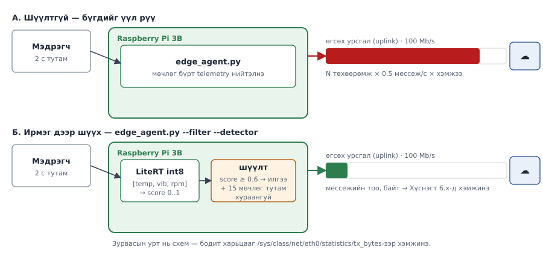

# Лаб 6 — Ирмэгийн хиймэл оюун: CPU дээр

| | |
|---|---|
| **7 хоног** | XII |
| **Хугацаа** | 4 цаг |
| **Суралцахуйн үр дүн** | ҮД5 (шинжлэх), ҮД7 (хэмжих) |
| **Үнэлгээ** | Бичгийн тайлан, 10 оноо |
| **Гол хэмжилт** | Дүгнэлтийн саатал (p99), санах ой, ирмэгийн шүүлтийн үр ашиг |

---

## 1. Зорилго

Энэ лаборатори загвар **сургах** тухай биш. Сургалт X–XI долоо хоногийн бие даалтаар аль хэдийн хийгдсэн байх ёстой (§2). Лабораторийн 4 цагт бид **байршуулалтын өртгийг** хэмжинэ:

```
  нарийвчлал  ←→  саатал  ←→  санах ой  ←→  зурвасын өргөн
```

Хамгийн чухал нь: **энэ курсын ирмэг бол хурдасгуургүй CPU.** Raspberry Pi AI Kit нь M.2 HAT+-аар Raspberry Pi **5**-ын PCIe 2.0 интерфэйст холбогддог; Raspberry Pi 3B-д PCIe холбогч байхгүй тул AI Kit **физикийн хувьд** холбогдох боломжгүй. Энэ бол дутагдал биш, **заах нөхцөл**: бодит үйлдвэрийн ирмэгийн зангилааны олонх нь яг ийм байдаг — хэдэн зуун МГц-ийн ARM, хэдэн зуун MiB RAM, хурдасгуургүй.

Дөрвөн асуултад тоон хариулт өгнө:

1. int8 квантчилал 4×Cortex-A53 дээр саатлыг хэдэн дахин багасгав?
2. 4 цөмийг бүгдийг ашиглах нь үргэлж дээр үү? (Санамж: **үгүй**. Үүнийг нотол.)
3. MobileNet зэрэглэлийн зурган загвар Pi 3B дээр **хэр удаан** вэ? Тэр тоо юуг хэлж байна вэ?
4. Ирмэг дээр шүүлт хийснээр 100 Mbit өгсөх урсгалаар явах мессеж, байт **хэдэн хувиар** буурав?

> **Гол зарчим:** Pi 3B дээр байршуулж болох цорын ганц бодит загвар бол **жижиг хүснэгтэн/цонхны гажил илрүүлэгч** (3–5 оролт, хэдэн KiB). Зурган загвар нь харьцуулалтын **сөрөг жишээ** болж орно — хэр удаан болохыг хэмжих нь даалгаврын нэг хэсэг.

---

## 2. Урьдчилсан нөхцөл — БИЕ ДААЛТААР УРЬДЧИЛАН ХИЙНЭ

Лабораторийн цагаар загвар сургах хугацаа **байхгүй**. Доорх 2.1–2.6-г X–XI долоо хоногийн бие даалтаар хийж, лабд ирэхэд **2.7-ийн шалгалт бүгд ✅** байх ёстой.

> 💡 **Алхмуудыг дарааллаар нь хий.** Алхам бүрийн төгсгөлд ✅ **Шалгах** хэсэг бий. Үр дүн нь таарахгүй бол **цааш бүү яв** — ❌ мөр эсвэл §8-аас шалтгааныг ол.

### 2.0 Терминалууд ба орчин

| Цонх | Хаана |
|---|---|
| **[🥧 Pi-1]**, **[🥧 Pi-2]** | Raspberry Pi (`ssh pi`) |
| **[💻 Ubuntu-1]**, **[💻 Ubuntu-2]** | Зөөврийн компьютер (WSL) |

Цонх **нээх бүрт**:

**[🥧 Pi-1]** ба **[🥧 Pi-2]**
```bash
cd ~/cnc302
PY=~/cnc302/edge/.venv/bin/python
set -a && source ~/cnc302/edge/.env && set +a
echo "төхөөрөмж=$DEVICE_ID"
```

**[💻 Ubuntu-1]** ба **[💻 Ubuntu-2]**
```bash
cd ~/cnc302 && source .venv/bin/activate
export DEV=pi3b-team<NN>
```

### 2.1 Pi дээр орчин бэлдэх 🥧 (X долоо хоног)

**[🥧 Pi-1]**
```bash
git pull
mkdir -p lab06/data lab06/models lab06/out
$PY -m pip install numpy ai-edge-litert
$PY -c "from ai_edge_litert.interpreter import Interpreter; print('OK')"
```

✅ `OK`. (SETUP Б.8-д суулгасан бол `Requirement already satisfied`.)

LiteRT бол TensorFlow Lite-ийн шинэ нэр; Python-ы interpreter багц нь `tflite-runtime`-аас `ai-edge-litert` болж солигдсон (`from ai_edge_litert.interpreter import Interpreter`). PyPI-д cp311 (Bookworm) ба cp313 (Trixie) `manylinux_2_27_aarch64` wheel бий. **32-бит OS дээр суухгүй** (`uname -m` → `aarch64` байх ёстой). Хуучин `tflite-runtime`-ийн сүүлийн хувилбар 2.14 (2023) — нөөц хувилбар болгон л ашигла; скриптүүд аль алиныг нь танина.

> Албан ёсны баримт: [LiteRT — Migrate (tflite-runtime → ai-edge-litert)](https://ai.google.dev/edge/litert/migration), [pypi: ai-edge-litert](https://pypi.org/project/ai-edge-litert/)

### 2.2 Өгөгдөл цуглуулах 🥧 (X долоо хоног)

Ирмэгийн агент нь `telemetry` суваг руу `proc_temp_c`, `vibration_g`, `rpm` гурван талбар нийтэлдэг. Загвар яг эдгээр дээр сурна. Агентын `--detector` нь **оролт `[1, 3]`** (энэ гурван утга, энэ дарааллаар), **гаралт нь 0..1 гажлын оноо** бүхий `.tflite` загвар хүлээдэг — сургалтын аль ч зам энэ гэрээг хангах ёстой.

**(а) Хэвийн өгөгдөл — 5 минут.** Эхлээд агент:

**[🥧 Pi-1]**
```bash
cd ~/cnc302/edge && $PY agent/edge_agent.py --interval 0.5 --anomaly-rate 0.0 --detector ''
```

Дараа нь цуглуулагч:

**[🥧 Pi-2]**
```bash
$PY lab06/collect_data.py --label normal --seconds 300 --device $DEVICE_ID
```

✅ 5 минутын дараа `lab06/data/normal-….csv` бичигдсэн гэж гарна. **[🥧 Pi-1]**-д `Ctrl + C`.

**(б) Гажилтай өгөгдөл — 2 минут.** Агентыг `--anomaly-rate 1.0`-аар:

**[🥧 Pi-1]**
```bash
$PY agent/edge_agent.py --interval 0.5 --anomaly-rate 1.0 --detector ''
```

**[🥧 Pi-2]**
```bash
$PY lab06/collect_data.py --label anomaly --seconds 120 --device $DEVICE_ID
ls -l lab06/data/
wc -l lab06/data/*.csv
```

✅ `normal-*.csv` (~600 мөр) ба `anomaly-*.csv` (~240 мөр). **[🥧 Pi-1]**-д `Ctrl + C`, `cd ~/cnc302`.

❌ CSV хоосон (1 мөр = толгой) → `--device` буруу: агент ажиллаж байх үед `mosquitto_sub -h localhost -t 'cnc302/#' -v -C 3` → сэдвийн 5-р хэсэг таны `DEVICE_ID` мөн эсэхийг шалга.

**(в) Өгөгдлийг компьютер руу хуулах.** `lab06/data/` нь `.gitignore`-д тул `scp`-ээр:

**[💻 Ubuntu-1]**
```bash
mkdir -p lab06/data lab06/models lab06/out
scp -i ~/.ssh/cnc302 'cnc302@<PI_IP>:cnc302/lab06/data/*.csv' lab06/data/
ls lab06/data/
```

### 2.3 Сургалт 💻 зөөврийн компьютер дээр (XI долоо хоног)

Сургалт **үүлний давхаргад** явагдана. Pi 3B дээр сургах гэж бүү оролд.

**А зам (үндсэн) — Keras + LiteRT converter.** `lab06/train_tiny_model.py` нь CSV-г уншиж `Normalization → Dense(16) → Dense(8) → Dense(1, sigmoid)` загварыг сургаад LiteRT-ийн албан ёсны post-training quantization-оор хоёр файл гаргана.

TensorFlow хэдэн зуун MB тул **тусдаа** venv-д суулгана (10–20 мин):

**[💻 Ubuntu-1]**
```bash
python3 -m venv ~/tf
~/tf/bin/pip install --upgrade pip
~/tf/bin/pip install tensorflow
~/tf/bin/python -c "import tensorflow as tf; print(tf.__version__)"
```

✅ `2.x.x`. Дараа нь сурга:

```bash
cd ~/cnc302
~/tf/bin/python lab06/train_tiny_model.py --data lab06/data --out lab06/models
ls -l lab06/models/
```

✅ `model_float32.tflite` ба `model_int8.tflite` үүсэж, float32 ба int8 validation нарийвчлал хэвлэгдэнэ — **Хүснэгт 6.2-т бич**.

Бүрэн бүхэл тоон (full integer) квантчлалын гол мөрүүд (скрипт дотор):

```python
converter.optimizations = [tf.lite.Optimize.DEFAULT]
converter.representative_dataset = representative_dataset   # ~300 бодит дээж
converter.target_spec.supported_ops = [tf.lite.OpsSet.TFLITE_BUILTINS_INT8]
converter.inference_input_type = tf.int8
converter.inference_output_type = tf.int8
```

> Албан ёсны баримт: [LiteRT — Post-training quantization](https://ai.google.dev/edge/litert/conversion/tensorflow/quantization/post_training_quantization), [Post-training integer quantization](https://ai.google.dev/edge/litert/conversion/tensorflow/quantization/post_training_integer_quant)

**Б зам (сонголтот) — Edge Impulse Studio.** https://studio.edgeimpulse.com дээр CSV-г (**Data acquisition → Upload data**) байршуулж, EON Tuner, Model testing-ийг судалж болно. Гэхдээ:

- Edge Impulse-ийн албан ёсоор дэмждэг самбарын жагсаалтад Raspberry Pi **4** ба **5** байгаа, **Pi 3 байхгүй**. Linux CLI (`edge-impulse-linux`) нь Node.js **20+** ба 64-бит OS (`aarch64`) шаарддаг. Тиймээс `.eim` + `edge-impulse-linux-runner`-ийг Pi 3B дээр ажиллуулах нь **албан ёсны дэмжлэггүй** — хийвэл өөрийн эрсдэлээр.
- Агентад ашиглах бол impulse нь дээрх `[1, 3]` гэрээг хангах ёстой: TFLite экспортын оролтын хэлбэрийг `benchmark_inference.py --backend tflite` хэвлэдэг `оролт=(…)`-оор шалга. Хэрэв `(1, 3)` биш бол (жишээ нь Spectral Analysis блокийн шинж чанар хүлээж байвал) агент ачаалахгүй — А замыг ашигла.
- Studio-гийн **Model testing** нарийвчлалыг Хүснэгт 6.2-т бичиж болно.

### 2.4 Сөрөг жишээний загвар (MobileNet) 💻 (XI долоо хоног)

Өмнө нь хэрэглэж байсан `download.tensorflow.org/models/tflite_11_05_08/mobilenet_v1_1.0_224_quant.tgz` холбоос **ажиллахаа больсон** (2026-09-д HTTP 403). Оронд нь Keras-ын албан ёсны `MobileNetV2`-ийг (224×224×3, ImageNet жин) ижил converter-ээр бүрэн int8 болгоно (ImageNet жинг анх удаа ~14 MB татна):

**[💻 Ubuntu-1]**
```bash
~/tf/bin/python lab06/train_tiny_model.py --skip-tiny --mobilenet --out lab06/models
ls -l lab06/models/
```

✅ `mobilenet_224_quant.tflite` нэмэгдэнэ (~3–4 MB).

> Representative dataset нь санамсаргүй зураг тул энэ загварын **нарийвчлал утгагүй** — бидэнд зөвхөн **саатал ба санах ой** хэрэгтэй. Албан ёсны баримт: [tf.keras.applications.MobileNetV2](https://www.tensorflow.org/api_docs/python/tf/keras/applications/MobileNetV2)

### 2.5 Загваруудыг Pi руу хуулах

**[💻 Ubuntu-1]**
```bash
scp -i ~/.ssh/cnc302 lab06/models/*.tflite cnc302@<PI_IP>:cnc302/lab06/models/
```

### 2.6 Компьютер дээр LiteRT (Алхам 5-д)

**[💻 Ubuntu-1]**
```bash
pip install -r tools/requirements.txt ai-edge-litert
python -c "from ai_edge_litert.interpreter import Interpreter; import numpy; print('OK')"
```

✅ `OK`.

### 2.7 Лабд ирэхээс өмнөх шалгалт

**[🥧 Pi-1]**
```bash
ls -l lab06/models/
$PY -c "from ai_edge_litert.interpreter import Interpreter; print('LiteRT OK')"
cd ~/cnc302/edge && make check && make up && cd ~/cnc302
```

✅ Гурван `.tflite` (`model_float32`, `model_int8`, `mobilenet_224_quant`), `LiteRT OK`, `make check` бүгд OK.

> **Загвар бэлэн болоогүй бол** бүх алхмыг `--backend synthetic`-ээр гүйцэтгэж болно. Аргачлал бүрэн хадгалагдана, гэхдээ дээд оноо **7** болно.

---

## 3. Онолын сануулга

### Яагаад хурдасгуур байхгүй вэ

| Үзүүлэлт | Pi 3B (албан ёсны үзүүлэлт) | Үр дагавар |
|---|---|---|
| Өргөтгөлийн шугам | **PCIe холбогчгүй** (AI Kit нь Pi 5-ын PCIe 2.0-д зориулагдсан) | AI Kit **боломжгүй** |
| CPU | Broadcom BCM2837, 4 цөм, 64-бит, 1.2 ГГц | бүх дүгнэлт эдгээр 4 цөм дээр |
| RAM | 1 GB | загвар + буфер + бусад үйлчилгээ багтах ёстой |
| Сүлжээ | 100 Base Ethernet | Алхам 7-гийн өгсөх урсгалын дээд хязгаар |
| Тэжээл | micro USB, 2.5 A хүртэл | тэжээл сул бол хүчдэл дутаж throttling болно |

Тиймээс энэ лабораторид Hailo-гийн мөр байх боловч зөвхөн **багшийн лавлагааны мөр** (тэнхимд Pi 5 + AI Kit байвал) — өөрсдийн төмөр дээр ажиллуулах боломжгүй.

### Квантчилал

float32 жинг int8 болгоно. LiteRT-ийн баримтад бүрэн бүхэл тоон (full integer) квантчлалын ашгийг "~4 дахин бага, 3+ дахин хурдан" гэж заасан — энэ нь ердийн том сүлжээнд хамаарах ерөнхий тоо. Үнэ нь нарийвчлалын бага зэргийн алдагдал; хэр их болохыг Хүснэгт 6.2-т өөрсдөө хэмжинэ. **Жижиг загварт** де/квантчилалын нэмэлт зардал ашгийг идэж, int8 нь float32-оос удаан гарч болно — энэ нь алдаа биш, тайлбарлах ёстой ажиглалт.

### Халаалт (warm-up), p99, throttling — хэмжилтийн гурван нөхцөл

1. **Халаалт.** CPU-гийн давтамж сул үеийн доод утгаасаа 1.2 ГГц рүү өсөх, кэш дүүрэх хүртэл эхний дүгнэлтүүд удаан. Халаалтгүй p99 нь **загварын биш, эхлэлийн өртгийг** хэмжинэ. Скрипт доод тал нь 20 дүгнэлт + 2 секунд халаана; `--cold` нь халаалтыг бүрэн алгасна (зөвхөн харьцуулалтад).
2. **p50 биш p99.** Бодит цагийн систем дунджаар биш, **хамгийн муу тохиолдлоор** төлөвлөгддөг. 100 Гц мэдрэгчид p99 < 10 мс байх ёстой — скрипт төгсгөлд үүнийг өөрөө шалгаж хэвлэнэ.
3. **Throttling.** Цөмийн температур 80–85 °C-ийн хооронд байхад Arm цөмүүд аажмаар удаашруулагдаж, 85 °C-д Arm ба GPU хоёулаа удаашруулагдана. Хүчдэл дутах нь мөн адил. `vcgencmd get_throttled` ажиллалтын **өмнө ба дараа** уншигдана: бит 0/1/2/3 = *яг одоо* хүчдэл дутуу / давтамж хязгаарлагдсан / throttling / зөөлөн дулааны хязгаар; бит 16–19 = ачаалснаас хойш *тохиолдсон*. (Зөөлөн хязгаар нь Pi 3B+-ийн онцлог.) Өөрчлөгдвөл скрипт чанга анхааруулж, гаралтын код **4** буцаана. Тэр тоог тайланд оруулж болохгүй.

> Албан ёсны баримт: [Raspberry Pi — vcgencmd get_throttled](https://www.raspberrypi.com/documentation/computers/os.html), [Frequency management and thermal control](https://www.raspberrypi.com/documentation/computers/raspberry-pi.html)

---

## 4. Алхмууд

| Алхам | Хаана | Юу хийх | Мин | Хүснэгт |
|---|---|---|---|---|
| 1 | 🥧 | Бэлэн байдал, халаалтын нөлөө | 25 | 6.1 |
| 2 | 🥧 | float32 ба int8 | 35 | 6.2 |
| 3 | 🥧💻 | Урсгалын тоо 1 / 2 / 4 | 35 | 6.3 |
| 4 | 🥧 | Зориудаар хэт хүнд загвар | 30 | 6.4 |
| 5 | 🥧💻 | Гурван төмрийн харьцуулалт | 25 | 6.5 |
| 6 | 🥧💻 | **Ирмэгийн шүүлт** | 60 | 6.6 |
| 7 | 💻 | Өгсөх урсгалын багтаамж | 20 | 6.7 |
| 8 | 💻🥧 | Дүн шинжилгээ ба Git | 10 | — |

> ⚠️ Pi дээрх бүх хэмжилт `lab06/out/bench.csv`-д **нэмэгдэж** бичигдэнэ (`--csv` файлыг дарж бичихгүй). Компьютер дээрх хэмжилт `lab06/out/bench-laptop.csv`-д. Алхам 8-д хоёрыг нийлүүлнэ.

---

### Алхам 1 — Бэлэн байдал ба аргачлалыг батлах (25 мин) 🥧

**1.1 Pi-г чөлөөлж, төлөвийг хэмжих.** Ирмэгийн агент ажиллаж байвал зогсоо (`Ctrl + C`):

**[🥧 Pi-1]**
```bash
pkill -f vscode-server
bash tools/measure_stack.sh --role edge | tee lab06/out/01-edge.txt
vcgencmd get_throttled
```

✅ `throttled=0x0`. ❌ Өөр бол Pi-г 5 мин хөргөж, тэжээлийг шалга — throttling-тай хэмжилт хүчингүй.

**1.2 Загваргүйгээр аргачлалыг шалгах.**

```bash
$PY lab06/benchmark_inference.py --backend synthetic --runs 500 \
    --threads 2 --device-label pi3b --label synth-t2 --csv lab06/out/bench.csv
```

✅ p50, p99, max, σ, дүгнэлт/с хэвлэгдэж, `lab06/out/bench.csv` үүснэ.

**1.3 Халаалтын нөлөөг тусад нь харах** (`--cold` vs хэвийн):

```bash
$PY lab06/benchmark_inference.py --backend synthetic --runs 200 --cold \
    --device-label pi3b --label synth-cold --csv lab06/out/bench.csv
$PY lab06/benchmark_inference.py --backend synthetic --runs 200 \
    --device-label pi3b --label synth-warm --csv lab06/out/bench.csv
```

#### Хүснэгт 6.1 — Халаалтын нөлөө (synthetic, 200 дүгнэлт)

| Шошго | p50 (мс) | p99 (мс) | **max (мс)** | σ (мс) | Халаалт хийсэн |
|---|---|---|---|---|---|
| `synth-cold` (`--cold`) | | | | | 0 |
| `synth-warm` | | | | | |
| **max-ийн ялгаа (дахин)** | | | | | |

> Хэрэв `max` хоёр дахин ч ялгаагүй бол Pi тань аль хэдийн халсан байна. 5 минут амраагаад давт.

---

### Алхам 2 — float32 ба int8 (35 мин) 🥧

**[🥧 Pi-1]**
```bash
$PY lab06/benchmark_inference.py --backend tflite \
    --model lab06/models/model_float32.tflite --runs 300 --threads 1 \
    --device-label pi3b --label f32-t1 --csv lab06/out/bench.csv
sleep 30
$PY lab06/benchmark_inference.py --backend tflite \
    --model lab06/models/model_int8.tflite --runs 300 --threads 1 \
    --device-label pi3b --label int8-t1 --csv lab06/out/bench.csv
```

✅ Хоёулаа `оролт=(1, 3)` ба хугацааны статистик хэвлэнэ. ❌ `TFLite орчин олдсонгүй` → §2.1; ❌ `No such file` → §2.5 (загвар Pi руу хуулагдаагүй).

#### Хүснэгт 6.2 — Загварын мэдээлэл ба квантчилалын ашиг

| Үзүүлэлт | float32 | int8 | Харьцаа |
|---|---|---|---|
| Файлын хэмжээ (KiB, `model_kib`) | | | |
| Загварын санах ой (`mem_model_mib`) | | | |
| p50 (мс) | | | |
| **p99 (мс)** | | | |
| Чадвар (дүгнэлт/с) | | | |
| Нарийвчлал (validation, %: `train_tiny_model.py` эсвэл Studio-гийн Model testing) | | | |

Квантчилалын хурдны ашиг: ______ ×  ·  Санах ойн ашиг: ______ ×  ·  Нарийвчлалын алдагдал: ______ %

> **int8 нь float32-оос хурдан БИШ гарвал** тайландаа шалтгааныг бич: 3 оролттой загварт де/квантчилалын зардал матрицын үржвэрээс их байж болно.

---

### Алхам 3 — Урсгалын тоо: 1 vs 2 vs 4 (35 мин) 🥧💻

**3.1 Сул үед.** Блокийг **бүтнээр нь** буулга (≈ 3–4 мин, хооронд нь 60 сек хөргөнө — эс тэгвээс throttling гажуулна):

**[🥧 Pi-1]**
```bash
for T in 1 2 4; do
  $PY lab06/benchmark_inference.py --backend tflite \
      --model lab06/models/model_int8.tflite --runs 300 --threads $T \
      --device-label pi3b --label int8-t$T --csv lab06/out/bench.csv
  sleep 60
done
```

✅ `int8-t1`, `int8-t2`, `int8-t4` гурван үр дүн.

#### Хүснэгт 6.3 — Урсгалын тооны нөлөө (int8)

| Урсгал | p50 (мс) | p99 (мс) | Чадвар (дүгнэлт/с) | `cpu_efficiency` (цөм) | Хурдны ашиг vs t1 | Темп. өсөлт (°C) |
|---|---|---|---|---|---|---|
| 1 | | | | | 1.00× | |
| 2 | | | | | | |
| 4 | | | | | | |

4 урсгал 4× хурдан болов уу: ______  ·  Хамгийн сайн урсгалын тоо: ______

`cpu_efficiency`, `temp_delta_c` нь `lab06/out/bench.csv`-ийн багана: `column -s, -t < lab06/out/bench.csv | less -S`.

> **Хүлээгдэх ажиглалт (таамаглал — өөрөө батал):** жижиг загварт 4 урсгал 2-оос **хурдан биш**, бүр удаан гарч болно. Боломжит шалтгаанууд: (1) маш жижиг загварт урсгалуудыг зохицуулах зардал тооцооллоос их, (2) 4 цөм нэг санах ойг хуваалцана, (3) дөрвөн цөм зэрэг ачаалагдахад дулаан хурдан өсч throttling эхэлнэ. Аль нь давамгайлж байгааг `cpu_efficiency` ба `temp_delta_c` баганаар тоогоор нотол.

**3.2 Ачаалалтай үед.** Компьютерээс Pi-гийн брокер руу флот илгээнэ:

**[💻 Ubuntu-1]**
```bash
python tools/sim_device.py --target edge --host <PI_IP> --devices 50 --interval 1.0
```

30 секундын дараа, флот ажиллаж байх **зуур**:

**[🥧 Pi-1]**
```bash
$PY lab06/benchmark_inference.py --backend tflite \
    --model lab06/models/model_int8.tflite --runs 300 --threads 2 \
    --device-label pi3b --label int8-t2-loaded --csv lab06/out/bench.csv
```

Дараа нь **[💻 Ubuntu-1]**-д `Ctrl + C`.

Чөлөөт (`int8-t2`) vs ачаалалтай (`int8-t2-loaded`) p99-ийн ялгаа: ______ %

---

### Алхам 4 — Зориудаар хэт хүнд загвар (30 мин) 🥧

Одоо **буруу загварыг** ажиллуулж, хэр буруу болохыг хэмжинэ. `--runs`-ыг 30 болгож багасгана — эс тэгвээс энэ алхам ганцаараа хагас цаг иднэ. Хэмжилт бүр **1–3 мин** — дэлгэц хөдлөхгүй байсан ч **бүү тасал**.

**[🥧 Pi-1]**
```bash
free -m
$PY lab06/benchmark_inference.py --backend tflite \
    --model lab06/models/mobilenet_224_quant.tflite --runs 30 --threads 2 \
    --device-label pi3b --label mnet-t2 --csv lab06/out/bench.csv
sleep 60
$PY lab06/benchmark_inference.py --backend tflite \
    --model lab06/models/mobilenet_224_quant.tflite --runs 30 --threads 4 \
    --device-label pi3b --label mnet-t4 --csv lab06/out/bench.csv
```

✅ `оролт=(1, 224, 224, 3)` ба хэдэн зуун мс-ийн p50.

❌ `Killed` (OOM) → `free -m`-ийн `available` 300 MiB-аас бага байна: **[🥧 Pi-1]** `cd ~/cnc302/edge && make down` (mosquitto-г түр зогсооно), дахин оролд, дараа нь `make up`.

#### Хүснэгт 6.4 — Жижиг гажил илрүүлэгч vs зурган загвар

| | int8 гажил илрүүлэгч | MobileNet 224 (t2) | MobileNet 224 (t4) | Харьцаа |
|---|---|---|---|---|
| Загварын хэмжээ (KiB) / оролтын хэлбэр | | | | |
| p50 (мс) | | | | |
| **p99 (мс)** | | | | |
| Санах ой (MiB) | | | | |
| Чадвар (дүгнэлт/с) | | | | |
| 100 Гц мэдрэгчид нийцэх үү | | | | |
| Хамгийн их боломжит давтамж (Гц) | | | | |

**Тооцоолол:** хэрэв нэг дүгнэлт `p99` мс авдаг бол секундэд хамгийн ихдээ `1000 / p99` дүгнэлт хийнэ. MobileNet-ийн хувьд энэ тоо хэд вэ?

> **Энэ бол хэмжилт, алдаа биш.** MobileNet Pi 3B дээр хэдэн зуун мс-ээс секунд хүртэл авна. Яг энэ тоо нь (а) яагаад ирмэгийн загвар **жижиг** байх ёстой, (б) яагаад **хурдасгуур гэж зүйл байдаг**, (в) яагаад зурган ажлыг үүлэн рүү илгээх нь ихэвчлэн зөв гэдгийг нэг дор тайлбарлана.

---

### Алхам 5 — Хөндлөн харьцуулалт: гурван төмөр (25 мин) 🥧💻

Ижил `--label`-тай хэмжилтийг **өөр төмөр** дээр авна. `--device-label` нь ялгах багана.

**5.1 Pi 3B дээр.**

**[🥧 Pi-1]**
```bash
$PY lab06/benchmark_inference.py --backend synthetic --runs 500 \
    --device-label pi3b --label xdev --csv lab06/out/bench.csv
$PY lab06/benchmark_inference.py --backend tflite --model lab06/models/model_int8.tflite --runs 300 \
    --device-label pi3b --label int8-xdev --csv lab06/out/bench.csv
```

**5.2 Зөөврийн компьютер дээр — ЯГ ижил команд**, зөвхөн `--device-label` ба CSV өөр (§2.6-д LiteRT суулгасан):

**[💻 Ubuntu-1]**
```bash
python lab06/benchmark_inference.py --backend synthetic --runs 500 \
    --device-label laptop-cpu --label xdev --csv lab06/out/bench-laptop.csv
python lab06/benchmark_inference.py --backend tflite --model lab06/models/model_int8.tflite --runs 300 \
    --device-label laptop-cpu --label int8-xdev --csv lab06/out/bench-laptop.csv
```

✅ Хоёулаа үр дүн хэвлэнэ. ❌ `TFLite орчин олдсонгүй` → §2.6.

#### Хүснэгт 6.5 — Төмрийн харьцуулалт (ижил загвар, ижил `--runs`)

| Төмөр (`device_label`) | p50 (мс) | p99 (мс) | Чадвар (дүгнэлт/с) | Хурд vs Pi 3B | Эх сурвалж |
|---|---|---|---|---|---|
| `pi3b` (4×A53 @1.2 ГГц) | | | | 1.00× | өөрсдийн хэмжилт |
| `laptop-cpu` | | | | | өөрсдийн хэмжилт |
| `reference` (Pi 5 + AI Kit) | | | | | **багшийн лавлагаа** |

> Гурав дахь мөрийг **өөрсдөө хэмжихгүй** — Pi 3B-д PCIe байхгүй. Багш тэнхимийн лавлагаа өгвөл `--device-label reference` гэж нэг CSV-д нэмнэ. Өгөөгүй бол мөрийг хоосон үлдээж, тайланд «хэмжих боломжгүй, шалтгаан: PCIe байхгүй» гэж бич.

---

### Алхам 6 — ГОЛ ХЭМЖИЛТ: ирмэгийн шүүлт (60 мин) 🥧💻

Энэ бол лабораторийн төлбөр. Дүгнэлтийг ирмэг дээр хийснээр **өгсөх урсгалаар юу явахгүй болохыг** хэмжинэ.



Ethernet интерфэйсийн байтын тоолуурыг ашиглана: `/sys/class/net/eth0/statistics/tx_bytes` нь тухайн сүлжээний төхөөрөмжийн **илгээсэн нийт байт** (цөмийн баримт: яг юуг тоолох нь драйвераас хамаарна). Энэ нь **бүх** гарах урсгалыг — SSH, `apt`, гүүрний MQTT — тоолно. Тиймээс:

- **[🥧 Pi-2]**-ийг **хаа** (`exit`), VS Code-ийн Pi холболтыг таслах — зөвхөн **[🥧 Pi-1]** үлдэнэ.
- Хэмжилтийн үед **[🥧 Pi-1]** цонхонд юу ч бүү бич.
- Флот (Алхам 3.2) зогссон байх ёстой.

**6.0 Интерфэйсийн нэрийг шалгах.**

**[🥧 Pi-1]**
```bash
ls /sys/class/net/
```

✅ `eth0` байна. Wi-Fi-аар холбогдсон бол (`wlan0`) доорх командуудад `eth0`-ийг `wlan0`-оор соль — гэхдээ Лаб 1-ийн дагуу кабель зөвлөмжтэй.

**6.1 Үүлний талаас сонсож эхлэх.** Хоёр ажиллалтын турш:

**[💻 Ubuntu-1]**
```bash
mosquitto_sub -h localhost -t "cnc302/shutis/mhts/lab/$DEV/#" -v | tee /tmp/l6-nofilter.log
```

**6.2 ШҮҮЛТГҮЙ — бүх мессежийг үүл рүү** (600 мөчлөг × 0.5 сек = **5 мин**). Блокийг **бүтнээр нь** буулга:

**[🥧 Pi-1]**
```bash
cd ~/cnc302/edge
TX0=$(cat /sys/class/net/eth0/statistics/tx_bytes)
$PY agent/edge_agent.py --detector ../lab06/models/model_int8.tflite \
    --threads 2 --interval 0.5 --anomaly-rate 0.05 --count 600
TX1=$(cat /sys/class/net/eth0/statistics/tx_bytes)
echo "шүүлтгүй tx = $((TX1-TX0)) байт" | tee -a ~/cnc302/lab06/out/06-filter.txt
cd ~/cnc302
```

✅ Эхэнд `[detector] загвар ачаалагдлаа: …model_int8.tflite`; төгсгөлд `илгээсэн N, дарсан M, дүгнэлт дундаж X мс` ба `шүүлтгүй tx = … байт`. Эдгээрийг бич.

❌ `[detector] ачаалж чадсангүй … босгын горимд шилжлээ` → загварын зам буруу (`ls ../lab06/models/`).

**[💻 Ubuntu-1]**-д `Ctrl + C`, дараа нь:
```bash
wc -l /tmp/l6-nofilter.log && wc -c /tmp/l6-nofilter.log
```

**6.3 ШҮҮЛТТЭЙ — зөвхөн гажил + үе үе хураангуй.** **[💻 Ubuntu-1]**-д сонсогчийг шинэ файлаар асаа:

```bash
mosquitto_sub -h localhost -t "cnc302/shutis/mhts/lab/$DEV/#" -v | tee /tmp/l6-filter.log
```

**[🥧 Pi-1]**
```bash
cd ~/cnc302/edge
TX0=$(cat /sys/class/net/eth0/statistics/tx_bytes)
$PY agent/edge_agent.py --detector ../lab06/models/model_int8.tflite \
    --threads 2 --interval 0.5 --anomaly-rate 0.05 --count 600 \
    --filter --health-every 15
TX1=$(cat /sys/class/net/eth0/statistics/tx_bytes)
echo "шүүлттэй tx = $((TX1-TX0)) байт" | tee -a ~/cnc302/lab06/out/06-filter.txt
cd ~/cnc302
```

**[💻 Ubuntu-1]**-д `Ctrl + C`, дараа нь `wc -l /tmp/l6-filter.log && wc -c /tmp/l6-filter.log`.

✅ `дарсан` тоо 0-ээс их, `wc -l` нь 6.2-оос хамаагүй бага.

#### Хүснэгт 6.6 — Ирмэгийн шүүлтийн үр ашиг (600 мөчлөг, `--interval 0.5`)

| Хэмжигдэхүүн | Шүүлтгүй | `--filter`-тэй | Бууралт % |
|---|---|---|---|
| Илгээсэн мессеж (агентын `илгээсэн`) | 600 | | |
| Дарагдсан мессеж (`дарсан`) | 0 | | — |
| `eth0` tx_bytes (байт) | | | |
| Үүлэнд хүрсэн мөр (`wc -l`) | | | |
| Байт/секунд (tx_bytes / 300) | | | |
| Дүгнэлтийн дундаж саатал (мс) | | | — |
| Pi-гийн CPU % (ажиллах үед **шинэ** цонхонд `top`) | | | |

> **Анхаар — `--filter` нь зөвхөн гажлыг илгээдэггүй.** `--health-every 15` тутамд «би амьд байна» хураангуй явна. Үүнгүй бол үүл нь **чимээгүй** ирмэгийг **үхсэн** ирмэгээс ялгаж чадахгүй. Тайландаа энэ солилцоог тайлбарла: шүүлт хэдий чинээ хатуу байна, ирмэгийн ажиглагдах чанар төдий чинээ муу.

**6.4 Босгын горимтой харьцуулах.** `--detector ''` (хоосон) өгвөл агент энгийн босго ашиглана (0.6). 6.3-ыг яг ижлээр, зөвхөн `--detector ''`-оор давтаж (`tee -a … 06-filter.txt` мөрөнд «босго» гэж бич), шүүлтийн үр ашиг ML загвартай харьцуулахад ялгаатай эсэхийг хэмж.

> ⚠️ `--detector`-ийг **огт өгөхгүй** бол агент `.env`-ийн `MODEL_PATH`-ийг ашиглана — тиймээс босгын горимд заавал `--detector ''`.

**6.5 Тусдаа процесс.** Дүгнэлтийг агентаас **тусад нь** ажиллуулж, зөвхөн `anomaly` суваг руу нийтлэх хувилбар. Хоёр Pi цонх хэрэгтэй — **[🥧 Pi-2]**-ийг дахин нээж §2.0-ын блокийг буулга:

**[🥧 Pi-2]** — агент, шүүлтгүй:
```bash
cd ~/cnc302/edge && $PY agent/edge_agent.py --detector '' --interval 0.5 --anomaly-rate 0.05 --count 240
```

**[🥧 Pi-1]** — тусдаа дүгнэгч (2 мин):
```bash
$PY lab06/anomaly_publish.py --backend tflite --model lab06/models/model_int8.tflite \
    --threads 2 --threshold 0.8 --device $DEVICE_ID --seconds 120
```

Загварын оролт `[1, 3]` тул скрипт мессеж бүрийн `proc_temp_c, vibration_g, rpm`-ийг шууд дүгнэнэ (ВЕКТОР горим). Аль архитектур нь дээр вэ — агент дотор шүүх үү, тусдаа процесс уу? (Санамж: тусдаа процесс нь мессеж бүрийг брокероор **хоёр удаа** дамжуулна.)

---

### Алхам 7 — Өгсөх урсгалын багтаамжийн тооцоо (20 мин) 💻

Лаб 4-т Pi-гийн 100 Base Ethernet өгсөх урсгал хэзээ ханахыг хэмжсэн (бодит дээд утгаа Лаб 4-өөс ав; доорх 90 Mbit нь жишээ). Одоо ирмэгийн шүүлт тэр хязгаарыг **хэдэн дахин** ухраасныг тооцно.

Хүснэгт 6.6-гийн байт/секунд утгыг ашиглан нэг төхөөрөмжийн эзлэх зурвасыг гаргаад:

```
өгсөх урсгалын бодит багтаамж ≈ 90 Mbit/с = 11.25 MB/с
дэмжих төхөөрөмжийн тоо = 11 250 000 / (байт/секунд нэг төхөөрөмжид)
```

#### Хүснэгт 6.7 — Өгсөх урсгал хэдэн төхөөрөмж даах вэ

| | Шүүлтгүй | `--filter`-тэй | Ашиг (дахин) |
|---|---|---|---|
| Байт/секунд нэг төхөөрөмжид (Хүснэгт 6.6) | | | |
| Онолын дээд хязгаар (төх., 90 Mbit) | | | |
| 50% нөөцтэй практик хязгаар (төх.) | | | |
| Өдрийн трафик 100 төхөөрөмжөөс (MiB) | | | |
| Сарын трафик 100 төхөөрөмжөөс (GiB) | | | |

> **Санамж:** өгсөх урсгалын хязгаар практикт хэзээ ч эхэлж ханадаггүй — Лаб 4-т RAM түрүүлж ханасан байх магадлалтай. Тайландаа **аль нөөц түрүүлж ханав** гэдгийг Лаб 4-ийн тоотой тулгаж хариул. Шүүлт нь тэр эрэмбийг өөрчлөв үү?

---

### Алхам 8 — Дүн шинжилгээ ба Git commit (10 мин) 💻🥧

**8.1 Pi-гийн хэмжилтийг компьютер руу хуулж, нэг CSV болгох.**

**[💻 Ubuntu-1]**
```bash
scp -i ~/.ssh/cnc302 'cnc302@<PI_IP>:cnc302/lab06/out/*' lab06/out/
tail -n +2 lab06/out/bench-laptop.csv >> lab06/out/bench.csv
wc -l lab06/out/bench.csv
```

✅ Pi-гийн бүх мөр + компьютерийн 2 мөр.

> ⚠️ `tail … >> bench.csv`-ийг **нэг л удаа** ажиллуул — давтвал компьютерийн мөрүүд давхардана.

**8.2 Нэг харцаар.** Блокийг **бүтнээр нь** буулга:

```bash
python - <<'EOF'
import csv
rows = list(csv.DictReader(open('lab06/out/bench.csv')))
w = max(len(r['label']) for r in rows)
print(f"{'label':<{w}} {'төмөр':>12} {'thr':>4} {'p50':>9} {'p99':>9} {'инф/с':>9}")
for r in rows:
    print(f"{r['label']:<{w}} {r['device_label']:>12} {r['threads']:>4} "
          f"{r['lat_p50_ms']:>9} {r['lat_p99_ms']:>9} {r['throughput_infer_s']:>9}")
EOF
```

**8.3 Тайлан, нэмэх, шалгах.** `lab06/out/` нь `.gitignore`-д — `bench.csv`-г **зориуд** нэмнэ. Загвар, өгөгдөл **орохгүй**:

```bash
cp docs/report-template.md lab06/report.md
code lab06/report.md
git add lab06/report.md
git add -f lab06/out/bench.csv lab06/out/06-filter.txt
git status --short
git ls-files | grep -E '\.tflite$|\.eim$|lab06/data/|\.env$'
```

✅ Сүүлийн команд **юу ч хэвлэхгүй**.

**8.4 Commit ба push.**
```bash
git commit -m "Лаб 6: CPU дээрх ирмэгийн дүгнэлт, шүүлтийн үр ашиг"
git tag lab06-done
git push && git push --tags
```

---

## 5. Хяналтын асуултууд

Хариулт бүр **хүснэгтээс тоо иш татсан** байх ёстой.

1. Хүснэгт 6.1-д `--cold` ба халаасан ажиллалтын `max` хэдэн дахин ялгаатай байв? Халаалтгүй тоог тайланд оруулбал ямар буруу дүгнэлтэд хүрэх байсан бэ?

2. Хүснэгт 6.2-т квантчилалын хурдны ашиг хэд байв? Санах ойн ашиг нь яагаад яг 4× биш вэ (загварын жингээс гадна юу санах ой иддэг вэ)?

3. Хүснэгт 6.3-д хамгийн сайн урсгалын тоо хэд байв? 4 урсгал 2-оос удаан бол `cpu_efficiency` ба `temp_delta_c` баганын аль нь шалтгааныг илүү тодорхой заав? Хэрэв Pi-д идэвхтэй сэнс тавибал үр дүн өөрчлөгдөх үү?

4. Хүснэгт 6.4-т MobileNet-ийн p99 хэдэн мс байв? Тэр загварыг 25 Гц видеонд ашиглах гэвэл хэдэн Pi 3B хэрэгтэй болох вэ? Тэр тоо утга учиртай юу?

5. Хүснэгт 6.5-д зөөврийн компьютер Pi 3B-ээс хэдэн дахин хурдан байв? Энэ харьцаа нь "бүх дүгнэлтийг үүлэн дээр хий" гэсэн дүгнэлтэд хүргэх үү? Ямар нөхцөлд үгүй вэ (хоёр шалтгаан нэрлэ)?

6. Хүснэгт 6.6-д мессежийн бууралт ба байтын бууралт **ижил хувь** байв уу? Ялгаатай бол яагаад? (Санамж: `--health-every` хураангуй ба гажлын мессежийн хэмжээ.)

7. Хүснэгт 6.7-гийн ашгийг Лаб 4-ийн багтаамжийн хязгаартай тулга. Ирмэгийн шүүлт нь **хязгаарлагч нөөцийг өөрчилсөн үү**, эсвэл зөвхөн нэг нөөцийг л ухрааж бусад нь хэвээр үлдсэн үү?

---

## 6. Хүлээлгэн өгөх зүйл

| # | Зүйл | Байрлал |
|---|---|---|
| 1 | Тайлан (Хүснэгт 6.1–6.7 бөглөсөн) | `lab06/report.md` → PDF |
| 2 | Бүх хэмжилтийн нэгдсэн CSV | `lab06/out/bench.csv` |
| 3 | Edge Impulse төслийн холбоос эсвэл сургалтын кодын diff | тайлангийн хавсралт |
| 4 | Шүүлттэй/шүүлтгүй агентын терминалын гаралт | `lab06/out/*.log` |
| 5 | Git tag | `lab06-done` |

⛔ `.tflite`, `.eim`, `lab06/data/*.csv` Git-д **орохгүй**.

---

## 7. Үнэлгээний шалгуур (10 оноо)

| Шалгуур | Оноо |
|---|---|
| Загвар Pi дээр ачаалагдаж, дүгнэлт ажиллаж байна (амьд үзүүлнэ) | 2 |
| Хүснэгт 6.1–6.5 бүрэн, throttling өмнө/дараа шалгагдсан | 3 |
| **Ирмэгийн шүүлтийн үр ашиг хэмжигдэж, өгсөх урсгалын тооцоо хийгдсэн** | 3 |
| MobileNet-ийн хэмжилт хийгдэж, шалтгаан нь тайлбарлагдсан | 1 |
| Git цэвэр, загвар/өгөгдөл ороогүй | 1 |

**`--backend synthetic`-ээр гүйцэтгэсэн бол** дээд тал нь 7 оноо.

---

## 8. Түгээмэл алдаа

| Шинж | Шалтгаан | Шийдэл |
|---|---|---|
| `TFLite орчин олдсонгүй` | сан суулгаагүй | 🥧 `$PY -m pip install ai-edge-litert` (§2.1); 💻 §2.6 |
| `pip`: `No matching distribution found for ai-edge-litert` | 32-бит OS (`armv7l`) эсвэл дэмжигдээгүй Python | `uname -m` → `aarch64` байх ёстой; 64-бит Raspberry Pi OS суулга |
| Агент `[detector] ачаалж чадсангүй` / оролтын хэлбэр `(1, 3)` биш | Edge Impulse-ийн DSP блоктой экспорт | А замаар (`train_tiny_model.py`) дахин гарга |
| Скрипт гаралтын код 4 буцаав | ажиллалтын явцад throttling эхэлсэн | 5 мин хөргөж, 5V/2.5A тэжээл шалгаад давт |
| int8 нь float32-оос удаан | загвар хэт жижиг, де/квантчилалын зардал давамгайлав | хэвийн — тайлбарла, алдаа биш |
| Саатал маш хэлбэлзэлтэй (σ өндөр) | Pi дээр өөр ачаалал байна | `pkill -f vscode-server`, `docker compose ps` |
| Санах ойн тоо 0 | `/proc/self/status` уншигдахгүй | контейнер дотор биш, Pi дээр шууд ажиллуул |
| `--detector` заасан ч босго ашиглаж байна | зам буруу эсвэл `.tflite` ачаалагдсангүй | агентын `[detector]` мөрийг унш |
| `--filter`-тэй ч мессеж багасахгүй | `--anomaly-rate` хэт өндөр | 0.02–0.05 болго |
| `eth0` олдохгүй | Wi-Fi ашиглаж байна | `ls /sys/class/net/`; кабельд шилжих (Лаб 1) |
| `mobilenet` ажиллуулахад OOM | 224×224×3 буфер + загвар | `--runs` 30 болго, Docker-ыг зогсоо |
| `No module named 'paho'` / `'numpy'` (Pi) | `python3` гэж бичсэн | `$PY` (§2.0) |
| `collect_data.py` CSV хоосон | `--device` нь агентын `DEVICE_ID`-тай зөрсөн | §2.2 (в)-ийн ❌ |
| Компьютер дээр `lab06/data` хоосон тул сургалт унав | Pi-гаас CSV хуулаагүй | §2.2 (в) |
| `pip install tensorflow` маш удаан / зай дутуу | TF ~600 MB | WSL-д ≥ 3 GB сул зай; хурдан сүлжээ |
| Босгын горим гэж бодсон ч `[detector] загвар ачаалагдлаа` | `--detector` өгөөгүй тул `.env`-ийн `MODEL_PATH` ашиглагдсан | `--detector ''` (Алхам 6.4) |
| `bench.csv`-д компьютерийн мөр давхардсан | 8.1-ийн `tail >>`-ийг хоёр удаа ажиллуулсан | давхар мөрийг гараар устга |

---

## 9. Эх сурвалж

| # | Эх сурвалж | Юуг баталгаажуулсан | Хандсан |
|---|---|---|---|
| 1 | [LiteRT — Migrate to LiteRT](https://ai.google.dev/edge/litert/migration) | `tflite-runtime` → `ai-edge-litert`, `from ai_edge_litert.interpreter import Interpreter` | 2026-09 |
| 2 | [pypi: ai-edge-litert](https://pypi.org/project/ai-edge-litert/), [pypi: tflite-runtime](https://pypi.org/project/tflite-runtime/) | ai-edge-litert 2.2.0: cp311 `manylinux_2_27_aarch64` wheel; tflite-runtime сүүлийн 2.14.0 (2023-10) | 2026-09 |
| 3 | [LiteRT for Python (tflite_runtime)](https://ai.google.dev/edge/litert/microcontrollers/python) | `Interpreter(model_path=…)`, хуучин багцын платформ | 2026-09 |
| 4 | [LiteRT — Post-training quantization](https://ai.google.dev/edge/litert/conversion/tensorflow/quantization/post_training_quantization) | full integer: `Optimize.DEFAULT`, `representative_dataset`, `TFLITE_BUILTINS_INT8`, `inference_input/output_type`; "4x smaller, 3x+ speedup" | 2026-09 |
| 5 | [LiteRT — Post-training integer quantization](https://ai.google.dev/edge/litert/conversion/tensorflow/quantization/post_training_integer_quant) | `input_details["quantization"]` → (scale, zero_point)-оор оролтыг квантчлах | 2026-09 |
| 6 | [tf.keras.applications.MobileNetV2](https://www.tensorflow.org/api_docs/python/tf/keras/applications/MobileNetV2) | `input_shape`, `weights='imagenet'` | 2026-09 |
| 7 | [pypi: onnxruntime](https://pypi.org/project/onnxruntime/) | 1.30.0, Python ≥3.11, `manylinux_2_28_aarch64` wheel | 2026-09 |
| 8 | [Edge Impulse — Supported hardware](https://docs.edgeimpulse.com/hardware), [Raspberry Pi 4](https://docs.edgeimpulse.com/hardware/boards/raspberry-pi-4) | албан ёсны жагсаалтад Pi 4/5 (Pi 3 байхгүй); Node.js 20+, `npm install edge-impulse-linux -g --unsafe-perm`, 64-бит OS | 2026-09 |
| 9 | [Edge Impulse — Linux Python SDK](https://docs.edgeimpulse.com/tools/libraries/sdks/inference/linux/python) | `pip3 install edge_impulse_linux`, `ImpulseRunner`, `runner.init()` | 2026-09 |
| 10 | [Raspberry Pi 3 Model B (бүтээгдэхүүний хуудас)](https://www.raspberrypi.com/products/raspberry-pi-3-model-b/) | BCM2837 4 цөм 1.2 ГГц 64-бит, 1 GB RAM, 100 Base Ethernet, 2.5 A | 2026-09 |
| 11 | [Raspberry Pi AI Kit](https://www.raspberrypi.com/products/ai-kit/) | Pi 5, M.2 HAT+ → PCIe 2.0 | 2026-09 |
| 12 | [Raspberry Pi — Raspberry Pi OS (vcgencmd)](https://www.raspberrypi.com/documentation/computers/os.html) | `get_throttled` битүүд, `measure_temp` | 2026-09 |
| 13 | [Raspberry Pi — Raspberry Pi hardware](https://www.raspberrypi.com/documentation/computers/raspberry-pi.html) | 80–85 °C аажмаар, 85 °C-д Arm+GPU throttle; зөөлөн хязгаар 3B+-д | 2026-09 |
| 14 | [Linux kernel ABI — sysfs-class-net-statistics](https://docs.kernel.org/admin-guide/abi-testing.html), [Interface statistics](https://docs.kernel.org/networking/statistics.html) | `tx_bytes` = илгээсэн байт (драйверээс хамаарна) | 2026-09 |
