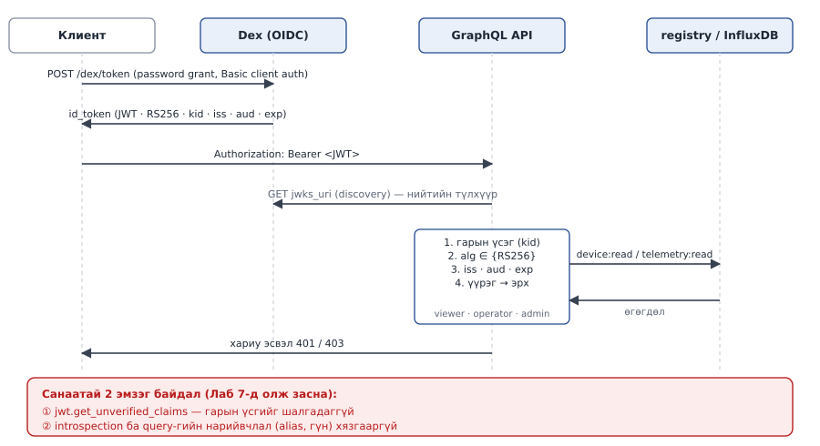

# Лаб 7 — Хэрэглээний давхарга ба Zero Trust

| | |
|---|---|
| **7 хоног** | XIV |
| **Хугацаа** | 4 цаг |
| **Суралцахуйн үр дүн** | ҮД3 (үнэлэх), ҮД4 (аюулгүй зохиох), ҮД6 |
| **Үнэлгээ** | Бичгийн тайлан, 10 оноо |
| **Гол хэмжилт** | REST vs GraphQL, аюулгүй байдлын 9 шалгалт (засварын өмнө/дараа) |

---

## 1. Зорилго

Платформын дээр **хэрэглэгчийн давхаргыг** барьж, дараа нь түүнийг **эвдэхийг оролдоно**.

1. **Барих** — REST ба GraphQL-ийн ялгааг зохион бүтээх замаар ойлгох, Dex-ээр OIDC нэвтрэлт, RBAC үүрэг, бодит хугацааны шинэчлэл
2. **Эвдэх** — `security_tests.py`-г ажиллуулж эмзэг байдлыг олох, гараар батлах, **засах**, дахин ажиллуулж засварыг нотлох

> **Чухал:** `lab07/graphql-api/main.py` дотор **ЯГ ХОЁР санаатай эмзэг байдал** бий: **(А)** `decode_token` токены гарын үсэг ба хугацааг шалгадаггүй (`jwt.get_unverified_claims`); **(Б)** introspection нээлттэй, асуулгын нийлмэл байдлын хязгаар байхгүй. Тэдгээрийг олж засах нь энэ лабораторийн гол ажил. `security_tests.py` (А)-г **2 ноцтой** (critical/high) УНАСАН мөрөөр, (Б)-г 2 АНХААР мөрөөр харуулна. Лабораторийн эцэст "Санаатай эмзэг байдал илрээгүй" гэж хэвлэж, (Б)-ийн хоёр мөр ТЭНЦСЭН болсон байх ёстой.

**💻 Энэ лаборатори бүхэлдээ үүлний давхаргад.** GraphQL API (:8000), Dex (:5556), бүртгэл (:8090), InfluxDB (:8181) — бүгд зөөврийн компьютер дээр. 🥧 Pi 3B нь зөвхөн ирмэгийн үүргээ гүйцэтгэнэ (mosquitto + агент). Pi дээр энэ лабораторид ажиллуулах комманд **байхгүй** — гэхдээ агент нь ажиллаж байх ёстой, эс бөгөөс InfluxDB-д унших өгөгдөл байхгүй.

---

## 2. Урьдчилсан нөхцөл ба бэлтгэл (15 мин)

- Лаб 1–6 дууссан, `lab06-done` tag тавигдсан. Лаб 2-ын authenticator унтраалттай (`authn false`).
- Бие даалт XIV: OAuth2 / OIDC-ийн authorization code урсгалыг уншсан.

> 💡 **Алхмуудыг дарааллаар нь хий.** Алхам бүрийн төгсгөлд ✅ **Шалгах** хэсэг бий. Үр дүн нь таарахгүй бол **цааш бүү яв** — ❌ мөр эсвэл §8-аас шалтгааныг ол.

### 2.1 Терминалууд

Энэ лабын ихэнх ажил **зөөврийн компьютер** дээр. Pi зөвхөн өгөгдөл урсгана.

| Цонх | Хаана | Үүрэг |
|---|---|---|
| **[🥧 Pi-1]** | Raspberry Pi (`ssh pi`) | ирмэгийн агент — лабын турш ажиллана |
| **[💻 Ubuntu-1]** | Зөөврийн компьютер (WSL) | `curl`, `security_tests.py`, засвар |
| **[💻 Ubuntu-2]** | Зөөврийн компьютер (WSL) | симулятор, лог |

### 2.2 Орчноо бэлтгэх — **цонх нээх бүрт** ажиллуулна

**[💻 Ubuntu-1]** ба **[💻 Ubuntu-2]**
```bash
cd ~/cnc302 && source .venv/bin/activate
tok() { curl -s -u cnc302:cnc302-lab-secret http://localhost:5556/dex/token \
  --data-urlencode grant_type=password --data-urlencode scope='openid email profile groups' \
  --data-urlencode username="$1@cnc302.mn" --data-urlencode password=cnc302 \
  | jq -r .id_token; }
```

`tok viewer` / `tok operator` / `tok admin` нь Dex-ээс тухайн хэрэглэгчийн ID токеныг авна (Алхам 2.1-д дэлгэрэнгүй).

### 2.3 Нэг удаагийн бэлтгэл

**[💻 Ubuntu-1]**
```bash
git pull
pip install -r tools/requirements.txt websocket-client
mkdir -p lab07/out
```

### 2.4 `app` профайлыг асаах

`graphql-api` анх удаа баригдана (2–4 мин):

**[💻 Ubuntu-1]**
```bash
cd ~/cnc302/stack
docker compose --profile core --profile pipeline --profile app up -d --build
sleep 20
make health
curl -s localhost:8000/health | jq
curl -s localhost:5556/dex/.well-known/openid-configuration | jq .issuer
cd ~/cnc302
```

✅
- `make health` дөрвөн мөр `200`,
- `/health` → `{"status":"ok","checks":{…: 200}}`,
- issuer → `"http://dex:5556/dex"`.

❌ `curl: (7) Failed to connect … 8000` → `docker compose logs graphql-api | tail -30` (§8).

### 2.5 Өгөгдөл урсгах

**[🥧 Pi-1]**
```bash
cd ~/cnc302/edge && make up && make agent
```

**[💻 Ubuntu-2]** — нэмэлт төхөөрөмжүүд (`dev0001` … `dev0005`):
```bash
python tools/sim_device.py --target cloud --host localhost --devices 5 --interval 2
```

Энэ хоёр цонх **лабын турш** ажиллана.

### 2.6 Бүртгэлд төхөөрөмж байгаа эсэх

**[💻 Ubuntu-1]**
```bash
curl -s 'localhost:8090/devices?limit=5' | jq '.devices | length'
```

✅ `5`. ❌ `0` бол Лаб 2-ын bulk бүртгэлийг дахин ажиллуул:
```bash
python lab02/provision.py bulk --count 50 --prefix dev --out lab02/out/devices.csv
```

---

## 3. Онолын сануулга

### REST-ийн 1+N асуудал, GraphQL-ийн шинэ эрсдэл

50 төхөөрөмж бүрийн сүүлийн 20 хэмжилтийг авахад REST-д **51 хүсэлт** хэрэгтэй (1 жагсаалт + 50 хэмжилт). GraphQL-д **1 хүсэлт**. IoT-д энэ нь жижиг зүйл биш: гар утасны апп сул сүлжээгээр 51 удаа тойрч гүйхэд хэдэн секунд алдана.

Гэхдээ клиент асуулгын **хэлбэрийг өөрөө** тодорхойлдог тул нэг хүсэлтээр серверийг ачаалж болно (гүн үүрлэсэн эсвэл олон давхар нэрлэсэн `alias` асуулга). REST-д ийм зүйл байхгүй — төгсгөлийн цэг бүр тогтмол өртөгтэй. Мөн `__schema` introspection нь довтолгооны газрын зургийг халдагчид үнэгүй өгнө.

### Танилт (authentication) ≠ Эрх (authorization)

Танилт: *чи хэн бэ?* → OIDC токен (Dex) → `decode_token()`.
Эрх: *чи юу хийж болох вэ?* → RBAC үүрэг → `Principal.require()`.

Хамгийн түгээмэл эмзэг байдал бол эхнийхийг хийгээд хоёр дахийг мартах, эсвэл **токеныг шалгалгүй итгэх**. Манай `main.py` яг сүүлийнхийг хийж байна.

### Хоёр эх сурвалж, нэг схем; Zero Trust

```
GraphQL :8000 ──┬──► registry :8090   төхөөрөмж, firmware, OTA (Лаб 2)
                └──► influxdb :8181   цаг цуваа (SQL, /api/v3/query_sql)
```

**ThingsBoard энд байхгүй.** Лаб 2-т бид бүртгэлээ өөрсдөө бичсэн тул түүн дээр GraphQL давхарга барихад юу ч нуугдахгүй.



**ID токен юугаар хамгаалагдсан бэ.** JWT нь JWS-ээр гарын үсэглэгдсэн JSON ([RFC 7519](https://www.rfc-editor.org/rfc/rfc7519), [RFC 7515](https://www.rfc-editor.org/rfc/rfc7515)). OpenID Connect Core §3.1.3.7-гоор хүлээн авагч: `iss` нь issuer-тэй **яг** таарах, `aud`-д өөрийн `client_id` байх, гарын үсгийг **issuer-ийн түлхүүрээр** (`jwks_uri`-ээс) шалгах, одоогийн цаг `exp`-ээс өмнө байх ёстой. Толгойн `kid` нь аль түлхүүрээр гарын үсэглэснийг заах *hint* л ([RFC 7515 §4.1.4](https://www.rfc-editor.org/rfc/rfc7515#section-4.1.4)); `alg`-ийг токеноос биш, **урьдчилан зөвшөөрсөн жагсаалтаас** авна ([RFC 8725 §3.1](https://www.rfc-editor.org/rfc/rfc8725#section-3.1)).

**Zero Trust:** "дотоод сүлжээ тул аюулгүй" гэсэн таамаг **байхгүй**. Хүсэлт бүрийг шалгана — эх сурвалж хаанаас ирсэн нь хамаагүй. InfluxDB-г `--without-auth` горимд ажиллуулж байгаа нь тэр зарчмыг илт зөрчсөн жишээ (Алхам 8).

---

## 4. Алхмууд

| Алхам | Юу хийх | Мин | Хүснэгт |
|---|---|---|---|
| 1 | Бэлтгэл ба схем судлах | 15 | — |
| 2 | OIDC токен ба үүргийн эх сурвалж | 35 | 7.1, 7.2 |
| 3 | REST ба GraphQL | 45 | 7.3 |
| 4 | `deviceStats` ба нэгтгэлийн байрлал | 30 | 7.4 |
| 5 | Polling ба WebSocket | 25 | 7.5 |
| 6 | Аюулгүй байдлын шалгалт | 30 | 7.6 |
| 7 | Засах ба дахин шалгах | 45 | 7.7 |
| 8 | InfluxDB ба Zero Trust | 10 | 7.8 |
| 9 | Git | 5 | — |

Бүх алхам **[💻 Ubuntu-1]**-д, өөрөөр заагаагүй бол. API-гийн код: `lab07/graphql-api/main.py` — VS Code-оор нээ: `code lab07/graphql-api/main.py`. **Код засах бүрт** дахин барина:

```bash
cd ~/cnc302/stack && docker compose --profile app up -d --build graphql-api && cd ~/cnc302
sleep 10; curl -s localhost:8000/health | jq .status
```

✅ `"ok"`. ❌ Өөр эсвэл холбогдохгүй бол `docker compose -f stack/docker-compose.yml logs graphql-api | tail -30` — Python-ий алдааны мөрийг (traceback) уншиж засна.

---

### Алхам 1 — Бэлтгэл ба схемийг судлах (15 мин) 💻

Windows-ийн хөтчөөр http://localhost:8000/graphql нээж GraphiQL-ийг үзнэ.

**1.1** Зүүн талын засварлагчид бичээд ▶ (Execute) дар:
```graphql
{ whoami }
```
✅ Хариу ирнэ (үүрэггүй).

**1.2** Одоо:
```graphql
{ devices(limit: 5) { id name } }
```
✅ **Алдаа**: `'device:read' эрх байхгүй. Таны үүрэг: []`. Энэ бол зөв зан төлөв — Zero Trust-ын анхдагч: **токенгүй хүсэлт нэг ч үүрэггүй**. Тиймээс эхлээд токен авах хэрэгтэй → Алхам 2.

**1.3** Зүүн дээд буланд **Docs** (номын дүрс) дарж схемийг судал: `devices`, `device`, `firmware`, `anomalies`, `deviceStats` (хараахан байхгүй), `sendCommand`.

---

### Алхам 2 — OIDC токен ба үүргийн эх сурвалж (35 мин) 💻

**2.1 Токен авах.** Dex-д гурван статик хэрэглэгч бий: `viewer@`, `operator@`, `admin@cnc302.mn`, бүгд нууц үг `cnc302`. Токены endpoint нь `<issuer>/token`, клиент нь `cnc302` / `cnc302-lab-secret` (`stack/dex/config.yaml`). Dex-ийн баримтын жишээний адил клиентийн нууцыг HTTP Basic-ээр (`-u`) илгээнэ — §2.2-ын `tok` функц яг үүнийг хийдэг.

**[💻 Ubuntu-1]**
```bash
curl -s localhost:5556/dex/.well-known/openid-configuration | jq '{issuer, token_endpoint, jwks_uri}'
TOKEN=$(tok admin) && echo "${TOKEN:0:40}…"
```

✅ `eyJhbGciOiJSUzI1NiIs…` хэлбэрийн 40 тэмдэгт.

❌ `null…` → `tok` функцийн `| jq -r .id_token`-ийг хасаж алдааг хар: `invalid_grant`/`Invalid username or password` бол `config.yaml`-ийн bcrypt hash нууц үгтэй таарахгүй; `unsupported_grant_type` бол `oauth2.grantTypes`-д `password` нэм.

> Албан ёсны баримт: [Dex — Local connector, Obtaining a token](https://dexidp.io/docs/connectors/local/) · [Dex — OAuth2 grants](https://dexidp.io/docs/configuration/oauth2/). Password grant ажиллахын тулд `enablePasswordDB: true` ба `oauth2.passwordConnector: local` хоёулаа хэрэгтэй. Dex-ийн баримтад энэ grant-ыг *"not recommended"* гэж тэмдэглэсэн (OAuth 2.0 Security BCP) — лабораторид л ашиглана; яагаад гэдгийг тайланд бич.

**2.2 Токеныг задлан үзэх.** JWT нь `толгой.ачаалал.гарын үсэг` гурван хэсэгтэй, эхний хоёр нь base64url:

```bash
echo "$TOKEN" | cut -d. -f1 | base64 -d 2>/dev/null; echo
echo "$TOKEN" | cut -d. -f2 | base64 -d 2>/dev/null; echo
```

✅ Толгойд `"alg":"RS256","kid":"…"`; ачаалалд `iss`, `aud`, `exp`, `email`. `alg` ба `kid`-ийг тэмдэглэ. (base64url тул padding дутуу бол сүүлийн хаалт тасарч болно — `jq`-гүйгээр уншина.)

**2.3 Гурван хэрэглэгчээр давтах.**

```bash
for U in viewer operator admin; do
  printf '%-9s ' "$U"
  curl -s -X POST localhost:8000/graphql -H "Authorization: Bearer $(tok $U)" \
    -H 'Content-Type: application/json' -d '{"query":"{ whoami }"}' | jq -r .data.whoami
done
```

#### Хүснэгт 7.1 — Токеноос үүрэг хүртэл

| Хэрэглэгч | `id_token`-ы `groups` талбар байна уу | `whoami`-гийн `roles=` | `perms=` тоо |
|---|---|---|---|
| viewer@cnc302.mn | | | |
| operator@cnc302.mn | | | |
| admin@cnc302.mn | | | |

**Ажиглалт:** Dex-ийн статик хэрэглэгчид (`staticPasswords`: `email`, `hash`, `username`, `userID` — [Dex local connector](https://dexidp.io/docs/connectors/local/)) бүлгийн мэдээлэлгүй тул `groups` scope хүссэн ч токенд `groups` **ирэхгүй**. `decode_token` нь `groups` олдохгүй бол `["viewer"]`-д унана — тиймээс **гурвуулаа viewer** болно.

**2.4 Үүргийн эх сурвалжийг сонгож хэрэгжүүлэх.** Хоёр шийдлийг харьцуулж, нэгийг нь хэрэгжүүл.

#### Хүснэгт 7.2 — Үүргийн эх сурвалжийн сонголт

| | (а) Dex-д LDAP/GitHub холбогч | (б) API дээр имэйлээс үүрэг зурвасжуулах |
|---|---|---|
| Хэрэгжүүлэх хугацаа (мин) | | |
| Үүргийг хаана удирдах вэ | | |
| Токен хуурамч бол ажиллах уу | | |
| Үйлдвэрлэлд тохирох уу | | |
| **Бидний сонголт ба шалтгаан** | | |

Лабораторийн цагт (б)-г хэрэгжүүлэх нь бодитой: `main.py`-ийн `decode_token`-д `roles = …` мөрийн **дараа** нэмнэ:

```python
    email = claims.get("email", "")
    if email.startswith("admin@"):
        roles = ["admin"]
    elif email.startswith("operator@"):
        roles = ["operator"]
```

Дахин барьж (дээрх команд), 2.3-ыг давт.

✅ `viewer → roles=viewer`, `operator → roles=operator`, `admin → roles=admin`. Тайландаа **(а) яагаад илүү зөв болохыг** заавал бич.

---

### Алхам 3 — REST ба GraphQL-ийн харьцуулалт (45 мин) 💻

```bash
TOKEN=$(tok admin)
```

**3.1 GraphQL — нэг хүсэлт:**

```bash
time curl -s -X POST localhost:8000/graphql -H "Authorization: Bearer $TOKEN" \
  -H 'Content-Type: application/json' -o /tmp/gql5.json \
  -d '{"query":"{ devices(limit:5){ name state readings(limit:10){ time temperature vibrationRms } } }"}'
wc -c /tmp/gql5.json
jq '.data.devices[0]' /tmp/gql5.json
```

✅ `real 0m0.XXXs`, файлын хэмжээ, эхний төхөөрөмжийн `readings` массив. ❌ `readings: []` — тухайн төхөөрөмж өгөгдөл илгээгээгүй (§2.5-ын симулятор ажиллаж байна уу?).

**3.2 REST — 1 + N хүсэлт.** Эхлээд жагсаалт (`/rest/devices` нь ЗӨВХӨН жагсаалт буцаана), дараа нь төхөөрөмж тус бүрийн хэмжилт. Блокийг **бүтнээр нь** буулга:

```bash
curl -s -H "Authorization: Bearer $TOKEN" \
  'localhost:8000/rest/devices?limit=5' | jq -r '.devices[].name' > /tmp/devs.txt
time (while read d; do
  curl -s -X POST localhost:8181/api/v3/query_sql -H 'Content-Type: application/json' \
    -d "{\"db\":\"cnc302\",\"q\":\"SELECT time, temperature, vibration_rms FROM telemetry WHERE device='$d' ORDER BY time DESC LIMIT 10\",\"format\":\"json\"}"
done < /tmp/devs.txt) > /tmp/rest5.json
wc -l /tmp/devs.txt && wc -c /tmp/rest5.json
```

✅ `/tmp/devs.txt` 5 мөр; REST хүсэлтийн тоо = 1 + 5.

**3.3 50 төхөөрөмж дээр давт** — 3.1-д `limit:5` → `limit:50`, 3.2-т `limit=5` → `limit=50`, файлын нэрийг `gql50`, `rest50` болго. Ялгаа шугаман өсөв үү?

#### Хүснэгт 7.3 — REST ба GraphQL

| Хэмжилт | REST | GraphQL |
|---|---|---|
| 5 төхөөрөмж: хүсэлтийн тоо | | 1 |
| 5 төхөөрөмж: нийт хугацаа (мс) | | |
| 50 төхөөрөмж: хүсэлтийн тоо | | 1 |
| 50 төхөөрөмж: нийт хугацаа (мс) | | |
| 50 төхөөрөмж: хариуны байт | | |
| Илүүдэл өгөгдөл (over-fetching) байна уу | | |

> **Санамж:** REST-ийн хугацаа нь `localhost` дээр хамгийн таатай нөхцөлд хэмжигдэж байна. Сүлжээний саатал (RTT) 200 мс байсан бол 51 хүсэлт **дор хаяж 10 секунд** болно. Хяналтын асуулт 1-д үүнийг тоогоор гарга.

---

### Алхам 4 — `deviceStats` ба нэгтгэлийн байрлал (30 мин) 💻

**4.1** `main.py` дотор `# TODO(оюутан): deviceStats(...)` гэсэн тэмдэглэгээг ол (VS Code: `Ctrl + F` → `deviceStats`). Дараах талбарыг нэмнэ:

```graphql
{ deviceStats(device: "dev0003", hours: 24) { avg min max samples } }
```

**Дүрэм:** нэгтгэлийг **InfluxDB-д хийлгэнэ** (SQL-ийн `avg/min/max/count`), Python дээр биш:

```sql
SELECT avg(temperature) AS avg, min(temperature) AS min, max(temperature) AS max,
       count(temperature) AS samples
FROM telemetry WHERE device = '<...>' AND time > now() - INTERVAL '24 hours'
```

(`'<...>'`-ийн оронд Алхам 7.3-ын **параметржүүлсэн** хэлбэрийг одооноос хэрэглэвэл илүү.)

**4.2** Дахин барьж (§4-ийн эхэнд), GraphiQL-д эсвэл `curl`-ээр шалга:

```bash
curl -s -X POST localhost:8000/graphql -H "Authorization: Bearer $TOKEN" -H 'Content-Type: application/json' \
  -d '{"query":"{ deviceStats(device:\"dev0003\", hours:24){ avg min max samples } }"}' | jq
```

✅ `samples` > 0 ба `min ≤ avg ≤ max`.

**4.3 Хоёр хувилбарыг хэмж:** (а) SQL-д нэгтгэх, (б) бүх мөрийг татаад Python дээр нэгтгэх (тусдаа `deviceStatsPy` талбар болгож туршиж болно). `time curl …`-аар хугацааг, `wc -c`-ээр хэмжээг ав.

#### Хүснэгт 7.4 — Нэгтгэлийг хаана хийх вэ

| | InfluxDB дээр (SQL) | Python дээр (API) |
|---|---|---|
| Хариу ирэх хугацаа (мс), 24 цаг | | |
| InfluxDB-ээс татсан мөрийн тоо | | |
| Хариуны байт | | |
| 30 хоногийн өгөгдөл дээр (мс) | | |

**Дүгнэлт:** нэгтгэлийг өгөгдөлд ойр хийх зарчим яагаад чухал вэ: ______________

---

### Алхам 5 — Бодит хугацааны шинэчлэл: polling ба WebSocket (25 мин) 💻

**5.1 Одоогийн байдал — polling.** 1 секунд тутам асуух (60 сек). Блокийг **бүтнээр нь** буулга:

```bash
timeout 60 bash -c 'while true; do
  curl -s -o /dev/null -w "%{size_download} " -X POST localhost:8000/graphql \
    -H "Authorization: Bearer '"$TOKEN"'" -H "Content-Type: application/json" \
    -d "{\"query\":\"{ devices(limit:5){ name } }\"}"; sleep 1
done' | tr ' ' '\n' | awk '{s+=$1; n++} END {print n " хүсэлт, " s " байт"}'
```

✅ 60 секундын дараа `≈60 хүсэлт, NNNN байт`.

**5.2 ОЮУТНЫ ДААЛГАВАР — WebSocket.** `main.py` дотор одоо WebSocket **байхгүй**. Хоёр замын аль нэгийг сонгож нэмнэ:

- (а) Strawberry-гийн `@strawberry.subscription` (async generator буцаадаг resolver) + `strawberry.Schema(..., subscription=Subscription)`. `GraphQLRouter` анхдагчаар `graphql-transport-ws` ба хуучин `graphql-ws` хоёр протоколыг хоёуланг нь идэвхжүүлсэн байдаг ([Strawberry — Subscriptions](https://strawberry.rocks/docs/general/subscriptions), [FastAPI integration](https://strawberry.rocks/docs/integrations/fastapi)).
- (б) FastAPI-гийн `@app.websocket("/ws/telemetry")` — `await websocket.accept()`, дараа нь `await websocket.send_text(...)`; клиент салахад `WebSocketDisconnect` шидэгдэнэ ([FastAPI — WebSockets](https://fastapi.tiangolo.com/advanced/websockets/)). EMQX-д paho-mqtt-ээр захиалж (контейнер дотроос хаяг нь `emqx:1883`), ирсэн мессежийг клиент рүү түлхэнэ. paho-гийн callback тусдаа thread-д ажилладаг тул мессежийг `asyncio.Queue`-д `loop.call_soon_threadsafe(queue.put_nowait, msg)`-ээр дамжуул. **(б)-д `paho-mqtt>=2.1,<3`-ийг `lab07/graphql-api/requirements.txt`-д нэмэхээ бүү март.**

> WebSocket endpoint-д ч `Depends`, `Header`, `Query` ажилладаг (FastAPI баримт) — **токен шалгахаа бүү март**: Zero Trust нь WebSocket-д ч хамаатай.

(б) нь энэ архитектурт илүү шууд: 🥧 Pi-гийн агент → гүүр → EMQX → API → хөтөч.

**5.3 Хэмжих.** Дахин барьсны дараа (WebSocket-ийн токеныг query параметрээр, `?token=…` гэж хүлээж авсан гэж үзвэл):

```bash
python - <<EOF
import time, websocket
ws = websocket.create_connection("ws://localhost:8000/ws/telemetry?token=$TOKEN")
t0, n, b = time.time(), 0, 0
while time.time() - t0 < 60:
    m = ws.recv(); n += 1; b += len(m)
ws.close()
print(f"{n} мессеж, {b} байт, 60 сек")
EOF
```

✅ 60 секундын дараа `N мессеж, … байт`. ❌ `Handshake status 404` → endpoint бүртгэгдээгүй / дахин бариагүй; `403` → токен шалгалт татгалзсан.

#### Хүснэгт 7.5 — Polling ба WebSocket (60 секунд, 5 төхөөрөмж)

| | 1 сек polling | WebSocket |
|---|---|---|
| Хүсэлт / холболтын тоо | | 1 |
| Нийт байт | | |
| Шинэчлэлийн дундаж саатал (мс) | | |

---

### Алхам 6 — АЮУЛГҮЙ БАЙДЛЫН ШАЛГАЛТ (30 мин) 💻

`security_tests.py` нь **9 шалгалт** ажиллуулна. Анхаар: `--tb` тугийг `--registry` **орлосон** — ThingsBoard энэ архитектурт байхгүй.

**6.1 Автомат шалгалт.**

```bash
python lab07/security_tests.py --api http://localhost:8000 \
    --influx http://localhost:8181 --registry http://localhost:8090 \
    --json lab07/out/security-before.json | tee lab07/out/security-before.txt
```

Гаралт **хоёр бүлэгт** тусгаарлагдана:

- **САНААТАЙ ЭМЗЭГ БАЙДАЛ** — `main.py`-ийн `decode_token`-д зориудаар үлдээсэн. **ЯГ 2** байх ёстой; өөр тоо гарвал шалгалт эсвэл API буруу ажиллаж байна.
- **Дэд бүтцийн ноцтой олдвор** — код биш, тохиргоо. Танилтгүй InfluxDB бол **бодит** асуудал, гэхдээ «тэр хоёрын» нэг **биш**. Энэ ялгааг тайланд заавал хадгал.

✅ `САНААТАЙ ЭМЗЭГ БАЙДАЛ: 2`.

**6.2 Гараар батлах — гарын үсгийн шалгалт.** Блокийг **бүтнээр нь** буулга:

```bash
python - <<'EOF'
import base64, json, time, httpx
b = lambda d: base64.urlsafe_b64encode(json.dumps(d).encode()).rstrip(b'=').decode()
sig = base64.urlsafe_b64encode(b'not-a-real-signature').rstrip(b'=').decode()
evil = f"{b({'alg':'RS256','typ':'JWT'})}.{b({'sub':'attacker','groups':['admin'],'exp':time.time()+3600})}.{sig}"
r = httpx.post("http://localhost:8000/graphql", json={"query": "{ whoami }"},
               headers={"Authorization": f"Bearer {evil}"})
print(r.json())
EOF
```

✅ (засварын **өмнө**) `roles=admin` — **та ямар ч нууц үггүйгээр админ боллоо**.

**6.3 Хугацаа дууссан токен.** 6.2-ын кодонд `'exp': time.time()+3600`-ийг `'exp': time.time()-7200` болгож давт — мөн адил `admin` гарах ёстой.

**6.4 Нийлмэл байдлын халдлага.** `security_tests.py` нь эрх шаарддаггүй `a0: whoami … a199: whoami`-г илгээдэг — ингэснээр шалгалт токен ба registry-ээс хамаарахгүй, зөвхөн GraphQL-ийн **валидацийн** хязгаарыг шалгана. Бодит DoS-ийг гараар давт: хүчинтэй `viewer` токентой 20 alias бүхий хүнд асуулга:

```bash
Q=$(python -c "print('{' + ' '.join(f'a{i}: devices(limit:50){{ name readings(limit:500){{ time }} }}' for i in range(20)) + '}')")
time curl -s -o /dev/null -w '%{http_code} %{size_download}\n' -X POST localhost:8000/graphql \
  -H "Authorization: Bearer $(tok viewer)" -H 'Content-Type: application/json' \
  -d "$(jq -n --arg q "$Q" '{query:$q}')"
```

Хариу ирэх хугацааг тэмдэглэ.

#### Хүснэгт 7.6 — Аюулгүй байдлын 9 шалгалтын бүртгэл ⭐

| # | Шалгалт | Зэрэглэл | Санаатай уу | Өмнө | Хэрхэн гараар батлав | Засвар | Дараа |
|---|---|---|---|---|---|---|---|
| 1 | Анонимоор төхөөрөмж жагсаах татгалзсан | high | ✗ | | | | |
| 2 | Хуурамч гарын үсэгтэй токен татгалзсан | **critical** | **✓** | | | | |
| 3 | viewer тушаал илгээхийг татгалзсан | high | ✗ | | | | |
| 4 | Хугацаа дууссан токен татгалзсан | **high** | **✓** | | | | |
| 5 | Introspection хаагдсан | low | ✓ | | | | |
| 6 | Асуулгын нийлмэл байдлын хязгаар | medium | ✓ | | | | |
| 7 | Тарилгын оролдлого аюулгүй боловсруулагдсан | high | ✗ | | | | |
| 8 | InfluxDB танилтгүй уншигдана | high | ✗ (дэд бүтэц) | | | | |
| 9 | Бүртгэл танилтгүй уншигдана | medium | ✗ (дэд бүтэц) | | | | |

---

### Алхам 7 — ЗАСАХ ба дахин шалгах (45 мин) 💻

Гурван засварыг `main.py`-д хийгээд, **нэг удаа** дахин барина (7.4).

**7.1 Гарын үсэг ба хугацааны шалгалт** (санаатай эмзэг байдал А). `decode_token`-ийн `jwt.get_unverified_claims(token)` мөрийг (`# ← ЭМЗЭГ` тэмдэгтэй) солино. python-jose-ийн `jwt.decode(token, key, algorithms=None, options=None, audience=None, issuer=None, subject=None, access_token=None)` нь `key`-д JWK Set (`{"keys": [...]}`) хүлээн авна ([python-jose](https://pypi.org/project/python-jose/), `help(jose.jwt.decode)`):

```python
import time
from jose import JWTError, jwt

_JWKS, _JWKS_AT = None, 0.0

def _jwks(force: bool = False) -> dict:
    """jwks_uri-г discovery-гээс авна (OIDC Discovery), 5 минут кэшлэнэ."""
    global _JWKS, _JWKS_AT
    if force or _JWKS is None or time.time() - _JWKS_AT > 300:
        conf = httpx.get(f"{OIDC_ISSUER}/.well-known/openid-configuration", timeout=10).json()
        _JWKS = httpx.get(conf["jwks_uri"], timeout=10).json()
        _JWKS_AT = time.time()
    return _JWKS

_VERIFY = dict(
    algorithms=["RS256"],              # ← ЗААВАЛ: токены alg-д итгэхгүй
    audience="cnc302",                 # Dex-ийн client_id
    issuer=OIDC_ISSUER,                # http://dex:5556/dex — яг таарах ёстой
    options={"require_exp": True, "require_iss": True, "require_aud": True,
             "verify_at_hash": False}, # доорх тайлбарыг үз
)

def decode_token(token: str) -> Principal:
    try:
        claims = jwt.decode(token, _jwks(), **_VERIFY)
    except JWTError:
        # Dex түлхүүрээ ээлжлэн солидог — шинэ kid байж магадгүй тул JWKS-ийг
        # НЭГ удаа шинэчилж дахин оролдоно. Хоёр дахь алдаа → 401.
        claims = jwt.decode(token, _jwks(force=True), **_VERIFY)
    roles = claims.get("groups") or claims.get("roles") or ["viewer"]
    ...
```

- **`algorithms=["RS256"]`-ийг заавал заа.** Заахгүй бол халдагч `alg: none` (гарын үсэггүй) эсвэл `alg: HS256` (нийтийн түлхүүрийг HMAC-ийн нууц болгон ашиглах) халдлага хийж болно. RFC 8725 §3.1: номын сан *"MUST enable the caller to specify a supported set of algorithms and MUST NOT use any other algorithms"*.
- **`require_exp: True`** — python-jose-ийн анхдагч `require_exp: False`: `exp`-гүй токен ч хүлээн авагдана. `verify_exp` нь анхдагчаар асаалттай, гэхдээ `exp` **байгаа** үед л шалгана.
- **`verify_at_hash: False`** — Dex-ийн ID токенд `at_hash` (access token-ы hash) байж болно ([Dex — Tokens](https://dexidp.io/docs/configuration/tokens/)-ийн жишээнд бий). python-jose `at_hash` байхад `access_token=` дамжуулахыг шаарддаг, эс бөгөөс *"No access_token provided to compare against at_hash claim"* алдаа өгнө (бид python-jose 3.5.0 дээр туршсан). Манай API зөвхөн ID токеныг Bearer болгон авдаг тул харьцуулах access token байхгүй — энэ шалгалтыг ухамсартайгаар унтраана. Үлдсэн шалгалт (гарын үсэг, `iss`, `aud`, `exp`) хэвээр.
- **`kid`** — python-jose JWKS-ийн түлхүүрүүдийг нэг нэгээр туршина; `kid` зөвхөн түлхүүр солигдсоныг илрүүлэхэд (дээрх дахин татах логик) хэрэгтэй.
- Алхам 2.4-ийн имэйлээс үүрэг гаргах мөрүүдийг **хадгал**.
- `decode_token`-ийг дуудаж буй газар `JWTError`-ийг барьж **401** буцааж байгаа эсэхийг шалга (эс бөгөөс 500 гарна).

**7.2 Introspection ба нийлмэл байдал** (санаатай эмзэг байдал Б). Strawberry-д бэлэн өргөтгөлүүд ([Strawberry extensions](https://strawberry.rocks/docs/extensions/max-aliases-limiter)). `schema = strawberry.Schema(query=Query, mutation=Mutation)` мөрийг доорхоор соль:

```python
import os
from strawberry.extensions import (DisableIntrospection, MaxAliasesLimiter,
                                   MaxTokensLimiter, QueryDepthLimiter)

exts = [QueryDepthLimiter(max_depth=6),        # ГҮН
        MaxAliasesLimiter(max_alias_count=15),  # ӨРГӨН — шалгалт №6-ийн 200 alias
        MaxTokensLimiter(max_token_count=1000)] # баримтын нийт хэмжээ
if os.environ.get("ENV", "production") == "production":
    exts.append(DisableIntrospection())
schema = strawberry.Schema(query=Query, mutation=Mutation, extensions=exts)
```

> `QueryDepthLimiter` нь **гүнийг** л хязгаарлана — 200 alias нэг түвшинд байгаа тул түүнийг зогсоохгүй. Шалгалт №6-г `MaxAliasesLimiter` (эсвэл `MaxTokensLimiter`) хаана. Тайландаа энэ ялгааг бич. `DisableIntrospection` идэвхтэй бол GraphiQL-ийн Docs самбар ажиллахгүй — хөгжүүлэлтэд `stack/docker-compose.yml`-ийн `graphql-api` орчинд `ENV: dev` нэм.

**7.3 SQL мөр залгалт.** `Device.readings` дотор `self.name` шууд SQL-д залгагдаж байна. `self.name` нь бүртгэлээс ирдэг, харин бүртгэлийн `claim` нь дурын `device_id` хүлээн авдаг (Лаб 2) — тиймээс `x' OR '1'='1` гэсэн нэртэй төхөөрөмж бүртгүүлж болно. Зөв засвар нь **параметржүүлсэн асуулга**: InfluxDB 3 `/api/v3/query_sql` нь `params` объект хүлээн авч, `WHERE device = $device` хэлбэрээр **зөвхөн WHERE-д** ашиглана ([InfluxDB 3 — Parameterized queries](https://docs.influxdata.com/influxdb3/core/query-data/sql/parameterized-queries/)):

```python
json={"db": INFLUX_DB, "q": "SELECT … FROM telemetry WHERE device = $device ORDER BY time DESC LIMIT 20",
      "params": {"device": self.name}, "format": "json"}
```

`LIMIT` нь WHERE биш тул параметрээр өгөх боломжгүй — `int()`-ээр хөрвүүлж, `min(limit, 500)` хэвээр үлдээ. (`Query.device` нь Python дээр шүүдэг тул тарилгын гадаргуугүй — яагаад болохыг тайланд бич.) Шалгалт №7 нь энэ засварыг автоматаар илрүүлдэггүй (үргэлж АНХААР) — засварыг кодоор нотол. Алхам 4-ийн `deviceStats`-д ч ижил засвар.

**7.4 Дахин барьж, дахин шалгах.**

```bash
cd ~/cnc302/stack && docker compose --profile app up -d --build graphql-api && cd ~/cnc302
sleep 10
python lab07/security_tests.py --api http://localhost:8000 \
    --influx http://localhost:8181 --registry http://localhost:8090 \
    --json lab07/out/security-after.json | tee lab07/out/security-after.txt
```

✅ `✓ Санаатай эмзэг байдал илрээгүй — засвар ажиллаж байна.`, Introspection ба нийлмэл байдлын мөрүүд ТЭНЦСЭН. 6.2-ын хуурамч токен одоо **401**.

❌ Бүх бодит токен татгалзвал `aud`/`iss` таарахгүй байна: токеныг хостоос `localhost:5556`-аар авсан ч `iss` нь config-ийн `issuer: http://dex:5556/dex` байдаг тул `OIDC_ISSUER` яг тэр утгатай байх ёстой; `aud` нь `client_id` (`cnc302`). API-гийн логийг `docker compose -f stack/docker-compose.yml logs graphql-api | tail -30`-аар хар.

**7.5 RBAC-ыг бодитоор турш.**

```bash
for U in viewer operator admin; do
  echo "── $U ──"
  curl -s -X POST localhost:8000/graphql -H "Authorization: Bearer $(tok $U)" \
    -H 'Content-Type: application/json' \
    -d '{"query":"mutation { sendCommand(device:\"dev0003\", command:\"reboot\") }"}' | jq -c
done
```

✅ viewer → эрхийн алдаа; operator, admin → амжилттай.

**7.6 Бүртгэлд шууд хандах** (Хүснэгт 7.7-ийн сүүлийн мөр):

```bash
curl -s -o /dev/null -w '%{http_code}\n' localhost:8090/devices
```

#### Хүснэгт 7.7 — RBAC матриц

| Үйлдэл | viewer | operator | admin | Бодитоор туршсан үр дүн |
|---|---|---|---|---|
| `devices` жагсаах | ✓ | ✓ | ✓ | |
| `readings` унших | ✓ | ✓ | ✓ | |
| `sendCommand` | ✗ | ✓ | ✓ | |
| Төхөөрөмж үүсгэх / устгах | ✗ | ✗ | ✓ | |
| Бүртгэлд шууд хандах (:8090) | ? | ? | ? | |

Сүүлийн мөр нь **defence in depth**-ийн асуулт: RBAC зөвхөн GraphQL давхаргад л байгаа бол хэн ч :8090 руу шууд хандаж чадна.

---

### Алхам 8 — InfluxDB `--without-auth` ба Zero Trust (10 мин) 💻

Энэ курс эхнээс нь InfluxDB-г танилтгүй ажиллуулж ирсэн. Яагаад, ямар үнээр:

```bash
curl -s -X POST localhost:8181/api/v3/query_sql -H 'Content-Type: application/json' \
  -d '{"db":"cnc302","q":"SELECT count(*) FROM telemetry","format":"json"}' | jq
```

✅ Токенгүйгээр тоо буцаана — **энэ бол асуудал**.

#### Хүснэгт 7.8 — Засварын өмнөх/дараах дүн

`security-before.json` ба `security-after.json`-оос: `jq '{passed, warned, failed, deliberate_criticals, infra_criticals}' lab07/out/security-*.json` (талбарын нэр өөр бол `jq 'keys'`-ээр шалга).

| | Өмнө (`security-before.json`) | Дараа (`security-after.json`) |
|---|---|---|
| ТЭНЦСЭН | | |
| АНХААР | | |
| УНАСАН | | |
| `deliberate_criticals` | **2** | **0** |
| `infra_criticals` | | |

**Тайландаа заавал хариул:** яагаад `--without-auth` нь лабораторид зөвшөөрөгдөх, гэхдээ үйлдвэрлэлд болохгүй вэ? Zero Trust бол юуг шаардах байсан бэ — гурав нэрлэ (жишээ: үйлчилгээ бүрт өөрийн таних тэмдэг, mTLS эсвэл токен, хамгийн бага эрхийн зарчим, хандалтын аудит лог).

---

### Алхам 9 — Git commit (5 мин)

**9.1 Нэмэх.** `lab07/out/` нь `.gitignore`-д — шалгалтын үр дүнг **зориуд** нэмнэ:

```bash
cp docs/report-template.md lab07/report.md   # тайлангаа бөглө: code lab07/report.md
git add lab07/report.md lab07/graphql-api/
git add -f lab07/out/security-*.json lab07/out/security-*.txt
git status --short
```

**9.2 Нууц ороогүйг ЗААВАЛ шалга** — хоёулаа **хоосон** байх ёстой:

```bash
git diff --cached --name-only | grep -E '\.env$|\.key$|devices\.csv'
grep -rln 'eyJ' lab07/out/ lab07/report.md
```

✅ Юу ч хэвлэхгүй. ❌ JWT (`eyJ…`) олдвол тэр файлаас токеныг устгаад дахин `git add`.

**9.3 Commit ба push.**
```bash
git commit -m "Лаб 7: GraphQL давхарга, OIDC, хоёр эмзэг байдал засагдсан"
git tag lab07-done
git push && git push --tags
```

---

## 5. Хяналтын асуултууд

Хариулт бүр **хүснэгтээс тоо иш татсан** байх ёстой.

1. Хүснэгт 7.3-д 50 төхөөрөмж дээр REST ба GraphQL-ийн хугацааны ялгаа хэдэн мс байв? Сүлжээний RTT 200 мс байсан бол REST хэдэн секунд болох вэ (51 × RTT)? GraphQL хэд вэ?

2. Хүснэгт 7.4-т нэгтгэлийг InfluxDB дээр хийхэд хэдэн дахин хурдан байв, татсан мөрийн тоо хэдэн дахин багассан бэ? 30 хоногийн өгөгдөл дээр энэ харьцаа хэрхэн өөрчлөгдсөн бэ?

3. Хүснэгт 7.5-д polling ба WebSocket-ийн байтын ялгаа хэд байв? 1000 хэрэглэгчтэй үед polling серверт хэдэн хүсэлт/секунд өгөх вэ?

4. Хүснэгт 7.6-д **санаатай** эмзэг байдал хэд байв, **дэд бүтцийн** олдвор хэд байв? Эдгээрийг яагаад ялгаж дүгнэх шаардлагатай вэ? (Санамж: аль нь код засаж, аль нь тохиргоо засаж шийдэгддэг вэ.)

5. `algorithms=["RS256"]`-ийг заахгүй бол ямар хоёр халдлага боломжтой болох вэ? `alg: none` ба `alg: HS256` халдлагыг тус тус тайлбарла.

6. Токеныг цуцлах (revoke) хэрхэн ажилладаг вэ? JWT нь **төлөвгүй** тул энэ яагаад хэцүү вэ? Лаб 2-ын сертификат цуцлалт (Хүснэгт 2.7) болон MQTT session цуцлалттай ямар төстэй вэ?

7. Хүснэгт 7.7-гийн сүүлийн мөр: `viewer` эрхтэй хэрэглэгч :8090 эсвэл :8181 руу шууд хандаж чадвал RBAC ямар утгатай вэ? Zero Trust-д үүнийг хэрхэн хаах вэ (Хүснэгт 7.8-ын гурван шаардлагыг иш тат)?

---

## 6. Хүлээлгэн өгөх зүйл

| # | Зүйл | Байрлал |
|---|---|---|
| 1 | Тайлан (Хүснэгт 7.1–7.8 бөглөсөн) | `lab07/report.md` → PDF |
| 2 | Шалгалтын өмнөх/дараах JSON | `lab07/out/security-before.json`, `security-after.json` |
| 3 | `decode_token` ба схемийн засвар (diff хэлбэрээр) | тайлангийн хавсралт |
| 4 | `deviceStats` ба WebSocket/subscription хэрэгжүүлэлт | `lab07/graphql-api/main.py` |
| 5 | Git tag | `lab07-done` |

---

## 7. Үнэлгээний шалгуур (10 оноо)

| Шалгуур | Оноо |
|---|---|
| REST/GraphQL харьцуулалт хэмжигдэж, `deviceStats` хэрэгжсэн | 2 |
| OIDC нэвтрэлт ажиллаж, үүргийн эх сурвалж шийдэгдсэн | 1 |
| Хоёр санаатай эмзэг байдал олдож, **гараар** батлагдсан | 2 |
| Засвар кодод хэрэгжиж, `security-after` дээр `deliberate_criticals = 0` | 3 |
| WebSocket / subscription ажиллаж, Хүснэгт 7.5 бөглөгдсөн | 1 |
| RBAC матриц бодитоор туршсан, Zero Trust дүгнэлт үндэслэлтэй | 1 |

**Автомат 0 оноо:** засварыг зөвхөн тайланд бичээд кодод хэрэгжүүлээгүй бол.

---

## 8. Түгээмэл алдаа

| Шинж | Шалтгаан | Шийдэл |
|---|---|---|
| `graphql-api` эхлэхгүй | build алдаа | `docker compose logs graphql-api` |
| `{ devices }` → эрх байхгүй | токенгүй хүсэлт | Алхам 2-оор токен ав |
| Dex `password` grant татгалзана (`unsupported_grant_type`) | grant идэвхгүй | `enablePasswordDB: true` + `oauth2.passwordConnector: local`; шаардлагатай бол `oauth2.grantTypes`-д `password` |
| Dex `invalid_grant` / нууц үг буруу | `config.yaml`-ийн bcrypt hash `cnc302`-той таарахгүй | hash-ыг дахин үүсгэ (`htpasswd -bnBC 10 "" cnc302 \| tr -d ':\n'`), `docker compose restart dex` |
| Засварын дараа бүх бодит токен 401: `No access_token provided to compare against at_hash claim` | python-jose `at_hash`-ыг шалгаж байна | `options={"verify_at_hash": False}` (Алхам 7.1) |
| Засварын дараа 401: `Invalid audience` / `Invalid issuer` | `audience`/`OIDC_ISSUER` токентой таарахгүй | `aud` = `cnc302`, `iss` = `http://dex:5556/dex` |
| `whoami` үргэлж `viewer` | Dex статик хэрэглэгчид `groups` байхгүй | Алхам 2.3–2.4 |
| JWKS татагдахгүй | `OIDC_ISSUER` буруу | контейнер дотроос `http://dex:5556/dex` байх ёстой |
| `readings` хоосон | 🥧 агент зогссон / гүүр тасарсан | 🥧 `make link` → `bridge/state 1` |
| Шалгалт "санаатай 0" гэнэ (засварын өмнө) | API дахин баригдаагүй | `up -d --build graphql-api` |
| `No module named 'httpx'` / `'websocket'` | хамаарал суугаагүй / venv идэвхгүй | §2.3 |
| `tok: command not found` | шинэ цонхонд функц тодорхойлогдоогүй | §2.2-ын блок |
| `readings` хоосон бүх төхөөрөмжид | симулятор зогссон | §2.5 (Ubuntu-2) |
| Засварын дараа API 500 буцаана | `JWTError`-ийг барьж 401 болгоогүй, эсвэл синтаксийн алдаа | `docker compose -f stack/docker-compose.yml logs graphql-api` |
| GraphiQL-ийн Docs самбар алга болов | `DisableIntrospection` идэвхтэй (зөв!) | хөгжүүлэлтэд `ENV: dev` (Алхам 7.2) |
| WebSocket: `Handshake status 404` | endpoint нэмээгүй эсвэл дахин бариагүй | Алхам 5.2, §4-ийн дахин барих команд |

---

## 9. Эх сурвалж

| # | Эх сурвалж | Юуг баталгаажуулсан | Хандсан |
|---|---|---|---|
| 1 | [Dex — OAuth2](https://dexidp.io/docs/configuration/oauth2/) | `grantTypes` (анхдагч жагсаалтад `password` байхгүй), `passwordConnector` password grant-д заавал, `skipApprovalScreen`, password grant "not recommended" | 2026-09 |
| 2 | [Dex — Local connector](https://dexidp.io/docs/connectors/local/) | `enablePasswordDB`, `staticPasswords` талбарууд, `<issuer>/token`-оор password grant авах жишээ (Basic auth) | 2026-09 |
| 3 | [Dex — Scopes and Claims](https://dexidp.io/docs/configuration/custom-scopes-claims-clients/) | `openid email profile groups` scope, `groups` claim | 2026-09 |
| 4 | [Dex — Tokens](https://dexidp.io/docs/configuration/tokens/) | ID токены бүтэц (`iss`, `aud`, `exp`, `at_hash`), түлхүүрийн ээлжлэлт | 2026-09 |
| 5 | [OpenID Connect Core 1.0 §3.1.3.7](https://openid.net/specs/openid-connect-core-1_0.html) | ID токены шалгалтын дүрэм (`iss`, `aud`, гарын үсэг, `exp`) | 2026-09 |
| 6 | [OpenID Connect Discovery 1.0](https://openid.net/specs/openid-connect-discovery-1_0.html) | `jwks_uri` | 2026-09 |
| 7 | [RFC 7519 — JWT](https://www.rfc-editor.org/rfc/rfc7519) | `exp` claim | 2026-09 |
| 8 | [RFC 7515 — JWS](https://www.rfc-editor.org/rfc/rfc7515) | `kid` толгой — hint | 2026-09 |
| 9 | [RFC 8725 — JWT Best Current Practices](https://www.rfc-editor.org/rfc/rfc8725) | алгоритмын зөвшөөрөгдсөн жагсаалт | 2026-09 |
| 10 | [python-jose (PyPI)](https://pypi.org/project/python-jose/) ба 3.5.0-ийн `jwt.decode` docstring | `jwt.decode(token, key, algorithms, options, audience, issuer, subject, access_token)`, JWK Set, `options`-ийн анхдагч утгууд, `at_hash` шаардлага. (python-jose.readthedocs.io-ийн API хуудас хоосон — 0.2.0) | 2026-09 |
| 11 | [Strawberry — Query Depth Limiter](https://strawberry.rocks/docs/extensions/query-depth-limiter) · [Max Aliases Limiter](https://strawberry.rocks/docs/extensions/max-aliases-limiter) · [Max Tokens Limiter](https://strawberry.rocks/docs/extensions/max-tokens-limiter) · [Disable Introspection](https://strawberry.rocks/docs/extensions/disable-introspection) | өргөтгөлийн нэр ба параметр | 2026-09 |
| 12 | [Strawberry — FastAPI integration](https://strawberry.rocks/docs/integrations/fastapi) · [Subscriptions](https://strawberry.rocks/docs/general/subscriptions) · [Resolvers](https://strawberry.rocks/docs/types/resolvers) | `GraphQLRouter`, `context_getter`, `graphql-transport-ws`/`graphql-ws`, `strawberry.Info` | 2026-09 |
| 13 | [FastAPI — WebSockets](https://fastapi.tiangolo.com/advanced/websockets/) | `@app.websocket`, `accept`/`send_text`, `WebSocketDisconnect`, `Depends`/`Header` | 2026-09 |
| 14 | [InfluxDB 3 Core — Query with the HTTP API](https://docs.influxdata.com/influxdb3/core/query-data/execute-queries/influxdb-v3-api/) | `POST /api/v3/query_sql` (`db`, `q`, `format`, `params`) | 2026-09 |
| 15 | [InfluxDB 3 Core — Parameterized SQL queries](https://docs.influxdata.com/influxdb3/core/query-data/sql/parameterized-queries/) | `$name` параметр, зөвхөн WHERE-д | 2026-09 |
| 16 | [InfluxDB 3 Core — Configuration options](https://docs.influxdata.com/influxdb3/core/reference/config-options/) | `--without-auth`, `--disable-authz` (health, ping, metrics) | 2026-09 |
